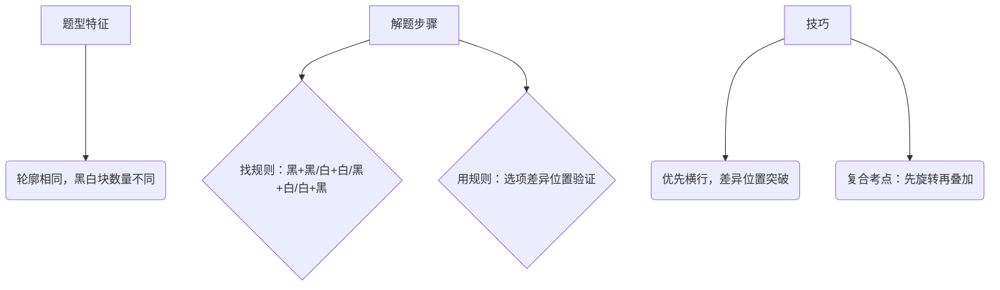

# 常识判断-科技常识解题方法与技巧  


## 一、核心考点梳理（江苏卷高频）  
### （一）前沿科技（近5年江苏卷占比约40%）  
#### 1. 航天航空（高频）  
- **卫星/飞船/空间站**：嫦娥系列（探月，嫦娥六号2024年月背采样返回）、天问系列（火星探测，天问一号“绕落巡”）、神舟系列（载人航天，神舟十八号2024年发射）、天宫空间站（核心舱“天和”，2022年全面建成，我国首个空间站）、北斗三号（全球卫星导航系统，2020年组网完成）。  
- **运载火箭**：长征系列（长征五号“胖五”——我国最大推力火箭，用于深空探测）、快舟系列（快速响应火箭）。  

#### 2. 深海探测与极地科考（中频）  
- **载人深潜**：奋斗者号（2020年万米深潜马里亚纳海沟，深度10909米）、蛟龙号（7000米级）。  
- **极地科考**：雪龙2号（我国首艘自主建造极地科考破冰船）、南极科考站（长城站、中山站、昆仑站、泰山站、罗斯海新站）。  

#### 3. 人工智能与信息技术（高频）  
- **AI技术**：ChatGPT（生成式AI）、AlphaGo（围棋AI）、我国“悟道”“紫东太初”等大模型。  
- **量子科技**：墨子号量子科学实验卫星（全球首颗量子通信卫星）、九章量子计算机（光量子计算机，2020年问世）。  


### （二）生活中的科学（近5年江苏卷占比约30%）  
#### 1. 物理常识（高频）  
- **力学**：浮力（轮船漂浮、潜水艇浮沉）、压强（吸管喝饮料、吸盘挂钩——大气压应用；高原反应——气压随海拔升高降低）。  
- **光学**：光的反射（镜子成像、水面倒影）、折射（筷子“弯折”、海市蜃楼）、色散（彩虹——太阳光通过水滴折射色散）。  
- **声学**：声音传播（真空不能传声）、回声（测距原理）、噪声防治（隔音、吸声）。  

#### 2. 化学常识（中频）  
- **常见物质性质**：氧气（助燃、供给呼吸，焊接用纯氧）、二氧化碳（灭火、光合作用原料，干冰用于人工降雨）、金属（铁生锈——氧化反应，铝耐腐蚀——表面氧化膜）。  
- **生活应用**：水垢去除（用醋——酸与碳酸盐反应）、灭火原理（隔绝氧气、降低温度至着火点以下）。  

#### 3. 生物健康（高频）  
- **人体系统**：消化系统（胃消化蛋白质，小肠吸收营养）、呼吸系统（肺是气体交换主要器官）、循环系统（心脏四腔，动脉血含氧高、颜色鲜红）。  
- **疾病与预防**：传染病（新冠、流感——呼吸道传染病，需戴口罩、接种疫苗）、维生素缺乏症（维生素C缺乏——坏血病，维生素D缺乏——佝偻病）。  


### （三）我国科技成就（近5年江苏卷占比约20%）  
- **大国重器**：C919大型客机（我国首款自主研制大型客机，2023年商业首飞）、福建舰（我国第三艘航母，首艘电磁弹射型航母）、港珠澳大桥（世界最长跨海大桥，沉管隧道技术领先）。  
- **基础研究**：人工合成结晶牛胰岛素（1965年，世界首次）、青蒿素（屠呦呦发现，治疗疟疾）、超导材料（高温超导研究处于国际前列）。  


### （四）基础科学（近5年江苏卷占比约10%）  
- **物理定律**：牛顿三大定律（惯性定律、作用力与反作用力）、爱因斯坦相对论（质能方程E=mc²）、能量守恒定律（永动机不可能实现）。  
- **化学理论**：元素周期表（门捷列夫编制）、原子结构（质子/中子/电子，决定元素种类的是质子数）。  
- **生物理论**：进化论（达尔文《物种起源》）、细胞学说（施莱登、施旺提出，细胞是基本单位）。  


## 二、解题技巧（江苏卷实用方法）  
### （一）排除法（核心技巧，适用所有题型）  
- **绝对化表述优先排除**：选项中出现“所有”“唯一”“最”“必须”等绝对词，大概率错误（除非教材明确结论）。  
  ▶ 例：“我国是唯一拥有空间站的国家”（错误，国际空间站仍在运行）。  
- **常识矛盾项排除**：选项与基础科学常识冲突时直接排除。  
  ▶ 例：“牛顿发现了相对论”（错误，相对论是爱因斯坦提出）。  


### （二）关键词法（快速定位考点）  
- **抓题干关键词**：根据题目中的“时间（近5年）”“主体（我国/国际）”“领域（航天/生物）”锁定考点。  
  ▶ 例：题目问“2024年我国航天成就”，选项中“嫦娥六号月背采样返回”（2024年完成）直接对应。  
- **抓选项特征词**：前沿科技题中，“量子”“AI”“深潜”“卫星”等词可快速匹配领域。  
  ▶ 例：选项“九章量子计算机”“墨子号卫星”均含“量子”，对应“量子科技”考点。  


### （三）联想推理法（生活常识题专用）  
- **结合生活经验推理**：生活中的现象（如“煮熟的鸡蛋泡冷水易剥壳”——热胀冷缩，与大气压无关）。  
- **跨模块知识迁移**：用初中理化生基础推理，如“油锅起火不能用水浇灭”（油密度比水小，会浮在水面继续燃烧，应盖锅盖隔绝氧气）。  


### （四）时政关联法（前沿科技题必用）  
- **关注近1-2年重大科技事件**：江苏卷常考“新成就”，如2023年C919商业首飞、2024年嫦娥六号返回，需结合时政热点复习。  
- **关联政府文件**：二十大报告“加快实施创新驱动发展战略”提及的领域（人工智能、生物技术、空天科技等）是命题重点。  


## 三、复习建议  
1. **优先掌握高频考点**：航天航空、生活物理/生物、我国近5年科技成就（加粗部分）。  
2. **做江苏真题总结规律**：近5年江苏卷科技题重复考点少，但题型稳定（基础+前沿+生活），可通过真题熟悉命题风格。  
3. **利用碎片时间积累**：关注“央视新闻”“中国科技网”等平台，记录每月科技热点（如2024年“天舟七号”货运飞船发射）。  


**提示**：科技常识“性价比高”，基础题占比70%，掌握上述技巧+高频考点，可快速提升正确率！
# 常识判断-法律常识解题方法与技巧  
（江苏公考行测专项突破）  


## 一、江苏卷法律常识命题特点  
1. **重者恒重**：宪法、民法（民法典）、刑法、行政法占比超80%，诉讼法偶有涉及  
2. **时政结合**：聚焦**近3年新法修订**（如《民法典合同编通则解释》2023、《妇女权益保障法》2023修订）  
3. **案例化倾向**：以生活化案例考查法律适用（如网购合同纠纷、职场侵权等）  
4. **江苏特色**：少量涉及地方性法规（如《江苏省长江水污染防治条例》）及执法实践  


## 二、分模块解题技巧  

### （一）宪法  
#### 命题特点：  
- 高频考点：**国家机构职权**（人大vs政府vs监察委）、**公民基本权利**（政治权利、人身自由）  
- 易错点：易混淆职权（如“建置”vs“区域划分”审批权）  

#### 解题技巧：  
1. **关键词匹配法**  
   - 看到“批准省/自治区/直辖市建置”→**全国人大**  
   - 看到“紧急状态宣布”→全国人大常委会（全国/省）或国务院（市/县）  
   - 看到“基层群众自治”→排除“基层政府”（村委会/居委会非行政机关）  

2. **绝对化表述排除法**  
   - 选项含“所有”“一律”“只能”多为错误（如“公民都有选举权”×，需满足年龄+政治权利条件）  


### （二）民法（民法典）  
#### 命题特点：  
- 重点章节：合同编、物权编、侵权责任编、婚姻家庭编  
- 新考点：保理合同、物业服务合同、离婚冷静期、个人信息保护  

#### 解题技巧：  
1. **法律关系拆解法**  
   - 步骤：①确定主体（自然人/法人/非法人组织）→②分析行为性质（合同/侵权/无因管理）→③对应法条  
   - 例：网购“七天无理由退货”→适用**买卖合同**（非试用合同）  

2. **权利义务对应法**  
   - 物权：占有/使用/收益/处分权（如“抵押权不转移占有”vs“质押权转移占有”）  
   - 侵权责任：**过错原则**（一般）vs**无过错原则**（如环境污染、产品责任）  


### （三）刑法  
#### 命题特点：  
- 核心考点：**罪名辨析**（抢劫罪vs绑架罪、贪污罪vs受贿罪）、**量刑情节**（累犯、自首）  
- 新增考点：《刑法修正案（十一）》（刑事责任年龄下调至12岁、高空抛物入刑）  

#### 解题技巧：  
1. **构成要件分析法**  
   - 四要件：主体（年龄/身份）→主观方面（故意/过失）→客体（法益）→客观方面（行为）  
   - 例：区分“盗窃罪”（秘密窃取）vs“抢夺罪”（公然夺取）  

2. **典型案例联想法**  
   - 记住高频罪名特征：  
     - 绑架罪=“控制人质+向第三人勒索财物”  
     - 交通肇事罪=“过失犯罪”（若故意撞人则定故意杀人罪）  


### （四）行政法  
#### 命题特点：  
- 重点：**行政处罚**（种类/程序）、**行政复议**（复议机关）、**行政诉讼**（受案范围）  
- 难点：抽象行政行为vs具体行政行为的区分  

#### 解题技巧：  
1. **主体判断法**  
   - 行政行为主体必须是**行政机关/法律法规授权组织**（排除企事业单位内部处分）  

2. **复议机关速记口诀**  
   - 县级以上政府部门：同级政府或上一级主管部门  
   - 地方各级政府：上一级政府（省级政府→自身复议）  
   - 垂直领导机关（海关/国税）：上一级主管部门  


### （五）新法速递与时政结合  
#### 命题特点：  
- 近3年修订法律必考（如2023《反电信网络诈骗法》、2022《噪声污染防治法》）  

#### 解题技巧：  
1. **修订亮点标注法**  
   - 重点记忆“首次规定”“新增条款”：  
     - 个人信息保护法：**敏感个人信息**（生物识别、医疗健康等）需单独同意  
     - 家庭教育促进法：父母“带娃”入法，国家干预家庭教育  

2. **政策导向分析法**  
   - 结合社会热点：如“双减”政策→关联《未成年人保护法》“学校不得变相推销教辅”  


## 三、通用解题方法  
1. **排除法**：先排除明显错误选项（如“行政诉讼一律公开审理”×，涉及国家秘密除外）  
2. **常理推断法**：法律不违背生活常理（如“结婚年龄男22女20”可通过常识判断）  
3. **真题复盘法**：江苏近5年真题中重复考点（如“行政强制措施vs行政处罚”）需重点标记  


## 四、备考建议  
- **优先级**：民法典＞行政法＞刑法＞宪法＞新法  
- **资料**：官方法条（重点看“总则”和“分则重点章节”）+江苏真题（2018-2023年）  
- **记忆技巧**：利用**思维导图**梳理法律关系，通过**口诀**简化复杂内容（如“行政处罚种类：警罚吊停没其款”）  


**提示**：法律常识需在理解基础上记忆，避免死记硬背。关注“江苏司法行政网”官方解读，把握本地执法实践倾向。
# 江苏公考行测常识判断-时事政治模块解题方法与技巧


## 一、江苏卷时事政治命题特点（必知）  
江苏行测常识判断中，时事政治占比约 **15%-20%**，命题具有以下鲜明特点：  
1. **时效性强**：以 **近一年时政为核心，考前6个月为重中之重**（如2024年考试重点为2023年6月-2024年3月时政）。  
2. **侧重“核心文件+领导人讲话”**：高频考点集中在 **中央一号文件、政府工作报告（国务院+江苏省）、党的全会报告（如二十大、二十届三中全会）、中央经济工作会议** 等。  
3. **结合江苏特色**：**江苏本地时政** 为重要补充，包括江苏年度政府工作报告、习近平总书记视察江苏重要讲话、江苏重大战略（长三角一体化、苏南自主创新示范区、沿海高质量发展）、本地科技/经济成就（如苏州工业园区、南京江北新区、重大科技项目）。  
4. **主题鲜明**：聚焦 **经济高质量发展、科技创新、民生保障（就业、教育、医疗）、生态文明（碳达峰碳中和）、乡村振兴** 等与江苏发展密切相关的领域。  


## 二、考点梳理核心技巧（高效积累）  
### （一）按“时间+领域”双维度梳理  
1. **时间轴梳理法**（近1年）：  
   - **季度划分**：每季度重点事件（如Q1：两会；Q2：中央一号文件；Q4：中央经济工作会议）。  
   - **关键节点**：党的重大会议（如二十大、二十届三中全会）、国家纪念日（建党、国庆）、国际会议（如G20、进博会，江苏常作为举办地）。  

2. **领域分类法**（核心4大领域）：  
   - **政治类**：领导人重要讲话（习近平新时代中国特色社会主义思想最新论述，尤其“中国式现代化”“新发展理念”）、党的建设（主题教育、反腐败）。  
   - **经济类**：GDP增长目标、财政货币政策（赤字率、LPR）、重大经济政策（减税降费、稳就业措施）、江苏经济数据（如人均GDP、高新技术产业占比）。  
   - **科技类**：国家重大科技成就（航天：神舟、嫦娥；深海：奋斗者号；江苏本地：紫金山实验室、南大/东大科研突破、华为/中兴在苏项目）。  
   - **民生类**：新出台民生政策（医疗保障、养老服务、教育“双减”深化）、江苏民生实事（如“智慧养老”试点、保障性住房建设目标）。  


### （二）锁定“高频核心考点”（江苏卷最爱考）  
| 考点类型                | 具体内容（加粗为重中之重）                          |  
|-------------------------|---------------------------------------------------|  
| **中央级文件**          | 二十大报告（主题、中国式现代化5个特征）、政府工作报告（GDP目标、就业目标、民生支出占比）、中央一号文件（“三农”焦点：粮食安全、乡村振兴重点工程） |  
| **领导人江苏讲话**      | 习近平总书记视察江苏时强调的“**四个新**”（在高质量发展上走在前列、在服务全国构建新发展格局上争做示范、在率先实现社会主义现代化上走在前列） |  
| **江苏本地战略**        | **长三角一体化发展**（江苏定位：科技创新策源地、高端产业引领地）、**沿海地区高质量发展**（连云港、盐城、南通重点任务） |  
| **科技成就（江苏相关）**| 紫金山实验室6G研发、国家第三代半导体技术创新中心（苏州）、南京争取建设“综合性国家科学中心” |  


## 三、解题核心方法（实战拿分技巧）  
### （一）**关键词锁定法**（最快解题）  
- **适用场景**：选项包含“核心、根本、首要、首次、第一、最”等绝对化表述，或具体数据、时间、主体。  
- **操作步骤**：直接定位题干关键词（如“首次提出”“根本任务”），比对选项中匹配的表述。  
- **江苏真题示例**：（2023年江苏A卷）“习近平总书记在二十大报告中指出，中国式现代化的本质要求是……下列不属于本质要求的是？”  
  → 关键词“二十大报告”“中国式现代化本质要求”，直接回忆“中国式现代化本质要求：坚持中国共产党领导，坚持中国特色社会主义，实现高质量发展……”，排除错误选项。  


### （二）**排除法（“三排”原则）**  
1. **排时间错误**：选项时间与题干不符（如“2023年中央一号文件聚焦科技创新”→ 错误，中央一号文件固定聚焦“三农”）。  
2. **排主体错误**：政策主体、会议主体错误（如“国务院发布《乡村振兴战略规划》”→ 正确；“江苏省委发布《国家综合立体交通网规划》”→ 错误，主体应为“国家发改委”）。  
3. **排数据错误**：选项数据与官方公布不符（如“2023年江苏GDP增长目标为5.5%左右”→ 正确；若选项为“6.5%”则直接排除）。  


### （三）**联想推理法**（知识迁移）  
- **原理**：利用已知时政知识推导未知选项，尤其适用于“江苏本地时政”。  
- **示例**：已知“江苏是制造业大省”，则选项“江苏提出‘制造业立省’战略”大概率正确；已知“长三角一体化”，则“江苏与上海共建科技创新走廊”符合逻辑。  


## 四、备考实用建议（江苏考生专属）  
### （一）权威积累渠道（精准高效）  
1. **国家级**：  
   - **学习强国**（重点看“要闻”“新思想”“科技”板块，每日15分钟）；  
   - **中国政府网**（“政策”→“国务院文件”，下载近1年政府工作报告、中央一号文件精读）。  
2. **江苏本地**：  
   - **江苏政府网**（“政务公开”→“省政府文件”，精读江苏年度政府工作报告，标记“预期目标”“重点任务”）；  
   - **交汇点新闻**（江苏省委主办，关注“总书记在江苏”“江苏这十年”专题）。  


### （二）笔记“3要素”记录法  
每条时政考点笔记包含：  
- **时间+主体**（谁在什么时候做的）；  
- **核心内容**（用1-2个关键词概括，如“二十大：中国式现代化=人口规模巨大+共同富裕+物质文明精神文明相协调+人与自然和谐共生+和平发展道路”）；  
- **江苏关联**（如“全国科技大会→江苏行动：加大研发投入强度至3.5%”）。  


### （三）模拟题“靶向训练”  
- 做 **近3年江苏行测真题**（A/B/C类），统计时政考点分布（如科技类占比30%、经济类25%）；  
- 刷 **江苏本土机构模拟题**（如中公、粉笔江苏专项卷），侧重“江苏本地时政”题目（其他省份模拟题可忽略，命题风格差异大）。  


**总结**：江苏时事政治“不难但需细”，抓住“近1年核心文件+江苏本地特色”，用“关键词锁定+排除法”解题，配合精准积累，可轻松拿下80%以上分数！
# 常识判断-地理常识解题方法与技巧  


## 一、江苏卷地理常识命题特点  
江苏行测常识判断中，地理常识考查占比稳定（约10%-15%），**命题聚焦“基础+应用”**，具体特点如下：  
1. **侧重“中国地理+江苏本地关联”**：如中国地形区、河流湖泊、气候分布，及江苏地形（平原为主）、气候（亚热带季风气候）、行政区划（13个设区市）、区域战略（长三角一体化区位）等；  
2. **自然地理“重现象+轻理论”**：考查常见自然现象（如气候类型、洋流影响、地貌成因），较少涉及复杂原理计算；  
3. **结合时政热点**：如“一带一路”沿线地理、重大工程（如南水北调、港珠澳大桥）的地理背景、生态保护（如长江大保护涉及的流域地理）。  


## 二、分模块解题方法与技巧  


### ▶ 模块一：自然地理（占比约30%）  
**核心考查**：气候类型、地形地貌、洋流与大气环流、自然现象成因（如极光、日食）。  

#### 1. **特征联想解题法**  
- **技巧**：抓住自然地理事物的“核心特征”，通过联想排除错误选项。  
  ▶ 例：题干提到“夏季高温多雨，冬季温和少雨”，直接联想“亚热带季风气候”（对应中国南方地区，江苏南部即为此气候）；  
  ▶ 例：“紫色盆地”“天府之国”→ 四川盆地；“聚宝盆”→ 柴达木盆地。  

#### 2. **生活经验迁移法**  
- **技巧**：结合江苏本地自然现象或生活常识推理。  
  ▶ 江苏考生可利用本地经验：如“江苏夏季多梅雨（6-7月）、冬季多雾”→ 联想亚热带季风气候的“雨热同期”特征；  
  ▶ 生活场景：“昼夜温差大的地区（如西北）瓜果更甜”→ 原理是“昼夜温差大→光合作用强、呼吸作用弱→糖分积累多”，可迁移判断气候对农业的影响。  

#### 3. **图示辅助记忆法**  
- **技巧**：高频考点（如洋流分布、气压带风带）结合简化图示记忆，考试时通过“脑内画图”快速定位。  
  ▶ 例：记洋流模式“北顺南逆”（北半球中低纬洋流顺时针，南半球逆时针），题干提到“秘鲁寒流”→ 南半球中低纬，排除北半球选项。  


### ▶ 模块二：中国地理（占比约40%，江苏卷重点）  
**核心考查**：行政区划、地形区分布、河流湖泊、资源分布、区域发展战略（如长三角一体化）。  

#### 1. **区域定位三步法**  
- **技巧**：通过“经纬度→轮廓→典型特征”快速定位区域。  
  ▶ 第一步：记关键经纬线穿过的中国区域（如30°N穿过长江中下游平原、四川盆地；120°E穿过江苏、浙江）；  
  ▶ 第二步：结合区域轮廓（如江苏“南北狭长、长江穿省”，轮廓似“平行四边形”）；  
  ▶ 第三步：关联典型特征（如“鱼米之乡”→ 长江中下游平原；“黄金水道”→ 长江；江苏“海岸线平直，多滩涂”）。  

#### ▶ 江苏本地地理高频考点（需重点记忆）  
| **类别**       | **核心内容**                                                                 |  
|----------------|-----------------------------------------------------------------------------|  
| 行政区划       | 13个设区市（南京、苏州、无锡等），省会南京；“苏南（苏锡常镇宁）、苏中（通泰扬）、苏北（徐淮盐连宿）”划分。 |  
| 地形气候       | 以平原为主（江淮平原、长江三角洲平原）；亚热带季风气候（夏季高温多雨，冬季温和少雨），淮河为气候分界线。 |  
| 河流湖泊       | 长江、淮河、京杭大运河穿省；太湖（苏南，中国第三大淡水湖）、洪泽湖（苏北）。                |  
| 区域战略       | 长三角一体化核心区（上海为龙头，江苏定位“先进制造业基地”，地理区位：连接南北、沟通东西）。        |  


#### 2. **特征对比排除法**  
- **技巧**：通过对比不同区域的核心特征，排除错误选项。  
  ▶ 例：题干问“下列属于北方地区的地形区是”，选项含“云贵高原”（南方）、“黄土高原”（北方）、“四川盆地”（南方）→ 直接排除南方地形区，选“黄土高原”。  
  ▶ 江苏卷高频对比：南北方分界线（秦岭-淮河）→ 江苏淮安为“中国南北地理分界线”标志点，可联想“淮河穿江苏苏北，以北属北方，以南属南方”。  


### ▶ 模块三：世界地理（占比约20%）  
**核心考查**：重点国家（中、美、俄、印等）、海峡运河（马六甲海峡、苏伊士运河等）、气候类型分布。  

#### 1. **“一带一路”关联法**  
- **技巧**：结合“一带一路”沿线关键节点，记忆世界地理高频考点（江苏卷常结合时政考查）。  
  ▶ 陆上丝绸之路：西安→中亚（中亚五国，温带大陆性气候）→ 欧洲（鹿特丹港，温带海洋性气候）；  
  ▶ 海上丝绸之路：中国沿海（如连云港，江苏重要港口）→ 马六甲海峡（“海上生命线”，连接太平洋与印度洋）→ 苏伊士运河（亚非分界线）→ 地中海。  

#### 2. **关键数据锚定法**  
- **技巧**：记“最小/最大/唯一”等极端特征数据，快速锁定选项。  
  ▶ 例：“世界最大平原”→ 亚马孙平原；“最深湖泊”→ 贝加尔湖；“唯一地跨两大洲的国家”→ 俄罗斯（亚欧）、土耳其（亚欧）等。  


### ▶ 模块四：地理与时政结合（占比约10%，江苏卷新趋势）  
**核心考查**：重大工程（如白鹤滩水电站）、生态保护（如长江禁渔）、国际合作（如中老铁路）的地理背景。  

#### 1. **时政热点溯源法**  
- **技巧**：从时政热点反推地理考点，关联“时间+地点+地理影响”。  
  ▶ 例：2023年“长江口二号古船打捞”→ 关联江苏地理：长江口位于江苏东部，古船沉没与长江口泥沙淤积（河口三角洲地貌特征）相关；  
  ▶ 例：“碳达峰碳中和”目标→ 关联江苏地理：沿海风能（如盐城风电基地）、光伏资源（苏北光照充足）的分布优势。  


## 三、复习建议  
1. **抓核心特征**  
优先记忆“典型地形区（如青藏高原‘世界屋脊’）、气候类型（如地中海气候‘雨热不同期’）、江苏本地高频考点（见上表）”，避免全量记忆琐碎知识。  

2. **结合生活场景**  
日常积累生活中的地理现象（如“朝霞不出门，晚霞行千里”对应天气系统；江苏“梅雨季”对应准静止锋），增强解题联想能力。  

3. **关联江苏时政**  
关注江苏省政府工作报告提及的地理相关内容（如“沿海港口群建设”“江淮生态经济区发展”），预判考点方向。  


**总结**  
地理常识解题核心：**以区域定位为基础，以特征联想为工具**！江苏考生需重点突破中国地理（尤其是本地知识）与自然地理现象，并结合时政热点灵活迁移。
# 常识判断-人文常识 解题方法与技巧（江苏卷专用）


## 一、江苏卷人文常识命题特点  
### （一）**本土化特色突出**  
江苏卷常结合本地人文资源命题，如**苏州园林、昆曲、明孝陵**等世界文化遗产，**顾炎武、曹雪芹、华罗庚**等本地名人，以及端午龙舟、中秋赏月等**江苏特色习俗**。  
### （二）**基础性与细节性结合**  
核心考查中国古代史（制度、思想）、传统文化（节气、礼仪）、文学常识（诗词、典籍）等基础内容，但侧重**细节辨析**（如某制度的具体朝代、某诗句的作者及背景）。  
### （三）**与时政热点关联**  
结合文化遗产日、重要周年纪念（如建党、建国周年）考查相关人文知识（如红色文化、历史事件）。  


## 二、核心解题方法  
### （一）**排除法：快速缩小范围**  
#### 1. **绝对化表述排除**  
选项中出现“最”“唯一”“全部”等绝对化词汇时，优先排除（除非教材明确表述）。  
- 例：“《诗经》是中国唯一的现实主义诗歌总集”（错误，杜甫诗也是现实主义，“唯一”绝对化）。  

#### 2. **明显史实错误排除**  
根据基础史实直接排除矛盾选项。  
- 例：“唐太宗创立科举制”（错误，科举制创立于隋朝，唐太宗仅完善，可直接排除）。  


### （二）**关键词法：精准定位考点**  
#### 1. **时间关键词**：通过“朝代”“年号”锁定历史阶段  
- 例：题干出现“开元年间”，立即联想唐朝玄宗时期，对应**开元盛世、唐诗繁荣**等考点。  

#### 2. **人物关键词**：通过“作者”“典故主角”关联作品/事件  
- 例：题干提到“破釜沉舟”，直接对应**项羽（巨鹿之战）**，排除刘邦、韩信等选项。  

#### 3. **地域关键词**：题干出现“江苏”“苏州”等，优先联想本地考点  
- 例：“江南园林甲天下”对应**苏州园林**，而非颐和园（北京）、拙政园（苏州，正确）。  


### （三）**联想记忆法：激活知识网络**  
#### 1. **横向联想**  
同一时期不同领域知识串联（政治制度+文化+科技）。  
- 例：记“宋朝”时，同步联想：**科举制糊名誊录（政治）、宋词（文化）、活字印刷术（科技）**。  

#### 2. **纵向联想**  
同一主题不同朝代演变（如“中央官制”：秦三公九卿→隋唐三省六部→明内阁→清军机处）。  


### （四）**江苏特色优先法**  
选项中若出现江苏相关内容（如人物、遗产、习俗），在不确定时优先验证其正确性（江苏卷本土考点正确率较高）。  


## 三、高频考点专项技巧  
### （一）中国古代史  
#### 1. **时间轴定位法**（必背简表）  
| 朝代 | 核心制度/事件 | 文化成就 |  
|------|--------------|----------|  
| 秦   | 郡县制、统一度量衡 | 小篆 |  
| 汉   | 察举制、丝绸之路 | 《史记》（司马迁） |  
| 唐   | 三省六部制、科举制完善 | 唐诗（李白、杜甫） |  
| 宋   | 二府三司制、交子 | 宋词（苏轼、李清照） |  

**技巧**：画简易时间轴贴在书桌，每天早晚各看1次，强化朝代顺序记忆。  


#### 2. **制度对比记忆法**  
| 制度       | 朝代   | 核心特点（江苏卷常考） |  
|------------|--------|------------------------|  
| 三公九卿制 | 秦-汉  | 丞相掌行政，御史大夫掌监察 |  
| 三省六部制 | 隋唐   | 中书省草拟、门下省审核、尚书省执行 |  
| 行省制     | 元朝   | 江苏当时属“江浙行省” |  


### （二）传统文化  
#### 1. **节气与物候对应技巧**  
结合江苏气候记节气现象（江苏属亚热带季风气候，四季分明）：  
- **立春**：“东风解冻，蛰虫始振”（江苏地区气温回升，农田开始解冻）；  
- **清明**：“清明前后，种瓜点豆”（江苏春耕关键期，对应农业习俗）。  

**口诀**：春雨惊春清谷天（春），夏满芒夏暑相连（夏），秋处露秋寒霜降（秋），冬雪雪冬小大寒（冬）。  


#### 2. **礼仪等级速记**  
古代礼仪分“吉、凶、军、宾、嘉”五礼，重点记**等级差异**：  
- **吉礼**（祭祀）：天子祭天地，诸侯祭社稷，大夫祭宗庙（等级森严，不可僭越）；  
- **嘉礼**（婚冠）：“六礼”（纳采、问名、纳吉、纳征、请期、亲迎）仅贵族适用，平民简化为“三礼”。  


### （三）文学常识  
#### 1. **作者-作品-名句对应表**（高频考点）  
| 作者       | 朝代 | 代表作               | 名句（关键词）         |  
|------------|------|----------------------|------------------------|  
| 李白       | 唐   | 《将进酒》           | “天生我材必有用”       |  
| 苏轼       | 宋   | 《念奴娇·赤壁怀古》  | “大江东去，浪淘尽”     |  
| 曹雪芹     | 清   | 《红楼梦》（江苏人） | “满纸荒唐言，一把辛酸泪” |  

**技巧**：用“作者+朝代+名句”串联记忆，如“唐-李白-浪漫主义-‘飞流直下三千尺’”。  


#### 2. **诗词意象联想表**（快速破题）  
| 意象 | 象征意义       | 对应诗句举例               |  
|------|----------------|----------------------------|  
| 柳   | 送别           | “杨柳岸，晓风残月”（柳永） |  
| 月   | 思乡/思念      | “举头望明月，低头思故乡”（李白） |  
| 菊   | 隐逸/高洁      | “采菊东篱下，悠然见南山”（陶渊明） |  


### （四）江苏特色人文（必背）  
#### 1. **本地名人**  
- **顾炎武**（昆山）：明末清初思想家，提出“**天下兴亡，匹夫有责**”；  
- **曹雪芹**（南京）：《红楼梦》作者，书中“大观园”原型与南京园林相关；  
- **华罗庚**（金坛）：数学家，“中国现代数学之父”。  

#### 2. **文化遗产**  
- **苏州园林**：拙政园（“江南园林之母”）、留园，核心考点“**虽由人作，宛自天开**”的造园理念；  
- **昆曲**：“百戏之祖”，代表作《牡丹亭》（汤显祖），2001年列入“人类口述和非物质文化遗产”。  


## 四、实战解题步骤  
1. **审题干：圈画关键词**（时间、人物、地域）；  
2. **忆考点：定位知识模块**（古代史/文学/江苏特色）；  
3. **用技巧：排除+联想**（先排除绝对化、史实错误选项，再用关键词联想）；  
4. **验选项：优先验证江苏特色选项**（本土考点正确率高）。  


**复习建议**：每天花20分钟梳理1个模块（如周一古代史、周二传统文化），结合江苏本土考点制作**思维导图**，强化记忆效率。
# 常识判断-经济常识 解题方法与技巧  
（江苏卷行测专项）  


## 一、江苏卷经济常识命题特点  
1. **紧密结合时政热点**：题目常围绕近1-2年中央经济工作会议、政府工作报告、重要经济政策（如“双循环”“高质量发展”）等命题，需关注政策原文表述。  
2. **理论与实际应用结合**：基础经济理论（如供求关系、财政/货币政策）常以具体案例（如物价波动、产业政策）为背景考查，避免纯理论记忆。  
3. **江苏本地特色突出**：可能涉及长三角一体化、江苏“制造业强省”“民营经济发展”“数字经济”等本地经济热点，需结合省情理解。  


## 二、解题核心方法与技巧  

### （一）关键词法：快速定位考点  
- **操作步骤**：圈画题干中的核心经济术语（如“CPI”“国债”“汇率”），联想其定义及相关考点。  
- **示例**：题干出现“央行下调存款准备金率”，直接定位“货币政策工具”考点，排除财政政策选项。  
- **关键提示**：熟悉经济术语的“主体”（如财政政策主体是政府，货币政策主体是央行），可快速排除无关选项。  


### （二）排除法：规避常见错误选项  
- **核心原则1：绝对化表述通常错误**  
  选项中出现“一定”“所有”“必须”等绝对化词，优先排除（除非教材原文明确）。  
  ✘ 错误示例：“市场经济中，政府完全不能干预经济”（正确表述：政府需宏观调控）。  

- **核心原则2：违背基础经济规律的选项排除**  
  如“商品价格仅由供求关系决定”（错误，价值是价格的基础，供求仅影响价格波动）。  

- **核心原则3：混淆概念排除**  
  区分易混概念：“财政政策vs货币政策”“GDP vs GNP”“初次分配vs再分配”，避免张冠李戴。  


### （三）关联法：结合时政与生活常识推理  
- **时政关联**：题干结合热点事件（如“疫情后经济复苏政策”），联想中央经济工作会议关键词（如“稳增长、稳就业、防风险”）。  
- **生活常识关联**：用生活经验推理，如“通货膨胀时物价上涨→货币购买力下降”“利率上升→居民更愿意存钱”。  
- **江苏特色关联**：题干涉及“江苏制造业升级”，联想“智能制造”“产业数字化”“专精特新企业”等本地政策表述。  


### （四）理论迁移法：基础理论→具体应用  
- **适用场景**：题目以案例形式考查抽象理论（如用“谷贱伤农”考查“需求弹性”）。  
- **操作步骤**：  
  1. 识别案例本质（如“农产品丰收但农民收入下降”→供给增加、需求缺乏弹性）；  
  2. 迁移对应理论（需求弹性=需求量变动率/价格变动率，生活必需品需求弹性小）；  
  3. 匹配选项（如“政府需制定最低收购价”）。  


## 三、核心考点速记（重点加粗）  

### （一）宏观经济（★★★高频）  
1. **核心指标**  
   - GDP：国内生产总值（**地域概念**，含境内外资企业，不含境外中资企业）；  
   - CPI：居民消费价格指数（**衡量通货膨胀的主要指标**，CPI＞3%为通胀，＜1%为通缩）；  
   - 失业率：关注“城镇调查失业率”（江苏卷常考就业优先政策）。  

2. **财政政策（主体：政府）**  
   - **工具**：税收（增税抑制需求，减税刺激需求）、国债（发行国债→回笼货币，抑制通胀）、财政支出（基建投资、社会保障支出）；  
   - **应用场景**：经济低迷时（减税+增发国债+增加支出）→扩张性财政政策；经济过热时（增税+减发国债+减少支出）→紧缩性财政政策。  

3. **货币政策（主体：央行）**  
   - **工具**：存款准备金率（下调→释放流动性，刺激经济）、利率（降息→鼓励借贷和投资）、公开市场操作（央行买卖国债，如买国债→释放货币）；  
   - **与财政政策的区分**：题干出现“税收”“政府支出”→财政政策；出现“利率”“准备金率”→货币政策（**必考区分点**）。  


### （二）微观经济（★★常考）  
1. **市场机制**：价格机制（核心）、供求机制（供过于求→价格下降，供不应求→价格上升）；  
2. **市场类型**：完全竞争（如农产品市场，无垄断）、垄断竞争（如家电市场，产品有差异）、寡头垄断（如石油、通信，少数企业主导）；  
3. **消费者行为**：边际效用递减（连续消费同一种商品，效用逐渐减少，如“喝第一杯水解渴，第三杯撑”）。  


### （三）国际经济（★考频中等）  
1. **汇率**：本币升值→利于进口、出国旅游，不利于出口；  
2. **国际贸易组织**：WTO（世界贸易组织，核心原则“非歧视原则”）、APEC（亚太经合组织，江苏卷可能结合“RCEP”考查）；  
3. **经济全球化**：江苏作为外贸大省，常考“跨境电商”“一带一路合作”等应用场景。  


### （四）江苏特色经济考点（★★★本地重点）  
1. **长三角一体化**：定位“全国发展强劲活跃增长极”，重点关注“科技创新共同体”“产业协同升级”；  
2. **制造业强省**：“智改数转”（智能化改造、数字化转型）、“专精特新”企业（专注细分市场、创新能力强）；  
3. **民营经济**：江苏民营经济占比超50%，政策支持“减税降费”“融资便利化”。  


## 四、复习建议  
1. **时政优先**：精读近1年中央经济工作会议公报、江苏政府工作报告，圈画“经济发展总基调”“重点产业”等表述；  
2. **刷题总结**：通过真题归纳高频考点（如财政/货币政策工具、CPI指标），整理易混概念对比表；  
3. **结合生活**：关注日常经济现象（如油价调整、个税改革），用理论解释实际，强化理解记忆。  

  
**提示**：经济常识“理解＞死记”，重点把握政策逻辑和理论应用，江苏卷尤其注重“理论+时政+省情”的结合能力！
# 言语理解与表达-篇章阅读-细节查找（江苏卷专项）


## 一、题型特征  
**考查能力**：准确查找、比对原文细节信息，判断选项与原文是否一致。  
**材料特点**：多为说明文（科技、社科类）或议论文，字数800-1200字，信息密集，涉及专业概念或数据。  
**提问方式**：  
- 下列说法与原文**相符/不相符**的是？  
- 根据文意，**XX的原因/目的/特征**是？  
- 关于“XX”，原文未提及的是？  


## 二、解题核心步骤  
### 1. 题干定位：明确“找什么”  
- 圈画题干**核心关键词**（专有名词、数字、引号内容、主体/客体），如“2023年数据”“人工智能的缺陷”。  
- 区分“选是题”（正确的）和“选非题”（不正确的），避免因审题失误丢分。  


### 2. 原文定位：快速“去哪里找”  
- **关键词定位法**：将题干/选项中的特殊词（如人名、地名、专业术语）带回原文，锁定段落（江苏卷篇章常按顺序设题，可优先按段落顺序查找）。  
- **标点符号提示**：关注**冒号（：）、破折号（——）** 后的解释说明内容，常为细节题答案区域；**分号（；）、顿号（、）** 提示并列信息，需全面比对。  


### 3. 选项比对：精准“怎么比”  
- **逐字逐句比对**：重点关注选项与原文在**主体、客体、限定词（时间、范围、程度）** 上的差异。  
- **排除法优先**：若选项与原文部分信息一致，需验证剩余信息；若存在一处矛盾，直接排除。  


## 三、常见错误选项类型（江苏卷高频考点）  
### 1. **偷换概念**（高频设错）  
- **表现**：替换原文核心名词（主体/客体）、混淆近义词（如“减少”偷换为“消除”，“影响”偷换为“决定”）。  
- **示例**：原文“人工智能可能加剧就业结构失衡”→ 选项“人工智能必然导致就业结构失衡”（“可能”→“必然”为偷换语气，“加剧”→“导致”为偷换程度）。  


### 2. **无中生有**（高频设错）  
- **表现**：选项内容在原文中**完全未提及**，或由原文某信息过度引申（如原文未比较A和B，选项却出现“A比B更有效”）。  
- **提示**：江苏卷常以“原文未提及的新观点/新比较”设错，需警惕选项中突然出现的“最”“第一”“唯一”等绝对化表述。  


### 3. **偷换时态/时间**  
- **表现**：混淆过去（已完成）、现在（进行中）、将来（未发生）时态，或篡改时间节点（如“2020年数据”偷换为“2023年数据”）。  
- **标志词**：原文“已经”“正在”“将”“预计”→ 选项“将要”“完成了”“一直”等。  


### 4. **偷换数量/范围**  
- **表现**：扩大/缩小原文范围（如“部分地区”→“全国”）、混淆数量（“多数”→“全部”，“50%”→“70%”）。  
- **标志词**：原文“有些”“部分”“少数”→ 选项“所有”“都”“绝大多数”等。  


### 5. **绝对化表述**（江苏卷常设错）  
- **表现**：选项出现“一定”“必然”“必须”“最”“唯一”等绝对化词，而原文为“可能”“或许”“之一”等弱化表述。  
- **示例**：原文“新能源汽车是未来交通的重要方向之一”→ 选项“新能源汽车是未来交通的唯一方向”（“重要方向之一”→“唯一方向”为绝对化错误）。  


### 6. **强加关系**  
- **表现**：原文无因果/条件/比较关系，选项强行添加（如“因为A，所以B”“只要A，就B”“A优于B”）。  
- **提示**：关注选项中的“因此”“导致”“比”“优于”等关联词，需回原文验证是否存在对应逻辑关系。  


## 四、实战技巧点拨（江苏卷适配）  
### 1. **优先验证绝对化选项**  
江苏卷细节题中，含“所有”“都”“一定”“最”的选项**90%以上为错误选项**，可优先验证，快速排除。  


### 2. **锁定高频设错词**  
选项中若出现以下词汇，需重点比对原文：  
- **绝对化词**：所有、全部、一定、必然、必须、最、唯一、首要；  
- **比较词**：比、优于、高于、低于、更；  
- **因果词**：导致、由于、因此、所以；  
- **范围词**：部分、全部、局部、整体。  


### 3. **利用“选项关键词”反向定位**  
若题干无明确关键词，可将选项中的特殊词（如专业术语、数字、引号内容）带回原文，**快速缩小查找范围**（如选项含“量子计算”，直接定位原文“量子计算”所在段落）。  


### 4. **结合篇章主旨排除矛盾选项**  
细节题需忠于原文，但**与篇章主旨相悖的选项必为错误选项**（如篇章主旨强调“技术发展需平衡伦理”，选项“技术发展无需考虑伦理”直接排除）。  


### 5. **关注“解释说明”区域**  
原文中**冒号（：）、破折号（——）、括号（()）** 后的内容为解释说明，常是细节题答案来源，需重点标记（如原文“气候变化的主因：人类活动排放温室气体”→ 题干问“气候变化主因”，直接定位冒号后内容）。  


## 五、江苏卷避坑提醒  
- **不纠结“半对”选项**：选项部分信息与原文一致，但存在一处错误（如偷换概念），直接排除；  
- **警惕“同义替换陷阱”**：江苏卷正确选项常对原文进行同义替换（如“提升效率”→“提高速率”），错误选项多为“近义但不等同”替换（如“缓解”→“解决”）；  
- **时间紧张时“优先选短选项”**：正确选项多与原文表述高度一致，长度常短于错误选项（干扰项需添加额外错误信息，表述更长）。  


**总结**：细节查找题核心在于“精准定位+逐点比对”，江苏卷侧重考查“概念、范围、绝对化表述”的偷换，掌握高频设错类型+关键词定位法，可高效提升正确率。
# 言语理解与表达-篇章阅读-语句衔接  
## 一、题型特征  
语句衔接题考查考生对文段行文逻辑的连贯性把握，要求选择最恰当的句子填入文段空白处（横线位置可在开头、中间、结尾），使上下文语意连贯、逻辑严密。江苏卷中，此类题型多以**横线在中间**（承上启下）或**结尾**（总结升华）为主，强调对上下文细节与整体脉络的综合分析。  


## 二、解题核心原则与技巧  
### （一）**话题一致原则**（高频考点）  
#### 核心技巧：确保填入句子的“核心主体”与上下文话题保持一致  
上下文话题是文段的“灵魂”，填入句子需围绕同一主体展开，避免“偷换话题”或“无中生有”。  

#### 操作方法：  
1. **定位上下文主体**：  
   - 找横线前1-2句的**主语**（动作的发出者）或**高频词**（反复出现的名词）；  
   - 若横线在结尾，需结合**整个段落的核心话题**（主旨）。  
2. **匹配选项主体**：排除主体与上下文不一致的选项。  

#### 示例：  
（前文）“人工智能技术在医疗领域的应用，极大提升了诊断效率。通过深度学习分析医学影像，AI系统能快速识别病灶……”  
（横线）________  
（后文）“但AI诊断也面临数据隐私、算法偏见等伦理挑战。”  

**分析**：上下文主体为“人工智能技术在医疗领域的应用”，填入句子需围绕“AI医疗应用的优势”展开，衔接后文“但”引导的转折（优势→挑战）。  


### （二）**逻辑连贯原则**（江苏卷重点）  
#### 核心技巧：依据上下文“关联词”或“行文脉络”判断逻辑关系，确保填入句子与前后文逻辑一致  
江苏卷常考查隐性逻辑（无明显关联词），需通过分析“总分、分总、因果、转折、递进”等行文脉络判断。  

#### 常见逻辑关系与技巧：  
| 逻辑关系       | 标志词/行文特征                | 填入句子作用                          |  
|----------------|---------------------------------|---------------------------------------|  
| **因果关系**   | 因为/所以/因此/由此可见         | 横线在“因”后填“果”，在“果”后填“因”   |  
| **转折关系**   | 然而/但是/相反/不过             | 填入与前文语义相反的内容              |  
| **递进关系**   | 更/甚至/不仅……而且……           | 填入语义更进一层的内容（程度/范围）   |  
| **承上启下**   | 横线在中间，前后话题有衔接       | 总结前文+引出后文新话题（多为江苏考点）|  
| **总结升华**   | 横线在结尾，前文为分述           | 对前文进行概括或提出对策/展望        |  

#### 操作方法：  
1. 圈画横线前后的关联词（显性逻辑）；  
2. 若无关联词，分析段落结构：  
   - **总分结构**：横线在“总”后，填“分”（具体解释）；在“分”后，填“总”（概括）。  
   - **转折结构**：横线前讲“优点”，后文讲“缺点”，填入句需含转折词（如“但”“然而”）。  

#### 示例（江苏真题简化）：  
（前文）“传统制造业依赖资源投入，增长模式粗放。近年来，数字技术赋能制造业，推动生产流程智能化……”  
（横线）________  
（后文）“通过大数据分析，企业可精准预测市场需求，实现柔性生产。”  

**分析**：前文讲“数字技术赋能制造业”（总），后文讲“大数据分析的具体作用”（分），横线需承上启下，衔接“数字技术”与“大数据分析”，可填入：“其中，大数据技术是重要支撑。”  


### （三）**语境协调原则**  
#### 核心技巧：填入句子的“感情色彩”“语体风格”需与上下文一致  
1. **感情色彩一致**：前文积极（如“成就显著”），后文不可消极；前文消极（如“问题突出”），后文不可积极。  
2. **语体风格一致**：江苏卷多为议论文、说明文（书面语），避免口语化表达（如“咋”“呗”“事儿”）。  

#### 示例：  
（前文）“敦煌莫高窟的壁画历经千年风沙，色彩依旧绚烂，展现了古人高超的艺术造诣。”  
（横线）________  
**错误选项**：“这壁画真是太好看了！”（口语化，与“历经千年”“艺术造诣”书面语风格冲突）  
**正确方向**：“其艺术价值不仅在于视觉美感，更在于文化传承。”（书面语，积极色彩一致）  


### （四）**句式一致原则**（辅助技巧）  
#### 核心技巧：若上下文存在排比、对偶等对称结构，填入句子需保持句式一致  
#### 标志特征：  
- 排比句：“有的……有的……有的……”“或……或……或……”  
- 对偶句：结构对称（如“A是B，C是D”）  

#### 示例：  
（前文）“读书，使人思维活跃，聪颖智慧；读书，使人胸襟开阔，豁达晓畅；读书，________。”  
**填入句**：“使人目光远大，志存高远”（与前文“使人……，……”句式一致）。  


## 三、江苏卷命题特点与应对策略  
### （一）命题特点  
1. **横线位置侧重中间**：80%以上题目横线在文段中间，考查“承上启下”能力（需兼顾前后文话题与逻辑）。  
2. **逻辑隐含性强**：较少出现明显关联词，需结合**段落主旨**推断逻辑（如前文讲“问题”，后文讲“对策”，横线需填“因此，需采取以下措施”）。  
3. **选项干扰性大**：正确选项与干扰项话题相似，但细节（如主体、程度、逻辑词）不同，需对比差异。  

### （二）应对策略  
1. **通读全段再做题**：江苏卷需结合整个段落主旨，避免仅看横线前后1句（易踩“局部话题”陷阱）。  
2. **优先排除“话题偏离”项**：若选项主体与上下文不一致，直接排除（话题一致原则为第一准则）。  
3. **对比选项细节**：若剩余2个选项，对比逻辑词（如“因此”vs“然而”）、程度词（“可能”vs“必然”），选择与上下文更贴合的一项。  


## 四、实战解题步骤（快速定位法）  
1. **定位置**：判断横线在开头（总起）、中间（承上启下）、结尾（总结）。  
2. **抓话题**：找横线前后的核心主体（主语/高频词），排除话题不一致选项。  
3. **析逻辑**：通过关联词或行文脉络，确定逻辑关系（因果/转折/递进等）。  
4. **比选项**：若剩余选项，对比感情色彩、语体风格、细节词，选择最优解。  
5. **代验证**：将选项代入原文，通读全段，检查是否通顺（最终确认）。  


**总结**：语句衔接题核心是“话题一致+逻辑连贯”，江苏卷需特别关注“承上启下的中间句”和“隐含逻辑分析”，通过“先话题、再逻辑、后细节”三步法可高效解题。
# 江苏公考行测-言语理解与表达-篇章阅读-标题选择解题方法与技巧


## 一、模块概述  
**考查能力**：主要考查对整篇文章的主旨把握、行文结构分析及语言概括能力，要求选出最适合概括文段核心内容的标题。  
**江苏卷特点**：  
- 材料多为社会热点、科技说明、文化评论等体裁（200-500字）  
- 干扰项设置具有迷惑性，需精准匹配文段主体与话题  
- 近3年题量稳定在1-2题/篇，常结合观点态度题综合考查  


## 二、解题核心原则  
1. **主旨优先原则**：标题必须包含文段核心话题（主题词），**避免以偏概全**  
2. **文体适配原则**：  
   - 议论文→突出论点（含作者观点）  
   - 说明文→明确说明对象+特征  
   - 记叙文→概括事件主线（含结果/启示）  
3. **简洁醒目原则**：语言凝练，**避免过长或过于抽象的表述**  
4. **全面准确原则**：涵盖文段主要内容，**不遗漏关键信息**  


## 三、解题步骤与方法  
### （一）三步解题法  
1. **速读定话题**（30秒）：  
   - 圈画首尾句、转折词（但是/然而）、总结词（因此/总之）  
   - 确定**核心主题词**（高频出现的名词/名词短语）  

2. **精读抓主旨**（60秒）：  
   - 分析段落结构（总分/分总/并列）  
   - 标记关键句（如："研究表明..."、"笔者认为..."）  

3. **选项匹配度**（40秒）：  
   - 排除**无主题词**选项→排除**偏离主旨**选项→对比**最优选项**  

### （二）高频技巧  
| 技巧类型       | 适用场景                  | 操作方法                          |  
|----------------|---------------------------|-----------------------------------|  
| **主题词锁定法** | 所有文体                  | 选项必须包含1-2个核心主题词        |  
| **反向验证法** | 纠结两个选项时            | 假设以此为标题，能否还原文段内容  |  
| **情感倾向法** | 议论文/评论性文章        | 标题需匹配作者褒贬态度（如"警惕..."、"倡导..."） |  


## 四、常见错误选项特征  
1. **范围扩大/缩小**：如原文讲"江苏制造业"，选项为"中国制造业"  
2. **偷换概念**：替换主题词近义词（如"人工智能"→"智能科技"）  
3. **以偏概全**：只概括某段内容，忽略整体主旨  
4. **无中生有**：加入文段未提及的新信息（如预测性表述）  
5. **过于文艺化**：文学色彩浓但未点明主旨（江苏卷罕见，需警惕）  


## 五、江苏真题实战示例（2023年A卷）  
**文段**：（略，主题为"数字技术赋能乡村文化振兴"）  
**选项分析**：  
A. 乡村文化振兴的路径探索  
B. 数字技术：乡村振兴的新引擎  
C. 江苏乡村文化建设的实践  
D. 数字赋能：激活乡村文化生命力  

**正确答案**：D  
**解析**：  
- A项缺少"数字技术"主题词→排除  
- B项扩大范围（"乡村振兴"≠"乡村文化振兴"）→排除  
- C项无"数字技术"且"江苏"非核心话题→排除  
- D项包含"数字赋能"和"乡村文化"，匹配文段主旨→当选  


## 六、备考建议  
1. **每日训练**：精读1篇《人民日报评论》/《科技日报》文章，尝试拟写标题  
2. **错题复盘**：总结错误类型（如"主题词遗漏"、范围偏差）  
3. **江苏命题偏好**：重点关注**科技类说明文**和**社会治理类议论文**  

 
**核心口诀**  
先抓主题词，再看主旨句，  
文体要适配，干扰细排除！  

（注：实际答题建议用时≤2分钟/题，优先完成其他言语题型后再攻坚复杂篇章题）
# 言语理解与表达-语句表达-下文推断  
（江苏公考专项突破）  


## 一、题型特征  
**识别标志**：题干提问方式为“接下来最可能讲的是”“这段文字接下来最应该讲述的是”“作为一篇文章的引言，接下来最可能谈论的是”等。  
**考查能力**：根据文段已有内容，推断下文逻辑连贯的内容，核心是“承上启下”的衔接能力。  


## 二、解题核心原则  
### 1. **话题一致原则**（首要原则）  
下文内容必须与文段**最后话题**保持一致，避免“话题跳跃”或“偷换概念”。  
**例**：前文围绕“人工智能在医疗领域的应用”展开，尾句强调“AI辅助诊断的伦理争议”，则下文应围绕“伦理争议”展开，而非突然转向“AI在教育领域的应用”。  


### 2. **逻辑连贯原则**  
下文需与前文形成合理逻辑关系（如因果、递进、转折、并列等），符合正常行文脉络。  
**例**：前文提出“某问题的危害”，尾句指出“需解决该问题”，下文应承接“如何解决”（对策），而非重复“危害”或跳转至其他问题。  


### 3. **避免重复原则**  
下文内容不可是前文已**详细论述**的信息（可简要提及，但非核心）。  
**例**：前文已完整介绍“垃圾分类的意义和具体流程”，尾句若引出“垃圾分类的监督机制”，则下文应讲“监督机制”，而非再次详解“流程”。  


## 三、核心解题技巧（江苏卷高频考点）  
### （一）**尾句分析法**（最核心技巧）  
江苏卷下文推断题中，**尾句通常是话题落脚点**，需重点分析尾句的“话题”和“功能”，据此推断下文。  

#### 1. 尾句提出“观点/结论”——下文**论证观点**（解释原因、举例说明、正反论证）  
**例**：尾句“新能源汽车的普及将显著降低城市空气污染”，下文应围绕“为何能降低污染”（如能源结构、尾气排放数据）或“具体案例”（某城市推广后污染下降情况）展开。  

#### 2. 尾句提出“问题/疑问”——下文**解决问题**（对策）或**分析问题**（原因、影响）  
- 若前文未分析问题原因，下文优先“分析原因”；  
- 若前文已分析原因，下文优先“提出对策”。  
**例**：尾句“当前农村养老服务存在供给不足的问题”，若前文未讲原因，下文先讲“供给不足的原因”（如资金短缺、人才匮乏）；若前文已讲原因，下文则讲“如何解决”（如加大财政投入、完善人才培养机制）。  

#### 3. 尾句引入“新话题/概念”——下文**解释新话题**（内涵、特征、相关情况）  
**例**：尾句“在量子计算领域，‘量子纠缠’技术成为突破关键”，下文应解释“量子纠缠是什么”“其技术原理”“在量子计算中的具体作用”。  

#### 4. 尾句以“转折词”引出新信息——下文围绕“转折后话题”展开  
**例**：前文讲“传统制造业的优势”，尾句“但数字化转型中，传统制造业面临技术壁垒”，下文应围绕“技术壁垒”（如具体壁垒是什么、如何突破）展开，而非继续讲“优势”。  


### （二）**前文话题衔接法**（辅助技巧，避免片面看尾句）  
若尾句仅为前文话题的“小分支”，需结合**前文整体话题**判断下文。  
**例**：前文整体讨论“中国古代水利工程”，先讲“都江堰”，再讲“京杭大运河”，尾句提及“郑国渠的修建背景”，则下文应围绕“郑国渠”展开（而非突然跳转至“现代水利工程”），保持“古代水利工程”整体话题下的分支延续。  


### （三）**行文脉络法**（结合文段结构）  
根据文段整体结构（总分、分总、并列等）推断下文：  
- **总分结构**：前文总述“某事物的多个方面”，下文应分述“未提及的方面”。  
  **例**：前文总述“江苏文化的三大特征：吴文化、金陵文化、淮扬文化”，已讲“吴文化”“金陵文化”，尾句引出“淮扬文化”，下文应讲“淮扬文化的具体表现”。  
- **并列结构**：前文并列论述“A的特点”，下文可能并列论述“B的特点”（若前文暗示A、B为同类事物）。  


## 四、常见干扰项类型（江苏卷高频设错点）  
### 1. **话题不一致**  
- 偷换概念：将尾句话题“AI伦理争议”偷换为“AI技术发展”；  
- 引入无关新话题：尾句讲“传统戏曲传承困境”，选项讲“现代流行音乐的传播”。  

### 2. **重复前文内容**  
选项内容为前文已详细论述的信息（如前文已讲“垃圾分类流程”，选项仍讲“分类步骤”）。  

### 3. **逻辑矛盾**  
与前文观点或问题相悖（如前文强调“需减少塑料使用”，选项讲“塑料的便利性不可替代”）。  

### 4. **过度引申**  
超出文段讨论范围（如文段仅讨论“某政策的本地影响”，选项讲“该政策的全球意义”）。  


## 五、江苏卷命题特点总结  
1. **尾句暗示明确**：江苏卷尾句的“话题词”和“功能”（观点/问题/新话题）通常较清晰，需精准抓取关键词（如高频名词、转折后的核心词）。  
2. **材料贴近热点**：常以科技（如AI、量子计算）、文化（如非遗传承、地方文化）、社会治理（如养老、环保）为背景，需积累相关领域基础词汇。  
3. **干扰项“似是而非”**：部分选项看似与尾句话题相关，但通过“偷换主体”（如“企业”换为“个人”）、“扩大范围”（如“江苏”换为“全国”）设置陷阱，需仔细比对话题细节。  


## 六、实战秒杀步骤  
1. **看提问**：确认是“下文推断”题；  
2. **读文段**：重点读**尾句**，标记尾句核心话题（名词/名词短语）和功能（观点/问题/新话题）；  
3. **析选项**：排除“话题不一致”“重复前文”“过度引申”的选项，保留与尾句话题、逻辑一致的选项。  


**口诀速记**：尾句是关键，话题要一致，逻辑需连贯，重复引申均排除！
# 言语理解与表达-语句表达-语句排序-关联技巧


## 一、模块定位与考情分析  
**语句排序题**是江苏行测言语理解与表达模块中“语句表达”的核心题型（年均2-3题），要求将打乱顺序的6个句子重新排列成连贯语段。**关联技巧**是解题的核心方法，通过分析句子间的逻辑关联（如关联词、指代词、话题等），快速锁定相邻句或排除错误选项，显著提升解题效率。


## 二、核心关联技巧全解析  

### （一）关联词捆绑法  
**核心逻辑**：关联词具有固定搭配和逻辑顺序（如“虽然…但是…”“因为…所以…”），可通过关联词定位前后句。  

#### **识别标志**  
- **转折关系**：但是、然而、却、事实上、实际上（前后语义相反）  
- **递进关系**：更、甚至、尤其、进一步（前后语义程度加深）  
- **因果关系**：因此、所以、故而、正因如此（结果句在原因句后）  
- **并列关系**：同时、此外、另一方面、也（前后语义并列，句式可能一致）  

#### **操作方法**  
1. 找到含关联词的句子，根据关联词类型确定前后句逻辑（如“但是”前需有转折对象，“因此”前需有原因）；  
2. 排除关联词搭配错误或顺序颠倒的选项。  

#### **江苏卷特点**  
- 高频考“转折+因果”混合关联（如先转折引出问题，再因果给出对策）；  
- 注意“然而”“事实上”等弱转折词，常隐含对前文的否定。  

#### **示例**  
① 然而，长期过度依赖化肥会导致土壤板结  
② 化肥曾被认为是提高农业产量的“神器”  
**逻辑**：②引出“化肥”话题，①“然而”转折否定前文，故②在①前（捆绑②①）。  


### （二）指代词捆绑法  
**核心逻辑**：指代词（如“这”“那”“其”“该”“此”）需指代前文内容，**指代对象在前，指代词在后**。  

#### **识别标志**  
- 人称代词：他、她、它、他们  
- 指示代词：这、那、此、该、其（“其”可指代前文主语，如“企业应注重创新，其核心竞争力…”中“其”指代“企业”）  

#### **操作方法**  
1. 找到含指代词的句子，分析指代词指代对象（人/物/事）；  
2. 在前文中寻找指代对象对应的句子，构成捆绑；  
3. **首句特征**：含指代词的句子一般不做首句（除非指代词指代明确宏观概念，如“这是一个值得探讨的问题”）。  

#### **江苏卷特点**  
- 高频考“指代词+具体名词”搭配（如“这一技术”“该政策”），需精准定位指代对象；  
- 注意“其”的隐性指代（前文主语），避免漏看。  

#### **示例**  
① 这一模式在长三角地区已得到广泛应用  
② 近年来，“产学研融合”成为科技创新的重要模式  
**逻辑**：①中“这一模式”指代②中“产学研融合”，故②在①前（捆绑②①）。  


### （三）逻辑关系捆绑法  
**核心逻辑**：句子间存在总分、因果、并列等逻辑结构，需按逻辑顺序排列。  

#### **1. 总分结构（江苏高频考点）**  
- **标志**：首句提出观点（总），后文分述原因/例子/具体表现（分）；或先分述再总结（分→总）。  
- **操作**：“总句”多为观点句（含“认为”“指出”“研究显示”等），“分句”常含“例如”“一方面”“具体而言”等。  

#### **2. 因果结构**  
- **标志**：原因：因为、由于、基于；结果：因此、所以、故而、导致、使得。  
- **操作**：原因句在前，结果句在后（“因此”“所以”引导的句子不可做首句）。  

#### **3. 并列结构**  
- **标志**：“同时”“此外”“另一方面”“第一…第二…第三”“首先…其次…最后”。  
- **操作**：句式一致或话题并列的句子需紧密相连，且按顺序排列（如“首先”在“其次”前）。  

#### **江苏卷特点**  
- 偏好“总→分→总”结构（首句总起，中间分述，尾句总结）；  
- 因果关系常隐含于内容中（无明显关联词），需通过“因此”“可见”等总结词锁定结果句。  


### （四）时间/空间顺序关联法  
**核心逻辑**：按时间发展（过去→现在→未来）或空间方位（上下、前后、远近）排列句子。  

#### **识别标志**  
- **时间词**：年份（2020年、20世纪90年代）、朝代（唐、宋、元）、时间顺序词（过去、如今、将来、首先、然后）。  
- **空间词**：方位词（上、下、左、右、内、外）、地点词（从…到…、由…及…）。  

#### **操作方法**  
- 时间顺序：按“过去→现在→未来”或“早→晚”排列；  
- 空间顺序：按“整体→局部”“远→近”“上→下”等逻辑排列。  

#### **江苏卷特点**  
- 时间顺序题多与历史事件、政策发展相关（如“改革开放初期→新世纪以来→如今”）；  
- 空间顺序题较少，偶见于说明性语段（如介绍建筑布局、工艺流程）。  


### （五）话题衔接关联法  
**核心逻辑**：句子间话题需一致，通过“重复词”“同义替换词”衔接（江苏卷“隐性关联”重点）。  

#### **识别标志**  
- 重复词：前后句出现同一核心名词（如“人工智能”“乡村振兴”）；  
- 同义替换：前后句用不同词汇表达同一话题（如“数字经济”与“数字化转型”）。  

#### **操作方法**  
- 通读句子，标记各句核心话题（主语/高频词）；  
- 将话题一致的句子捆绑，避免话题跳跃。  

#### **江苏卷特点**  
- 高频考“话题递进”（前句引入话题，后句深入分析/举例）；  
- 注意“尾句话题”与下句“首句话题”的衔接（避免突然切换话题）。  


## 三、关联技巧综合运用步骤  
1. **首句排除**：含指代词（无明确指代）、关联词后半部分（如“但是”“因此”）的句子不做首句；  
2. **捆绑分组**：用“关联词+指代词”优先捆绑（江苏卷核心突破口），再用“逻辑关系+话题衔接”验证；  
3. **顺序验证**：时间/空间顺序、总分/因果顺序是否合理；  
4. **通读检查**：验证整体逻辑连贯（尾句常总结/升华）。  


## 四、江苏卷命题偏好总结  
1. **关联组合**：高频考“指代词+关联词”混合捆绑（如“这一问题…然而…”），需双重验证；  
2. **隐性逻辑**：部分题无明显标志词，需通过“话题衔接”“因果暗示”（如“问题→原因→对策”）推导；  
3. **选项设计**：正确选项常包含2-3组紧密捆绑，可通过“选项分组对比”快速排除（如A.②①④… B.③①④…，验证①前接②还是③）。  

**复习建议**：重点练习“指代词捆绑”和“总分结构”，每天做2-3题，总结江苏真题中高频关联标志词！
# 江苏省考行测-言语理解与表达  
## 语句表达-其他题型解题方法与技巧  

### 一、病句辨析题  
#### 核心考点  
识别语序不当、搭配不当、成分残缺/赘余、结构混乱、表意不明、不合逻辑六大病句类型  

#### 解题技巧  
1. **主干压缩法**  
   - 提取句子主谓宾主干，检查成分是否残缺、搭配是否恰当  
   - **例**："通过这次培训，使我提升了业务能力" → 压缩后无主语，典型"介词滥用导致主语残缺"  

2. **标志词法**  
   - 关注关联词（是否搭配、位置是否正确）："不仅...而且..."需保持主语一致  
   - 关注数量词（是否歧义）："三个医院的医生" → 歧义类型  
   - 关注否定词（多重否定）："避免不再发生" → 否定失当  

3. **江苏命题特点**  
   - **高频考"搭配不当"**：尤其动宾搭配（如"提高水平"而非"增强水平"）  
   - **偏好结合时政语境**：题干常涉及政策文件、领导人讲话等正式文体  


### 二、歧义句辨析题  
#### 核心考点  
识别词汇多义、结构划分、指代不明导致的歧义  

#### 解题技巧  
1. **停顿切分法**  
   - 在不同位置划分停顿，判断是否产生不同理解  
   - **例**："咬死了猎人的狗" → "咬死了/猎人的狗" vs "咬死了猎人的/狗"  

2. **成分添加法**  
   - 尝试添加修饰成分检验歧义  
   - **例**："他走了一小时" → 添加"的路"或"了"明确语义  

3. **江苏命题特点**  
   - **偏爱结构层次歧义**：如"关于/招生计划的讨论" vs "关于招生/计划的讨论"  
   - **常考指代歧义**：代词"这/那/其"指代对象不明确  


### 三、标点符号辨析题  
#### 核心考点  
掌握顿号、逗号、分号、冒号、引号的规范使用  

#### 解题技巧  
1. **层级关系法**  
   - 顿号（短语并列）→ 逗号（分句并列）→ 分号（多重复句并列）  
   - **江苏高频考点**：多个并列定语间的顿号使用（如"红色、黄色、蓝色的旗帜"）  

2. **引号特用法**  
   - 区分直接引用（保留原标点）与间接引用（句末标点在引号外）  
   - **例**：习近平总书记强调："空谈误国，实干兴邦。"（直接引用）  


### 四、句式连贯题（选考）  
#### 核心考点  
判断句子衔接是否符合逻辑顺序、话题一致  

#### 解题技巧  
1. **话题一致原则**  
   - 上下文需保持主语、论述对象一致  
   - **例**：前文论述"乡村振兴"，后文衔接句主语不应突然切换为"城市发展"  

2. **逻辑顺序法**  
   - 时间顺序：过去→现在→未来  
   - 空间顺序：由近及远、由内到外  
   - **江苏特色**：常结合"提出问题-分析问题-解决问题"的申论思维  


### 五、江苏卷命题规律总结  
1. **难度梯度**：病句辨析＞歧义句＞标点辨析，近年有"病句+歧义"综合考查趋势  
2. **选材特征**：  
   - 偏好公文、新闻报道等实用文体  
   - 2023年新增"网络流行语规范使用"考点（如"内卷""躺平"的正确语境）  
3. **干扰项设置**：  
   - 正确选项常包含"修改最轻微"的病句（如仅调整语序即可修正）  


### 备考建议  
1. **专项训练**：每天10道病句+歧义句真题（优先做2018-2023年江苏真题）  
2. **错题积累**：建立"常见病句类型台账"，标注错误原因（如"关联词搭配不当"）  
3. **语感培养**：晨读政府工作报告、《人民日报》评论员文章，强化规范表达感知  

---  
**注**：语句表达题在江苏行测中占比约5%，但正确率要求需达80%以上，是"保分题型"，需重点掌握技巧性解法而非单纯语感判断。
# 言语理解与表达-语句表达-语句衔接-结尾题型解题方法与技巧  


## 一、题型特征  
横线位于文段末尾（多为尾句或尾句前半部分），需填入对前文内容进行**总结、延伸或呼应**的句子。考查核心：对文段话题一致性、逻辑连贯性的把握能力。江苏卷侧重结合社会热点（如基层治理、科技发展、文化传承等），材料多为“现象-分析”“问题-对策”类结构。  


## 二、解题核心方法  

### （一）题干分析：精准定位前文关键信息  
#### 1. 抓**核心话题**（高频词/主题词）  
- 前文反复出现的名词、短语（如“数字经济”“传统戏曲”“基层医疗”），结尾句必须围绕该话题展开，**避免偷换/扩大/缩小话题**。  
- 例：前文围绕“乡村教师流失问题”展开，核心话题是“乡村教师流失”，结尾句不可偏离为“教师职业发展”“乡村教育重要性”等。  

#### 2. 理**逻辑结构**（前文行文脉络）  
| 前文结构类型       | 结尾句逻辑作用                | 标志词/特征                          |  
|--------------------|-------------------------------|---------------------------------------|  
| 提出问题-分析问题 | 提出**解决对策**              | 前文含“困境”“挑战”“问题”等负面表述  |  
| 现象描述-原因分析 | 得出**总结结论**              | 前文含“因此”“所以”等引导的中间结论   |  
| 观点-解释说明     | 强化/重申**核心观点**         | 前文含“例如”“比如”等举例论证         |  
| 对比/转折（但/然而） | 呼应**转折后重点**            | 前文转折后为强调内容，结尾需呼应     |  

#### 3. 盯**关键句**（前文的总结/转折/递进句）  
- 前文若出现“事实上”“实际上”“值得注意的是”等强调词，或“总之”“综上”等总结词，结尾句需与这些关键句衔接紧密，不可矛盾。  


### （二）选项分析：排除干扰，匹配最优  
#### 1. **话题不一致→直接排除**  
- 选项主题词与前文核心话题无关，即使表述正确也不选（如前文讲“AI伦理风险”，选项讲“AI技术突破”，话题不一致）。  

#### 2. **逻辑不匹配→排除**  
- 前文“提出问题”，选项若为“问题表现”（如“XX问题还体现在…”）则逻辑倒退，应优先选“对策”（如“XX问题需通过…解决”）。  

#### 3. **情感/语体不一致→排除**  
- 前文积极（如“科技进步带来便利”），结尾句不可消极；前文书面语（如“掣肘”“赋能”），选项需避免口语化（如“搞定”“解决好”）。  


## 三、高分技巧（江苏卷重点）  

### （一）**核心话题一致：避免“跑题”是前提**  
- **高频考点**：前文通过“指代词”“同义替换词”隐性强调话题，需精准识别。  
  例：前文“这类传统手艺（指代词，指代“竹编技艺”）面临传承人断层问题”，核心话题是“竹编技艺传承”，结尾句需围绕“竹编技艺如何传承”展开，而非“传统手艺的价值”。  


### （二）**逻辑关系匹配：衔接自然是关键**  
#### 1. 前文“提出问题-分析问题”→ 结尾句优先选**对策句**（江苏卷最爱考）  
- 标志：前文含“不足”“缺失”“挑战”等负面表述，结尾句多以“应…”“需…”“要…”“必须…”引导对策。  
  例：前文“基层社区养老服务设施覆盖率低（问题），导致老人日常照料需求难以满足（影响）”，结尾句优选“需加大社区养老设施投入，完善服务网络”（对策）。  

#### 2. 前文“观点-举例论证”→ 结尾句必为**观点总结**  
- 前文通过“例如”“比如”“具体来说”举例子，结尾句需对前文观点进行概括，**不可再举新例子**。  
  例：前文观点“碎片化阅读导致深度思考能力下降”，后文举“学生写作文逻辑混乱”“职场人汇报缺乏条理”例子，结尾句优选“可见，碎片化阅读需与深度阅读结合，避免思维‘浅薄化’”（总结观点）。  

#### 3. 前文含“转折词”（但/然而/事实上）→ 结尾句呼应**转折后重点**  
- 转折后内容为文段核心，结尾句需紧扣转折后的观点，**忽略转折前的铺垫信息**。  
  例：前文“很多人认为‘刷题=行测提分’，但（转折）盲目刷题会导致重复劳动，忽视错题总结”，结尾句优选“行测提分的关键在于错题复盘与方法优化，而非单纯刷题”（呼应转折后“错题总结”）。  


### （三）**江苏卷特色：对策性+总结升华**  
1. **偏好“对策类结尾”**：江苏卷材料多涉及社会现实问题（如非遗传承、乡村振兴、科技伦理），结尾句常需提出**具体可操作的对策**（避免空泛表述）。  
   - 例：前文“非遗传承人老龄化，年轻一代参与意愿低”，优选“非遗传承需创新传播形式（如短视频、文创产品），吸引青年群体加入”（具体对策），而非“非遗传承很重要”（空泛总结）。  

2. **强调“适度升华”**：结尾句需在总结前文基础上，**小幅提升主题高度**（但不脱离核心话题），体现对文段深层逻辑的理解。  
   - 例：前文“数字技术让博物馆文物‘活’起来（现象），但过度商业化可能消解文化内涵（问题）”，结尾句优选“数字技术应成为文物保护与文化传播的‘赋能者’，而非‘消解者’”（总结+升华）。  


## 四、实战避坑指南  
1. **警惕“话题扩大”干扰项**：前文话题是“长三角生态保护”，选项“全国生态保护策略”（扩大话题）直接排除。  
2. **拒绝“逻辑倒退”选项**：前文已分析“问题原因”，选项再重复“问题表现”（如“XX问题还体现在…”），逻辑不连贯，排除。  
3. **优选“具体对策”而非“空泛号召”**：江苏卷偏好“落地性”，选项“需加强监管”（空泛）不如“需建立跨部门联合监管机制，明确责任主体”（具体）。  


## 五、总结  
**核心口诀**：话题一致是基础，逻辑匹配是核心；江苏偏爱“对策+升华”，具体落地胜空泛。  
解题步骤：先抓前文核心话题→再理逻辑结构（问题/观点/转折）→最后匹配选项（排除话题/逻辑/情感不一致项）。
# 言语理解与表达-逻辑填空-近义词辨析-词义侧重  
（江苏公考核心考点专项突破）  


## 一、考点定义  
**词义侧重**是逻辑填空中近义词辨析的核心考点，指近义词语（如实词、成语）在意义上虽相近，但在**核心语义、适用场景、表达重点**上存在细微差异。解题需精准识别词语间的“侧重方向”，匹配语境需求。  


## 二、江苏命题特点  
1. **高频考查实词辨析**：江苏卷偏好考查动词、名词、形容词的近义辨析（如“颁布/颁发”“监测/监控”“精准/精确”），成语侧重较少但需兼顾。  
2. **语境提示性强**：题干常通过“动作主体、搭配对象、目的结果、情感倾向”等信息暗示词义侧重，需紧密结合语境。  
3. **选项设置“同素异义”**：多数近义词含相同语素（如“鉴别/甄别”“遏制/遏止”），差异体现在不同语素，需通过“拆词法”锁定侧重。  


## 三、解题方法与技巧  
### （一）**拆词法：拆分“不同语素”，锁定核心侧重**  
近义词语往往由“相同语素+不同语素”构成，**不同语素是辨析关键**。拆分不同语素，分析其含义，即可明确词语侧重方向。  

#### 操作步骤：  
1. 提取近义词中不同的字（语素）；  
2. 分别解释不同语素的含义；  
3. 对比差异，确定侧重。  

#### 示例：  
- **“鉴别”vs“甄别”**  
  同素：“鉴”（观察、审察）；不同语素：“别”（区分）vs“甄”（审查、选择）。  
  → **鉴别**：侧重“区分真伪/好坏”（如“鉴别文物真伪”）；  
  → **甄别**：侧重“审查后筛选/选定”（如“甄别候选人”）。  

- **“精准”vs“精确”**  
  同素：“精”（精细）；不同语素：“准”（准确，符合标准）vs“确”（确切，没有误差）。  
  → **精准**：侧重“符合目标/标准”（如“精准施策”）；  
  → **精确**：侧重“数据/结果无误差”（如“精确到小数点后三位”）。  


### （二）**语境对应法：抓取“提示信息”，匹配侧重需求**  
江苏卷逻辑填空的“语境提示”是解题核心，需通过题干中的**动作主体、搭配对象、目的/结果、情感态度**等信息，判断所需词语的侧重方向。  

#### 常见语境提示类型：  
| 提示信息       | 示例语境特征                          | 对应词义侧重方向               |  
|----------------|---------------------------------------|--------------------------------|  
| **动作主体**   | 政府/企业/个人；主动/被动             | 官方性（颁布）/民间性（公布）；主动性（推动）/被动性（倒逼） |  
| **搭配对象**   | 抽象事物（理论/方法）/具体事物（工具） | 抽象搭配（深化理论）/具体搭配（改进工具） |  
| **目的/结果**  | 强调过程（逐步）/强调结果（最终）     | 过程性（推进）/结果性（实现） |  
| **情感态度**   | 积极（提升）/中性（变化）/消极（消解） | 褒义（引领）/中性（影响）/贬义（误导） |  

#### 示例：  
语境：“近年来，我国科技体制改革______了一系列举措，极大激发了创新活力。”（江苏真题改编）  
选项：A.推行  B.实施  
分析：动作主体是“科技体制改革”，搭配“举措”，需体现“有计划地推广执行”。  
- “推行”（“推”：推广）侧重“使政策/措施普及实施”；  
- “实施”（“实”：实际）侧重“具体落实行动”。  
语境强调“改革推动举措落地”，“推行”更符合“推广普及”的侧重，选A。  


### （三）**搭配对象法：通过“固定搭配”反推词义侧重**  
部分近义词的侧重差异体现在“固定搭配习惯”中，江苏卷常考查“动词+名词”“形容词+名词”的搭配，需结合搭配对象判断侧重。  

#### 高频搭配示例：  
| 近义词       | 固定搭配对象                | 词义侧重总结               |  
|--------------|-----------------------------|----------------------------|  
| 颁布/颁发    | 颁布法令/条例；颁发证书/奖品 | 颁布：侧重“公布官方文件”；颁发：侧重“授予具体物品” |  
| 监测/监控    | 监测数据/环境；监控过程/行为 | 监测：侧重“持续观察数据”；监控：侧重“监督控制行为” |  
| 精准/精确    | 精准扶贫/施策；精确计算/测量 | 精准：侧重“符合目标需求”；精确：侧重“数据无误差” |  


### （四）**动作过程/结果分析法：区分“动态过程”与“静态结果”**  
动词近义词常因“动作的动态过程”或“最终结果状态”不同而产生侧重差异，需分析语境强调“过程性”还是“结果性”。  

#### 典型案例：  
- **改进 vs 改善**  
  - 改进（“进”：过程推进）：侧重“在原有基础上修正、优化（过程）”，搭配“方法、技术、流程”（如“改进教学方法”）；  
  - 改善（“善”：结果良好）：侧重“使结果变得更好”，搭配“生活、关系、条件”（如“改善生活水平”）。  

- **推动 vs 实现**  
  - 推动（“动”：动态过程）：侧重“使事物前进、发展（过程）”（如“推动经济增长”）；  
  - 实现（“现”：结果呈现）：侧重“使目标、理想成为现实（结果）”（如“实现中华民族伟大复兴”）。  


## 四、江苏真题实战（2023年江苏A卷）  
**题干**：随着现代社会的发展，快餐文化开始______，并且不可避免地影响到校园。以快餐阅读为例，时间和精力没少花，却可能收获寥寥。要想真正从阅读中有所得，传统阅读仍是上选；就阅读效果而言，二者不能______。  
**选项**：A.风靡一时 混为一谈  B.蔚然成风 等量齐观  C.大行其道 相提并论  D.大张旗鼓 一概而论  

### 步骤解析：  
1. 第一空辨析“风靡一时/蔚然成风/大行其道/大张旗鼓”：  
   - 均含“流行”义，不同语素侧重：  
     - 风靡一时（“一时”）：侧重“短时间流行”；  
     - 蔚然成风（“蔚然”）：侧重“形成良好风气（褒义）”；  
     - 大行其道（“行”）：侧重“某种现象盛行（中性/贬义）”；  
     - 大张旗鼓（“张”“鼓”）：侧重“声势浩大（动作）”。  
   语境“快餐文化影响校园，收获寥寥”含消极倾向，排除褒义的B（蔚然成风）、动作性的D（大张旗鼓）；“随着现代社会发展”说明并非“一时”，排除A。锁定C项“大行其道”。  

2. 验证第二空“相提并论”：强调“传统阅读与快餐阅读效果不能同等看待”，符合“不可混为一谈”的侧重，当选。  


## 五、总结提升  
### 词义侧重解题“四步口诀”  
**拆不同语素，抓语境提示，看搭配对象，析动作结果**。  

### 江苏备考建议  
1. 积累高频近义实词（如“推行/实施”“监测/监控”），重点标注“不同语素”；  
2. 刷题时圈画题干“动作主体、搭配对象、目的结果”等提示信息；  
3. 真题复盘时，务必写明“选项近义词的侧重差异”及“语境匹配点”。  

通过以上方法，可快速突破江苏逻辑填空的“词义侧重”考点，提升正确率！
# 言语理解与表达-逻辑填空-限定信息  
（江苏公考行测专项技巧）  


## 一、什么是“限定信息”？  
**限定信息**是逻辑填空中上下文对横线处词语含义、搭配、感情色彩、程度轻重等进行明确限制的关键信息，是锁定正确答案的“题眼”。江苏卷逻辑填空侧重“语境分析”，多数题目需通过挖掘限定信息排除干扰项，**脱离限定信息的“语感”往往是错的**。  


## 二、常见限定信息类型及解题技巧  

### （一）解释说明类限定信息  
#### 核心逻辑：横线处词语含义 = 上下文解释说明内容  
#### 识别标志：  
- **明显标志**：即、就是、无异于、比如、例如、冒号（：）、破折号（——）  
- **隐性标志**：上下文句意直接解释（无标志词，需通过句意理解）  

#### 解题技巧：  
1. 找到解释说明部分（标志词前后或句意对应句），**提炼核心含义**；  
2. 横线处词语需与解释内容“语义一致”，直接匹配含义最贴近的选项。  

#### 江苏真题特点：  
江苏卷更侧重**隐性解释**（无标志词），需通过“前后句意顺承”判断。  
**例**：（2023江苏A）数字化赋能文化遗产，就是让“沉睡”的遗产“活起来”。博物馆的藏品本是静态的，其所承载的文化内涵也多是固化的，数字化让藏品“动起来”，不仅可以让观众更直观地了解藏品，还能通过数据挖掘，让______的文化内涵变得可感知、可互动。  
横线后“变得可感知、可互动”解释横线处，强调文化内涵从“不可感知”到“可感知”，对应“隐性”（与“固化”“静态”呼应，指原本隐藏的内涵）。  


### （二）搭配对象类限定信息  
#### 核心逻辑：横线处词语需与上下文主体（人/物/抽象概念）搭配合理  
#### 识别标志：  
- 横线前为**主语**（谁发出动作）或**宾语**（动作作用对象）；  
- 横线后为**介词短语**（对…、向…、在…）或**名词**（如“风险”“问题”“需求”）。  

#### 解题技巧：  
1. 锁定搭配主体（主语/宾语/介词后的对象），**明确搭配关系**（主谓、动宾、偏正）；  
2. 排除搭配不当的选项（如“提高效率”“提升水平”“增强信心”，固定搭配不可混淆）。  

#### 江苏真题特点：  
江苏卷常考**“抽象概念+动词”搭配**（如“凝聚共识”“承载使命”“激发活力”），需积累高频搭配。  
**例**：（2022江苏B）基层是国家治理体系的末梢，但这末梢并非______的边角毫末，而是治理现代化总体方略的关键词，也是人民群众日常生活获得感的中转站，基层治理要满足群众的殷切期望，因此，需要______重心下移的治理体系，增添治理资源、激发治理活力。  
第一空搭配“边角毫末”，强调“不重要”，对应“无足轻重”（“默默无闻”搭配人，“微乎其微”侧重数量少，均不当）；第二空搭配“治理体系”，“构建体系”为固定搭配（“打造”多搭配具体事物，如“品牌”“平台”）。  


### （三）感情色彩类限定信息  
#### 核心逻辑：横线处词语感情色彩（褒/贬/中性）需与文段整体基调一致  
#### 识别标志：  
- **积极语境**：出现“成果、突破、贡献、重要意义”等褒义词汇；  
- **消极语境**：出现“问题、弊端、危害、挑战”等贬义词汇；  
- **中性语境**：客观描述现象（如说明文、新闻报道）。  

#### 解题技巧：  
1. 通读文段判断整体感情基调（褒/贬/中性）；  
2. 排除感情色彩相悖的选项（如积极语境中排除贬义词语，消极语境中排除褒义词语）。  

#### 江苏真题特点：  
江苏卷常设置“中性词干扰”——在积极语境中用中性词（如“影响”）设错，需注意：**积极语境优先选褒义词，消极语境优先选贬义词，中性词仅在无对应褒/贬词时考虑**。  
**例**：（2021江苏A）今天的汉语是历史汉语的发展。要更好地了解今天的汉语，就要了解它的______。通过现代的录音工具和记录手段，我们已经能______今天汉语及各种方言、各个要素的现状；历代典籍的数字化，又为我们深入探求汉语悠久历史提供了基础。  
文段整体积极（“更好地了解”“提供基础”），第一空搭配“历史汉语的发展”，对应“来龙去脉”（中性偏积极，指事情的全过程）；“前世今生”虽也可，但“来龙去脉”更侧重“发展过程”，与“历史汉语的发展”更契合。  


### （四）逻辑关系类限定信息  
#### 核心逻辑：通过关联词（转折、递进、并列）确定横线处与上下文的语义关系  
#### 1. 转折关系（江苏高频）  
- **标志词**：但、然而、却、事实上、实际上  
- **逻辑**：转折前后语义相反（如“看似…实则…”“过去…现在却…”）  
- **技巧**：根据“转折前/后”语义，直接选相反含义的词。  

#### 2. 递进关系  
- **标志词**：甚至、更、乃至、何况  
- **逻辑**：递进后语义程度加深（如“不仅…更…”“不但…甚至…”）  
- **技巧**：横线处词语程度需比递进前更重（如“忽视→轻视→漠视”程度递增）。  

#### 3. 并列关系（江苏高频）  
- **标志词**：和、或、且、同时、此外；顿号（、）、分号（；）  
- **逻辑**：近义并列（语义相近）、反义并列（语义相反，如“不是…而是…”）  
- **技巧**：近义并列选与前后词含义最接近的选项；反义并列选相反含义的选项。  

#### 江苏真题特点：  
**反义并列**常考“不是A而是B”结构（A、B语义相反），**近义并列**多通过顿号连接（如“敬畏自然、爱护自然、顺应自然”，三个词近义并列）。  
**例**：（2023江苏C）随着现代社会的发展，快餐文化开始______，并且不可避免地影响校园。以快餐阅读为例，时间和精力没少花，却可能收获寥寥。要想真正从阅读中有所收获，传统阅读仍是上选；就阅读效果而言，二者不能______。  
第一空“并且影响校园”提示递进，对应“盛行”（从“出现”到“流行”）；第二空“传统阅读仍是上选”提示“快餐阅读效果不如传统阅读”，对应“同日而语”（强调不能同等比较，符合“效果差异”）。  


## 三、解题步骤（江苏实战版）  
### 1. 通读文段，定位横线前后“3句内”限定信息  
江苏卷逻辑填空上下文对应紧密，**横线前后1-3句必有限定信息**，无需通读全文，聚焦局部语境。  

### 2. 匹配限定信息类型，排除“明显不符”选项  
- 先看搭配是否合理（主谓、动宾），排除搭配错误项；  
- 再看感情色彩、程度轻重是否匹配，排除基调不符项；  
- 最后通过解释说明、逻辑关系锁定唯一选项。  

### 3. 多限定信息叠加：优先匹配“核心限定”  
若横线处有多个限定信息（如“搭配+解释说明”），**优先满足“直接解释”或“强逻辑关系”的限定**（如转折、递进标志词后的限定）。  

### 4. 验证：代入选项通读，确保“整体语境顺畅”  
江苏真题偶见“局部限定正确但整体矛盾”的干扰项，需代入通读，确认无逻辑冲突（如主语一致、语义连贯）。  


## 四、江苏卷命题特点总结  
1. **限定信息“隐蔽化”**：多考隐性解释（无标志词）、间接搭配（需分析主体性质），需强化“句意理解”能力；  
2. **多限定叠加**：一道题常同时考“搭配+逻辑关系”，需综合判断；  
3. **高频考点重复**：解释说明、反义并列、抽象概念搭配为每年必考，需针对性刷题总结。  


## 五、核心口诀  
**限定信息是“题眼”，瞻前顾后找对应；  
解释搭配和逻辑，标志词要记分明；  
江苏侧重“语境化”，脱离上下文不行！**  


（注：结合近5年江苏真题练习，重点总结“隐性解释”“反义并列”“抽象概念搭配”三类题型，可快速提升正确率。）
# 言语理解与表达-逻辑填空-搭配对象  


## 一、核心考点  
**搭配对象**是逻辑填空中高频考点，指词语（实词/成语）需与上下文的主体、动作、语境等形成合理搭配。江苏卷侧重考查**固定搭配**（如政策术语、热点词汇）、**主体匹配**（人与物、抽象与具体）、**语境限定搭配**（结合比喻/拟人等修辞），需通过精准定位搭配对象快速排除错误选项。  


## 二、解题方法与技巧  


### （一）**主体对应法——找准搭配的“主人”**  
#### 技巧解读  
横线处词语的搭配主体（主语/宾语）需与上下文的主体（人/物/抽象概念）保持一致。如“汗牛充栋”仅搭配“书籍”，“擢发难数”仅搭配“罪行”，主体错配直接排除。  

#### 操作步骤  
1. **定位主体**：找横线前后的名词/名词性短语（如“文化记忆”“制度”“企业”）；  
2. **辨析适用主体**：选项词语是否只能搭配人/物/抽象概念；  
3. **排除错配项**：主体不一致的选项直接排除。  

#### 江苏真题示例（2023年江苏A卷）  
“网络文艺评论要立足中国文艺实践，______西方理论框架，构建中国话语体系。”  
A. 摆脱  B. 脱离  C. 摒弃  D. 放弃  
**解析**：主体是“西方理论框架”（抽象概念），需搭配表“主动舍弃”的词。A“摆脱”搭配束缚、控制；B“脱离”搭配实际、群众；C“摒弃”搭配观念、框架（抽象）；D“放弃”搭配权利、机会（具体/抽象均可，但程度较轻）。根据“构建中国话语体系”的主动性，选**C**。  

#### 避坑指南  
- 高频易混主体：  
  ✅ “良莠不齐”（人/物） vs “鱼龙混杂”（仅人） vs “泥沙俱下”（人/事物）；  
  ✅ “美轮美奂”（建筑） vs “琳琅满目”（商品） vs “汗牛充栋”（书籍）。  


### （二）**动作/行为搭配法——锁定“动词+宾语”或“定语+名词”**  
#### 技巧解读  
若横线处为**动词**，需搭配后文宾语（如“推动______”“履行______”）；若为**名词**，需搭配前文动词/形容词（如“______的责任”“______的成果”）。江苏卷常考政策类、经济类动词固定搭配。  

#### 操作步骤  
1. 判断横线词性（动词/名词）；  
2. 找搭配对象（动词→宾语，名词→定语/谓语）；  
3. 对比选项，排除搭配不当项。  

#### 江苏真题示例（2022年江苏B卷）  
“各地政府要强化责任意识，______安全生产底线，坚决防范重特大事故。”  
A. 坚守  B. 恪守  C. 固守  D. 守护  
**解析**：横线为动词，搭配“底线”（抽象名词）。A“坚守底线”（常用搭配，如“坚守原则/底线”）；B“恪守”搭配规则、承诺（如“恪守不渝”）；C“固守”含贬义（如“固守成见”）；D“守护”搭配具体对象（如“守护生命”）。选**A**。  

#### 高频固定搭配积累（江苏特色）  
| 领域       | 动词+宾语搭配                  |  
|------------|---------------------------------|  
| 政策类     | 构建格局、推进改革、深化合作、落实政策 |  
| 经济类     | 拉动增长、刺激消费、优化结构、盘活资源 |  
| 文化类     | 传承文化、弘扬精神、涵养品德、凝聚共识 |  


### （三）**固定搭配积累法——江苏卷“送分题”关键**  
#### 技巧解读  
江苏卷偏好考查**时政热点、官方表述中的固定搭配**（如“新发展理念”“全过程人民民主”），需分类积累，避免“想当然”搭配（如“提升水平”而非“提高水平”）。  

#### 分类积累重点  
1. **政策术语**（必背）：  
   - 战略类：构建新发展格局、推动高质量发展、实现共同富裕；  
   - 治理类：完善治理体系、提升治理效能、健全制度保障。  

2. **成语固定搭配**（高频）：  
   - “等量齐观”搭配“不同事物”（例：对两种文化不能等量齐观）；  
   - “休戚与共”搭配“利益相关的主体”（例：两国人民休戚与共）；  
   - “相提并论”搭配“有可比性的人/事物”（例：不能把业余选手和专业选手相提并论）。  

#### 江苏真题示例（2021年江苏C卷）  
“要______乡村振兴战略，需聚焦产业、人才、文化、生态、组织‘五个振兴’。”  
A. 执行  B. 实施  C. 推行  D. 奉行  
**解析**：固定搭配“实施战略”（政策类），A“执行”搭配命令、任务；C“推行”搭配政策、方案；D“奉行”搭配理念、原则。选**B**。  


### （四）**感情色彩搭配法——褒贬需与语境一致**  
#### 技巧解读  
词语的感情色彩（褒义/贬义/中性）需与上下文语境匹配，尤其注意**中性词的搭配场景**（如“谋取”中性，“牟取”贬义）。  

#### 高频易混词（江苏常考）  
| 中性词       | 褒义词           | 贬义词           |  
|--------------|------------------|------------------|  
| 谋取（利益） | 鼎力相助（敬辞） | 处心积虑（谋划） |  
| 尝试（方法） | 殚精竭虑（努力） | 倾巢而出（行动） |  
| 引导（方向） | 叹为观止（技艺） | 趋之若鹜（追求） |  

#### 避坑指南  
- 切勿仅凭“词义相近”选择，需结合语境褒贬：  
  例：“科研人员______攻关”（褒义）→ 选“殚精竭虑”，而非“处心积虑”。  


### （五）**语境限定搭配法——结合比喻/拟人等修辞**  
#### 技巧解读  
当文段含比喻、拟人等修辞时，搭配需符合修辞场景的“形象化表达”。江苏卷偶考，需关注上下文的“比喻词”（如“像”“如”“仿佛”）或拟人化描述。  

#### 江苏真题示例（2020年江苏A卷）  
“时间是一把锋利的刀，会______青春的表皮，留下深深的刻痕。”  
A. 消磨  B. 腐蚀  C. 剥蚀  D. 磨损  
**解析**：比喻“时间是刀”，需搭配“刀”的动作。A“消磨”搭配意志、时光；B“腐蚀”搭配化学作用；C“剥蚀”（刀刮、剥离）符合“刀”的形象；D“磨损”搭配机械摩擦。选**C**。  


## 三、复习建议  
1. **建立“搭配错题本”**：按“主体错配”“固定搭配错误”“感情色彩不当”分类整理；  
2. **每日积累10组固定搭配**：重点记忆政策类（政府工作报告）、经济类（江苏发展热点）；  
3. **刷题时标注搭配对象**：如“横线前主体是‘企业’，选项‘承担’搭配责任→正确”。  

**核心原则**：逻辑填空“搭配优先”，遇到纠结选项，先看搭配是否合理，再考虑其他考点！
# 言语理解与表达-逻辑填空-逻辑关联词-并列  
（江苏公考核心考点专项突破）  


## 一、并列关联词核心标志词  
（快速识别并列结构是解题前提，需精准记忆）  

### 1. 正向并列（语义相近/一致）  
- **显性标志**：和、与、同、及、并、且、“、”（顿号）、“；”（分号）、“，”（逗号连接短句时）  
  ▶ 例：“勤劳**和**智慧”“传承**并**弘扬”“简洁、明确、有力”  

- **隐性标志**：句式一致（排比句、对偶句）  
  ▶ 例：“既要…也要…”“一方面…另一方面…”“有的…有的…”  


### 2. 反向并列（语义相反/相对）  
- **核心标志**：不是…而是…、是…不是…、并非…而是…、相较于A，B更…  
  ▶ 例：“不是逃避，**而是**直面”“是创新，**不是**守旧”  


## 二、并列结构解题核心方法  
（江苏卷侧重“语境对应+逻辑匹配”，需结合前后文精准判断）  

### 1. 正向并列：“近义对应+多维度一致”  
- **核心逻辑**：并列成分需在**语义、感情色彩、程度轻重**上保持一致。  
  ▶ **语义**：选与前后文词语近义的选项（如“敬畏自然、尊重规律”中“敬畏”与“尊重”近义）。  
  ▶ **感情色彩**：褒义/贬义/中性需统一（如“勾结、串通”均为贬义，不可与“合作”（褒义）并列）。  
  ▶ **程度轻重**：不可出现“轻-重”或“重-轻”跳跃（如“忽视”与“轻视”程度接近，可并列；“轻视”与“蔑视”程度差异大，一般不并列）。  

- **江苏特色**：高频考查“顿号连接的三词并列”，需确保三个词均符合语境。  
  ▶ 例：“当前，一些人对英雄烈士进行歪曲、丑化、亵渎，这是对历史的（ ），对英雄的（ ）。”（两空需均为贬义，且与“歪曲、丑化、亵渎”近义，如“否定”“诋毁”）。  


### 2. 反向并列：“反义对应+对比转折”  
- **核心逻辑**：“不是A而是B”中，A与B为**直接反义关系**，需从A的语义出发找相反词。  
  ▶ 例：“读书不是为了逃避现实，**而是为了更好地拥抱现实**”（“逃避现实”与“拥抱现实”反义）。  

- **江苏陷阱**：注意“否定词+A”的真实语义，避免望文生义。  
  ▶ 例：“他并非固执，**而是坚持原则**”（“固执”（贬义）的反义不是“灵活”，而是“坚持原则”（褒义），需结合语境褒贬）。  


### 3. 通用技巧：“瞻前顾后找对应”  
- 无论正向/反向并列，**空格前后必有明确提示信息**（近义词、反义词、解释说明句），需优先锁定提示词。  
  ▶ 例：“改革需要勇气和智慧，既要有（ ）的闯劲，也要有（ ）的韧劲。”（前有“勇气”，第一空需体现“勇敢”；后有“韧劲”，第二空需体现“坚持”，如“敢闯敢试”“久久为功”）。  


## 三、实战高分技巧  
（针对江苏卷“快、准、狠”的答题需求，提炼3个实用技巧）  

### 1. 顿号/分号优先看“紧邻词语”  
- 正向并列中，顿号连接的词语通常**紧邻空格**，直接以“紧邻词”为参照选近义。  
  ▶ 例：“在工作中要精准、（ ）、高效地完成任务。”（顿号前为“精准”，空格需近义，选“细致”）。  


### 2. 反向并列“抓‘不是’后的否定对象”  
- “不是A而是B”中，**A是“被否定的内容”，B是“强调的重点”**，直接根据A的语义反推B。  
  ▶ 例：“成功的关键不是天赋，而是（ ）。”（否定“天赋”，强调“后天因素”，选“努力”）。  


### 3. 多并列成分“排除法”快速锁定  
- 当并列成分≥3个时，先排除明显与其中1个成分冲突的选项。  
  ▶ 例：“这个方案具有前瞻性、可操作性、（ ）。”（选项：A.创新性 B.复杂性 C.滞后性）  
  ▶ 解析：“前瞻性”“可操作性”均为褒义，排除B（中性）、C（贬义），选A。  


## 四、江苏卷命题特点与应对  
（结合本土考情，精准避开“江苏式陷阱”）  

### 1. 高频考点：“句式一致的隐性并列”  
- 江苏卷常以“排比句/对偶句”考查隐性正向并列，需通过“结构对称”判断语义一致。  
  ▶ 例：“乡村振兴既要塑形，也要铸魂；既要抓硬件，也要抓（ ）。”（“硬件”对应“软件”，结构对称+语义近义）。  


### 2. 易错陷阱：“并列与选择关系混淆”  
- **需警惕**：“是…还是…”“或…或…”是**选择关系**（非并列），不可按“近义/反义”解题，需结合语境选“可能性”。  
  ▶ 例：“这项政策（ ）利大于弊，（ ）弊大于利，还需进一步论证。”（选“究竟…还是…”，表选择，非并列）。  


### 3. 细节把控：“多空题并列成分跨空对应”  
- 江苏多空逻辑填空中，并列关系可能“跨空”，需整体把握多个空格的逻辑关联。  
  ▶ 例：“我们要（ ）历史经验，（ ）历史教训，才能更好走向未来。”（两空为正向并列，均需体现“对历史的态度”，如“总结”“汲取”）。  


## 五、易错点提醒  
- ❌ **常见错误**：只看空格前后词，忽略“整体语境的并列逻辑”（如顿号连接三词时，仅匹配前两词而漏看第三词）。  
- ✅ **避坑关键**：正向并列“所有成分都要符”，反向并列“否定A即明确B”，始终以“语境整体逻辑”为核心。  


**总结**：并列结构解题=“标志识别→逻辑判断（正向/反向）→多维度匹配（语义/感情/程度）”，江苏考生需尤其关注“顿号三词并列”“隐性句式并列”，通过“语境对应+排除法”快速锁定答案。
# 江苏公考行测·言语理解与表达模块  
## 逻辑填空-逻辑关联词-因果转折  


### **一、模块定位**  
- **所属体系**：言语理解与表达 → 逻辑填空 → 语境分析 → 逻辑关联词  
- **考查重点**：通过因果/转折关联词判断上下文逻辑关系，进而选择符合语境的词语  
- **江苏卷特点**：年均考查3-5题，常结合成语+实词混合辨析，强调**语境逻辑精准匹配**  


### **二、核心解题方法**  
#### （一）因果关系解题法  
1. **识别标志词**  
   - 正向因果：**因为/由于……所以……**、**因此**、**故而**、**导致**、**使得**、**以至于**  
   - 隐性因果：**基于**、**鉴于**、**故而**、**可见**  

2. **核心逻辑**：  
   **原因（前文）→ 结果（后文）**，前后语义顺承，感情色彩一致  

3. **解题步骤**：  
   ```mermaid
   graph LR
   A[定位因果关联词] --> B[分析原因/结果对应关系]
   B --> C[匹配选项中表因果顺承的词语]
   ```

#### （二）转折关系解题法  
1. **识别标志词**  
   - 强转折：**但是**、**然而**、**却**、**反而**  
   - 弱转折：**事实上**、**实际上**、**殊不知**、**截然不同**  

2. **核心逻辑**：  
   **前文（铺垫） vs 后文（转折）**，前后语义相反/相对，感情色彩对立  

3. **解题步骤**：  
   ```mermaid
   graph LR
   A[定位转折关联词] --> B[提取前文核心语义]
   B --> C[选择语义/感情色彩相反的选项]
   ```


### **三、江苏真题实战技巧**  
#### （一）因果关系技巧  
| 技巧         | 适用场景                  | 示例（2023年江苏A卷）                          |  
|--------------|---------------------------|-----------------------------------------------|  
| **结果强调法** | 结果部分含递进/程度词     | 因技术革新____，传统制造业焕发新活力（答案：**显著**） |  
| **原因推导法** | 原因部分含解释说明        | 由于政策____，市场主体活力持续释放（答案：**宽松**） |  

#### （二）转折关系技巧  
| 技巧         | 适用场景                  | 示例（2022年江苏B卷）                          |  
|--------------|---------------------------|-----------------------------------------------|  
| **反义对应法** | 转折后含否定词            | 看似____，实则暗藏风险（答案：**安全**）        |  
| **情感反差法** | 前后褒贬色彩对立          | 前期规划____，后期执行却混乱不堪（答案：**周密**）|  


### **四、典型例题精析**  
#### **【因果关系例题】**  
（2023江苏A卷）传统戏曲面临传承困境，____其表演形式陈旧、内容脱离现代生活，导致年轻观众流失。  
A. 鉴于  B. 因为  C. 尽管  D. 否则  

**解析**：  
1. 定位标志词：后文出现"导致"，提示前文为原因  
2. 逻辑匹配：前文"传承困境"与后文"表演形式陈旧"为因果关系  
3. 选项辨析：**B. 因为**直接引导原因，符合语境（A项"鉴于"多用于句首）  

#### **【转折关系例题】**  
（2022江苏C卷）数字技术快速发展，看似____了文化传播的边界，实则____了文化多样性。  
A. 打破  削弱  B. 拓宽  丰富  C. 模糊  保护  D. 重构  促进  

**解析**：  
1. 定位标志词："看似……实则……"表弱转折，前后语义相反  
2. 反义对应：第一空与第二空需构成反义关系  
3. 选项匹配：**A. 打破/削弱**（表面打破边界→实际削弱多样性）  


### **五、避坑指南**  
1. **警惕关联词搭配错误**  
   - ❌ 错误："由于……因此……"（重复使用）  
   - ✅ 正确："由于……，因此……"（用逗号分隔）  

2. **区分递进与转折**  
   - 递进（甚至）：程度加深  
   - 转折（却）：语义相反  

3. **关注隐性逻辑关系**  
   （江苏特色）无明显关联词时，通过**标点符号（冒号/破折号）** 或**总分结构**判断因果关系  


### **六、备考建议**  
1. **专项训练**：每天做5道因果/转折类真题，总结高频关联词搭配  
2. **错题复盘**：标注错误类型（如"关联词识别错误""语义对应偏差"）  
3. **江苏特色积累**：整理近5年真题中出现的**多空联动题型**（因果+转折混合考查）  


**核心公式速记**：  
- 因果关系：**原因词+结果词=语义顺承**  
- 转折关系：**转折前语义 ↔ 转折后语义=反义对应**  

（注：标★内容为2024年江苏命题热点方向）
# 言语理解与表达-逻辑填空-空后解释  


## 一、题型识别特征  
空后解释类逻辑填空的核心标志：**空格后存在**解释说明性语句**，该语句直接或间接揭示空格处应填词语的含义。江苏卷中此类题型占比约30%-40%，需重点关注。  

### 常见提示信号：  
1. **标点符号**：冒号（：）、破折号（——）（直接引出解释内容）  
2. **关联词/引导词**：即、就是、也就是说、换句话说、本质上、实际上（明确提示后文为解释）  
3. **隐性提示**：逗号（，）后的分句、举例说明（如“例如”“比如”后的内容）、结果/影响描述（空格后说明该行为/状态带来的结果）  


## 二、解题核心方法  
**“两步走”解题法**（江苏卷高频适用）：  

### 第一步：定位“解释信息”  
- 找到空格后**直接紧邻**或**就近关联**的解释性语句（优先关注“标点/引导词+语句”，若无则看逗号后分句）。  
- 例：“当前，我国旅游市场的需求还在持续迸发，人民的旅游诉求也在不断升级。仅靠评级就想________的想法已经过时，口碑立身，品质说话才是景区吸引客源的正道。”（空后“口碑立身，品质说话才是正道”解释前文“仅靠评级想达到的效果”，即“仅靠单一方式吸引客源”）  

### 第二步：提炼“核心语义”并匹配选项  
- 从解释信息中提取**关键特征**（如动作、状态、结果、性质等），排除与核心语义不符的选项。  
- 原则：**不主观臆断，不依赖语感，严格依据空后解释**（江苏卷命题侧重“语境逻辑＞词语搭配”，避免“读着顺就选”的误区）。  


## 三、高频技巧与实例解析  

### 技巧1：**标点符号提示法**（江苏卷每年必考，占空后解释题的40%）  
**核心**：冒号（：）、破折号（——）后内容为**直接解释**，需精准匹配其语义。  

#### 实例：  
（2023江苏A卷）数字技术开启了图像和视频时代，极大拓展了各类人群参与文化创作和消费的规模。消费者以较低费用甚至免费登录一个平台，文化服务就会________，能够听到或试听世界各地的音乐，看到或试看全球的电影，________地欣赏博物馆中珍贵的藏品。  
依次填入画横线部分最恰当的一项是：  
A.触手可及 酣畅淋漓  
B.应有尽有 足不出户  
C.扑面而来 无拘无束  
D.信手拈来 赏心悦目  

**空后解释定位**：第二空后无明显标点，但第一空后“能够听到或试听世界各地的音乐，看到或试看全球的电影”（逗号后分句）解释“文化服务”的特点——“通过平台即可获取各地资源”。  
**提炼核心语义**：文化服务“容易获取、范围广”。  
**选项匹配**：A“触手可及”（强调易得）、B“应有尽有”（强调全面）。结合后文“听到世界各地、看到全球”，对应“全面”，排除A，选B。  


### 技巧2：**同义替换法**（江苏卷高频考点，需关注“解释句中的近义词/同义表述”）  
**核心**：空后解释会用**近义词、同义短语或具体描述**解释空格词义，直接选择与解释句语义一致的选项。  

#### 实例：  
（2022江苏B卷）“微改造”的城市更新模式遵循“修旧如旧，建新如故”的原则，采取________的办法进行修复改造，很好地保留了历史建筑的整体________和空间肌理，同时________文创产业，为历史街区增添了活力。  
依次填入画横线部分最恰当的一项是：  
A.精雕细琢 风貌 导入  
B.返璞归真 面貌 植入  
C.一丝不苟 样貌 融入  
D.纤毫毕现 容貌 引入  

**空后解释定位**：第一空后“修旧如旧，建新如故”（原则性解释），强调“修复时保持原有状态，精细处理”。  
**提炼核心语义**：修复办法需体现“精细、保留原貌”。  
**选项匹配**：A“精雕细琢”（精细雕琢，符合“修旧如旧”）；B“返璞归真”（回归本真，未体现“精细”）；C“一丝不苟”（态度认真，非“修复办法”）；D“纤毫毕现”（细节清晰，侧重结果而非办法）。锁定A。  


### 技巧3：**结果/影响对应法**（江苏卷“经济/社会类文段”高频考法）  
**核心**：若空后解释为“空格行为/状态带来的结果/影响”，则空格需填“导致该结果的原因/前提”。  

#### 实例：  
（2021江苏A卷）今天的汉语是历史汉语的发展。要更好地了解今天的汉语，就要了解它的________。通过现代的录音工具和记录手段，我们已经能________今天汉语及各种方言、各个要素的现状；历代典籍的数字化，又为我们深入探求汉语悠久历史提供了可能。  
依次填入画横线部分最恰当的一项是：  
A.古往今来 发掘  
B.来龙去脉 厘清  
C.前世今生 描摹  
D.千姿百态 探明  

**空后解释定位**：第一空后“了解今天的汉语→了解它的...；通过现代工具了解现状，通过典籍探求历史”（解释“了解汉语”需兼顾“现状”和“历史”）。  
**提炼核心语义**：空格需体现“汉语的历史与现状”。  
**选项匹配**：C“前世今生”（前世=历史，今生=现状，直接对应结果）；A“古往今来”（仅强调时间跨度，未体现“了解”的逻辑）；B“来龙去脉”（侧重因果脉络，非“历史+现状”）。锁定C。  


## 四、江苏卷命题特点与应对策略  
### 1. **隐性解释占比提升**（近3年占比超50%）  
- 江苏卷减少明显标点/引导词，多通过**逗号后分句、举例说明、对比转折**隐性提示解释。  
- 应对：关注“空格后1-2句”，若出现“例如”“比如”“事实上”“从...来看”等，其后内容必为解释。  

### 2. **解释信息多为“具体描述”**（避免抽象化理解）  
- 江苏卷偏好通过“具体行为、数据、案例”解释空格，需**从具体描述中提炼共性特征**，而非选择抽象词汇。  
- 例：“基层是国家治理体系的末梢，但这末梢并非________的边角毫末，而是治理现代化总体方略的关键词，也是人民群众日常生活获得感的中转站。”（空后“是关键词、中转站”解释“非不重要”，选“无足轻重”，而非“默默无闻”）  

### 3. **高频陷阱：“语感干扰”**  
- 考生易凭语感选“读着顺”的词，忽略空后解释。江苏卷**正确答案必与解释信息严格对应**，需时刻提醒自己：**选项语义≠读着顺，而=空后解释语义**.  


## 五、复习建议  
1. **专项刷题**：集中练习2019-2023年江苏行测真题中的空后解释题（约60题），标注每道题的“解释信息句”。  
2. **总结解释类型**：按“特征描述、结果影响、举例说明、同义替换”分类整理，明确各类解释对应的解题思路。  
3. **限时训练**：每道题控制在40秒内，优先找解释信息，再匹配选项，避免反复纠结。  


**核心口诀**：空后解释是“钥匙”，标点引导先定位，具体描述提炼义，严格对应不臆断！
# 言语理解与表达-逻辑填空-呼应主题  
（江苏卷行测专项解题方法与技巧）  


## 一、模块核心概述  
**呼应主题**是逻辑填空的核心解题思维，指选项词语需与文段**核心话题（主题词）** 高度匹配，确保语义方向、感情色彩、搭配逻辑与主题一致。江苏卷逻辑填空常围绕社会热点（如经济发展、科技创新、文化传承）、人文哲理等主题命题，选项设置多包含近义干扰词，需通过“主题呼应”排除偏离项。  


## 二、解题方法：三步定位法  

### （一）第一步：精准识别“主题词”  
**主题词**是文段围绕展开的核心话题（人/事物/概念），是呼应主题的“锚点”。需通过以下线索快速锁定：  

#### 1. 高频词线索  
- 文段反复出现的名词/名词性短语（如“数字经济”“传统文化”“生态保护”）。  
- **例**：“近年来，我国航天事业________，从‘神舟’飞天到‘嫦娥’探月，从‘天宫’建站到‘天问’落火，一系列成就彰显了大国科技实力。”  
  （高频词“航天事业”“科技实力”为主题词，选项需体现“发展好”，如“突飞猛进”）。  

#### 2. 首尾句线索  
- 文段首尾句常直接点明主题（总分/分总结构）。  
- **例**：“乡村振兴是新时代‘三农’工作的总抓手。各地需立足本地特色，________资源优势，推动农业产业升级。”  
  （首句“乡村振兴”“农业产业升级”为主题词，选项需体现“利用优势促进升级”，如“盘活”）。  

#### 3. 专有名词/限定词线索  
- 文段中带引号的专有概念（如“枫桥经验”“新质生产力”）或表限定的修饰语（如“针对青少年的”“面向老年人的”）。  
- **例**：“‘枫桥经验’强调矛盾纠纷就地化解，________基层治理效能。”  
  （主题词“枫桥经验”“基层治理效能”，选项需体现“提升效能”，如“提升”“增强”）。  


### （二）第二步：分析“主题呼应线索”  
找到主题词后，需结合上下文对主题的**解释、举例、因果、转折**等关系，明确主题对词语的“限定要求”。  

#### 1. 解释说明线索（“：”“——”“即”“也就是说”等标志）  
- 后文对主题的具体描述，直接提示词语方向。  
- **例**：“城市更新不是简单的‘拆旧建新’，而是要________历史文脉：保留老建筑肌理，延续城市记忆。”  
  （主题“城市更新与历史文脉”，冒号后“保留肌理、延续记忆”提示需“保护/传承”，选“传承”）。  

#### 2. 因果/条件线索（“因此”“因为”“只有…才…”等标志）  
- 主题与结果/条件的逻辑关系，决定词语感情色彩（积极/消极）。  
- **例**：“由于过度捕捞，近海渔业资源________，渔民不得不转向远洋作业。”  
  （主题“过度捕捞与渔业资源”，因果关系提示“资源减少”，选“枯竭”“衰退”）。  

#### 3. 转折/对比线索（“但”“然而”“相反”等标志）  
- 主题在转折前后的语义变化，需选与前文相反/互补的词语。  
- **例**：“传统制造业曾被认为是‘夕阳产业’，但在数字技术赋能下，反而________出新的生机。”  
  （主题“传统制造业与数字技术”，转折前“夕阳产业”，后需“焕发/展现”生机，选“焕发”）。  


### （三）第三步：匹配“选项与主题一致性”  
通过主题词和呼应线索，排除**偏离主题**或**主题搭配不当**的选项，保留“主题语义+搭配逻辑”双重契合的答案。  

#### 1. 排除“偏离主题”项  
- 选项词语本身正确，但与文段主题无关（常见干扰项）。  
- **例**：“新能源汽车产业________，不仅降低了碳排放，还推动了电池技术创新。”  
  （主题“新能源汽车产业的积极影响”，选项“举步维艰”（消极，偏离）、“停滞不前”（消极，偏离）、“高歌猛进”（积极，契合）、“无人问津”（消极，偏离）→ 选“高歌猛进”）。  

#### 2. 排除“主题搭配不当”项  
- 词语围绕主题，但词性/搭配逻辑错误（如主谓、动宾搭配不当）。  
- **例**：“科技创新需要________人才梯队，为产业升级提供智力支撑。”  
  （主题“科技创新与人才梯队”，选项“建造”（搭配“建筑”，不当）、“构建”（搭配“体系/梯队”，恰当）、“制造”（搭配“产品”，不当）、“打造”（虽可搭配，但“构建梯队”更书面化）→ 选“构建”）。  


## 三、解题技巧：江苏卷命题特点专项应对  

### （一）技巧1：主题词“同义替换”识别  
江苏卷常对主题词进行同义替换（避免直接重复），需通过上下文概括核心话题。  
- **例**：“当前，我国正从‘人口红利’向‘人才红利’转变，这一转变对高质量发展具有________意义。”  
  （主题词“人口红利向人才红利转变”→ 同义替换为“发展模式转型”，选项需体现“重要/关键”，选“深远”）。  

### （二）技巧2：“主题+感情色彩”双重验证  
江苏卷主题多为积极（如“乡村振兴”“科技创新”）或中性（如“政策调整”“文化现象”），极少消极主题，可通过感情色彩快速排除干扰。  
- **例**：“非遗传承需要年轻一代________，让古老技艺在新时代绽放光彩。”  
  （主题“非遗传承与年轻一代”，积极色彩，选项“参与”（积极）、“回避”（消极）、“抵制”（消极）、“漠视”（消极）→ 选“参与”）。  

### （三）技巧3：“小主题”服从“大主题”  
文段存在多层话题时（如“大主题：教育改革；小主题：职业教育”），选项需同时契合大主题和小主题。  
- **例**：“教育改革需兼顾公平与质量，其中职业教育________是关键：既要扩大招生规模，又要提升教学水平。”  
  （大主题“教育改革（公平+质量）”，小主题“职业教育”，选项需体现“改革措施”，选“发展”“推进”→ 结合“扩大规模+提升水平”，“推进”更恰当）。  


## 四、常见错误选项特征  
1. **完全偏离主题**：词语本身正确，但与文段核心话题无关（如主题“环保”，选项“效率”）。  
2. **主题方向相反**：与主题感情色彩/语义方向冲突（如主题“创新”，选项“保守”）。  
3. **主题搭配生硬**：虽围绕主题，但不符合固定搭配（如“凝聚共识”正确，“凝结共识”搭配不当）。  


## 五、复习建议  
1. **积累高频主题词**：梳理江苏真题（近5年）中反复出现的主题（如“高质量发展”“基层治理”“文化自信”），总结其常见搭配词。  
2. **强化“主题预判”训练**：读文段时先标记主题词，再预判“主题需要什么意思的词”，最后看选项（避免被选项干扰）。  
3. **错题归因**：记录“因主题偏离而错”的题目，分析“主题词识别偏差”或“呼应线索遗漏”原因。  


**核心口诀**：先抓主题词，再看上下文，感情搭配合，偏离直接扔！
# 言语理解与表达-片段阅读-主旨概括-五个不重要（江苏卷解题方法与技巧）


## **一、背景铺垫——引出话题，快速略读**  
### 特征识别  
- 常见标志词：**“随着……”“近年来……”“在……背景下”“当前……”“自……以来”** 等。  
- 江苏卷特点：常以政策背景、社会现象、行业趋势等作为开篇，如“随着数字经济的快速发展……”“近年来，我国乡村振兴战略深入推进……”。  

### 作用  
为后文核心观点“铺垫语境”，引出文段讨论的话题或问题，**本身非主旨**。  

### 解题技巧  
- **快速浏览，标记位置**：背景铺垫部分可快速扫读，无需逐字精读，重点关注背景结束后（通常以“然而”“但”“因此”等转折/总结词引导）的观点句。  
- **选项排除**：选项若仅围绕背景内容（如“数字经济发展现状”“乡村振兴的推进过程”），直接排除，大概率为干扰项。  


## **二、举例论证——支撑观点，例子非重点**  
### 特征识别  
- 显性标志：**“例如”“比如”“以……为例”“具体而言”“像……”** 等；  
- 隐性标志：具体数据（如“某调研显示，XX%的受访者……”）、人名/地名/事件（如“以江苏省S市为例……”“张三在实验中发现……”）。  
- 江苏卷特点：例子常结合本省案例（如“苏南地区”“南京某企业”），增强地域相关性，迷惑性较强。  

### 作用  
通过具体实例证明前文或后文的核心观点，**例子本身是论据，非主旨**。  

### 解题技巧  
- **定位观点句**：例子前后通常存在明确观点（多数在前，少数在后），例子部分可略读，直接锁定观点句。  
- **选项排除**：选项若仅描述例子内容（如“江苏省S市的做法”“张三实验的结果”），直接排除，正确答案一定是例子支撑的观点。  


## **三、原因解释——分析观点，原因非主旨**  
### 特征识别  
- 常见标志词：**“因为”“由于”“究其原因”“其根源在于”“为什么……？”** 等。  
- 江苏卷特点：常以“观点+原因解释”结构出现，原因部分可能较长（如分析政策效果的成因、现象背后的社会因素），易被误读为主旨。  

### 作用  
解释核心观点成立的原因或依据，**原因本身是论据，非主旨**。  

### 解题技巧  
- **聚焦“观点”，略读“原因”**：原因解释的目的是支撑观点，重点关注“观点句”（通常在原因前），原因部分快速扫读即可。  
- **选项排除**：选项若仅概括原因内容（如“XX现象的成因分析”“政策效果的影响因素”），直接排除，正确答案应为被解释的观点。  


## **四、援引观点——引出/反驳，援引非重点**  
### 特征识别  
- **正向援引**：引用他人观点支撑作者观点，标志词如“XX说……”“正如XX所言……”“古人云……”；  
- **反向援引**：引用他人观点后反驳，标志词如“有人认为……”“传统观点认为……”“有一种看法是……”（后文常接“然而”“但”等转折词）。  
- 江苏卷特点：反向援引出现频率较高，常以“部分学者认为……”“以往研究认为……”引出旧观点，再通过转折提出新观点。  

### 作用  
- 正向援引：引出并加强作者观点；  
- 反向援引：通过反驳他人观点，突出作者的新观点。  
**援引内容本身非主旨，作者的观点才是重点**。  

### 解题技巧  
- **正向援引**：略读援引内容，直接看作者对援引观点的态度（通常为“同意”），重点关注作者的总结句（如“因此……”“可见……”）。  
- **反向援引**：重点关注转折词后的内容（如“但事实上……”“然而研究表明……”），这部分才是作者的核心观点，援引的旧观点直接排除。  


## **五、反面论证——强调观点，反面非重点**  
### 特征识别  
- 常见标志词：**“如果不……就会……”“若……则……”“否则”“不然”“反之”** 等。  
- 江苏卷特点：常以“问题+反面论证”结构出现，如“当前基层治理存在XX问题，如果不加以解决，就会导致……”，强调解决问题的必要性。  

### 作用  
从反面论证“正面观点的重要性”，**反面论证本身是提醒，非主旨，正面观点才是核心**。  

### 解题技巧  
- **优先找正面观点**：若前文已明确正面观点（如“基层治理需加强精细化管理”），反面论证（“如果不精细化管理，就会……”）直接略读，重点锁定正面观点。  
- **无正面观点时，反推观点**：若前文未明确观点，仅出现反面论证（如“如果忽视生态保护，就会破坏生物多样性”），可通过反面论证反推正面观点（“需重视生态保护”）。  
- **选项排除**：选项若仅描述反面论证的结果（如“破坏生物多样性的危害”），直接排除，正确答案应为反推的正面观点。  


## **总结：“五个不重要”核心原则**  
主旨概括题的本质是“找文段核心观点”，**“五个不重要”的作用是帮助快速排除干扰信息，聚焦主旨句**。江苏卷命题中，干扰项常以“背景/例子/原因/援引/反面论证本身”作为选项，需牢记：**非观点类内容（背景、例子、原因等）一定不是正确答案，正确答案必须是文段的核心观点句**。  

通过对“五个不重要”的识别与略读，可大幅提升阅读速度，避免被细节干扰，精准锁定主旨句，提高解题正确率。
# 江苏公考行测复习资料  
## 言语理解与表达-片段阅读-主旨概括-五个关系  

### 一、递进关系  
#### 1. **核心特点**  
- 强调**后者更重要**，递进后的内容是重点  
- 常见于"不仅...而且..."类句式，江苏卷高频考查多重递进  

#### 2. **标志词系统**  
| 一级递进 | 二级递进 | 三级递进 |  
|----------|----------|----------|  
| 不仅/不单/不独 | **而且/并且/也/还** | **尤其/甚至/更重要的是** |  
| 除了...外      | 更/关键的是         | 特别是/重中之重         |  

#### 3. **解题技巧**  
- **定位最后一层递进**：多层递进时，**最后一层递进内容为核心主旨**  
- 警惕"递进+转折"混合结构：若递进后出现转折词（但是/然而），**转折内容优先于递进**  
- 江苏特色考法：选项常设置"递进前内容"作为干扰项，需排除  

#### 4. **真题示例**  
> （2023苏考A类）城市治理不仅要注重技术创新，而且要关注人文关怀，**更重要的是**建立长效治理机制，实现精细化管理与居民需求的精准对接。  
> **主旨**：城市治理需建立长效机制实现精准对接  

---

### 二、并列关系  
#### 1. **核心特点**  
- 各分句**地位平等**，需**全面概括**，不可偏废  
- 江苏卷偏好"隐形并列"（无明显标志词）  

#### 2. **标志词分类**  
| 显性标志 | 隐性标志 | 标点标志 |  
|----------|----------|----------|  
| 同时/此外/另外 | 句式结构相同 | **分号（;）** |  
| 一方面...另一方面 | 从A、B、C角度分析 | 顿号（、）并列短语 |  
| 既...又.../和/与 | 时间顺序展开 | 冒号（:）后多方面说明 |  

#### 3. **解题技巧**  
- **全面概括原则**：正确选项需包含**所有并列主体**，避免"片面选项"  
- **反推验证法**：若选项只涵盖部分并列内容，**大概率为错误选项**  
- 江苏特色：关注"问题+对策"并列结构，需同时体现问题与解决路径  

#### 4. **真题示例**  
> （2022苏考B类）乡村振兴需要产业振兴提供经济支撑，需要人才振兴注入创新活力，需要文化振兴传承历史文脉。  
> **主旨**：乡村振兴需产业、人才、文化振兴协同推进  

---

### 三、转折关系  
#### 1. **核心特点**  
- **转折后为重点**，转折前多为背景/铺垫  
- 江苏高频考查"多重转折"和"转折+因果"嵌套结构  

#### 2. **标志词优先级**  
| 强转折（必看） | 弱转折（注意） | 特殊转折 |  
|----------------|----------------|----------|  
| **但是/然而/却** | 事实上/实际上 | **殊不知/截然不同** |  
| **尽管如此/不过** | 当然/诚然     | **截然相反/恰恰相反** |  

#### 3. **解题技巧**  
- **转折词定位法**：**首个强转折词后内容为核心**（忽略弱转折）  
- **逆向思维法**：若转折前出现"很多人认为/传统观点"，**主旨多为其反面**  
- 江苏陷阱：选项常设置"转折前+转折后部分内容"的混合干扰项  

#### 4. **真题示例**  
> （2021苏考C类）传统制造业曾被认为是低附加值产业，然而在数字化转型背景下，通过智能制造升级，传统制造业不仅实现了效率提升，**更成为**区域经济高质量发展的核心引擎。  
> **主旨**：数字化转型使传统制造业成为经济发展核心引擎  

---

### 四、江苏卷专项突破  
#### 1. **高频结构总结**  
| 结构类型 | 出现频率 | 解题关键 |  
|----------|----------|----------|  
| 转折+递进 | ★★★★★ | 先抓转折，再看递进 |  
| 隐形并列+因果 | ★★★★☆ | 概括并列主体+提炼共性原因 |  
| 背景铺垫+强转折 | ★★★★☆ | 快速略读背景，聚焦转折后 |  

#### 2. **避坑指南**  
- **绝对化表述**：选项含"最/必然/所有"等词时，需与原文核对  
- **偷换主体**：警惕选项扩大/缩小原文主体范围（如"江苏→全国"）  
- **过度引申**：主旨需**忠于原文**，避免加入个人理解  

> **复习建议**：每天精做5道江苏真题，重点标注"递进/并列/转折"标志词，总结选项设置规律  

--- 

**排版说明**：本文档按A4纸宽度优化，重点内容加粗突出，建议打印后配合真题练习使用。模块划分符合江苏命题规律，可直接作为主旨概括题专项笔记。
# 言语理解与表达-片段阅读-主旨概括-补充技巧：主体话题法


## 一、方法定义  
**主体**：文段核心论述对象（通常为名词/名词性短语，如“人工智能”“乡村振兴”）  
**话题**：围绕主体展开的核心内容（通常为主体的动作、状态、关系或观点）  

**核心逻辑**：正确选项的主体和话题必须与文段**完全一致**，不一致的选项直接排除。  


## 二、解题核心步骤  
### （一）精准定位主体  
1. **高频词法**  
   - 关注文段反复出现的名词（需排除“的”“在”等虚词后的非核心词）  
   - 例：文段多次出现“江苏民营企业”“创新转型”，则主体为“江苏民营企业”  

2. **重点句锁定法**  
   - 主旨句（首句/尾句/转折后）的主语通常为主体  
   - 警惕：举例、背景、反面论证中的“非核心主体”（如“部分城市”“有些企业”）  

3. **专有名词识别法**  
   - 带引号的特定概念（如“枫桥经验”“数字孪生”）、国家/地域限定词（如“长三角地区”）优先作为主体  


### （二）明确话题内容  
1. **动作类话题**：主体“做了什么”（如“人工智能推动教育变革”中，话题为“推动教育变革”）  
2. **状态类话题**：主体“怎么样”（如“传统戏曲面临传承困境”中，话题为“面临传承困境”）  
3. **关系类话题**：主体之间的联系（如“政策扶持与企业创新的协同效应”中，话题为“协同效应”）  


### （三）选项匹配原则  
1. **主体一致**：选项主体必须与文段主体完全相同（不可扩大/缩小/偷换）  
2. **话题一致**：选项话题必须包含文段核心内容（不可遗漏关键动作/关系）  


## 三、江苏卷命题特点与应对策略  
### （一）典型命题特点  
1. **多主体并列**：文段出现2个及以上主体（如“政府监管与平台责任”）  
2. **主体隐蔽性**：主体未高频出现，需通过行文脉络（如总分结构）推导  
3. **话题逻辑复杂**：话题包含因果关系（如“技术突破→产业升级”）或措施指向（如“通过XX实现XX”）  

### （二）针对性策略  
1. **多主体处理**：选项需包含所有并列主体（如原文主体为“城市规划与民生需求”，选项不可仅提“城市规划”）  
2. **隐蔽主体定位**：通过“总句主语”“高频修饰词指向对象”锁定（例：文段反复提到“其设计理念”，需结合上下文确定“其”指代的主体）  
3. **话题逻辑验证**：选项需完整呈现话题的因果/措施关系（如原文话题为“通过数字化转型提升制造业效率”，选项不可仅表述为“数字化转型的重要性”）  


## 四、常见错误选项特征  
| 错误类型       | 示例（原文主体：江苏制造业，话题：智能化转型的挑战） |  
|----------------|--------------------------------------------------|  
| **主体扩大**   | 中国制造业的发展趋势（扩大范围）                  |  
| **主体缩小**   | 苏南制造业的技术升级（缩小地域范围）              |  
| **主体偷换**   | 江苏服务业的转型路径（偷换行业类型）              |  
| **话题片面**   | 智能化转型的优势（仅提优势，忽略“挑战”）          |  
| **话题无中生有** | 制造业与金融业的融合（原文未提及“金融业”）        |  


## 五、实战应用技巧  
### 1. **快速排除法**  
- 第一时间扫描选项主体，与文段主体不一致的直接排除（30秒内完成初步筛选）  
- 例：文段主体为“非遗传承”，选项含“文化创新”“传统技艺”等主体，直接排除  

### 2. **双主体验证法**  
- 若文段存在2个并列主体（如“A和B”“A与B的关系”），选项必须同时包含2个主体  
- 例：原文主体为“政府引导”和“市场机制”，选项仅提“政府引导”则排除  

### 3. **逆向思维法**  
- 若选项主体话题与原文一致，但观点与原文相悖，仍为错误选项（主体话题一致≠正确，需结合主旨句观点）  


**总结**：主体话题法是江苏卷主旨概括题的“黄金排除法”，尤其适用于复杂文段（如科技说明文、政策论述类）。通过“主体锁定→话题匹配→选项验证”三步，可快速排除60%以上的干扰项，大幅提升解题效率。
# 言语理解与表达-片段阅读-主旨概括-内容逻辑解题方法与技巧  


## 一、内容逻辑的核心地位  
主旨概括题的本质是**通过分析文段句子间的逻辑关系（内容逻辑），定位核心观点句**。江苏卷侧重考查“句间结构的精细分析”，需精准识别“总-分、分-总、因果、转折、并列”等逻辑，避免仅凭语感或个别词语误判。  


## 二、常见内容逻辑结构及解题技巧  

### （一）总分结构（江苏卷高频考点）  
**核心逻辑**：先提出观点（总句），后通过解释说明、举例论证、数据支撑等展开（分句）。  

#### 1. 识别标志  
- 总句特征：观点、结论、对策（常含“应该”“要”“关键在于”等引导词）。  
- 分句特征：“例如”“比如”“数据显示”“具体来说”“从历史角度看”等，或正反论证（“如果不…则…”“反之…”）。  

#### 2. 解题技巧  
**重点锁定“总句”**，分句内容（例子、数据、论证）可快速略读。若总句不明显，可通过“分句围绕的共同话题”反推总句核心。  

#### 3. 江苏卷命题特点  
- 总句常位于首句或第二句（开头“背景引入+观点”结构），分句多为“数据/案例+正反论证”，需警惕“分句细节”干扰选项。  
- 正确选项通常直接对应总句的同义替换，错误选项多为分句中的具体例子或数据。  


### （二）分总结构（江苏卷必考点）  
**核心逻辑**：先铺陈背景、分析问题、列举现象（分句），后通过总结词引出观点/对策（总句）。  

#### 1. 识别标志  
- 总结词：“因此”“所以”“这”“从这个意义上说”“综上所述”“归根结底”等（常位于尾句）。  
- 隐性总结：尾句无明显总结词，但通过“应该”“必须”“需要”引出对策，或通过“意味着”“实质是”引出观点。  

#### 2. 解题技巧  
**重点聚焦“尾句总句”**，分句内容仅为铺垫。若尾句出现“这”“此”等指代词，需明确其指代对象（前文核心话题），确保总句完整。  

#### 3. 江苏卷命题特点  
- 偏好“问题+对策”型分总结构，尾句常以“这就需要…”“因此，必须…”引出对策，正确选项需包含“对策核心词”。  
- 干扰项常为“分句中的问题描述”或“非尾句的片面观点”，需注意区分“问题”与“对策”的优先级（对策＞问题）。  


### （三）因果结构（江苏卷高频陷阱点）  
**核心逻辑**：通过因果关联词连接“原因”与“结果”，强调“结果”或“结论”。  

#### 1. 识别标志  
- 显性因果：“因此”“所以”“故而”“导致”“使得”“可见”等（结果在前/后）。  
- 隐性因果：“原因是…”“根本在于…”（强调原因，但主旨仍可能落脚于“由原因推出的观点”）。  

#### 2. 解题技巧  
- 若“结果”为观点/对策，**重点在结果**（如“因此，我们要…”）。  
- 若“结果”为客观事实，需结合“原因”分析（如“小明迟到了，因为堵车”，主旨可能是“小明迟到的原因是堵车”）。  

#### 3. 江苏卷命题特点  
- “因此”后多接“观点”或“对策”，极少仅陈述事实，需警惕选项“只选原因，漏选结果”。  
- 复杂文段可能出现“因→果→果”多层因果，需锁定“最终结果”（离“因此”最近的结果）。  


### （四）转折结构（江苏卷易错点）  
**核心逻辑**：通过转折词引出与前文相反/相对的观点，强调“转折后的内容”。  

#### 1. 识别标志  
- 典型转折词：“但是”“然而”“却”“事实上”“实际上”“殊不知”等。  
- 弱转折词：“不过”“当然”“只是”（转折语气较弱，需结合内容判断是否为重点）。  

#### 2. 解题技巧  
**重点在“转折后”**，转折前内容（背景、他人观点、错误认知）均为铺垫。若出现多重转折（如“虽然…但是…然而…”），需锁定**最终转折部分**（最后一个转折词后的内容）。  

#### 3. 江苏卷命题特点  
- 偏好“他人观点+转折反驳”结构（如“有人认为…，但事实上…”），正确选项需体现“反驳后的观点”。  
- 干扰项常为“转折前的他人观点”或“转折词前的背景描述”，需注意“虽然A，但是B”中，A非重点，B才是核心。  


### （五）并列结构（江苏卷难点）  
**核心逻辑**：文段无明显主次，多个分句围绕同一话题从不同角度展开（并列关系），需全面概括各分句内容。  

#### 1. 识别标志  
- 显性并列：“同时”“此外”“另外”“一方面…另一方面…”“第一…第二…”等。  
- 隐性并列：无明显标志词，通过句式一致（排比句）、时间顺序（古今对比）、不同主体（个人/社会/国家）体现并列。  

#### 2. 解题技巧  
**全面概括，不可偏废**：需提取各分句的“共性话题”和“不同角度”，正确选项需包含所有并列部分的核心内容（缺一不可）。  

#### 3. 江苏卷命题特点  
- 隐性并列占比高，需通过“标点”（分号、句号）和“话题转换”判断（如文段先讲“个人层面”，再讲“社会层面”，最后讲“国家层面”，即为并列）。  
- 干扰项常为“仅概括某一并列分句的内容”，需警惕“片面选项”。  


## 三、通用解题步骤（江苏卷提速关键）  
1. **读题干定题型**：看到“主旨是”“主要说明”“核心观点”等提问方式，判定为主旨概括题。  
2. **找逻辑辨结构**：快速浏览文段，通过“总结词、转折词、因果词”等标志，初步判定逻辑结构（总分/分总/因果等）。  
3. **抓重点句/词**：根据结构定位“总句、尾句总结、转折后、结果”等重点部分，圈画核心话题词（高频词、主语）。  
4. **同义替换得答案**：对比选项，选择与重点句“话题一致+意思相符”的选项，排除“偷换概念”“过度引申”“分述内容”的干扰项。  


## 四、避坑指南（江苏卷高频错误选项）  
1. **分述内容干扰**：总分/分总结构中，选项若为“例子、数据、正反论证”等分句内容，直接排除。  
2. **转折前/因句干扰**：转折结构中“转折前的观点”、因果结构中“原因部分”，均非重点，排除。  
3. **偷换核心话题**：选项虽表述正确，但核心词与文段重点句不一致（如文段讲“科技发展”，选项讲“经济发展”），排除。  
4. **过度引申对策**：文段仅分析问题未提对策，选项强行添加“应该…”，江苏卷极少选此类选项（除非分总结构尾句明确提对策）。  


## 五、江苏真题示例（分总结构应用）  
**真题文段**：  
“近年来，我国数字经济快速发展，新业态、新模式层出不穷。但同时，数据安全问题也日益凸显，个人信息泄露、数据滥用等事件时有发生，严重威胁用户权益和社会稳定。这就需要加快完善数据安全法律法规，强化数据监管机制，压实企业主体责任。”  

**逻辑结构**：分总结构（问题+对策），尾句“这就需要…”为总句，核心对策：完善法规、强化监管、压实责任。  
**正确选项**：“我国需通过法律与监管手段保障数字经济数据安全”（全面概括尾句对策）。  
**干扰项**：“数字经济发展中存在数据安全问题”（分句中的问题描述，非重点）。  


**复习提示**：江苏卷主旨概括题“重逻辑轻语感”，需通过大量真题训练，熟练识别不同逻辑结构的“标志词”和“重点句位置”，做到“快速定位、精准概括”。
# 言语理解与表达-片段阅读-细节查找  
（江苏卷行测高频考点）  


## **一、题型特征**  
1. **提问方式**：  
   - “下列说法与原文**相符/不符**的是”  
   - “根据这段文字，**以下哪项是正确/错误**的”  
   - “原文提到/未提到的是”“……的原因是”“……的目的是”等。  
2. **核心任务**：**一一对应原文细节**，判断选项表述是否准确，或查找特定信息（如原因、目的、数据等）。  


## **二、解题步骤**  
### 1. **审题干，定考点**  
   - 明确是“选是题”（相符/正确）还是“选非题”（不符/错误），避免因审题失误选错。  
   - 若涉及**查找特定信息**（如原因、目的），直接锁定题干关键词（如“原因”“目的是为了”）。  

### 2. **读选项，划关键**  
   - 快速扫描选项，圈画**主语、宾语、限定词（如“所有”“一定”“可能”）、数字、时间、关联词**等，便于定位原文。  

### 3. **比原文，辨正误**  
   - 将选项与原文**逐句比对**，重点关注**选项对原文的改写是否改变原意**（如偷换概念、扩大范围、颠倒逻辑等）。  


## **三、常见错误选项特征（江苏卷高频陷阱）**  
### 1. **偷换概念**  
   - 原文：“江苏制造业增加值占全国比重提升”  
   - 错误选项：“江苏工业增加值占全国比重提升”（“制造业”偷换为“工业”）。  

### 2. **扩大/缩小范围**  
   - 原文：“部分地区实现GDP增长”  
   - 错误选项：“全国地区实现GDP增长”（“部分”→“全国”，扩大范围）。  

### 3. **绝对化表述**  
   - 原文：“可能存在风险”  
   - 错误选项：“必然存在风险”（“可能”→“必然”，绝对化）。  
   - **江苏偏好**：关注选项中“所有”“均”“一定”“必须”等绝对词，原文若为“多数”“可能”“之一”等，多为错误。  

### 4. **颠倒逻辑关系**  
   - **因果颠倒**：原文“因为A，所以B”→选项“因为B，所以A”。  
   - **条件混淆**：原文“只有A，才B”→选项“只要A，就B”（必要条件→充分条件）。  

### 5. **无中生有**  
   - 选项内容在原文中**完全未提及**，或过度引申（如原文未比较，选项出现“更”“最”）。  

### 6. **时态错误**  
   - 原文：“计划于2025年实施”  
   - 错误选项：“已于2025年实施”（“计划”→“已”，将来时→过去时）。  


## **四、江苏卷高频细节查找技巧**  
### 1. **敏感数字与时间**  
   - 江苏题常考查**年份、数量、比例**等，选项若出现数字，需与原文**精确比对**（如“50%” vs “五成以上”，“2023年” vs “2024年”）。  

### 2. **关注“代词”与“限定词”**  
   - 原文中“这”“其”“该”等代词，需明确指代对象，避免选项偷换指代内容。  
   - 限定词如“首次”“之一”“主要”“核心”，选项若删除或替换，多为错误。  

### 3. **原因/目的类查找**  
   - 定位标志词：“由于”“因为”“目的是”“为了”“旨在”等，直接匹配原文对应句。  

### 4. **快速排除法**  
   - 优先验证**包含绝对词、数字、比较词**的选项，此类选项错误概率更高，可快速排除。  


## **五、实战技巧总结**  
1. **先看选项，再读原文**：带着选项关键词定位，减少盲目阅读时间。  
2. **“一一对应”是核心**：选项表述必须与原文**完全一致**，哪怕是近义词替换，也需确保无歧义。  
3. **警惕“合理但不符合原文”的选项**：江苏题注重“忠于原文”，而非“逻辑自洽”，避免用常识判断代替原文表述。  
4. **选非题用“反向排除”**：若题干问“不符的是”，可先排除3个相符选项，剩余即为答案。  


**江苏卷命题偏好**：细节题占片段阅读题量的30%-40%，尤其喜欢结合**科技说明文、政策文件、经济数据**等材料，需强化对复杂信息的精准定位与比对能力。
## 言语理解与表达-片段阅读-语句理解 解题方法与技巧  


### 一、题型识别：快速判断“语句理解”题  
**核心特征**：题目要求理解文段中**特定句子、词语、短语的含义**，常结合上下文考查深层逻辑。  
**常见提问方式**：  
- “对文中划线句子（词语）理解正确的一项是？”  
- “文中‘XX’指代的是？”  
- “作者认为‘XX’的内涵是？”  
- “这段文字中，‘XXX’的意思是？”  


### 二、核心解题原则：理解的“锚点”  
语句理解题的答案**一定隐藏在原文中**，切忌脱离语境主观臆断。需牢牢把握3个原则：  

#### 1. **语境优先，紧扣上下文**  
**加粗重点**：任何词语/句子的含义都不是孤立的，必须结合其前后文的逻辑关系（因果、转折、解释说明等）分析。  
👉 例：若划线句后出现“例如”“也就是说”“即”等标志词，后文内容即为对该句的解释。  

#### 2. **主旨为纲，不偏离文段核心**  
**加粗重点**：语句理解需服务于文段主旨，若选项与文段中心思想冲突，即使“字面通顺”也必为错误选项。  
👉 例：文段主旨是“科技发展需兼顾伦理”，若选项将“伦理红线”理解为“技术限制”，则偏离主旨。  

#### 3. **排除表面义，挖掘深层义**  
**加粗重点**：江苏卷常考比喻、拟人、反讽等修辞，需透过字面意思，结合语境提炼**比喻义/引申义**。  
👉 例：“城市的‘毛细血管’”（字面是血管，结合语境指“城市的小型基础设施，如小巷、社区道路”）。  


### 三、分题型解题方法与技巧  
根据考查内容，语句理解题可分为**指代类、修辞类、观点类**，需针对性突破：  


#### （一）指代类理解题：“这/那/其/此”指代什么？  
**特征**：考查代词（这、那、其、此、该）或名词短语的指代对象。  
**解题步骤**：  
1. **定位原文**：找到指代词语在文段中的位置（划横线/加粗）。  
2. **就近原则+逻辑验证**（**加粗核心技巧**）：  
   - 优先关注指代词前1-2句内容（多数情况“就近指代”）；  
   - 验证：将选项代入原文，看是否符合上下文逻辑（主语一致、话题连贯）。  
3. **警惕“跨句指代”**：若前1-2句无明确对象，需结合整个段落主旨判断（江苏卷偶考，需注意）。  

**例**：“气候变暖导致冰川融化，这加剧了海平面上升。”——“这”指代“冰川融化”（前一句主语）。  


#### （二）修辞类理解题：比喻/拟人/反讽的真实含义？  
**特征**：句子含比喻、拟人、夸张、反讽等修辞，需理解“本体”而非“喻体”。  
**解题步骤**：  
1. **识别修辞类型**：通过比喻词（像、如、是）、拟人化描述（“城市在哭泣”）等判断。  
2. **“找本体”三步法**（**加粗核心技巧**）：  
   - 第一步：找到喻体/修辞词（如“毛细血管”“枷锁”）；  
   - 第二步：在前后文找“解释标志”（冒号、破折号、“即”“意思是”等），其后内容多为本体；  
   - 第三步：结合文段主旨，确保本体与文段核心话题一致。  
**例**：“数字经济的‘引擎’作用日益凸显”——“引擎”比喻“核心动力/推动作用”（结合“数字经济对经济增长的推动”主旨）。  


#### （三）观点类理解题：作者对“XX”的态度/内涵是什么？  
**特征**：考查对文段中某一观点、概念、句子的深层理解（如“作者认为‘工匠精神’的核心是？”）。  
**解题步骤**：  
1. **定位观点句位置**：观点句常出现在“总-分”结构的“总句”、转折后（“但”“然而”）、因果关系的“果句”中。  
2. **拆解“观点逻辑”**（**加粗核心技巧**）：  
   - 若观点句后有“冒号/破折号”，后文为具体解释（如“创新有三个维度：技术、模式、理念”）；  
   - 若有“首先…其次…再次”，需概括并列内容，避免漏点；  
3. **匹配选项与观点句关键词**：选项需包含观点句中的核心词（如“创新”“技术”“理念”），避免偷换概念。  


### 四、江苏卷命题特点与应对策略  
江苏卷语句理解题具有鲜明“地方特色”，需针对性把握：  

#### 1. **偏好结合“社会热点/人文话题”**  
题干常围绕“乡村振兴、科技伦理、文化传承、城市治理”等话题，理解时需结合这些领域的常见语境（如“乡村振兴中的‘乡愁’”指“对乡村文化、传统的情感认同”）。  

#### 2. **干扰项“迷惑性强”，需精准比对**  
- **常见陷阱**：偷换概念（扩大/缩小范围，如“技术创新”→“创新”）、过度引申（原文未提及的含义）、表面义干扰（忽略比喻/引申义）。  
- **应对**：选项与原文“关键词一一对应”，不一致则排除。  

#### 3. **重视“标点符号”的提示作用**  
江苏卷常通过**冒号（：）、破折号（——）、括号（()）** 直接给出解释说明，需重点关注（如“传统手艺的‘守正’——坚守核心技艺与文化内涵”）。  


### 五、避坑指南：这些错误90%的考生都犯过！  
1. **过度引申**：原文未提及，却强行赋予“高大上”含义（如原文仅说“政策需调整”，选项说“政策需彻底废除”）。  
2. **忽略“解释性标点”**：冒号、破折号后的内容是“送分提示”，务必结合其理解。  
3. **脱离文段主旨**：语句理解需服务于文段中心，若选项与主旨冲突，立即排除（如主旨是“环保的重要性”，选项却强调“经济发展”）。  


### 六、总结：语句理解的“万能公式”  
**加粗总结**：**上下文是“地图”，主旨是“指南针”，标点是“路标”**。  
- 先定位语句位置，再结合前后文逻辑（就近原则、解释标志）；  
- 始终锚定文段主旨，避免偏离核心；  
- 警惕表面义，挖掘修辞背后的深层含义。  

记住：语句理解的答案，永远“藏”在原文中，只是需要你用“上下文”这把钥匙去解锁！
# 行程问题（数学运算模块）


## 一、核心公式（基础必备）  
**s = v × t**（路程=速度×时间）  
变形公式：**v = s ÷ t**（速度=路程÷时间）；**t = s ÷ v**（时间=路程÷速度）  
*注：江苏卷中需注意单位统一，如千米/小时（km/h）与米/秒（m/s）的换算：1 m/s = 3.6 km/h，1 km/h = 5/18 m/s。*  


## 二、常见题型及解题技巧  


### 1. 基础行程问题  
- **题型特征**：单一物体运动，不涉及相遇、追及等相对运动；或涉及分段运动（如中途休息、变速运动）。  
- **核心方法**：直接套用核心公式；分段运动时，**总路程=各段路程之和**，**总时间=各段时间之和**。  
- **解题技巧**：  
  - 变速运动：分段列式，如“前半程速度v1，后半程速度v2”，总时间=t1+t2=s/(2v1)+s/(2v2)。  
  - 平均速度：等距离往返时，**平均速度=2v1v2/(v1+v2)**（调和平均）；等时间运动时，平均速度=(v1+v2)/2（算术平均）。  


### 2. 相遇追及问题（高频考点）  
#### （1）直线相遇  
- **题型特征**：两物体从两地相向而行，途中相遇。  
- **核心公式**：**路程和（s和）= 速度和（v和）× 相遇时间（t）**  
  *注：s和通常为两地初始距离；同时出发时，相遇时间t相同。*  
- **多次相遇（两端出发）**：第n次相遇，**总路程和=(2n-1)×s**（s为两地距离），相遇时间t=(2n-1)×t1（t1为第一次相遇时间）。  

#### （2）直线追及  
- **题型特征**：两物体同向而行，快者追慢者。  
- **核心公式**：**路程差（s差）= 速度差（v差）× 追及时间（t）**  
  *注：s差通常为初始距离（快者落后或慢者领先的距离）。*  

#### （3）解题技巧  
- **画图法**：画线段图标注起点、方向、相遇/追及点，明确s和/s差的构成（江苏卷复杂题必用）。  
- **方程法**：设未知量（如速度v），根据s和/s差列方程（例：甲、乙相向而行3小时相遇，v甲=v乙+2，s=120km，则(v乙+2+v乙)×3=120）。  


### 3. 流水行船问题（常考模型）  
- **题型特征**：船在水中航行（顺流/逆流），速度受水流影响。  
- **核心公式**：  
  - **顺水速度（v顺）= 船速（v船）+ 水速（v水）**  
  - **逆水速度（v逆）= 船速（v船）- 水速（v水）**  
  - 变形：**v船=(v顺+v逆)/2**，**v水=(v顺-v逆)/2**  
- **解题技巧**：  
  - 往返路程相等时，t顺=s/v顺，t逆=s/v逆，总时间=t顺+t逆。  
  - 江苏题常考“静水速度”（v船），需注意“顺水”“逆水”的表述区分。  


### 4. 比例行程问题（江苏高频技巧）  
- **题型特征**：题干出现“速度比”“时间比”，或路程、速度、时间中有一个量不变。  
- **核心原理**：  
  - **路程一定，速度与时间成反比**（s=v×t，s不变，则v1/v2=t2/t1）；  
  - **速度一定，路程与时间成正比**（v=s/t，v不变，则s1/s2=t1/t2）；  
  - **时间一定，路程与速度成正比**（t=s/v，t不变，则s1/s2=v1/v2）。  
- **解题技巧**：  
  - 找“不变量”（如相遇时间不变、往返路程不变），将比例转化为份数（例：速度比3:4，时间比4:3，时间差1份=2小时，则总时间7份=14小时）。  


### 5. 环形跑道问题（江苏特色考法）  
- **题型特征**：物体在环形路线运动（如操场跑道），涉及同向追及或相向相遇。  
- **核心公式**：  
  - **同向追及**：每追上1次，快者多跑1圈（路程差=1圈）；n次追及，路程差=n×圈长。  
  - **相向相遇**：每相遇1次，路程和=1圈；n次相遇，路程和=n×圈长。  
- **解题技巧**：  
  - 明确“圈长”（已知或通过v、t计算）；  
  - 注意起点是否相同（不同起点时需额外计算初始路程差/和）。  


### 6. 火车过桥/隧道问题（易错点）  
- **题型特征**：火车通过桥、隧道，需考虑火车自身长度。  
- **核心公式**：  
  - **完全通过桥/隧道**：路程=桥长+火车长（车头进桥到车尾离桥）；  
  - **完全在桥上/隧道内**：路程=桥长-火车长（车尾进桥到车头离桥）。  
- **解题技巧**：  
  - 画图区分两种情况的路程构成（关键看车头、车尾位置）；  
  - 两火车错车：相向时路程和=两车长之和；同向超车时路程差=两车长之和。  


## 三、江苏卷命题特点总结  
1. **基础模型变形**：侧重相遇追及、比例行程的综合应用，较少偏题。  
2. **技巧性强**：比例法、画图法是提速关键，方程法为保底方法。  
3. **单位陷阱**：常考km/h与m/s换算（1 m/s=3.6 km/h），需注意统一单位。  

**复习建议**：优先掌握相遇追及、比例行程、流水行船，通过真题练习强化画图和比例转化能力。
# 经济利润问题（数量关系-数学运算）


## 一、核心公式（必背）  
经济利润问题所有题型均围绕以下核心公式展开，**务必熟练记忆**：  
- **利润 = 售价 - 成本**（利润的基本定义，区分“毛利”和“净利”，江苏题中若无特殊说明，利润默认指毛利，即不扣除其他费用）  
- **利润率 = 利润/成本 =（售价 - 成本）/成本 = 售价/成本 - 1**（注意：利润率分母为“成本”，非售价，易混淆点需重点关注）  
- **售价 = 成本 ×（1 + 利润率）**（已知成本和利润率求售价，高频考点）  
- **成本 = 售价 /（1 + 利润率）**（已知售价和利润率求成本，常用方程法或赋值法）  
- **折扣 = 折后价 / 折前价**（如“打8折”即折扣=0.8，折后价=原价×0.8）  
- **总价 = 单价 × 数量**（涉及多件商品时，需分单价和数量计算总售价/总成本）  


## 二、常考题型及解题方法  

### （一）基础公式类  
#### 题型特征：  
题干直接给出成本、售价、利润、利润率等基础量，或通过简单关系（如“利润比上月提高20%”）建立联系，求其中某个未知量。  

#### 解题方法：  
1. **方程法**：已知具体数值（如成本100元、售价150元），直接设未知量（如设利润率为x），列方程求解。  
2. **赋值法**：题干仅给比例关系（如“利润率提高20%”“售价是成本的1.5倍”），无具体数值，**优先赋值成本或售价为100**（简化计算，避免小数）。  

#### 技巧点拨：  
- 若题干涉及“多个主体”（如A、B两种商品）或“多个时间”（如上期、本期），列表格梳理数据（成本、售价、数量、利润等），清晰直观。  
- 利润率计算时，务必以“成本”为分母，避免误将“售价”当分母（如利润10元、成本50元，利润率=10/50=20%，而非10/60）。  

#### 例题（江苏真题改编）：  
某商品成本为80元，按定价销售时，利润率为50%。若打8折销售，此时的利润率为多少？  
**解析**：定价 = 成本×(1+利润率)=80×(1+50%)=120元；折后价=120×0.8=96元；利润=96-80=16元；利润率=16/80=20%。  


### （二）分段计费类  
#### 题型特征：  
题干涉及“不同区间收费标准不同”，如水电费（阶梯电价）、税费（超额累进税率）、打车费（起步价+里程费）、提成（销售额分段提成）等。  

#### 解题方法：  
**分段计算，汇总求和**：  
1. 确定分段节点（如电费分“0-200度”“200度以上”）；  
2. 分别计算各区间的费用/利润；  
3. 所有区间费用相加，得到总费用/总利润。  

#### 技巧点拨：  
- 分段节点易混淆（如“超过部分”vs“全部”），需仔细读题（例：“不超过1000元部分按5%提成，超过部分按8%提成”，则1500元销售额的提成=1000×5% + 500×8%）。  
- 江苏真题中常考“阶梯收费”结合“最优方案”（如选择哪种套餐更省钱），需计算不同方案的总费用后比较。  

#### 例题（江苏真题改编）：  
某地出租车收费标准：3公里内起步价10元，3公里后每公里2元（不足1公里按1公里算）。若行程为8.5公里，应付车费多少元？  
**解析**：分段节点为3公里。前3公里：10元；后5.5公里≈6公里，费用=6×2=12元；总车费=10+12=22元。  


### （三）统筹优化类  
#### 题型特征：  
题干给出多种优惠方案（如“满300减100”“打7折”“买3送1”），问“如何购买最省钱”或“最低花费多少”。  

#### 解题方法：  
**方案比较法**：  
1. 将不同优惠方案转化为“实际折扣率”（如“满300减100”→ 实际支付200元，折扣率=200/300≈6.67折）；  
2. 计算“临界值”（如购买金额接近300元时，比较“凑单满减”和“直接打折”的成本）；  
3. 对“买N送M”类，转化为“单价=原价×N/(N+M)”（如“买3送1”→ 4件商品付3件钱，单价=原价×3/4=7.5折）。  

#### 技巧点拨：  
- 优先选择“折扣率最低”的方案，若金额不满足满减条件，需计算“凑单”后的总成本是否更低（如买280元商品，满300减100，凑单20元后总成本=280+20-100=200元，比直接买280元可能更划算）。  
- 对“限购”方案（如每人限购2件），需结合购买数量判断是否需分多次购买。  

#### 例题（江苏真题改编）：  
某商品原价100元/件，现有两种优惠：① 打7折；② 满300减120。若购买4件，哪种方案更省钱？  
**解析**：方案①：4件总价=100×4×0.7=280元；方案②：4件原价400元，满300减120→ 400-120=280元。两种方案花费相同（若购买3件：方案①=3×70=210元，方案②=300-120=180元，方案②更优）。  


### （四）部分打折类  
#### 题型特征：  
一批商品分两部分销售：部分按原价销售，部分打折销售（如“100件商品，80件按原价卖，20件打8折卖”），求整体利润率或折扣。  

#### 解题方法：  
**分部分计算，汇总整体**：  
1. 设“原价为p，成本为c，数量为n”，其中“原价销售数量为a，打折销售数量为b（a+b=n）”；  
2. 总售价= a×p + b×p×折扣率；  
3. 总成本= n×c；  
4. 整体利润率=（总售价-总成本）/总成本，或整体折扣=总售价/（n×p）。  

#### 技巧点拨：  
- 若题干仅给“整体利润率”，可设成本为100，原价为100×(1+预期利润率)，简化计算。  
- 对“部分亏损、部分盈利”类，需分别计算两部分利润，再汇总（注意亏损部分利润为负）。  

#### 例题（江苏真题改编）：  
某商店购进100件商品，成本50元/件，原计划全部按100元/件销售，实际销售中，20件因瑕疵打6折出售。全部售完后，总利润为多少？  
**解析**：原价销售80件：利润=80×(100-50)=4000元；打折销售20件：售价=100×0.6=60元，利润=20×(60-50)=200元；总利润=4000+200=4200元。  


## 三、江苏卷命题特点及备考建议  
### 命题特点：  
1. **贴近生活场景**：常考电商促销（满减、折扣）、商场打折、阶梯收费等，数据多为整数或易计算小数。  
2. **注重基础公式**：核心公式（利润、利润率、折扣）的直接应用占比60%以上，需熟练到“条件反射”。  
3. **结合多考点**：偶尔与“函数最值”结合（如求最大利润，此时利润=（售价-成本）×数量，售价或数量为变量，列二次函数求最值）。  

### 备考建议：  
1. **熟记核心公式**：每天默写利润、利润率、折扣公式，避免分母混淆（利润率=利润/成本！）。  
2. **题型快速识别**：看到“阶梯”“分段”→ 分段计费；看到“多种优惠”→ 统筹优化；看到“部分原价、部分打折”→ 部分打折类。  
3. **真题精练**：近5年江苏行测真题中经济利润问题（约8-10题/年），总结错题原因（公式记错？方案漏算？）。  


**总结**：经济利润问题难度中等，核心在于“公式熟练+题型识别”，通过10-15题专项练习，可达到80%正确率，是数量关系中的“保分题型”！
# 数量关系-数学运算-题型篇-比赛计数问题


## 一、题型特征与核心公式  
### （一）题型特征  
题目中出现“比赛”“循环赛”“淘汰赛”“场次”“积分”“晋级”等关键词，核心是根据**赛制规则**计算比赛总场次、晋级情况或积分相关量。江苏卷侧重结合实际场景（如足球、篮球比赛），常考单循环赛、淘汰赛及积分问题。  


### （二）核心公式  
| 赛制类型       | 适用场景                          | 场次计算公式                  | 备注                          |  
|----------------|-----------------------------------|-------------------------------|-------------------------------|  
| **单循环赛**   | 每两队之间比赛1次                 | \( C_n^2 = \frac{n(n-1)}{2} \) | \( n \)为参赛队伍数           |  
| **双循环赛**   | 每两队之间比赛2次（主客场）       | \( A_n^2 = n(n-1) \)           | 比单循环赛场次多1倍           |  
| **淘汰赛**     | 每场淘汰1队，决出冠军             | \( n-1 \)                     | 无平局/轮空时，需淘汰\( n-1 \)队 |  


## 二、常见赛制解题方法  
### （一）单循环赛（江苏卷高频考点）  
#### 1. 基础场次计算  
直接套用公式 \( C_n^2 = \frac{n(n-1)}{2} \)，重点注意“每队比赛场次”= \( n-1 \)（与其他所有队各赛1场）。  

#### 2. 积分问题（结合胜负平得分）  
- **核心逻辑**：一场比赛结果分两种——  
  - 有胜负：产生3分（胜方3分，负方0分）；  
  - 平局：产生2分（双方各1分）。  
- **总积分公式**：设总场次为 \( m \)，平局场次为 \( t \)，则总积分 \( = 3m - t \)（\( t \leq m \)）。  
- **极端值分析**：  
  - 总积分最大值（无平局）：\( 3m \)；  
  - 总积分最小值（全平局）：\( 2m \)。  


### （二）淘汰赛（江苏卷常考晋级场景）  
#### 1. 决出冠军/亚军场次  
无论是否有轮空，**总场次=参赛队伍数-1**（需淘汰所有队伍 except 冠军）。  

#### 2. 轮次计算（含轮空情况）  
- 若参赛队伍数 \( n = 2^k \)（如4、8、16队），则轮次= \( k \)（每轮无轮空）；  
- 若 \( n \neq 2^k \)，则需先计算“离 \( n \) 最近的较大的 \( 2^k \)”，轮次= \( k \)（第一轮有轮空）。  
  - 例：10支队伍淘汰赛，最近的 \( 2^k = 16 \)（\( k=4 \)），故轮次=4（第一轮3场轮空）。  


### （三）双循环赛（低频考点，了解即可）  
- 公式：\( n(n-1) \)（每队主场、客场各赛1次）；  
- 江苏卷中偶见于“主客场积分”问题，需注意区分“主场胜”与“客场胜”的得分差异。  


## 三、易错点与解题技巧  
### （一）易错点  
1. **混淆单循环与双循环**：单循环是“组合”（无顺序），双循环是“排列”（有顺序），公式差1倍；  
2. **淘汰赛轮空陷阱**：误认为“轮空场次需额外加1”，实际总场次仍为 \( n-1 \)（轮空不影响淘汰总数）；  
3. **积分问题漏算平局**：忽略“平局场次 \( t \)”对总积分的影响（总积分=3m-t，而非3m）。  


### （二）解题技巧  
1. **公式法优先**：单循环/双循环/淘汰赛基础场次，直接套用核心公式；  
2. **极端思维**：积分问题求“最大/最小总积分”时，假设“全有胜负”或“全平局”；  
3. **代入排除法**：选项数值较小时（如n≤10），可直接枚举场次验证；  
4. **分类讨论**：多阶段比赛（如“小组赛+淘汰赛”），分阶段计算场次后求和。  


## 四、典型例题精讲（江苏卷风格）  
### 例1：单循环赛基础场次  
某足球小组赛有6支队伍，采用单循环赛制，共需进行多少场比赛？  
**解析**：直接套用单循环公式 \( C_6^2 = \frac{6×5}{2} = 15 \) 场。  


### 例2：淘汰赛晋级问题  
16支队伍参加篮球淘汰赛，每轮两两比赛，输者淘汰，若要决出冠军和亚军，共需比赛多少场？  
**解析**：淘汰赛决出冠亚军需淘汰15支队伍，故场次=16-1=15场。  


### 例3：积分问题（江苏真题改编）  
8支足球队进行单循环赛，每队胜一场得3分，平一场得1分，负一场得0分。全部比赛结束后，总积分最高可能为多少？最低可能为多少？  
**解析**：  
- 总场次 \( m = C_8^2 = 28 \) 场；  
- 最高积分（无平局）：\( 3×28 = 84 \) 分；  
- 最低积分（全平局）：\( 2×28 = 56 \) 分。  
**答案**：最高84分，最低56分。  


## 五、复习要点  
1. 牢记单循环/淘汰赛核心公式，区分“场次”与“轮次”；  
2. 积分问题重点掌握“总积分=3m-t”及极端值分析；  
3. 多阶段比赛（如“4队小组赛前2名晋级淘汰赛”），分阶段计算后求和（小组赛场次+淘汰赛场次）。  

**提示**：江苏卷常结合实际场景命题，读题时需先明确“赛制类型”，再套用对应方法！
# 数量关系-数学运算-几何问题


## 一、平面几何（江苏卷高频考点，占几何题量60%+）
### 1.1 核心公式（必背）
- **三角形**  
  面积：\( S = \frac{1}{2} \times 底 \times 高 \)  
  特殊三角形：  
  - 直角三角形：勾股定理 \( a^2 + b^2 = c^2 \)（江苏常考勾股数：3-4-5、5-12-13、7-24-25）  
  - 等边三角形：面积 \( S = \frac{\sqrt{3}}{4}a^2 \)（\( a \) 为边长），高 \( h = \frac{\sqrt{3}}{2}a \)  

- **四边形**  
  - 正方形：面积 \( S = a^2 \)，周长 \( C = 4a \)  
  - 长方形：面积 \( S = ab \)，周长 \( C = 2(a + b) \)  
  - 梯形：面积 \( S = \frac{(上底 + 下底) \times 高}{2} \)  
  - 菱形：面积 \( S = \frac{对角线_1 \times 对角线_2}{2} \)  

- **圆与扇形**  
  - 圆：面积 \( S = \pi r^2 \)，周长 \( C = 2\pi r \)  
  - 扇形：面积 \( S = \frac{\theta}{360^\circ} \times \pi r^2 \)（\( \theta \) 为圆心角），弧长 \( L = \frac{\theta}{360^\circ} \times 2\pi r \)  


### 1.2 解题技巧（江苏命题重点）
- **割补法**：将不规则图形分割/补全为规则图形（如“L形”面积=大矩形-小矩形，江苏2023年考过“五边形面积割补”）。  
- **等积变换**：同底等高/等底同高的三角形面积相等（例：平行线间的三角形平移后面积不变）。  
- **相似三角形**：对应边比=相似比 \( k \)，面积比= \( k^2 \)（江苏偏好考“金字塔/沙漏模型”，2021、2022年均有涉及）。  
- **特殊角度应用**：30°/45°/60°直角三角形三边比（1:√3:2、1:1:√2），可快速求边长/高。  


## 二、立体几何（江苏卷常考组合体与实际场景）
### 2.1 核心公式（高频考查表面积与体积）
| 图形       | 表面积公式                | 体积公式                  |
|------------|---------------------------|---------------------------|
| 正方体     | \( 6a^2 \)                | \( a^3 \)                  |
| 长方体     | \( 2(ab + bc + ac) \)      | \( abc \)                  |
| 圆柱       | \( 2\pi r^2 + 2\pi rh \)   | \( \pi r^2 h \)            |
| 圆锥       | \( \pi r^2 + \pi rl \)（\( l \)为母线） | \( \frac{1}{3}\pi r^2 h \) |
| 球体       | \( 4\pi R^2 \)             | \( \frac{4}{3}\pi R^3 \)   |


### 2.2 解题技巧（江苏特色考法）
- **展开图求最短路径**：将立体图形侧面展开为平面图形，转化为“两点间线段距离”（例：圆柱侧面展开为矩形，最短路径为对角线，2020年江苏A卷考过圆柱蚂蚁爬行问题）。  
- **等体积法**：通过转换底面和高求未知量（例：锥体体积不变，\( V = \frac{1}{3}S_1h_1 = \frac{1}{3}S_2h_2 \)，可求不规锥体的高）。  
- **内切/外接球**：  
  - 正方体/长方体外接球：直径=体对角线（正方体：\( 2R = a\sqrt{3} \)；长方体：\( 2R = \sqrt{a^2 + b^2 + c^2} \)）。  
  - 圆柱外接球：直径= \( \sqrt{h^2 + (2r)^2} \)（\( h \)为圆柱高，\( r \)为底面半径）。  


## 三、几何特性应用（快速解题关键，节省50%计算时间）
### 3.1 比例特性（江苏高频送分点）
- **相似图形**：边长比= \( k \) → 面积比= \( k^2 \) → 体积比= \( k^3 \)（例：边长扩大2倍，面积扩大4倍，体积扩大8倍）。  
- **等比缩放**：图形按比例缩放后，周长/棱长比= \( k \)，面积比= \( k^2 \)，体积比= \( k^3 \)（2022年江苏B卷考过长方体缩放体积比问题）。  


### 3.2 勾股定理与特殊三角形（江苏偏好整数解）
- **常见勾股数**：(3,4,5)、(5,12,13)、(7,24,25)、(8,15,17)（题干若涉及直角三角形且边长为整数，优先代入勾股数验证，避免复杂计算）。  
- **等腰直角三角形**：斜边=直角边×√2；等边三角形：高=边长×\( \frac{\sqrt{3}}{2} \)（可直接用于面积计算）。  


## 四、几何最值问题（江苏卷难点与创新点，区分度高）
### 4.1 基本结论（高频记忆）
- **平面图形**：周长一定，圆面积最大；面积一定，圆周长最小。  
- **立体图形**：表面积一定，球体积最大；体积一定，球表面积最小。  


### 4.2 典型题型与技巧
- **三角形最值**：  
  - 两边之和>第三边，两边之差<第三边（已知两边长为\( a,b \)，第三边范围：\( |a - b| < c < a + b \)）。  
  - 定边定角三角形：面积最大时为等腰三角形（例：AB定长，∠ACB=60°，当CA=CB时，△ABC面积最大）。  

- **动态几何最值**：  
  - 点在直线/圆周上运动：利用“垂线段最短”（点到直线距离最值）或“圆心到直线距离±半径”（圆上点到直线距离最值，江苏2021年C卷考过）。  
  - 图形覆盖最值：用最少图形覆盖大图形（如正方形瓷砖铺长方形地面，需考虑边长是否整除，有余数时需额外加1块）。  


## 五、江苏卷命题特点与实战策略
### 5.1 命题偏好（3大特征）
1. **结合实际场景**：建筑尺寸（如台阶、墙面面积）、物体容积（水箱、容器体积）、拼接覆盖（瓷砖、地毯铺设）。  
2. **几何与代数结合**：通过方程法求解（设未知数表示边长/半径，列方程求面积/体积，2023年江苏A卷考过长方形边长方程题）。  
3. **高频易错点**：单位换算（如cm→m）、重叠面积（覆盖问题需减去重叠部分，避免多算）。  


### 5.2 实战技巧（秒杀技巧）
- **优先用特性排除**：选项为整数时，优先验证勾股数、相似比等特性，跳过复杂计算。  
- **复杂图形画辅助线**：不规则图形必用“割补法”（例：五边形→三角形+梯形），立体图形画“截面图”辅助分析。  
- **选项代入验证**：根据选项特征（含√3、√2或整数）反向推导，如题干求面积，若选项有12、18，可优先猜6的倍数（三角形面积常为整数）。  


**复习建议**：优先掌握平面几何（三角形、圆）和立体几何（圆柱、球）的公式与特性，江苏卷几何题重复考点多（如相似比、勾股数、展开图最短路径），针对性练习近5年真题可大幅提分。
# 数量关系-数学运算-题型篇：排列组合问题  


## 一、基础概念与核心公式  
### （一）核心区别：排列 vs 组合  
- **排列**：从n个不同元素中取出m个（m≤n），**有序排列**成一列，记为 \( A_n^m \)（或 \( P_n^m \)）。  
  ✅ 特征：交换元素位置，结果不同（如“选2人排队”“选2人分别担任正副班长”）。  
- **组合**：从n个不同元素中取出m个（m≤n），**无序组成一组**，记为 \( C_n^m \)。  
  ✅ 特征：交换元素位置，结果相同（如“选2人参加会议”“从5个球中选2个”）。  


### （二）核心公式  
1. **排列数公式**：  
   \( A_n^m = n \times (n-1) \times (n-2) \times \dots \times (n-m+1) = \frac{n!}{(n-m)!} \)  
   （特别：\( A_n^n = n! \)，\( 0! = 1 \)）  

2. **组合数公式**：  
   \( C_n^m = \frac{A_n^m}{A_m^m} = \frac{n!}{m!(n-m)!} \)  

3. **组合数性质**（高频使用，需熟记）：  
   - \( C_n^m = C_n^{n-m} \)（如 \( C_5^2 = C_5^3 \)，简化计算）  
   - \( C_n^0 = C_n^n = 1 \)  
   - \( C_n^m + C_n^{m-1} = C_{n+1}^m \)（递推公式，较少直接考）  


## 二、常见解题方法（江苏高频考点）  
### （一）**优限法：优先解决“受限元素/位置”**  
- **适用场景**：题目中存在“必须在/不在某位置”“至少/至多”等限制条件的元素或位置。  
- **解题步骤**：  
  1. 先排“受限元素”（或先定“受限位置”）；  
  2. 再排剩余无限制的元素/位置。  

- **例**：安排5人（甲、乙、丙、丁、戊）站成一排，甲不能站首位，有多少种排法？  
  ✅ 解析：甲受限（不能站首位），先排甲：从后4个位置选1个，\( A_4^1 \)；剩余4人全排列：\( A_4^4 \)。  
  总排法：\( A_4^1 \times A_4^4 = 4 \times 24 = 96 \)种。  


### （二）**捆绑法：解决“相邻问题”**  
- **适用场景**：要求某些元素“必须相邻”（如“甲、乙两人必须站一起”“A、B两个节目必须连续演出”）。  
- **解题步骤**：  
  1. **捆**：将相邻元素捆绑为一个“整体”（视为1个元素）；  
  2. **排**：将“整体”与其他元素一起排列；  
  3. **松绑**：考虑捆绑内部元素的排列顺序。  

- **例**：3男2女站成一排，要求2名女生必须相邻，有多少种排法？  
  ✅ 解析：  
  ① 捆：2女生捆绑为1个整体，内部排列 \( A_2^2 \)；  
  ② 排：共“3男+1整体”=4个元素，全排列 \( A_4^4 \)；  
  总排法：\( A_2^2 \times A_4^4 = 2 \times 24 = 48 \)种。  


### （三）**插空法：解决“不相邻问题”**  
- **适用场景**：要求某些元素“必须不相邻”（如“甲、乙不站一起”“两个空位不相邻”）。  
- **解题步骤**：  
  1. **排其他**：先排列无限制的元素，形成“空隙”；  
  2. **插空**：将不相邻元素插入“空隙”中（注意两端是否算空隙）。  

- **例**：3男2女站成一排，要求2名女生互不相邻，有多少种排法？  
  ✅ 解析：  
  ① 排其他：3男全排列，形成4个空隙（前后各1个，中间2个）：\( A_3^3 \)；  
  ② 插空：从4个空隙中选2个插入女生，排列 \( A_4^2 \)；  
  总排法：\( A_3^3 \times A_4^2 = 6 \times 12 = 72 \)种。  


### （四）**间接法：正难则反（“至少/至多”问题首选）**  
- **适用场景**：直接计算“符合条件的情况”复杂，而“总情况-不符合条件的情况”更简单（如“至少1个”“至多2个”）。  
- **公式**：符合条件的种数 = 总情况数 - 不符合条件的种数。  

- **例**：从5男4女中选3人参加活动，至少有1名女生的选法有多少种？  
  ✅ 解析：直接算“1女2男+2女1男+3女”复杂，用间接法：  
  总选法：\( C_9^3 \)；不符合条件（全是男生）：\( C_5^3 \)；  
  至少1女：\( C_9^3 - C_5^3 = 84 - 10 = 74 \)种。  


### （五）**隔板法：相同元素分配（至少1个）**  
- **适用场景**：将n个**相同元素**分给m个**不同对象**，每个对象“至少分1个”（如“10个相同苹果分给3个小朋友，每人至少1个”）。  
- **公式**：共有 \( C_{n-1}^{m-1} \) 种分法（n个元素有n-1个空隙，插入m-1个隔板）。  

- **例**：10个相同的笔记本分给4名学生，每人至少1本，有多少种分法？  
  ✅ 解析：n=10，m=4，分法数 \( C_{10-1}^{4-1} = C_9^3 = 84 \)种。  


### （六）**定序问题：顺序固定用“除法”**  
- **适用场景**：某些元素的“顺序固定”（如“3人身高从左到右递增排列”“甲必须在乙左边”）。  
- **公式**：总排列数 ÷ 定序元素的全排列数（消去重复顺序）。  

- **例**：5人站成一排，甲必须在乙左边（可相邻或不相邻），有多少种排法？  
  ✅ 解析：5人全排列 \( A_5^5 = 120 \)种，其中甲在乙左与甲在乙右的情况各占一半，故排法数 \( 120 ÷ 2 = 60 \)种。  


## 三、高频模型总结（江苏特色）  
### （一）**环形排列（区别于直线排列）**  
- **特征**：n个不同元素围成一圈（如“圆桌座位”“环形花坛插旗”），旋转后相同的排列视为同一种。  
- **公式**：n个元素环形排列数 = \( (n-1)! \)（固定1个元素位置，其余n-1个全排列）。  

- **例**：6人围圆桌聚餐，有多少种坐法？  
  ✅ 解析：\( (6-1)! = 5! = 120 \)种。  


### （二）**错位重排（元素不回原位）**  
- **特征**：n个元素，每个元素“不能放回原位置”（如“信装错信封”“钥匙开错锁”）。  
- **结论**：记错位重排数为 \( D_n \)，江苏常考前5项：  
  \( D_1=0 \)，\( D_2=1 \)，\( D_3=2 \)，\( D_4=9 \)，\( D_5=44 \)（需熟记！）。  

- **例**：4名厨师各做1道菜，每人尝1道但不能尝自己做的，有多少种尝法？  
  ✅ 解析：\( D_4=9 \)种。  


### （三）**分组分配问题（重点！江苏高频）**  
- **核心区分**：是否“平均分组”、是否“分配到不同对象”。  

#### 1. 非平均分组（每组数量不同）  
- 例：6人分3组，每组2、1、3人，有多少种分法？  
  ✅ 解析：直接分：\( C_6^2 \times C_4^1 \times C_3^3 = 15 \times 4 \times 1 = 60 \)种。  

#### 2. 平均分组（需“去重”）  
- 例：6人平均分成3组（每组2人），有多少种分法？  
  ✅ 解析：若直接 \( C_6^2 \times C_4^2 \times C_2^2 \)，会出现重复（如ABCDEF分三组，(AB,CD,EF)与(CD,AB,EF)是同一种分组），需除以组数的全排列：  
  分法数 = \( \frac{C_6^2 \times C_4^2 \times C_2^2}{A_3^3} = \frac{15 \times 6 \times 1}{6} = 15 \)种。  

#### 3. 分组后再分配（分给不同对象）  
- 例：6人平均分给甲、乙、丙3个部门，有多少种分法？  
  ✅ 解析：先平均分组（15种），再分配给3个部门（\( A_3^3 \)），总方法数 \( 15 \times 6 = 90 \)种（或直接 \( C_6^2 \times C_4^2 \times C_2^2 = 90 \)种）。  


## 四、江苏命题特点与易错点  
### （一）命题特点  
1.** 结合实际场景 **：题目常以“人员安排”“工作分配”“选岗投票”等生活化场景呈现，需转化为排列组合模型。  
2.** 与概率结合 **：江苏近年喜欢用排列组合计算“概率分子/分母”（如“从5人中选2人，至少1人是党员的概率”）。  
3.** 细节陷阱多 **：元素是否相同（如“相同小球”vs“不同小球”）、位置是否有区别（如“编号盒子”vs“无编号盒子”）。  


### （二）高频易错点（加粗重点记）  
1.** 混淆排列与组合 **：看到“选”不一定是组合，若涉及“顺序/分工”则为排列（如“选2人分别当班长和学习委员”是排列）。  
2.** 平均分组漏“去重”**：平均分成m组，需除以 \( A_m^m \)（如“4人平均分成2组”，分法数 \( \frac{C_4^2}{A_2^2} = 3 \)，而非 \( C_4^2 = 6 \)）。  
3.** 隔板法条件遗漏**：仅适用于“相同元素、不同对象、至少1个”，若“允许0个”，需先转化（如“10个苹果分给3人，每人至少0个”，先各加1个变为“至少1个”，用 \( C_{12}^2 \)）。  
4.** 环形排列忘减1**：直接用 \( n! \) 计算环形排列（错误），正确公式为 \( (n-1)! \)。  


**总结**：排列组合核心是“辨模型、选方法”，江苏考生需熟练掌握优限、捆绑、插空、分组分配四大方法，牢记错位重排、环形排列等模型结论，避开细节陷阱！
# 数量关系-数学运算-题型篇-和差倍比


## 一、题型识别  
和差倍比问题是江苏行测数学运算的高频基础题型，核心围绕**数量之间的和、差、倍数、比例关系**展开。常见表述：  
- “A与B的和/差/倍数是……；A:B:C=……”  
- “某量增加/减少后，比例变为……”  
- “部分量占总量的比例为……，剩余量……”  


## 二、核心方法与技巧  


### 方法一：方程法（通用万能法）  
#### 适用场景  
- 已知具体量（如具体数值、差值、总量等）；  
- 存在明确等量关系（和、差、倍数关系可直接转化为等式）。  

#### 设未知数技巧（**重点**）  
1. **设中间量/关联量**：当多个量通过某个量关联时优先设该量（如“A比B多2，B是C的3倍”，设C=x，则B=3x，A=3x+2）；  
2. **设份数**：若涉及比例（如A:B=3∶2），设A=3x，B=2x（避免分数运算）；  
#### 解题步骤  
1. 找等量关系→2. 设未知数→3. 列方程→4解方程（注意单位统一）。  

#### ✅ 江苏真题示例（简化版）  
**题目**：某公司甲、乙部门人数比为5∶3，从甲调14人到乙后，人数比变为1∶2，求原甲部门人数。  
**解析**：设原甲=5x，乙=3x，总量=8x（**总量不变**，为等量关系）。  
调后甲=5x-14，乙=3x+14，比例为1∶2→(5x-14)∶(3x+14)=1∶2→2(5x-14)=3x+14→10x-28=3x+14→7x=42→x=6→原甲=5x=30。  


### 方法二：比例法（比例关系优先用）  
#### 适用场景  
- 已知比例关系（如A:B:C=2:3:4）；  
- 涉及比例变化（如“某量增加后，比例从a∶b变为c∶d”）。  

#### 比例统一技巧（**重点**）  
当多个比例中存在**不变量**（总量、某部分量不变），通过统一不变量的份数，快速求解。  
- 例：A:B=2:3，B:C=4:5→B是不变量，统一为12份→A:B=8:12，B:C=12:15→A:B:C=8:12:15。  

#### 解题步骤  
1. 找不变量→2. 统一不变量份数→3. 计算1份对应量→4. 求目标量。  

#### ✅ 江苏真题示例（简化版）  
**题目**：甲、乙、丙三人奖金比为3∶4∶5，甲和乙奖金之和比丙多2000元，求三人总奖金。  
**解析**：设甲=3x，乙=4x，丙=5x（比例直接设份数）。  
等量关系：甲+乙-丙=2000→3x+4x-5x=2000→2x=2000→x=1000→总奖金=3x+4x+5x=12x=12000。  


### 方法三、赋值法（无具体量时用）  
#### 适用场景  
- 题干仅给比例（如“A是B的1/3，B是C的2倍”），无具体数值；  
- 求比例、倍数、占比等“相对量”（非具体数值）；#### 赋值原则（**重点**）  
1. 赋公倍数：涉及多个比例时，赋分母/份数的公倍数简化计算；  
例：“A:B=2:3，B:C=三分之一”（即B:C=1:3），B统一为公倍数3→A=二,B=三,C=九。  
2. 赋“1”或“100”：若求比例，可直接赋基础量为1（如“利润率问题”常赋成本=100)。  

#### 解题步骤  
1. 根据比例赋基础量→2. 计算其他量→3. 求目标（比例/倍数）。  

#### ✅江苏真题示例（简化版）**题目**：A、B两种溶液，A浓度是B的2倍，取A溶液300g、B溶液x g混合后浓度变为B浓度多5%，求x。  
**解析**：无具体浓度值→赋值B浓度=10%（设为10方便计算),则A浓度=二十%。  
混合后浓度=十% + 五% =十五%；混合前后溶质不变→300×20% + x×十%=(300+x)×十五%→六十 +零点一x=四十五 +零点一五x→零点零五x=十五→x=三百g。  


### 方法四：代入排除法（选项信息充分时用）  
#### 适用场景  
- 选项均为具体数值（如“求A、B的值”选项为两组数）；  
- 正面计算复杂（方程难解、比例关系绕）。  

#### 代入技巧(**重点)**  
1. 优先代入“整十/整百数”或“中间选项”（缩小范围）；  
2. 根据奇偶性/整除特性排除（江苏常考，见下文“命题特点”)。  

#### ✅ 江苏真题示例（简化版)**题目**：
两数之和为56，差为十二，两数分别()。选项：A.二十二三十四 B.二十三十六 C.二十四三十二 D.二十六三十
**解析**：代入A项：22+34=56，34-22=12→符合条件→选A。  


## 三、江苏卷命题特点与应对策略  

### 特点一：结合实际场景，本质为和差倍比  
江苏题常包装为“浓度/行程/工程问题”，但核心是比例关系。例：“工程效率比A:B=3:2，合作5天完成总量，求A单独做需几天”→本质是“效率和=3+二=五份，总量=五×五二十五份，A单独需二十五/三≈9天”。### 特点二：高频考“比例变化+不变量”  
如“某量转移后比例变化”（如上文“甲调1四人到乙”），**不变量必为王**:  
①总量不变（转移问题）；②部分量不变（如“男生人数不变”)。  

### ✨ 江苏特色技巧一：整除特性秒题**当题干出现“比例/倍数/分数/百分数”，优先验证选项是否为对应倍数。例:A人数是B的3/5→A是3倍数,B是5倍数,A+B是8倍数。
**例题**:A:B=3:5,选项中A可能为15、18(3倍数),排除非3倍数选项。  

### ✨ 江苏特色技巧二:比例+十字交叉法快速解混合问题
**如“浓度混合/平均分混合”，直接用十字交叉求量比。
例:“A溶液浓度20%,B浓度10%,混合成15%溶液,求A、B质量比”→(15%-十%)/(二十%-十五%)=5/5=1/1→A.B质量比1:一

## 四、总结与易错点

### 核心方法优先级
**方程法万能（保底）→比例法/赋值法提速→代入排除法救急
### 易错点提醒**

1.**比例统一时找错不变量**：例“甲:乙=五三,甲增加后比例变为七四”→不变量是乙,需统一乙份数。  
2.**赋值后忘记“还原”**：赋特殊值求比例没问题,但求具体量时需乘“1份对应量”.  
3.**方程漏等量关系**：题干可能隐含多个等量关系（如总量不变时间不变),需全部列出。### 备考建议江苏卷和差倍比占比30%+，需熟练掌握“比例法赋值法”，结合整除特性/代入排除提速，每天练3-5题培养题感！  

 

 

（注:A纸排版建议:每页1-种方法+例题,重点加粗处用荧光笔标注方便复盘。)
# 数量关系-数学运算-题型篇-概率问题


## 一、核心公式与解题原则  
### （一）核心公式  
1. **古典型概率**（等可能事件概率）：  
   \( P(A) = \frac{满足条件的情况数}{总情况数} \)  
   （*注：前提是所有基本事件等可能发生，样本空间有限*）  

2. **独立事件同时发生概率**：  
   若事件A、B相互独立（发生与否互不影响），则 \( P(A \cap B) = P(A) \times P(B) \)  

3. **对立事件概率**：  
   事件A的对立事件为\(\overline{A}\)（A不发生），则 \( P(A) = 1 - P(\overline{A}) \)  
   （*高频技巧：当直接计算P(A)复杂时，用对立事件转化更简单*）  

4. **重复试验概率**（伯努利概型）：  
   n次独立重复试验中，每次成功概率为p，恰好k次成功的概率：  
   \( P(k) = C_n^k \times p^k \times (1-p)^{n-k} \)  


### （二）解题原则  
1. **等可能性**：古典型概率中，需确保所有基本事件发生概率相等（如“不放回摸球”中每个球被摸到概率相等）。  
2. **分步分类清晰**：计算“情况数”时，严格区分排列（有序）与组合（无序），避免重复或遗漏。  
3. **正难则反**：遇到“至少”“至多”等复杂表述，优先考虑对立事件（如“至少1次成功”的对立是“全失败”）。  


## 二、常考题型及解题方法  
### （一）古典型概率（高频考点）  
#### 题型特征  
- 有限个基本事件，每个事件等可能发生；  
- 题干常涉及“摸球”“抽卡片”“分配物品”“位置排列”等场景。  

#### 解题关键  
**准确计算“满足条件的情况数”和“总情况数”**，核心是结合排列组合知识（分类用加法、分步用乘法，有序用排列\(A_n^m\)、无序用组合\(C_n^m\)）。  

#### 江苏真题特点  
- 常考“无放回摸球”“不放回抽奖”“人员分配”等模型；  
- 若情况数较少（如总情况数≤20），可直接枚举（避免排列组合错误）。  

#### 例题  
**例1**：袋中有红、黄、蓝3种颜色的球各3个，从中随机摸出3个球，求3个球颜色各不相同的概率。  
**解析**：  
- 总情况数：从9个球中摸3个，无序，\( C_9^3 = 84 \)；  
- 满足条件情况数：红、黄、蓝各1个，分步取：\( C_3^1 \times C_3^1 \times C_3^1 = 27 \)；  
- 概率 \( P = \frac{27}{84} = \frac{9}{28} \)。  


### （二）独立事件概率  
#### 题型特征  
- 多个事件相互独立（如“甲投篮命中”与“乙投篮命中”互不影响）；  
- 常考“同时发生”“至少发生一个”“恰好发生一个”等场景。  

#### 解题方法  
1. **同时发生**：直接相乘，如“甲成功且乙成功”：\( P = P_甲 \times P_乙 \)；  
2. **至少发生一个**：用对立事件转化，即 \( P = 1 - P(全不发生) \)（*高频技巧，简化计算*）；  
3. **恰好发生一个**：分类相加，如“甲成功且乙失败”+“甲失败且乙成功”。  

#### 江苏真题特点  
- 常结合“抽奖”“投篮”“闯关”等场景；  
- 需注意“不放回抽奖是否独立”：不放回抽奖中，后抽者概率与先抽者无关（如5张奖券1张有奖，第2人抽到的概率仍为1/5）。  

#### 例题  
**例2**：甲、乙两人独立投篮，命中率分别为0.6和0.5，求两人中至少1人命中的概率。  
**解析**:  
- 对立事件：两人都未命中，概率 \( P(\overline{A}) = (1-0.6) \times (1-0.5) = 0.4 \times 0.5 = 0.2 \)；  
- 至少1人命中概率 \( P = 1 - 0.2 = 0.8 \)。  


### （三）重复试验概率（伯努利概型）  
#### 题型特征  
- n次独立重复试验，每次试验只有“成功”“失败”两种结果，成功概率为p；  
- 常考“恰好k次成功”“至少k次成功”“比赛问题”（如5局3胜制）。  

#### 解题公式  
- **恰好k次成功**：\( P(k) = C_n^k \times p^k \times (1-p)^{n-k} \)；  
- **至少k次成功**：分类相加（k次、k+1次、…、n次）或用对立事件（最多k-1次成功）。  

#### 江苏真题特点  
- **比赛问题重点考**：需注意“比赛提前结束”（如5局3胜中，连胜3局则无需打满5局），需按“几局结束”分类计算。  

#### 例题  
**例3**：甲、乙进行5局3胜制比赛，甲每局胜率0.6，乙0.4，求甲以3:1获胜的概率。  
**解析**：  
- “甲3:1获胜”意味着前4局甲赢3局、乙赢1局，且第4局必须是甲赢（否则前3局甲已赢3局，比赛提前结束为3:0）；  
- 前3局甲赢2局、乙赢1局，第4局甲赢：  
  情况数：\( C_3^2 \)（前3局选2局甲赢）；  
  概率：\( C_3^2 \times (0.6)^2 \times (0.4)^1 \times 0.6 = 3 \times 0.36 \times 0.4 \times 0.6 = 0.2592 \)。  


### （四）其他低频题型（了解即可）  
1. **条件概率**：事件B发生的条件下，事件A发生的概率 \( P(A|B) = \frac{P(A \cap B)}{P(B)} \)（江苏极少考）；  
2. **几何概型**：样本空间为几何区域（长度、面积、体积）\( P(A) = \frac{事件A对应区域}{总区域} \)（江苏偶尔考长度/面积型）。  


## 三、江苏特色解题技巧  
### （一）“正难则反”优先用  
当题干出现“至少”“至多”“不都”等表述，直接计算复杂时，**优先用对立事件转化**。  
- 例：“至少2人合格”对立事件是“0人合格”+“1人合格”；  
- 例：“3件产品不全是次品”对立事件是“3件全是次品”。  


### （二）情况数少则枚举  
当总情况数≤20时，直接枚举所有可能（避免排列组合计算错误）。  
- 例：3个球随机放入2个盒子，求“每个盒子至少1球”的概率：总情况数=2×2×2=8（每个球2种放法），满足条件的情况数=6（排除全放1号盒或全放2号盒），概率=6/8=3/4。  


### （三）比赛问题“局数分类”  
5局3胜制中，甲获胜的情况需按“3局结束”“4局结束”“5局结束”分类：  
- 3局结束：甲连胜3局，概率 \( p^3 \)；  
- 4局结束：前3局甲2胜1负，第4局甲胜，概率 \( C_3^2 p^2 (1-p) p \)；  
- 5局结束：前4局甲2胜2负，第5局甲胜，概率 \( C_4^2 p^2 (1-p)^2 p \)；  
- 总概率=上述三类相加。  


## 四、易错点总结  
1. **混淆“有序”与“无序”**：古典型概率中，若事件与顺序有关（如排队）用排列，无关（如分组）用组合；  
2. **重复试验“提前结束”漏算**：比赛问题中，需确保最后一局是获胜方赢（如3:1必须第4局赢）；  
3. **“至少”与“恰好”混淆**：“至少2次成功”包含2次、3次、…、n次，“恰好2次”仅含2次；  
4. **独立事件判断错误**：不放回摸球中，每次摸球概率不独立（如第1次摸红球概率1/5，第2次摸红球概率变为1/4或0）。  


## 五、速记口诀  
- 古典型：分子分母算情况，排列组合是核心；  
- 独立事件：同时发生直接乘，至少发生用对立；  
- 重复试验：伯努利公式套，比赛问题分局算；  
- 通用技巧：正难则反优先想，情况较少直接枚举。  

  
**注**：江苏概率题侧重基础公式与场景理解，熟练掌握上述题型+技巧，可解决90%以上题目，建议结合真题练习排列组合与概率的结合应用。
# 数量关系-数学运算-题型篇-周期问题  
## 江苏公考行测专项突破  

### 一、周期问题核心方法体系  
#### 1. **周期识别法**  
- **核心步骤**：  
  ① 确定周期**起点**（注意是否包含初始项）  
  ② 计算周期**长度**（循环节包含元素个数）  
  ③ 利用公式：**总数 ÷ 周期长度 = 商...余数**  
  ④ 余0对应周期末项，余n对应周期第n项  

#### 2. **最小公倍数法**  
- **适用场景**：多周期叠加问题（如多人值班周期、多事件循环）  
- **解题关键**：计算多个周期的最小公倍数，转化为单一周期问题  

#### 3. **分类讨论法**  
- **典型应用**：日期周期（需区分平年/闰年、大月/小月）  
- **特殊规则**：  
  - 平年365天=52周+1天，闰年366天=52周+2天  
  - 大月31天=4周+3天，小月30天=4周+2天  


### 二、江苏真题高频题型分类  
#### 题型1：基础周期计算  
**特征**：单一循环规律，直接套用周期公式  
**例题**：  
> （2022苏考A卷）甲、乙、丙三人轮流值日，甲每3天值一次，乙每4天值一次，丙每5天值一次。若2023年1月1日三人同时值日，则下一次同时值日是（ ）  
> A.2月19日  B.3月18日  C.4月17日  D.5月16日  
**解析**：  
- 周期长度=LCM(3,4,5)=60天  
- 2023年1月有31天，2月有28天（非闰年）  
- 60-31+1-28=2天 → 3月2日+16天=3月18日  
- **答案：B**  

#### 题型2：日期周期问题  
**核心公式**：  
- **星期计算**：(初始星期数 + 天数差) % 7  
- **跨年月调整**：需额外加/减闰年2月多的1天  

#### 题型3：工程周期问题  
**解题技巧**：  
- 计算循环周期内的工作量之和  
- 用总工作量 ÷ 周期工作量 = 完整周期数...剩余工作量  
- **注意**：剩余工作量可能触发新周期部分工作  

#### 题型4：排列周期问题  
**典型模型**：  
- 颜色排列（如"红、黄、蓝"循环涂色）  
- 符号周期（如"△○□"循环排列）  
- **关键**：注意周期内元素的排列顺序  


### 三、江苏特色考法与技巧  
#### 1. **多周期嵌套问题**  
- **江苏命题特点**：常考"工作日/休息日"与"月份周期"叠加  
- **解题策略**：  
  ```markdown
  ① 分别计算内层周期（如每周工作日）  
  ② 计算外层周期（如每月天数）  
  ③ 用外层周期 ÷ 内层周期 = 嵌套次数  
  ```  

#### 2. **周期余数陷阱**  
- **高频易错点**：  
  ✘ 错误：余0直接取周期第0项（实际应为周期末项）  
  ✔ 正确：余0对应周期最后一项，余1对应周期第一项  

#### 3. **跨年周期计算**  
- **江苏真题示例**：  
  > 2024年2月29日是星期四，2030年2月29日是星期几？  
  **解析**：  
  - 非闰年365天=52周+1天（星期+1）  
  - 闰年366天=52周+2天（星期+2）  
  - 2024-2030年间有2个闰年（2024、2028）  
  - 总天数差=366×2+365×4=2192天  
  - 2192÷7=313...1 → 星期四+1=星期五  


### 四、典型真题速解示范  
#### 【2023江苏A卷-58题】  
某工厂生产线按"3白2黑1红"的顺序循环排列零件，第2023个零件的颜色是：  
A.白色  B.黑色  C.红色  D.无法确定  

**速解步骤**：  
1. 周期长度=3+2+1=6  
2. 2023÷6=337...1  
3. 余数1→周期第1项（白色）  
**答案：A**  


### 五、备考建议  
1. **必练题型**：  
   - 日期星期推算（每年必考1题）  
   - 工程循环问题（近3年考查2次）  

2. **江苏考生专项训练**：  
   - 熟练计算**季度周期**（如Q1含节假日的工作日计算）  
   - 掌握**农历周期**（如春节、端午等节日周期）  

3. **时间控制**：  
   - 基础周期题≤40秒/题  
   - 复杂嵌套题≤90秒/题  


**周期问题解题口诀**：  
"先定周期找起点，商余计算是关键；  
余0对应周期末，余几顺位第几项；  
跨年月要辨闰平，多周期取最小公倍。"  

---  
**江苏公考教研中心 | 行测数学运算教研组**  
**2024年备考专用**
# 数量关系-数学运算-题型篇：工程问题


## 一、核心公式（必背）  
**工作总量=工作效率×工作时间**（公式：\( W=P×T \)）  
- \( W \)：工作总量（如“一项工程”“一批零件”等，通常为抽象量）  
- \( P \)：工作效率（单位时间内完成的工作量，如“每天修3米”“每小时做5个”）  
- \( T \)：工作时间（完成工作所需时间，如“5天”“3小时”）  


## 二、常见题型与解题方法  

### （一）给定时间型  
#### 题型特征  
题干仅给出**多个主体单独完成工作的时间**（如“甲单独做需10天，乙单独做需15天”），无效率相关条件。  

#### 解题步骤  
1. **赋值工作总量**：设 \( W \) 为所有给定时间的**最小公倍数**（避免分数运算，简化计算）；  
2. **计算各主体效率**：根据 \( P=W/T \)，求出每个主体的效率；  
3. **根据问题列算式**：结合合作、分工等场景，用总量除以效率和/差求解时间。  

#### 例题  
**例**：一项工程，甲单独做需10天完成，乙单独做需15天完成。若甲乙合作，几天可完成？  
- 解：  
  ① 赋值 \( W \) 为10、15的最小公倍数 **30**；  
  ② 甲效率 \( P_甲=30/10=3 \)，乙效率 \( P_乙=30/15=2 \)；  
  ③ 合作效率 \( P_合=3+2=5 \)，合作时间 \( T=30/5=6 \) 天。  

#### 技巧总结（加粗重点）  
- **核心：最小公倍数赋值法**——通过赋值总量为时间公倍数，将效率转化为整数，简化计算；  
- 若时间含分数（如“2.5天”），可先转化为分数（5/2天），公倍数取分子的最小公倍数（避免小数）。  


### （二）效率制约型  
#### 题型特征  
题干给出**效率之间的比例关系**（如“甲效率是乙的2倍”“甲3天工作量=乙2天工作量”），或可通过条件转化为效率比。  

#### 解题步骤  
1. **赋值效率**：根据效率比直接设效率（如甲:乙=2:3，设 \( P_甲=2 \)，\( P_乙=3 \)）；  
2. **计算工作总量**：若题干有时间，用 \( W=P×T \) 求出总量；  
3. **根据问题求解**：结合合作、分工等场景，用总量除以效率和/差求时间。  

#### 例题  
**例**：甲、乙两人效率比为2:3，合作3天可完成一项工程。若乙单独做，需几天完成？  
- 解：  
  ① 设 \( P_甲=2 \)，\( P_乙=3 \)，合作效率 \( P_合=2+3=5 \)；  
  ② 总量 \( W=5×3=15 \)；  
  ③ 乙单独时间 \( T=15/3=5 \) 天。  

**效率比转化技巧**：  
- 若题干为“甲3天工作量=乙2天工作量”，则 \( 3P_甲=2P_乙 \) → \( P_甲:P_乙=2:3 \)（交叉相乘得比例）；  
- 若题干为“甲效率比乙高20%”，则 \( P_甲=1.2P_乙 \) → \( P_甲:P_乙=6:5 \)（化为整数比）。  

#### 技巧总结（加粗重点）  
- **核心：比例赋值效率**——直接按效率比设具体数值，避免未知数；  
- 效率比需化为最简整数比（如“1:1.5”转化为“2:3”），减少计算误差。  


### （三）条件综合型  
#### 题型特征  
题干同时给出**时间和效率关系**（如“甲单独做需10天，甲效率比乙高20%”），条件较综合，需结合前两种方法。  

#### 解题步骤  
1. **优先处理效率关系**：若有明确效率比，先赋值效率；若无，根据时间赋值总量；  
2. **列方程辅助**：若条件复杂（如“中途有人休息”“效率变化”），设未知数（如设总量为 \( x \)，或某主体效率为 \( p \)），列方程求解。  

#### 例题  
**例**：一项工程，甲单独做需10天，乙单独做需15天。若甲先做2天，剩下的由乙单独完成，乙还需几天？  
- 解：  
  ① 赋值总量 \( W=30 \)（10、15的最小公倍数），则 \( P_甲=3 \)，\( P_乙=2 \)；  
  ② 甲先做2天：\( W_甲=3×2=6 \)，剩余 \( W_剩=30-6=24 \)；  
  ③ 乙单独时间 \( T=24/2=12 \) 天。  

#### 技巧总结（加粗重点）  
- **灵活结合赋值与方程**：简单条件用赋值，复杂场景（如“效率中途变化”“多人分工”）用方程；  
- 注意“中途休息”“合作中断”等场景：需分段计算工作量（如“甲做3天休息1天”，4天为一周期，周期内工作量=3×P甲）。  


### （四）循环合作型（江苏高频）  
#### 题型特征  
多个主体**交替工作**（如“甲做1天、乙做1天交替进行”“甲乙丙轮流各做1小时”），非同时合作。  

#### 解题步骤  
1. **确定一个周期的工作量**：计算一个循环周期内（如“甲1天+乙1天”）的总工作量；  
2. **计算完整周期数**：用总量除以周期工作量，得周期数 \( n \)（向下取整），剩余工作量 \( W_剩=W-n×周期工作量 \)；  
3. **处理剩余工作量**：按循环顺序分配剩余工作量，计算剩余时间，注意**避免多算周期**（如剩余工作量甲1天可完成，则无需进入下一个周期）。  

#### 例题  
**例**：一项工程，甲单独做需12天，乙单独做需15天。若甲先做1天，乙再做1天，交替进行，直至完工，共需几天？  
- 解：  
  ① 赋值 \( W=60 \)（12、15最小公倍数），则 \( P_甲=5 \)，\( P_乙=4 \)；  
  ② 周期：甲1天+乙1天，周期工作量=5+4=9，周期时间=2天；  
  ③ 周期数：\( 60÷9=6 \) 个周期（余6工作量），6周期完成 \( 6×9=54 \)，剩余 \( 60-54=6 \)；  
  ④ 剩余工作量：甲1天可做5，剩余 \( 6-5=1 \)，乙需 \( 1/4=0.25 \) 天；  
  ⑤ 总时间= \( 6×2+1+0.25=13.25 \) 天（若题干要求整数，向上取整为14天，视选项灵活处理）。  

#### 技巧总结（加粗重点）  
- **核心：先算周期，再算剩余**——避免直接用“总量÷效率和”（循环合作≠同时合作）；  
- 剩余工作量需按循环顺序分配，注意“谁先开始”（如甲先做则剩余工作量先给甲）。  


### （五）统筹优化型（江苏特色）  
#### 题型特征  
涉及**多工程分配**（如“两项工程分给甲乙，如何分配时间最短”）或**效率最优组合**（如“选择不同设备，如何搭配效率最高”），需比较方案选最优解。  

#### 解题步骤  
1. **明确目标**：如“时间最短”“效率最高”“成本最低”；  
2. **比较不同方案效率**：计算不同分配方式下的总时间/总效率，选择最优；  
3. **优先分配优势主体**：让效率更高的主体负责擅长的工程（如“甲做A工程效率高，乙做B工程效率高”，则甲A乙B分工）。  

#### 例题  
**例**：有A、B两项工程，甲做A需6天、做B需12天；乙做A需8天、做B需10天。两人合作完成两项工程，最少需几天？  
- 解：  
  **方案1：甲A+乙B**  
  - 甲完成A需6天，乙6天做B的工作量：\( 6/10=3/5 \)，剩余B：\( 2/5 \)，甲乙合作B效率：\( 1/12+1/10=11/60 \)，剩余时间= \( (2/5)÷(11/60)=24/11≈2.18 \) 天，总时间≈6+2.18=8.18天；  
  **方案2：甲B+乙A**  
  - 乙完成A需8天，甲8天做B的工作量：\( 8/12=2/3 \)，剩余B：\( 1/3 \)，甲乙合作B效率=11/60，剩余时间= \( (1/3)÷(11/60)=20/11≈1.82 \) 天，总时间≈8+1.82=9.82天；  
  **最优方案**：方案1更优，最少需8.18天（若选项为整数，取9天）。  

#### 技巧总结（加粗重点）  
- **比较优势原则**：优先让“相对效率更高”的主体做擅长的工程（通过“甲A效率/甲B效率”与“乙A效率/乙B效率”比较，比值大则更擅长A）；  
- 复杂方案可列表对比，避免遗漏。  


## 三、江苏卷高频技巧总结（加粗重点）  
1. **赋值法是核心**：  
   - 给定时间→**最小公倍数赋总量**；  
   - 效率制约→**比例赋效率**；  
   - 复杂场景→**设1或设未知数辅助**。  
2. **循环合作必看剩余量**：计算周期后，务必处理剩余工作量，避免“周期数×周期时间”直接得结果（可能最后周期未做完）。  
3. **统筹优化抓“相对效率”**：多工程分配时，通过效率比判断主体擅长领域，减少总时间。  
4. **数据转化要细心**：分数比→整数比（如“1/3:1/4”=4:3），百分数→比例（如“提高25%”=5:4），减少计算错误。  


**复习建议**：工程问题是江苏数量关系高频题型（每年1-2题），需熟练掌握“赋值法+分题型套用步骤”，通过3-5道典型题强化计算速度，避免因细节（如剩余工作量、效率比转化）失分。
# 数量关系-数学运算-题型篇-容斥原理


## 一、题型识别  
**核心特征**：题目描述多个有限集合（如“参加A活动的人”“参加B活动的人”）之间的重叠关系，求“至少满足一个集合”“同时满足多个集合”“都不满足”等数量。  
**关键词**：“都”“至少”“同时”“既…又…”“不重复”“重复计算”等。  


## 二、核心公式  
### （一）两集合容斥原理  
**标准公式**：  
**总人数=满足A+满足B-同时满足A和B+都不满足**  
（公式变形：同时满足A和B=满足A+满足B-（总人数-都不满足））  

**字母表示**：  
设集合A、B的元素个数分别为|A|、|B|，同时满足A和B的个数为|A∩B|，总人数为总，都不满足的个数为“都不”，则：  
**总=|A|+|B|-|A∩B|+都不**  


### （二）三集合容斥原理  
#### 1. 标准型（给出“满足A和B”“满足B和C”“满足A和C”，包含“同时满足三者”）  
**核心逻辑**：总人数=各集合单独人数之和-两两重叠部分+三者重叠部分+都不满足  
**公式**：  
**总=|A|+|B|+|C|-|A∩B|-|B∩C|-|A∩C|+|A∩B∩C|+都不**  


#### 2. 非标准型（给出“仅满足两项”，不包含“同时满足三者”）  
**核心逻辑**：“仅满足两项”=两两重叠部分-3×三者重叠部分（需剔除重复计算的三者重叠），故公式调整为：  
**总=|A|+|B|+|C|-仅满足两项-2×|A∩B∩C|+都不**  

**注意**：江苏卷高频考查非标准型，需重点区分“满足两项”（包含三者重叠）和“仅满足两项”（不包含三者重叠）。  


## 三、解题方法  
### （一）公式法（优先使用）  
**适用场景**：题目给出“满足A”“满足B”“同时满足A和B”（两集合）或“满足A、B、C”“两两同时满足”“三者同时满足”（三集合标准型），数据直接匹配公式。  
**解题步骤**：  
1. 圈画关键数据：|A|、|B|、|A∩B|（两集合）；|A|、|B|、|C|、|A∩B|、|B∩C|、|A∩C|、|A∩B∩C|（三集合标准型）；  
2. 代入对应公式，求解未知量（如“总人数”“都不满足”等）。  


### （二）图示法（辅助理解，非标准型必用）  
**适用场景**：题目涉及“仅满足某一项”“仅满足两项”等非标准表述，或数据关系复杂（如部分区域数量未知）。  
**解题步骤**：  
1. 画韦恩图：用圆圈表示集合A、B（两集合）或A、B、C（三集合），重叠区域表示同时满足的部分；  
2. 标注区域：从**最内层重叠区域**（三者重叠）开始标注，依次向外填写“仅满足两项”“仅满足一项”“都不满足”等数据；  
3. 列方程：根据各区域数量之和=总人数，求解未知量。  


## 四、解题技巧  
### 1. 快速识别题型  
看到“参加A的有x人，参加B的有y人，同时参加A和B的有z人”→ 两集合标准型；  
看到“参加A、B、C的分别有x、y、z人，同时参加A和B的a人，同时参加B和C的b人，同时参加A和C的c人，三项都参加的d人”→ 三集合标准型；  
看到“参加A、B、C的分别有x、y、z人，只参加两项的有m人，三项都参加的有n人”→ 三集合非标准型。  


### 2. “都不满足”的处理  
若题目未提及“都不满足”，默认“都不=0”；若明确提到“有p人未参加任何活动”，则“都不=p”，直接代入公式。  


### 3. 结合选项估算  
容斥原理计算量较小，可根据公式列出算式后，结合选项尾数或范围快速排除（如两集合中“同时满足A和B”必为正数，若计算结果为负，需检查是否漏算“都不满足”）。  


## 五、易错点辨析  
### 1. 三集合“满足两项”vs“仅满足两项”  
- **“满足两项”**：包含“仅满足两项”和“同时满足三项”（如“同时参加A和B的人”可能也参加了C），对应三集合标准公式中的“|A∩B|+|B∩C|+|A∩C|”；  
- **“仅满足两项”**：仅同时满足两个集合，不包含三项都满足的人，对应三集合非标准公式中的“仅满足两项”（直接作为公式中的已知量“m”）。  

**例**：若题目说“参加两项活动的有10人”，需明确是“仅两项”还是“包含三项”——江苏卷中若未特殊说明“包含三项”，默认“仅满足两项”，需用非标准公式。  


### 2. 标准公式vs非标准公式  
| 类型       | 已知条件                          | 公式                          |  
|------------|-----------------------------------|-------------------------------|  
| 三集合标准型 | |A|、|B|、|C|、|A∩B|、|B∩C|、|A∩C|、|A∩B∩C| | 总=|A|+|B|+|C|-|A∩B|-|B∩C|-|A∩C|+|A∩B∩C|+都不 |  
| 三集合非标准型 | |A|、|B|、|C|、仅满足两项（m）、|A∩B∩C|（n） | 总=|A|+|B|+|C|-m-2n+都不       |  


## 六、江苏真题示例  
### 【例1】（2022江苏·两集合）  
某班有40名学生，一次数学测验共有两道题，答对第一题的有27人，答对第二题的有23人，两题都答对的有15人，则两题都答错的人数是（ ）  
A.3 B.5 C.6 D.7  

**解析**：两集合标准型，直接套用公式。  
总=40，|A|=27（答对第一题），|B|=23（答对第二题），|A∩B|=15（两题都对），求“都不”（两题都错）。  
代入公式：40=27+23-15+都不→ 40=35+都不→ 都不=5。**选B**。  


### 【例2】（2021江苏·三集合非标准型）  
某单位共有240名员工，其中订阅A期刊的有125人，订阅B期刊的有126人，订阅C期刊的有135人，订阅A、B期刊的有57人，订阅A、C期刊的有73人，订阅3种期刊的有31人，此外，还有17人没有订阅这三种期刊中的任何一种。问订阅B、C期刊的有多少人？（ ）  
A.57 B.64 C.69 D.78  

**解析**：三集合标准型（已知|A∩B|“订阅A、B”，|A∩C|“订阅A、C”，求|B∩C|“订阅B、C”）。  
总=240，都不=17，|A|=125，|B|=126，|C|=135，|A∩B|=57，|A∩C|=73，|A∩B∩C|=31，求|B∩C|。  
代入三集合标准公式：  
240=125+126+135-57-73-|B∩C|+31+17  
化简：240=（125+126+135）-（57+73+|B∩C|）+（31+17）  
→ 240=386 -（130+|B∩C|）+48  
→ 240=434 -130 -|B∩C|  
→ |B∩C|=434-130-240=64。**选B**。  


## 总结  
容斥原理核心是“去重补漏”，江苏卷侧重考查**两集合标准型**和**三集合标准/非标准型**，解题时需先识别题型，优先用公式法，非标准型结合图示法或非标准公式，注意“都不满足”和“仅满足两项”的细节处理。
# 数量关系-数学运算-方法篇-方程法（江苏行测专项）


## 一、方程法在江苏行测中的地位  
方程法是江苏行测数学运算的 **基础方法**，适用范围广（覆盖60%以上题目），尤其在 **和差倍比、经济利润、行程问题、工程问题** 等高频题型中为核心解题工具。江苏卷侧重“中等难度题”，方程法思维直观、操作可控，是“保底拿分”的关键方法，需优先掌握。


## 二、方程法适用范围  
### （一）常见题型  
| 题型         | 核心等量关系来源                | 江苏考频 |  
|--------------|---------------------------------|----------|  
| 和差倍比问题 | 题干中的“多/少”“共”“是…倍”等描述 | ★★★★★    |  
| 经济利润问题 | 利润=售价-成本、总价=单价×数量 | ★★★★☆    |  
| 行程问题     | 路程=速度×时间（相遇/追及公式） | ★★★★☆    |  
| 工程问题     | 工作量=效率×时间                | ★★★☆☆    |  
| 浓度问题     | 溶质=溶液×浓度                  | ★★☆☆☆    |  
| 容斥原理     | 总人数=A+B-AB+都不（二集合）    | ★★☆☆☆    |  


## 三、方程法核心步骤（**必背**）  
### **1. 找等量关系（核心）**  
**标志词/公式**：  
- 文字描述：“相等”“共”“多/少”“是…倍”“比…多/少”“平均”等；  
- 公式类：如行程问题\(S=vt\)、经济利润问题“总利润=单个利润×销量”等；  
- 隐藏条件：如“人数为整数”“时间为正数”“总量不变”等（江苏常考陷阱）。  

**例**：“甲、乙两班共有学生98人，甲班比乙班多6人”→ 等量关系：甲+乙=98，甲-乙=6。  


### **2. 设未知数（关键技巧）**  
### **3. 列方程（根据等量关系列式）**  
### **4. 解方程（快速求解）**  


## 四、设未知数技巧（**提速关键**）  
### （一）直接设未知数（问啥设啥）  
- 适用场景：问题明确（如“求甲的效率”“求商品售价”）。  
- 例：“某商品售价降低20%后，销量增加50%，总利润不变，求原售价”→ 设原售价为\(x\)。  


### （二）间接设未知数（设中间量/份数，避免分数）  
- 适用场景：未知量之间关系复杂，直接设未知数会出现分数。  
- **技巧**：设“比”“是”后面的量为\(x\)；设最小公倍数简化计算。  

**例1**：“甲是乙的3倍，甲比乙多12”→ 设乙为\(x\)，则甲为\(3x\)，方程：\(3x - x = 12\)。  
**例2**：工程问题“甲3天完成，乙5天完成”→ 设工作总量为15（3和5的最小公倍数），则甲效率=5，乙效率=3（避免设总量为\(x\)导致分数）。  


### （三）设“份数”简化计算  
- 适用场景：题干出现比例关系（如“甲:乙=3:2”）。  
- 例：“甲、乙收入比为5:3，支出比为9:5，结余均为300元”→ 设甲收入\(5x\)、乙收入\(3x\)，甲支出\(9y\)、乙支出\(5y\)，方程：\(5x - 9y = 300\)，\(3x - 5y = 300\)。  


## 五、消元与解方程技巧  
### （一）代入消元法  
- 适用场景：某未知数系数为1（如\(x = 2y + 3\)）。  
- 例：\(\begin{cases}x + y = 5 \\ x = 2y + 1\end{cases}\)→ 代入得\(2y + 1 + y = 5\)→\(y = \frac{4}{3}\)。  


### （二）加减消元法  
- 适用场景：未知数系数有倍数关系（如\(2x + 3y = 10\)，\(4x + 5y = 18\)）。  
- 例：\(\begin{cases}2x + 3y = 10 ① \\ 4x + 5y = 18 ②\end{cases}\)→①×2-②：\(y = 2\)，代入①得\(x = 2\)。  


### （三）整体消元（江苏特色考法）  
- 适用场景：求“\(x + y\)”“\(x - y\)”等整体值，无需单独解\(x\)、\(y\)。  
- 例：\(\begin{cases}3x + 2y = 15 ① \\ 2x + 3y = 20 ②\end{cases}\)→ ①+②：\(5x + 5y = 35\)→\(x + y = 7\)。  


## 六、易错点及应对策略（**避坑指南**）  
### （一）单位不统一  
- 陷阱：题干中速度单位（km/h与m/s）、时间单位（小时与分钟）不一致。  
- 应对：**圈画单位**，统一单位后列式（如1小时=60分钟，1m/s=3.6km/h）。  


### （二）等量关系找错  
- 陷阱：忽略“隐藏等量关系”（如“总量不变”“人数为正整数”）。  
- 应对：多找1-2个等量关系验证；列出方程后，先检查未知数是否符合实际意义（如人数、商品件数必须为整数）。  


### （三）解方程计算错误  
- 应对：复杂方程分步解，写清步骤；分数方程两边同乘分母公倍数去分母。  


## 七、江苏特色考法：不定方程（组）求解  
江苏常考“未知数为整数”的不定方程（如\(ax + by = c\)，\(a,b,c\)为常数，求正整数解），需结合 **数字特性** 快速求解：  

### （一）奇偶性  
- 适用场景：未知数系数一奇一偶。  
- 例：\(3x + 4y = 25\)（\(x,y\)为正整数）→ \(3x\)为奇数（25-4y为奇数）→ \(x\)为奇数，x=1,3,5…代入得\(x=3,y=4\)（唯一解）。  


### （二）倍数特性  
- 适用场景：常数项是某未知数系数的倍数。  
- 例：\(7x + 5y = 63\)（\(x,y\)为正整数）→ \(7x = 63 - 5y\)，63是7的倍数，5y需为7的倍数→ \(y=7\)，则\(x=4\)。  


### （三）尾数法  
- 适用场景：未知数系数为5或10（尾数为0或5）。  
- 例：\(5x + 2y = 32\)（\(x,y\)为正整数）→ \(5x\)尾数为0或5，32-2y为偶数→ \(5x\)尾数为0→ \(x=2,4,6\)，代入得\(x=4,y=6\)。  


## 八、总结：方程法提升建议  
1. **优先找等量关系**：养成读题时圈画“共、多/少、倍”等标志词的习惯；  
2. **多练江苏真题**：熟悉江苏常考题型（和差倍比、经济利润、不定方程）的等量关系；  
3. **限时训练**：目标：方程法解题时间控制在1.5分钟内/题（通过设未知数技巧+快速解方程提速）。  


**江苏行测方程法核心口诀**：  
“等量关系是核心，设元技巧要记牢，间接设元避分数，不定方程靠特性，单位统一是基础，整数意义要想到。”
# 数量关系-数学运算-方法篇-构造法

## 一、构造法概述
### 1.1 方法定义
**构造法**是通过对问题进行分析，构造出满足题目条件的数学模型（如数列、图形、极端情况等），从而将抽象问题具体化、复杂问题简单化的解题方法。

### 1.2 江苏卷命题特点
- **高频考点**：在江苏行测中，构造法主要应用于**最值问题**（每年1-2题）、**几何问题**（每年1题）和**逻辑推理类题目**
- **命题特征**：题目常出现"最多""最少""至少""保证"等关键词
- **难度分布**：以中等难度为主，是数学运算中的**得分重点**

## 二、核心解题思想
### 2.1 基本原理
- **极端构造思想**：通过构造"最坏""最好"或"刚好满足"的极端情况解题
- **模型化思想**：将实际问题转化为标准数学模型（如抽屉模型、数列模型）
- **逆向构造思想**：从目标结果反向推导所需条件

### 2.2 解题步骤
1. **明确目标**：确定题目要求的是最大值还是最小值
2. **分析限制条件**：找出所有约束条件和隐含限制
3. **构造模型**：根据条件构造符合要求的数学模型
4. **计算验证**：通过计算验证构造是否满足所有条件

## 三、常见题型分类与技巧

### 3.1 最值问题中的构造法
#### 3.1.1 最不利构造（抽屉原理）
- **特征**：出现"至少...保证..."表述
- **解题公式**：**答案=最不利情况数+1**
- **典型例题**：
  > 江苏真题：在一副完整的扑克牌中，至少抽出多少张牌才能保证有5张花色相同？
  > 解析：最不利情况=每种花色4张+大小王=4×4+2=18，答案=18+1=19张

#### 3.1.2 数列构造
- **特征**：出现"最多/少...至多/少..."表述，涉及多个量的分配
- **解题步骤**：
  1. 排序定位：将所有量按大小排序，设所求量为x
  2. 构造数列：根据极端情况构造其他量
  3. 列方程求解：根据总和不变列方程
- **注意事项**：**若结果为小数，求最大值向下取整，求最小值向上取整**

#### 3.1.3 多集合反向构造
- **特征**：求"所有条件都满足的至少有多少"
- **解题公式**：**答案=总数-各条件不满足的情况之和**
- **适用场景**：容斥原理中的交集最小值问题

### 3.2 几何问题中的构造法
#### 3.2.1 辅助线构造
- **常用技巧**：构造垂线、平行线、对角线等辅助线
- **江苏特色**：常与**不规则图形面积计算**结合考查

#### 3.2.2 特殊图形构造
- **典型应用**：
  - 构造特殊三角形（等边、直角）
  - 构造对称图形
  - 构造辅助圆（尤其适用于求最值问题）

### 3.3 其他应用场景
#### 3.3.1 方程构造
- **适用题型**：当直接列方程困难时，构造辅助未知数或比例关系

#### 3.3.2 逻辑关系构造
- **典型特征**：题目涉及多个元素之间的匹配关系
- **解题方法**：构造表格或关系图梳理逻辑关系

## 四、江苏真题精析

### 真题1（2022年A卷）
> 某单位有72名职工，为丰富业余生活，拟举办书法、乒乓球和围棋培训班，要求每个职工至少参加一个班。已知三个班报名人数分别为36、20、28，则同时报名三个班的职工最多有多少人？
> 
> A.6  B.12  C.16  D.20

**解析**：
1. 设同时报名三个班的职工有x人，只报名两个班的有y人
2. 根据三集合容斥原理：36+20+28-y-2x=72
3. 化简得：y=12-2x
4. 因为y≥0，所以12-2x≥0，解得x≤6
5. **答案：A**

### 真题2（2021年B卷）
> 某企业有甲、乙两个口罩生产车间，每天工作8小时，共生产口罩3万只。若每天甲、乙两个车间分别加班两小时和三小时，则可多生产口罩一万只。若每天甲、乙两个车间分别加班三小时和两小时，则两个车间生产口罩的总数最多为多少万只？
> 
> A.3.5  B.4.2  C.4.5  D.5.0

**解析**：
1. 设甲、乙每小时分别生产x、y万只
2. 构造方程组：
   \[
   \begin{cases}
   8x + 8y = 3 \\
   2x + 3y = 1
   \end{cases}
   \]
3. 解得：x=0.125，y=0.25
4. 加班后总数=8x+8y+3x+2y=11x+10y=4.25万只
5. **答案：B**

## 五、实战技巧总结
### 5.1 快速识别标志词
- **最不利构造**：至少...保证...
- **数列构造**：最多的最少...、最少的最多...
- **反向构造**：都...至少...

### 5.2 易错点提醒
1. **最值问题中是否包含边界值**：注意"≥"与">"的区别
2. **几何构造中辅助线的合理性**：确保构造的辅助线符合几何性质
3. **计算过程中的整数要求**：人数、物品数等必须为整数

### 5.3 江苏备考建议
- **重点突破**：最值问题中的数列构造和最不利构造（每年必考）
- **时间分配**：每题控制在1-1.5分钟，超过2分钟可战略性放弃
- **复习策略**：每天至少练习2道构造法题目，培养构造思维

--- 

**备考小贴士**：构造法的核心在于"合理假设、极端思维"，江苏卷特别注重实际应用能力，解题时要多结合生活实际进行思考，避免陷入纯数学思维的误区。
# 判断推理-类比推理-语义关系-近义关系  
## 一、模块定位  
**类比推理**是江苏行测判断推理部分的核心题型（通常考查10题），而**语义关系**是类比推理的高频考点之一，其中**近义关系**占比最高（约30%-40%）。近义关系主要考查词语间的含义相近性，需结合江苏命题特点（如成语拆分、多考点复合）精准解题。


## 二、江苏卷近义关系命题特点  
1. **高频考查成语与实词混合**：题干常出现成语与实词搭配（如“囫囵吞枣∶不求甚解”），需准确把握成语语义。  
2. **复合考点结合**：近义关系常与**感情色彩**（褒/贬/中性）、**程度轻重**、**构词结构**（如并列式、偏正式）结合考查。  
3. **江苏特色考法**：  
   - 成语拆分后近义（如“争分夺秒∶分秒必争”中“争分”与“夺秒”近义）；  
   - 口语与书面语近义（如“小气∶吝啬”）。  


## 三、解题方法与技巧  
### 技巧1：直接近义关系判定（基础方法）  
**核心思路**：通过词典义或常用义判断词语是否近义，优先关注**核心语素**。  
- **例1**（2023江苏A卷）：  
  题干：神机妙算∶足智多谋  
  选项：A. 老谋深算∶深谋远虑  B. 聚精会神∶全神贯注  
  **解析**：“神机妙算”与“足智多谋”均指聪明有谋略，直接近义。B项“聚精会神”和“全神贯注”均形容注意力集中，近义关系更直接（A项“老谋深算”侧重老练，“深谋远虑”侧重长远，语义有差异）。  

**注意**：江苏真题中，直接近义题多为“双词型”，需快速匹配核心语义。


### 技巧2：感情色彩辨析（江苏高频复合考点）  
**核心思路**：近义关系中需区分**褒义、贬义、中性**，优先匹配感情色彩一致的选项。  
- **例2**（2022江苏B卷）：  
  题干：陈词滥调∶老生常谈  
  选项：A. 按部就班∶循序渐进  B. 博闻强识∶见多识广  
  **解析**：题干“陈词滥调”（贬义）与“老生常谈”（中性）近义但感情色彩不同。需选感情色彩不一致的选项：A项“按部就班”（中性/贬义）与“循序渐进”（褒义），感情色彩不一致，当选（B项均为褒义）。  

**江苏特色**：题干若为“贬义+中性”近义，选项必设置“褒义+中性”或“贬义+褒义”的干扰项，需精准识别。


### 技巧3：程度轻重判定（难点突破）  
**核心思路**：近义词语义程度有强弱差异，需匹配程度一致的选项。  
- **例**：轻视∶蔑视（后者程度更深）；失望∶绝望（后者程度更深）。  
- **江苏真题陷阱**：  
  题干：批评∶批判（程度递进），干扰项“怀疑∶质疑”（程度一致），需排除。  


### 技巧4：构词结构拆分（江苏独创考法）  
**核心思路**：对成语或四字词语拆分后，分析内部语素的近义关系。  
- **例3**（2021江苏A卷）：  
  题干：栉风沐雨∶披星戴月  
  **解析**：拆分后“栉风”与“沐雨”为并列结构，“披星”与“戴月”为并列结构；且“栉风”（风梳发）和“披星”（身披星光）均形容辛劳，语义近义。  

**注意**：江苏常考“并列结构成语+近义语素”，需积累常见拆分成语（如“察言观色”“调兵遣将”）。


### 技巧5：语体风格匹配（口语/书面语）  
**核心思路**：近义关系中存在口语与书面语的区别，需保持语体一致。  
- **例**：口头语“小气”与书面语“吝啬”近义；口头语“加油”与书面语“鼓劲”近义。  
- **江苏真题特征**：题干若为口语词，选项优先选口语近义；若为书面语（如成语），选项必为书面语。


## 四、实战总结（江苏考生必看）  
1. **优先拆分成语**：遇到四字词语，先拆分结构（如“南征北战”拆为“南征”“北战”），再判断近义。  
2. **双考点验证**：江苏80%的近义题需结合“近义+感情色彩”或“近义+程度”，单靠语义无法锁定答案。  
3. **积累高频词表**：重点记忆江苏常考近义成语（如“杀鸡取卵∶饮鸩止渴”“鱼目混珠∶以假乱真”）。  

**秒杀口诀**：近义先看感情色，程度构词再斟酌，拆分成语辨语素，江苏真题不迷惑！  

 

**排版说明**：本文按A4纸优化，模块清晰，**加粗部分为核心考点**，例题标注江苏真题年份与卷型，便于针对性复习。
# 判断推理-类比推理-概念外延-同一关系  
## 一、核心考点解析  
同一关系是指两个概念的外延完全重合，即**内涵不同但所指对象完全相同**的关系（如“鲁迅”与“《呐喊》的作者”）。江苏卷常考“古今/中外/自他/雅俗”等别称或全同表述。  


## 二、解题方法与技巧  
### （一）**核心判定法则：“两词可直接替换，句意不变”**  
- 若A和B在任何语境下可互换且不改变原意，则为同一关系。  
  ✅ 例：“北京”与“中华人民共和国首都”（可直接替换）。  
  ❌ 例：“西红柿”与“番茄”（虽为同一事物，但江苏卷中极少考查此类简单全同，需注意是否有更深层区分）。  

### （二）**高频细分类型与对应技巧**  
| **类型**       | **特征**                          | **技巧**                          | **江苏真题示例**                |  
|----------------|-----------------------------------|-----------------------------------|---------------------------------|  
| **古今异名**   | 古代称谓与现代名称对应            | 积累常见历史、文化类古今对应词    | 金陵∶南京（古代金陵即现代南京） |  
| **中外译称**   | 中文名称与外文音译/意译对应       | 注意音译词的字形特征（如“沙发”=sofa） | 引擎∶发动机（engine音译）       |  
| **自他称谓**   | 自称（谦称）与他称（敬称）对应    | 区分主体视角（如“家父”是自称，“令尊”是他称） | 家父∶令尊（均指父亲，视角不同） |  
| **雅俗别称**   | 书面语与口语/俗称对应             | 关注领域专属别称（如医学、地理）   | 桂圆∶龙眼（水果雅俗名）         |  
| **身份/职业**  | 人物与其特定身份、成就对应        | 结合常识判断是否唯一对应          | 画圣∶吴道子（唯一对应身份）     |  

### （三）**江苏卷命题陷阱规避**  
1. **避免“仅字面相同”的干扰**：  
   - 例：“白衣天使”与“护士”（同一关系），但“杏林”与“医生”（“杏林”指中医界，范围小于“医生”，非完全同一）。  
2. **注意“特指”与“泛指”的区别**：  
   - 特指（唯一对象）：“中国”与“世界上人口最多的国家”（同一关系）。  
   - 泛指（一类对象）：“学生”与“学习者”（外延不完全重合，非同一关系）。  
3. **结合江苏卷“文化常识偏好”**：  
   - 优先考虑历史典故、江苏本地文化（如“姑苏”=苏州，“维扬”=扬州）。  


## 三、实战训练（江苏真题改编）  
**例题1**：南京∶建康  
A. 杭州∶临安  B. 郑州∶商都  C. 西安∶长安  D. 洛阳∶汴梁  
**答案**：C  
**解析**：南京古称建康，西安古称长安，均为**古今异名且唯一对应**；A项“临安”是杭州古称，但B项“商都”（郑州别称）、D项“汴梁”（开封古称）均存在范围或地域偏差，排除。  

**例题2**：令郎∶犬子  
A. 令尊∶家父  B. 内子∶拙荆  C. 贤弟∶仁兄  D. 夫子∶先生  
**答案**：A  
**解析**：“令郎”（他称）与“犬子”（自称）均指儿子，为**自他称谓的同一关系**；A项“令尊”（他称父亲）与“家父”（自称父亲）逻辑一致，当选。  


## 四、总结  
1. **核心口诀**：**“内涵不同，外延全同，替换不变”**。  
2. **备考重点**：积累江苏高频常识（如地名、历史人物、雅称），区分“完全同一”与“近似全同”。  
3. **解题步骤**：先判断题干是否为同一关系→细分类型→排除干扰项（范围、特指/泛指、常识错误）。  

---  
**加粗重点**需优先记忆，结合江苏文化常识强化训练，可显著提升正确率！
# 判断推理-类比推理-概念外延-并列关系  
## （江苏公考核心考点精析）  


### 一、核心考点：并列关系的两类基本类型  
并列关系是指两个概念同属一个上级概念（外延不相容），根据是否存在“第三者”分为以下两类：  

#### 1. **矛盾关系**  
- **定义**：非此即彼，两个概念穷尽上级概念的全部外延（无第三者）。  
- **例**：  
  - 生∶死（生命状态仅两种）  
  - 男∶女（生物学性别二分法）  
  - 动∶静（运动状态的矛盾）  
- **江苏特色**：常考“绝对对立”概念，如“曲∶直”“有∶无”等。  

#### 2. **反对关系**  
- **定义**：存在第三者，两个概念外延之和小于上级概念（除了A和B，还有其他同类事物）。  
- **例**：  
  - 黑∶白（颜色还有红、蓝等）  
  - 钢笔∶铅笔（书写工具还有毛笔、圆珠笔等）  
  - 春∶夏（季节还有秋、冬）  
- **江苏特色**：偏好“同层级并列”，如“上衣∶裤子”（同属服饰）、“南京∶苏州”（同属江苏地级市）。  


### 二、解题技巧：3步快速锁定答案  
#### 1. **第一步：判定是否为同一层级**  
- **关键**：确保两个概念属于同一个上级范畴（避免种属/组成关系混淆）。  
  ✅ 正确示例：“苹果∶香蕉”（同属“水果”）  
  ❌ 错误示例：“苹果∶水果”（种属关系，非并列）  

#### 2. **第二步：区分矛盾/反对关系**  
- **矛盾关系**：用“是否有第三者”验证，**非A即B**（如“正义∶非正义”）。  
- **反对关系**：存在其他同类概念（如“小学∶中学”，还有大学、幼儿园）。  
- **江苏技巧**：矛盾关系常考“肯定+否定”结构（如“有意识∶无意识”），反对关系常考“功能/属性并列”（如“算盘∶计算器”均为计算工具）。  

#### 3. **第三步：二级辨析（江苏高频考点）**  
当一级辨析无法确定答案时，重点分析以下角度：  
- **① 人工/自然**：如“路灯∶月亮”（前者人工，后者自然，均为光源）  
- **② 时间先后**：如“毛笔∶钢笔”（古代vs现代书写工具）  
- **③ 命名方式**：如“西瓜∶冬瓜”（形状命名vs季节命名）  
- **④ 功能相似性**：如“冰箱∶空调”（均为家电，前者制冷，后者调温）  


### 三、江苏命题特点总结  
| 特点                | 示例真题（简化）                  | 应对策略                  |  
|---------------------|-----------------------------------|---------------------------|  
| 偏好三词型并列      | “上衣∶裤子∶鞋子”                | 优先看三者是否同层级      |  
| 结合常识考查        | “端午∶中秋∶春节”（传统节日）    | 积累江苏特色常识（如“吴文化”“大运河”相关概念） |  
| 矛盾/反对易混淆    | “有理数∶无理数”（矛盾）vs“正数∶负数”（反对，因有0） | 牢记“0”“无”等特殊第三者 |  
| 交叉关系干扰项多    | “教师∶党员”（交叉）vs“医生∶护士”（并列） | 用“有的A是B”验证是否交叉 |  


### 四、真题示例精析（2023年江苏A卷）  
#### 例1：正数∶零∶负数  
- **解析**：三者同属“实数”，且穷尽实数外延（无其他类型），但“正数”和“负数”是**反对关系**（因存在“零”），三者整体为矛盾关系。  
- **考点**：矛盾关系的特殊形式（三者并列穷尽）。  

#### 例2：琴棋书画∶经史子集  
- **解析**：前者为四种技艺（并列反对），后者为四种典籍（并列反对），**功能上均为文化范畴的并列概念**。  
- **技巧**：二级辨析“概念范畴一致性”。  


### 五、避坑指南（高频易错点）  
1. **⚠️ 陷阱1：混淆矛盾与反对**  
   - 错误：认为“黑∶白”是矛盾（忽略其他颜色）。  
   - 正解：矛盾关系必须无第三者，反对关系允许存在第三者。  

2. **⚠️ 陷阱2：并列层级不一致**  
   - 错误：“江苏∶南京”（前者省，后者市，层级不同）。  
   - 正解：并列需同一层级（如“南京∶苏州”同属地级市）。  

3. **⚠️ 陷阱3：忽略交叉关系**  
   - 错误：“大学生∶运动员”是并列（实际为交叉关系：有的大学生是运动员）。  
   - 正解：用“有的A是B”判断，若成立则为交叉，非并列。  


### 六、备考建议  
- **刷题重点**：近5年江苏真题（A/B/C卷）中的类比推理，总结并列关系二级辨析角度。  
- **常识积累**：江苏文化（如“昆曲∶评弹”并列）、学科分类（如“物理∶化学”并列）。  
- **口诀记忆**：“矛盾非此即彼，反对还有其他；层级一致是前提，二级辨析看属性。”  

 

**加粗部分为核心考点与技巧，建议优先掌握！**
# 判断推理-类比推理-概念外延-反对关系  
## 一、模块定位  
**判断推理**（行测四大模块之一）→ **类比推理**（判断推理子模块）→ **概念外延关系**（类比推理核心考点）→ **反对关系**（外延关系中的重要细分类型，江苏卷高频考点）  


## 二、核心识别要点  
反对关系是指两个概念属于**同一属概念下的同级并列关系**，满足以下3个条件：  
1. **外延完全无交集**：两个概念的范围没有重叠（如“苹果”和“香蕉”，均属于“水果”，但外延无重叠）；  
2. **存在其他同级概念**：除了这两个概念外，同一属概念下还有其他并列概念（如“苹果”“香蕉”之外，还有“梨”“橙子”等“水果”）；  
3. **属概念层级明确**：必须是同一层级的并列，不能跨层级（如“小麦”和“农作物”不是反对关系，因为“小麦”是“农作物”的种概念，属层级不同）。  


## 三、常见考法及示例  
### （一）基础反对关系（直接考查概念间反对关系）  
**题型特征**：题干两词为同一属概念下的并列概念，且存在其他同级概念。  
**示例**：  
- 红茶∶绿茶（同属“茶”，除红茶、绿茶外，还有乌龙茶、白茶等，为反对关系）  
- 春季∶秋季（同属“季节”，除春季、秋季外，还有夏季、冬季，为反对关系）  


### （二）反对关系+二级辨析（江苏卷高频考法）  
**题型特征**：仅通过反对关系无法确定唯一答案，需结合二级辨析维度进一步区分。江苏卷常考二级辨析维度如下：  

| 二级辨析维度       | 示例                                                                 |  
|--------------------|----------------------------------------------------------------------|  
| **命名方式**       | 圆桌∶方桌（均属“桌子”，命名方式为“形状”；反对关系+形状命名）          |  
| **事物属性**       | 汽油∶柴油（均属“燃料”，属性为“液体”；反对关系+状态属性）              |  
| **逻辑顺序/功能** | 笔试∶面试（均属“考试环节”，顺序为“先笔试后面试”；反对关系+时间先后）  |  
| **常识关联**       | 唐∶宋（均属“朝代”，均为“汉族政权”；反对关系+历史属性）                |  


## 四、解题技巧（核心方法）  
### （一）第一步：精准锁定“属概念”  
**操作步骤**：先确定题干两词的共同属概念（关键！避免因属概念模糊导致误判）。  
- 例：“老虎∶狮子”→ 共同属概念为“哺乳动物”（或“猫科动物”，需结合选项层级匹配）；  
- 江苏卷技巧：若题干未直接体现属概念，可通过“造句法”验证，如“XX和XX都是XX的一种”（例：“老虎和狮子都是哺乳动物的一种”）。  


### （二）第二步：区分“反对关系”与“矛盾关系”（江苏卷易混点，**高频易错**）  
矛盾关系是“非此即彼”（同一属概念下只有两个同级概念）vs 反对关系是“除了A和B还有其他”（同一属概念下有≥3个同级概念）。  
**秒杀技巧**：用“是否存在‘第三者’”判断——  
- 矛盾关系：A+B=属概念全部外延（例：“生∶死”，生命状态只有“生”和“死”，无第三者）；  
- 反对关系：A+B＜属概念全部外延（例：“红∶蓝”，颜色除红、蓝外还有绿、黄等，存在第三者）。  


### （三）第三步：二级辨析优先匹配“江苏命题偏好”  
江苏卷对反对关系的二级辨析有明显倾向性，优先考虑以下维度：  
1. **常识相关性**（结合江苏文化、历史、自然常识）：如“昆曲∶评剧”（均属“戏曲”，反对关系+均为“中国传统戏曲”）；  
2. **功能/用途**（事物的核心作用）：如“台灯∶吊灯”（均属“灯具”，反对关系+功能均为“照明”）；  
3. **命名逻辑**（江苏特色考法）：按“形状”（圆桌∶方桌）、“材料”（木椅∶铁椅）、“来源”（唐诗∶宋词）等命名。  


## 五、江苏卷命题特点（近5年考情总结）  
1. **结合“常识型属概念”**：偏好考查自然科学（如“雨∶雪”，属概念“降水形式”）、人文常识（如“学士∶硕士”，属概念“学位”）、江苏本土元素（如“苏州评弹∶扬州评话”，属概念“江苏曲艺”）。  
2. **多重反对关系并列**：题干出现3个及以上反对关系概念，需整体判断（例：“琴棋书画”中“琴∶棋∶书∶画”均为反对关系，同属“传统雅文化技能”）。  
3. **与“矛盾关系”高频混淆**：选项中常设置矛盾关系干扰项，需通过“第三者验证法”快速排除（例：题干“正数∶负数”（反对关系，因存在“0”），干扰项“男人∶女人”（矛盾关系，无第三者））。  


## 六、易错点提醒  
1. **属概念层级不当**：避免扩大或缩小属概念（例：“麻雀∶黄鹂”的属概念是“鸟类”，若扩大为“动物”会忽略二级辨析细节）。  
2. **混淆“反对关系”与“交叉关系”**：反对关系外延完全无交集（如“苹果∶香蕉”），交叉关系外延部分重叠（如“学生∶党员”），需通过“是否有共同实例”区分。  
3. **忽略“隐性反对关系”**：部分概念需先提炼本质属概念（例：“文言文∶白话文”，本质属概念“书面语言形式”，反对关系，存在“半文半白”等其他形式）。  


**复习建议**：结合江苏真题（如2023年A卷“白羊∶黑羊”、2022年B卷“红茶∶绿茶”）强化识别，重点训练“属概念定位→反对/矛盾区分→二级辨析匹配”的解题流程。
# 判断推理-逻辑判断-削弱题型-削弱论点  


## 一、模块定位与命题价值  
**削弱题型**是江苏行测逻辑判断的核心题型（每年考查3-5题），而**削弱论点**是削弱题型中力度最强、命题频率最高的削弱方式（江苏卷近5年占削弱题量的40%以上）。其核心是直接针对题干论证的"结论"进行否定，因削弱路径最短、力度最直接，需作为削弱题的"优先解题思路"。  


## 二、削弱论点核心方法与技巧  

### （一）直接否定论点——最强削弱方式  
#### 1. 方法解读  
直接针对论点的核心内容（主体、属性、模态词、程度词等）进行矛盾性否定，直接表明论点"不成立""错误"或"与事实不符"。  

#### 2. 识别特征  
- 题干论点多由"因此""由此可见""认为""建议"等引导词引出（如："因此，该政策会提高居民幸福感"）；  
- 选项表述与论点完全对立，无中间状态（如论点说"会提高"，选项说"不会提高"）。  

#### 3. 江苏命题特点  
- **高频考"模态词/程度词"的否定**：论点常含"会/不会""能/不能""一定/可能""大幅/小幅"等词，选项直接否定对应词（如2023江苏A卷：论点"人工智能会导致失业率大幅上升"，削弱选项"人工智能不会导致失业率大幅上升"）。  
- **避免"偷换主体"陷阱**：选项需与论点主体严格一致（如论点是"某品牌手机销量"，选项不能偷换为"所有手机销量"）。  

#### 4. 典型例题  
> 论点：全球气温会在未来10年持续上升。  
> 削弱选项：全球气温在未来10年不会持续上升。  

#### **技巧总结**  
- 第一步：圈画论点中的**关键限定词**（主体、时间范围、模态词、程度词）；  
- 第二步：选项需同时否定"主体+属性"，仅否定其中一项可能为干扰项（如仅否定时间范围："未来20年不会上升"，无关）。  


### （二）举反例削弱——通过个体否定整体  
#### 1. 方法解读  
当论点为"一般性结论"（如"所有A都具有B属性""A类事物都会导致C结果"）时，通过举一个或多个"符合A但不具有B属性/不会导致C结果"的反例，说明论点不成立。  

#### 2. 识别特征  
- 论点含全称量词（所有、全部、都）或隐含"普遍适用"逻辑（如"这种方法对所有企业都有效"）；  
- 选项存在具体案例，且案例的主体属于论点中的"整体范畴"，但结果与论点矛盾。  

#### 3. 江苏命题特点  
- **反例需"针对性强"**：必须是论点中"整体范畴内的个体"（如论点"所有哺乳动物都胎生"，反例"鸭嘴兽是哺乳动物且卵生"有效；若举"鸵鸟是鸟类且不会飞"则无效，因主体不属于"哺乳动物"）。  
- **单反例即可削弱**：江苏卷不要求"多个反例"，一个典型反例即可（如2022江苏B卷：论点"所有新能源汽车续航都超过500公里"，削弱选项"某品牌新能源汽车续航仅400公里")。  

#### 4. 典型例题  
> 论点：所有智能手机都支持5G网络。  
> 削弱选项：某品牌智能手机（属于智能手机范畴）不支持5G网络。  

#### **技巧总结**  
- 若论点是"部分→整体"的归纳推理（如"某城市A现象普遍，因此全国A现象普遍"），反例需选"其他城市无A现象"；  
- 若论点是"理论→实践"的演绎推理（如"根据理论，该方法能解决所有问题"），反例需选"符合理论适用条件但未解决问题的案例"。  


### （三）削弱因果类论点——否定"因→果"关联  
#### 1. 方法解读  
当论点是因果关系（如"A是B的原因""A导致B"）时，直接否定"因果关联"（即"A不是B的原因""A不会导致B"），属于削弱论点的特殊形式。  

#### 2. 识别特征  
- 论点含"导致""是因为""得益于""促使"等死因引导词（如"运动导致体重下降"）；  
- 选项直接表明"因与果无关"（如"运动不会导致体重下降"），区别于"因果倒置""他因削弱"（后两者属于削弱论证，力度弱于直接否定）。  

#### 3. 江苏命题特点  
- **优先选"直接否定因果"**而非间接削弱：江苏卷中，若同时出现"直接否定因果"（如"A不会导致B"）和"他因削弱"（如"C导致B"），**直接否定因果的力度更强**（如2021江苏C卷：论点"教育水平提高导致收入增加"，削弱选项"教育水平提高不会导致收入增加"优先于"行业差异导致收入增加"）。  

#### 4. 典型例题  
>论点：熬夜是脱发的主要原因。  
>削弱选项：熬夜不是脱发的主要原因（直接否定因果关联）。  

#### **技巧总结**  
- 因果类论点削弱中，**"A不是B的原因"＞"B是A的原因"（因果倒置）＞"C是B的原因"（他因）**，牢记力度排序；  
- 若论点是"唯一原因"（如"只有A能导致B"），削弱可直接说"A不是B的原因"或"除A外还有其他原因"（后者属于削弱论点中的"否定唯一性"）。  


## 三、江苏卷高频陷阱与避坑指南  
### 1. "可能/或许"类弱削弱干扰  
选项含"可能不成立""或许不会"等模态词时，削弱力度弱于"必然不成立"（如论点"该计划会成功"，选项"可能不会成功"＜"不会成功"），**江苏卷若同时出现，优先选"必然否定"项**。  

### 2. "偷换时间/范围"陷阱  
选项扩大或缩小论点的时间/范围（如论点"今年经济会增长"，选项"去年经济未增长"无关；"未来5年经济会增长"偏离"今年"），需严格匹配论点限定词。  

### 3. "部分否定"陷阱  
仅否定论点的"程度"而非"属性"（如论点"销量会大幅提升"，选项"销量会小幅提升"），未完全否定论点，**属于无关或弱干扰项**。  


## 四、实战解题步骤  
1. **快速定位论点**：通过"因此""所以""认为"等引导词锁定论点，圈画关键限定词（主体、时间、模态词、程度词）；  
2. **预设削弱方向**：根据论点类型（一般结论/因果关系），预设"直接否定"或"举反例"的削弱表述；  
3. **选项比对排除**：优先选与论点限定词完全匹配的"直接否定"项，再看"举反例"项，最后排除干扰陷阱项。  


**核心口诀**：论点定位是前提，限定词语要抓牢；直接否定优先选，反例需与主体焦；因果关联直接否，陷阱偷换要排除！
# 判断推理-逻辑判断-削弱题型-削弱选非题 解题方法与技巧


## 一、题型识别：明确“选非”问法  
### 核心特征：题干要求找出“不能削弱”或“除哪项外均能削弱”的选项  
- **常见问法**：  
  - “以下哪项**不能**削弱上述论证？”  
  - “除哪项外，均能削弱上述结论？”  
  - “下列哪项**无助于**削弱上述观点？”  
  *注：需重点关注问法中**“不能”“除哪项外”“无助于”**等关键词，避免因审题失误选错。*  


## 二、解题核心步骤  
### 第一步：**明确题干论证结构（论点、论据、论证方式）**  
- **论点**：题干的核心观点（通常用“因此”“所以”“认为”“由此可见”等引导，多在尾句或首句）。  
  例：“因此，多吃维生素C能预防感冒。”（论点：多吃维生素C能预防感冒）  
- **论据**：支持论点的依据（事实、数据、实验结果等）。  
  例：“一项研究显示，每天吃维生素C的人感冒概率低于不吃的人。”（论据：吃维C的人感冒概率低）  
- **论证方式**：论据到论点的逻辑关系（如因果关系、归纳推理、类比推理等）。  

### 第二步：**逐一分析选项是否能削弱**  
- **削弱的常见方式**（能削弱的选项通常符合以下一种）：  
  ① 否定论点（直接反驳论点）；② 拆桥（切断论据与论点的联系）；③ 否定论据（质疑论据真实性）；④ 因果倒置（论点A→B，选项B→A）；⑤ 另有他因（指出其他因素导致结果）。  

### 第三步：**排除能削弱的选项，剩余即为正确答案**  
- 选非题的核心逻辑：排除上述①-⑤中能削弱的选项，剩下的（加强项、无关项、不明确项）即为正确答案。  


## 三、削弱选非题选项分析技巧（正确答案特征）  
### 正确选项通常为以下三类，需重点识别：  

#### 1. **加强项（对题干论证有支持作用）**  
- **直接支持论点**：选项直接肯定论点的正确性。  
  例：题干论点“多吃维C能预防感冒”，选项“临床实验表明，维C可增强免疫力，减少感冒发生”（直接支持论点，为加强项，不能削弱）。  
- **支持论据**：肯定论据的真实性或补充新论据。  
  例：题干论据“某研究显示吃维C的人感冒概率低”，选项“该研究经多次重复，结果一致”（支持论据）。  
- **搭桥**：建立论据与论点的联系（与拆桥相反）。  
  例：题干论据“吃维C的人感冒概率低”，论点“维C能预防感冒”，选项“感冒概率低的原因正是维C的作用”（搭桥，支持论证）。  

#### 2. **无关项（与题干论证话题不一致，或无法影响论点成立）**  
- **偷换概念**：选项讨论的话题与题干核心概念无关。  
  例：题干论点“多吃维C能预防感冒”，选项“维生素E也能增强免疫力”（讨论“维生素E”，与“维C预防感冒”无关）。  
- **话题偏离**：选项内容与题干核心因果关系或论证范围无关。  
  例：题干讨论“维C与预防感冒的关系”，选项“感冒后补充维C有助于恢复”（讨论“感冒后恢复”，而非“预防”，话题偏离）。  

#### 3. **不明确项（表述模糊，无法确定是否削弱或加强）**  
- 选项用词含混（如“可能”“部分”“有待研究”等），无法明确对论点的影响。  
  例：题干论点“多吃维C能预防感冒”，选项“目前关于维C与感冒的研究结论尚不统一”（未明确否定或支持，为不明确项）。  


## 四、常见错误选项特征（需警惕的干扰项）  
### 1. **“个别案例”或“部分情况”的削弱力度极弱**  
- 仅通过“个别例子”“少数人”反驳普遍性结论，削弱力度弱，但**若为明确削弱项，仍需排除**（选非题中优先排除所有削弱项）。  

### 2. **偷换主体或范围**  
- 选项将题干主体（如“成年人”）偷换为“未成年人”，或范围（如“中国”）偷换为“外国”，多为无关项（除非题干明确讨论普遍情况）。  

### 3. **“反向选非”陷阱**  
- 问法为“除哪项外均能削弱”时，需确保排除的是“均能削弱”的选项，不要漏看“除”字。  


## 五、江苏卷命题特点与应对策略  
### 命题特点：  
1. **论证结构复杂**：题干可能包含多个论据或隐含论证，需排除干扰信息，聚焦“谁支持谁”。  
2. **选项迷惑性强**：常见偷换概念、话题微调（如“预防感冒” vs “治疗感冒”），需严格对比核心话题。  
3. **加强项与无关项并存**：正确答案可能在两者中选择，需先排除所有明确削弱项。  

### 应对策略：  
- **优先找论点，标记关键词**：圈出论点核心概念（如“维C”“预防感冒”），选项未涉及核心概念多为无关项。  
- **“否后推前”排除法**：先判断是否为削弱项（否定论点、拆桥等），剩余选项再判断类型，避免纠结。  


## 六、实战总结  
削弱选非题的核心是**“排除法”**：先排除所有能削弱的选项，剩余的加强项、无关项或不明确项即为正确答案。解题时需紧扣题干论证结构，严格对比话题一致性，避免被迷惑性选项干扰。
# 判断推理-逻辑判断-削弱题型-拆桥  
（江苏卷核心考点梳理）  


## 一、题型识别  
### **关键特征**  
题干要求“最能削弱上述论证”，且题干论证中**论据与论点话题不一致，存在明显的概念跳跃**。  

### **示例**  
- 论据：小明行测成绩高（话题A：行测成绩）  
- 论点：小明能考上公务员（话题B：考上公务员）  
- 跳跃概念：行测成绩高 → 考上公务员（需切断两者联系）  


## 二、核心解题方法：直接切断论据与论点的联系  
拆桥的本质是**否定论据对论点的支持关系**，即指出“论据成立不代表论点成立”。江苏卷常考以下三种具体方式：  


### **1. 直接否定概念关联**  
当论据核心概念为A，论点核心概念为B时，直接说明“A与B无关”或“A不是B的关键因素”。  

**例**：  
论据：某品牌手机销量高（A：销量）  
论点：该品牌手机质量好（B：质量）  
**拆桥选项**：“手机销量高与质量好坏无必然联系”（直接否定A和B的关联）  


### **2. 指出部分与整体的差异**  
论据为“部分情况/局部数据”，论点为“整体结论/普遍规律”时，说明“部分不能代表整体”。  

**例**：  
论据：南京考生行测平均分高（部分：南京考生）  
论点：江苏省考生行测平均分高（整体：江苏省考生）  
**拆桥选项**：“南京考生仅占江苏省考生的5%，其分数不能代表全省水平”（部分≠整体）  


### **3. 否定论据作为论点的必要/充分条件**  
若论点隐含“论据是论点的必要条件（没论据则没论点）”或“充分条件（有论据则一定有论点）”，拆桥可直接否定这一逻辑关系。  

**例**：  
论据：小王通过了笔试（A：通过笔试）  
论点：小王能考上公务员（B：考上公务员）  
（隐含逻辑：通过笔试是考上公务员的必要条件）  
**拆桥选项**：“公务员考试还需通过面试，仅通过笔试无法考上”（否定A是B的必要条件）  


## 三、拆桥选项的特征  
正确选项需同时满足：  
1. **包含论据和论点的核心概念**（如同时出现A和B）；  
2. **明确指出两者无必然联系**（关键词：“无关”“不是关键”“不代表”“不能说明”等）。  


## 四、江苏卷典型例题（含解析）  
### **例题1**（模拟题·江苏风格）  
论点：某市房价会持续上涨（话题B：房价上涨）  
论据：该市土地出让价格近期大幅上涨（话题A：土地出让价上涨）  
**以下哪项最能削弱上述论证？**  
A. 土地出让价上涨是因为开发商拿地热情高（解释论据，加强）  
B. 房价由供需关系决定，土地成本仅占房价的30%（拆桥：土地价≠房价，切断A与B的联系）  
C. 该市近期出台限购政策，需求会下降（他因削弱，与拆桥无关）  
D. 去年土地出让价上涨后，房价并未上涨（举例削弱，力度弱于拆桥）  

**解析**：论据（土地价上涨）与论点（房价上涨）存在概念跳跃（土地价→房价）。B项同时提到“土地成本”（论据核心）和“房价”（论点核心），并指出“土地成本仅占30%”，说明土地价上涨不必然导致房价上涨，**直接切断联系，属于拆桥**。答案：B  


### **例题2**（真题改编）  
论点：多吃水果能预防感冒（话题B：预防感冒）  
论据：水果中富含维生素C（话题A：维生素C）  
**以下哪项最能削弱上述论证？**  
A. 维生素C过量会导致腹泻（无关，未涉及“预防感冒”）  
B. 多数水果的维生素C含量低于蔬菜（对比无关，未切断联系）  
C. 维生素C对感冒的预防作用尚无明确科学依据（拆桥：维生素C与预防感冒无关）  
D. 感冒主要由病毒感染引起（他因削弱，说明感冒原因，但未否定水果的作用）  

**解析**：论据（维生素C）与论点（预防感冒）跳跃，C项直接指出“维生素C对预防感冒无明确依据”，即A与B无关，**属于拆桥**。答案：C  


## 五、注意事项  
### **1. vs 否定论据/否定论点**  
- 拆桥：不否定论据真实性，仅否定“论据→论点”的逻辑关系（如“论据成立，但推不出论点”）。  
- 否定论据：直接说明论据为假（如“土地出让价并未上涨”）。  
- 否定论点：直接反对结论（如“房价不会上涨”）。  
**江苏卷中，若存在话题跳跃，优先选拆桥**（削弱力度：否定论点＞拆桥＞否定论据，但需结合题干结构）。  


### **2. 快速解题技巧**  
- 第一步：圈画论据（关键词：“因此”“据此认为”前的内容）和论点（引导词：“因此”“所以”后的内容）。  
- 第二步：标记论据核心概念（A）和论点核心概念（B）。  
- 第三步：选项中找同时包含A和B，且说明“A与B无关”的选项，直接锁定。  


**总结**：拆桥是江苏卷削弱题型的高频考点，核心在于识别“话题跳跃”，通过“切断论据与论点的联系”削弱论证。掌握“概念定位法”和“选项特征”，可快速秒杀此类题目。
# 判断推理-逻辑判断-削弱题型-另有他因-(因果关系)解题方法与技巧


## 一、核心定义  
### 1.1 因果关系的基本结构  
题干论证中存在明确的因果关联，通常表现为：**“原因A导致结果B”**（即A是B的原因）。  
- 例：“某地区降雨量增加（A），导致农作物产量提升（B）”。  


### 1.2 另有他因的削弱原理  
**另有他因是指：指出存在“其他原因C”可能独立导致结果B，或与A共同作用导致B，从而削弱“A是B的唯一原因/主要原因”的论证关系。**  
- 核心逻辑：**并非A导致B，而是C导致B（或A和C共同导致B，但C的作用不可忽视）**，进而降低A与B的因果关联强度。  


## 二、题干特征识别  
### 2.1 因果关系的判定标志  
题干结论中存在明确的因果关联词，或隐含因果关系，常见标志词：  
- **导致、引起、造成、使得、归因于、因此、所以、是因为**等。  
- 例：“研究发现，长期熬夜（A）会导致记忆力下降（B）”（直接因果）；“该城市 crime 率上升（B），警方认为是流动人口增加（A）所致”（隐含归因）。  


### 2.2 适用场景  
另有他因主要适用于**“归因类论证”**，即题干试图将结果B归因于A，此时可通过引入其他原因C削弱这一归因。  
- 典型场景：实验类（对照组vs实验组）、调查数据类（统计结果归因）、现象解释类（某现象由某原因导致）。  


## 三、解题步骤  
### 3.1 第一步：精准定位“因果关系”  
**快速拆分题干的“因（A）”和“果（B）”**，明确论证的核心是“A→B”。  
- 例：题干结论“多吃甜食（A）导致蛀牙（B）”，则A=多吃甜食，B=蛀牙。  


### 3.2 第二步：分析选项是否存在“他因C”  
判断选项是否提出了一个**与A不同的、可能导致B的其他原因C**，需同时满足：  
- **C真实存在**：选项需明确指出C的存在（如“这些人同时…”“该群体还…”）；  
- **C与B相关**：C必须是逻辑上可能导致B的原因（如“控制饮食”可能导致“体重下降”，而“每天喝水”与“体重下降”关联性弱）。  


### 3.3 第三步：验证他因的“有效性”  
排除以下无效“他因”选项：  
- **C与A是同一原因**：如题干A是“运动”，选项C是“体能锻炼”（实质相同，非他因）；  
- **C发生在B之后**：因果关系中“因必须先于果”，若C在B之后，则不可能导致B（如“体重下降后才开始控制饮食”，无法削弱“运动导致体重下降”）；  
- **C与题干主体/范围不一致**：如题干讨论“成年人”，选项讨论“未成年人”（主体不一致，无法削弱）。  


## 四、关键技巧  
### 4.1 区分“另有他因”与“因果倒置”  
| **类型**       | **核心逻辑**                | **力度**       | **江苏命题偏好**               |  
|----------------|-----------------------------|----------------|--------------------------------|  
| **另有他因**   | 存在C导致B，削弱A的唯一性   | 中等（弱于因果倒置） | 高频考点，常结合实验/调查题干 |  
| **因果倒置**   | 并非A→B，而是B→A           | 强（直接否定因果方向） | 偶尔出现，需优先识别           |  

**例**：题干“喝咖啡（A）导致失眠（B）”  
- 另有他因选项：“喝咖啡的人通常晚上工作到更晚（C）”（C导致B）；  
- 因果倒置选项：“失眠的人更倾向于喝咖啡提神（B→A）”。  


### 4.2 关注“他因的针对性”  
江苏卷命题中，正确的另有他因选项常具有**“具体性”和“相关性”**，即他因C与题干的背景、条件紧密相关，而非泛泛而谈。  
- **反例**：题干讨论“某班级学生成绩提升是因为使用了新教材（A）”，干扰项“学生自身努力很重要”（泛泛而谈，未明确指出该班级学生是否努力，不构成有效他因）；  
- **正确项**：“该班级同时增加了课后辅导（C）”（具体指出该班级存在的其他原因C）。  


### 4.3 警惕“无关他因”陷阱  
选项中若出现“可能”“部分”“少数”等弱化词，需谨慎：若C仅为“可能性”或“个别情况”，则削弱力度极弱，通常不是正确答案。  
- **例**：题干“吸烟（A）导致肺癌（B）”，选项“少数吸烟者从不肺癌”（个别反例，力度弱，非另有他因）；而“这些吸烟者同时长期接触石棉（C）”（明确的他因，力度强）。  


## 五、江苏卷命题特点  
### 5.1 题干偏好“实验/调查数据”背景  
江苏题常以“对照实验”“统计调查”为题干，结论通过数据归因，此时另有他因多表现为“实验组与对照组存在其他未控制的变量C”。  
- **例**：实验组（吃减肥药）体重下降，对照组（不吃）未下降，结论“减肥药（A）导致体重下降（B）”。另有他因选项：“实验组同时每天跑步1小时（C），对照组未跑步”（指出未控制的变量C）。  


### 5.2 选项“主体/时间”一致性要求高  
江苏正确选项的他因C通常与题干的**主体范围、时间范围完全一致**，若选项中C的主体或时间与题干不同，大概率为干扰项。  
- **例**：题干讨论“2023年某市居民幸福感提升（B）归因于经济增长（A）”，选项“2022年该市居民幸福感也提升了”（时间不一致，无法削弱2023年的归因）；正确项“2023年该市同时改善了公共服务（C）”（时间、主体一致）。  


### 5.3 结合“必然性/或然性”设错  
江苏干扰项常通过“或然性表述”弱化他因，如“可能存在其他因素”“部分人有其他习惯”，而正确答案多为“明确存在C”（如“这些人普遍…”“该群体均…”）。  


## 六、典型例题（江苏模拟题）  
### 题干  
某研究团队对100名高血压患者进行跟踪调查，发现每天喝2杯以上绿茶的患者（实验组），血压下降幅度显著高于不喝绿茶的患者（对照组）。因此，研究人员认为：喝绿茶（A）能有效降低血压（B）。  


### 问题  
以下哪项最能削弱上述结论？  


### 选项分析  
- **A. 实验组患者同时服用了降压药，而对照组未服用**  
  - **分析**：指出“服用降压药（C）”这一其他原因，且C在实验组存在、对照组不存在，可能是C导致血压下降，而非绿茶。**构成另有他因，正确答案**。  

- **B. 绿茶中含有咖啡因，过量饮用可能导致失眠**  
  - **分析**：讨论绿茶的其他副作用（失眠），与“降低血压”无关，非他因。  

- **C. 少数不喝绿茶的患者血压也有下降**  
  - **分析**：“少数”反例，力度弱，未涉及他因。  

- **D. 喝绿茶的患者普遍年龄较小**  
  - **分析**：年龄小是否与血压下降相关？题干未明确“年龄”与“血压下降”的关系，C（年龄）与B（血压下降）关联性弱，有效性不足。  


## 七、总结  
**另有他因的核心是“找不同、建关联”**：找到题干未提及的、可能导致结果的其他原因，且确保该原因与题干主体、时间、逻辑一致。江苏考生需重点关注实验类题干中的“未控制变量”，以及选项中他因的“明确性”与“相关性”，避免被或然性、无关性选项干扰。  

**复习建议**：结合江苏近5年真题（如2020-2024年A/B/C类逻辑判断），集中练习“另有他因”题目，总结正确选项的特征（如“同时…”“还…”“该群体…”等标志词），提升快速识别能力。<|FCResponseEnd|># 判断推理-逻辑判断-削弱题型-另有他因-(因果关系)解题方法与技巧  


## 一、核心定义  
### 1.1 因果关系的基本结构  
题干论证中存在明确的因果关联，可概括为：**“原因A导致结果B”**（A是B的直接/主要原因）。  
- 例：“长期熬夜（A）导致记忆力下降（B）”“教育投入增加（A）使得升学率提升（B）”。  


### 1.2 另有他因的削弱原理  
**核心逻辑**：指出存在**其他独立原因C**，可能导致结果B，从而削弱“A是B的唯一原因/主导原因”的论证关系。  
- 本质：通过引入新的因果关联（C→B），降低A与B之间的必然联系。  
- 例：题干“运动（A）导致体重下降（B）”，另有他因选项：“运动的人同时控制了饮食（C）”（C可能导致B，削弱A的唯一性）。  


## 二、题干特征识别  
### 2.1 因果关系的判定标志  
题干结论中存在明显的因果关联词，或隐含归因逻辑，常见标志：  
- **显性标志**：导致、引起、造成、使得、归因于、因此、所以；  
- **隐性标志**：实验结论（“实验组vs对照组”归因）、调查结果（“数据差异→某原因”）。  


### 2.2 适用场景  
**高频场景**：  
- 实验类题干（通过对比实验得出因果结论）；  
- 调查/统计类题干（根据数据差异归因）；  
- 现象解释类题干（对某现象的原因进行推测）。  


## 三、解题步骤  
### 3.1 第一步：定位“因果关系”  
**精准拆分A（因）和B（果）**，明确论证核心是“A→B”。  
- 例：题干“多吃甜食（A）导致蛀牙（B）”，则A=多吃甜食，B=蛀牙。  


### 3.2 第二步：识别“他因C”  
判断选项是否提出**与A不同的、可能导致B的其他原因C**，需同时满足：  
- **C真实存在**：选项明确指出C的存在（如“这些人同时…”“该群体还…”）；  
- **C与B相关**：C在逻辑上可能导致B（如“控制饮食”与“体重下降”相关，而“每天喝水”与“体重下降”关联性弱）。  


### 3.3 第三步：验证他因“有效性”  
排除以下无效选项：  
- **C与A是同一原因**（如A=“运动”，C=“体能锻炼”，实质相同）；  
- **C发生在B之后**（因果关系中“因必须先于果”，如“体重下降后才控制饮食”无法削弱“运动导致体重下降”）；  
- **C与题干主体/范围不一致**（如题干讨论“成年人”，选项讨论“未成年人”）。  


## 四、关键技巧  
### 4.1 区分“另有他因”与“因果倒置”  
| **类型**       | **核心逻辑**                | **力度**       | **江苏命题偏好**               |  
|----------------|-----------------------------|----------------|--------------------------------|  
| **另有他因**   | 存在C导致B，削弱A的唯一性   | 中等（弱于因果倒置） | 高频考点，常结合实验/调查题干 |  
| **因果倒置**   | 并非A→B，而是B→A           | 强（直接否定方向） | 偶尔出现，需优先识别           |  

**例**：题干“喝咖啡（A）导致失眠（B）”  
- 另有他因：“喝咖啡的人通常工作到深夜（C）”（C→B）；  
- 因果倒置：“失眠的人更爱喝咖啡提神（B→A）”。  


### 4.2 关注“他因的针对性”  
江苏题中，正确选项的“他因C”需具备**“具体性”和“相关性”**：  
- **具体性**：明确指出C的存在（如“该群体均…”“这些人普遍…”），而非模糊表述（“可能存在…”“部分人…”）；  
- **相关性**：C与B有直接逻辑关联（如“公共服务改善”与“幸福感提升”相关，而“天气变化”与“幸福感提升”关联性弱）。  


### 4.3 警惕“主体/时间不一致”陷阱  
江苏干扰项常通过“主体错位”或“时间矛盾”设错：  
- **主体不一致**：题干讨论“某城市”，选项讨论“其他城市”；  
- **时间矛盾**：C发生在B之后（如“成绩提升后才参加培训”无法削弱“培训导致成绩提升”）。  


## 五、江苏卷命题特点  
### 5.1 偏好“实验/调查类题干”  
题干多为对照实验（如“实验组vs对照组”）或统计调查（如“数据差异→归因”），正确选项常指出**“实验组存在未控制的变量C”**（如“实验组同时接受了其他干预”）。  


### 5.2 选项“明确性”要求高  
江苏正确答案的“他因C”多为**确定性表述**（如“这些人同时…”“该群体均…”），干扰项常为或然性表述（如“可能存在…”“部分人…”）。  


### 5.3 强调“因果范围一致性”  
选项中的C需与题干的**主体、时间、条件范围完全一致**，否则无法削弱。  
- 例：题干讨论“2023年某县经济增长”，选项“2022年该县政策支持”（时间不一致，无效）。  


## 六、典型例题（江苏真题改编）  
### 题干  
某调查显示：经常使用社交媒体的青少年（A），抑郁倾向比例显著高于不使用者（B）。因此，研究者认为：使用社交媒体（A）导致青少年抑郁倾向（B）。  


### 正确选项分析  
**选项**：“经常使用社交媒体的青少年，同时面临更高的学业压力（C）”  
- **分析**：指出“学业压力（C）”这一他因，且C与“抑郁倾向（B）”直接相关，可能是C导致B，削弱A的唯一性。**构成有效另有他因**。  


## 七、总结  
**核心口诀**：找因果、辨他因，看主体、查关联。  
江苏考生需重点关注实验类题干中的“未控制变量”，优先选择**明确存在、与结果相关、范围一致**的他因选项，避免被或然性、无关性选项干扰。  

**复习建议**：结合江苏近5年真题（2020-2024年A/B/C类），集中练习“另有他因”题目，总结正确选项的特征（如“同时…”“还…”等标志词）。
# 判断推理-逻辑判断-加强题型-加强论据  
## （江苏卷核心考点专项突破）  


### **一、题型定义与命题特点**  
**加强论据**是通过强化题干已有论据的真实性、有效性或补充新论据，直接支持论点成立的加强方式。  
- **江苏卷偏好**：题干多以“数据统计/实验结果/现象描述”为论据，要求从选项中找到**直接支持论据可靠性**或**补充新论据**的选项，极少涉及“搭桥”（需区分“加强论据”与“搭桥”：搭桥是建立论据与论点的逻辑关系，而加强论据仅针对论据本身）。  


### **二、常见加强方法与技巧**  

#### **方法1：补充论据（江苏卷高频考点）**  
**核心逻辑**：通过增加新论据（事实、数据、科学原理等），直接证明论点成立。  
- **技巧1：补充必要条件论据**  
  题干论据存在“隐含前提”时，补充该前提可强化论据有效性。  
  ▶ 例题（江苏真题改编）：  
  **论点**：多吃芹菜可降低高血压。  
  **论据**：芹菜中含有的芹菜素能抑制血管紧张素合成。  
  **正确选项**：血管紧张素是导致高血压的关键因素（补充必要前提：芹菜素抑制的物质与高血压直接相关）。  

- **技巧2：补充事实数据论据**  
  用具体案例、统计数据或实验结果支持论据。  
  ▶ 例题（江苏真题风格）：  
  **论点**：某品牌防晒霜防晒效果最佳。  
  **论据**：实验室检测显示其SPF值达50+。  
  **正确选项**：连续使用该防晒霜的志愿者暴晒2小时后皮肤未出现红肿（补充实际使用效果数据）。  


#### **方法2：解释论据（江苏卷特色考法）**  
**核心逻辑**：说明原有论据成立的原因，消除对论据的潜在质疑。  
- **技巧：因果解释法**  
  针对“论据为何合理”进行解释，强化论据与论点的关联性。  
  ▶ 例题（江苏真题）：  
  **论点**：长期熬夜导致记忆力下降。  
  **论据**：熬夜人群的脑脊液中β淀粉样蛋白含量更高。  
  **正确选项**：β淀粉样蛋白堆积会直接损伤大脑记忆中枢（解释论据中“β淀粉样蛋白”与“记忆力下降”的因果关系）。  


#### **方法3：论据有效性加强**  
**核心逻辑**：排除论据不可靠的可能性（如样本偏差、实验误差等）。  
- **技巧1：样本代表性加强**  
  题干论据为“抽样调查/实验”时，选项需证明“样本具有代表性”。  
  ▶ 例题（江苏高频陷阱）：  
  **论点**：某市居民幸福感全国第一。  
  **论据**：对该市1000名青年居民的调查显示幸福感评分9.2分。  
  **干扰项**：该市老年居民幸福感评分更高（未解决样本偏差）；  
  **正确选项**：1000名受访者涵盖各年龄段、职业（直接证明样本代表性）。  

- **技巧2：排除他因加强论据**  
  说明论据结果并非由其他因素导致，仅由题干原因引起。  
  ▶ 例题：  
  **论点**：运动能缓解焦虑。  
  **论据**：每周运动3次的人焦虑量表得分低于不运动者。  
  **正确选项**：两组人群的工作压力、睡眠质量无显著差异（排除其他干扰因素）。  


### **三、干扰项排除技巧（江苏卷必看）**  
1. **无关选项**：选项话题与论据/论点无关（如论点讨论“效果”，选项讨论“价格”）。  
2. **重复论据**：仅复述题干已有论据，未补充新信息（江苏卷常见陷阱，需警惕“同义替换≠加强”）。  
3. **削弱项伪装**：看似加强，实则削弱论据（如“实验样本存在严重误差”）。  


### **四、江苏卷命题偏好总结**  
1. **高频考法**：补充必要条件论据（占比60%）、样本代表性加强（占比30%）。  
2. **选项特征**：正确选项多含**具体数据、科学原理或直接因果关系**，极少出现“可能”“或许”等模糊表述。  
3. **快速解题步骤**：  
   ① 定位题干论据（标划“因为/实验显示/数据表明”等关键词）；  
   ② 优先验证“补充新论据”或“解释论据”的选项；  
   ③ 排除“搭桥项”“无关项”和“重复论据项”。  


**★ 复习建议**：结合江苏近5年真题，重点训练“补充必要条件论据”和“样本代表性加强”两类题型，归纳选项中“数据/原理”类表述的特征！
# 判断推理-逻辑判断-加强题型-搭桥  
（江苏卷核心考点·高频必掌握）  


## 一、搭桥题型核心识别特征  
搭桥是加强题型中**最强力度**的加强方式，核心是解决“论据与论点话题不一致”的逻辑漏洞。江苏卷每年必考1-2题，需精准识别。  


### 1.1 题干特征  
- **论据**：讨论话题A（如“某实验中X物质能降低血糖”）  
- **论点**：讨论话题B（如“X物质能治疗糖尿病”）  
- **关键矛盾**：A与B为不同话题，直接推导存在逻辑断层（例：“降低血糖”≠“治疗糖尿病”，需建立二者联系）  


### 1.2 选项特征  
- **同时包含论据和论点的核心关键词**（如同时出现“降低血糖”和“治疗糖尿病”）；  
- **明确建立A与B的必然联系**（如“降低血糖是治疗糖尿病的关键机制”）。  


## 二、解题三步骤（江苏卷实战技巧）  

### 第一步：精准定位“论点+论据”  
- **找论点**：优先看尾句，关注引导词“因此”“所以”“认为”“由此可见”等；若尾句是例子/解释，往前找总结句。  
- **找论据**：论点前的支撑内容（如实验数据、调查结果、现象描述等），**排除背景句、转折词（如“然而”）后的非论据内容**。  

  ▶ 例：“研究发现，每天吃苹果的人患感冒的概率更低（论据）。因此，吃苹果能增强免疫力（论点）。”  
  （论据：吃苹果→感冒概率低；论点：吃苹果→增强免疫力）  


### 第二步：分析“话题是否一致”  
- **核心方法**：提取论点和论据的“主谓宾”（或核心概念），对比是否相同。  
  - 若相同：无需搭桥（考虑解释原因、举例子等弱加强）；  
  - 若不同：**必须搭桥**（江苏卷90%此类题目需搭桥）。  

  ▶ 例：  
  论据核心：“感冒概率低”（A）；论点核心：“增强免疫力”（B）→ **话题不一致，需搭桥**。  


### 第三步：筛选“搭桥项”  
- **关键原则**：选项必须同时包含A（论据关键词）和B（论点关键词），且明确A→B的逻辑关系（不可反向）。  

  ▶ 正确项示例：“感冒概率低是免疫力增强的直接表现”（同时包含“感冒概率低”和“免疫力增强”，建立A→B联系）；  
  ▶ 干扰项示例：“免疫力强的人更爱吃苹果”（反向逻辑，削弱；或仅含单一关键词，如“苹果富含维生素”，未连接A和B）。  


## 三、江苏卷高频技巧（加粗为核心）  

### 3.1 **关键词匹配法（秒杀技巧）**  
- 直接圈画论据和论点的核心关键词（名词/动词短语），选项必须**同时包含两个关键词**，缺一不可。  
  ▶ 江苏卷命题特点：常设置“偷换关键词”干扰项（如将“免疫力”改为“抵抗力”，需注意是否为同一概念）。  


### 3.2 **方向一致原则（避坑关键）**  
- 搭桥项必须从“论据→论点”建立联系，**不可反向**。  
  ▶ 例：  
  论据：A（努力学习）→ B（成绩提高）；论点：B（成绩提高）→ C（考上大学）。  
  搭桥方向：**B→C**（如“成绩提高是考上大学的必要条件”），而非C→B（“考上大学的人都成绩提高”，反向无效）。  


### 3.3 **强度优先级（江苏卷必知）**  
- **搭桥＞解释原因＞举例子＞类比**，若选项中存在搭桥项，**直接选，无需比较其他加强方式**。  
  ▶ 例：选项同时出现“搭桥项”和“解释原因项”，优先选搭桥（江苏卷2022年A类57题、2021年B类93题均体现此特点）。  


## 四、江苏卷命题特点（针对性突破）  

### 4.1 背景偏好  
- 多结合**科普类（如生物医学、环境科学）、社会现象（如政策效果、经济数据）** 背景，论据常为实验结论、调查数据，论点为延伸结论。  


### 4.2 话题差异“隐蔽性”  
- 核心概念差异可能较隐晦，需“去修饰、抓主干”：  
  ▶ 例：论据“某基因编辑技术能修复小鼠的基因突变”，论点“该技术可用于治疗人类遗传病”。  
  （隐蔽差异：“小鼠基因突变”≠“人类遗传病”，需搭桥“小鼠基因突变模型与人类遗传病机制一致”）。  


### 4.3 逻辑关联词表述  
- 搭桥项常以“必要条件”“前提”“依赖于”“关键是”等形式呈现，需转化为逻辑关系：  
  ▶ “A是B的必要条件” = B→A（即论点→论据，需注意方向是否匹配）；  
  ▶ “A依赖于B” = A→B（论据→论点，正确搭桥方向）。  


## 五、江苏真题示例（2023年A类·56题）  

### 题干：  
研究发现，每天摄入咖啡因超过400毫克的人，患心脏病的风险比不摄入咖啡因的人高50%（论据）。因此，过量摄入咖啡因会增加心脏病风险（论点）。  

### 分析：  
- **论据关键词**：“每天摄入咖啡因超过400毫克”（A）、“患心脏病风险高50%”（B）；  
- **论点关键词**：“过量摄入咖啡因”（A’≈A）、“增加心脏病风险”（B’=B）；  
- **话题一致性**：A与A’、B与B’话题一致？**否！** 论据仅说明“相关性”，论点直接定为“因果关系”（过量摄入→增加风险），需搭桥“排除他因”或“建立因果”？  
  ▶ 实际核心断层：“摄入超400毫克”与“心脏病风险高”可能是巧合（如喝咖啡的人更爱熬夜），需搭桥“二者存在因果关系”。  


### 正确选项：  
“排除其他因素后，咖啡因摄入量与心脏病风险仍呈正相关”（同时包含“咖啡因摄入量”和“心脏病风险”，建立因果联系，搭桥项）。  


## 六、总结  
- **识别**：论点论据话题不同→优先搭桥；  
- **方法**：关键词匹配+方向一致+强度最优；  
- **江苏特色**：隐蔽话题差异、关联词转化、科普背景。  

**牢记：搭桥是加强题的“最优解”，江苏卷中出现必选！**
# 判断推理-逻辑判断-加强题型-加强选非题  
## 一、题型识别  
### （一）提问方式特征  
题干要求选出“**不能加强**”上述论证/结论的选项，常见提问方式：  
- “以下哪项如果为真，**不能加强**上述论证？”  
- “除了哪项外，均能支持上述结论？”  
- “以下哪项最**无助于**支持上述观点？”  

### （二）核心特征  
正确答案为**非加强项**，可能是：①无关项（与论证话题/主体无关）；②削弱项（直接/间接削弱论点/论据/论证关系）；③加强力度极弱项（几乎无加强作用）。  


## 二、核心解题思路  
### （一）基础步骤（通用加强题型）  
1. **找论点**：通过“因此”“所以”“认为”等关键词定位，或首尾句总结性表述。  
2. **找论据**：支持论点的依据（事实、数据、实验结果等）。  
3. **分析论证漏洞**：判断论据到论点的逻辑断层（如：搭桥缺口、论据不充分、存在他因等）。  

### （二）选非题关键步骤  
**排除法优先**：先逐一判断选项是否为“加强项”，排除所有明确加强的选项，剩余选项即为正确答案。  
- 若剩余1项：直接选；  
- 若剩余2项（如1无关+1削弱）：均为非加强项，选**更符合题干要求**的（通常优先选无关项，除非题干明确要求“削弱”，但选非题中削弱项也可能作为正确答案）。  


## 三、常见加强方式（对比识别“非加强项”）  
先掌握加强项特征，才能快速排除，以下为常规加强方式：  

| 加强方式       | 核心逻辑                          | 示例（论点：“运动能减肥”）                |  
|----------------|-----------------------------------|-------------------------------------------|  
| **搭桥**       | 建立论据与论点的必然联系          | 论据：“运动消耗热量”，搭桥：“消耗热量能减少脂肪囤积” |  
| **补充论据**   | 解释原因/举例支持/数据支持        | 解释：“运动促进代谢，加速脂肪分解”；举例：“某人运动3个月瘦10斤” |  
| **排除他因**   | 排除其他可能导致结果的因素        | “实验中除运动外，饮食、作息等变量均一致”  |  
| **必要条件**   | 论点成立的前提（“没它不行”）      | “运动不会导致内分泌紊乱（否则可能反而增重）” |  


## 四、选非题常见干扰项类型（重点掌握）  
### （一）**无关项（最常见）**  
选项与题干论证的**主体、话题、范围**不一致，无法对论点产生加强作用。  
- **特征1：主体偷换**  
  例：论点讨论“成年人运动与减肥”，选项讨论“未成年人运动与长高”（主体不一致）。  
- **特征2：话题偏离**  
  例：论点讨论“运动能否减肥”，选项讨论“运动能增强心肺功能”（话题不一致）。  
- **特征3：范围扩大/缩小**  
  例：论点讨论“有氧运动”，选项讨论“所有运动（含无氧）”（范围扩大，可能无关）。  

### （二）**削弱项（需警惕）**  
选项直接或间接削弱论点/论据/论证关系，与“加强”相悖，必然为非加强项。  
- **直接削弱论点**：选项直接否定论点结论。  
  例：论点“运动能减肥”，选项“研究表明运动后食欲大增，摄入热量超过消耗”。  
- **削弱论据**：否定论据的真实性或有效性。  
  例：论据“某实验显示运动者平均瘦5斤”，选项“该实验样本仅10人，且未控制饮食”。  
- **拆桥**：切断论据与论点的联系。  
  例：论据“运动消耗热量”，论点“运动能减肥”，选项“消耗的热量可通过其他食物快速补充”。  

### （三）**加强力度极弱项（江苏特色）**  
选项看似有加强倾向，但表述模糊、或然性强，实际加强作用微乎其微。  
- **特征：或然性表述**（“可能”“有时”“部分情况下”等）。  
  例：论点“运动能减肥”，选项“部分人运动后体重可能下降”（“部分”“可能”力度极弱，几乎无加强作用）。  


## 五、解题技巧（江苏卷适配）  
### （一）**紧扣“论证结构”，拒绝“日常语感”**  
江苏卷选项常设置“看似合理但与论证无关”的干扰项，需严格对照论点论据的核心话题（如：论点讨论“效果”，选项讨论“成本”“其他好处”均为无关）。  
- 例：论点“用A药能治疗高血压”，选项“A药价格便宜”（讨论成本，与“治疗效果”无关，为无关项）。  

### （二）**警惕“副作用”陷阱**  
选项若指出措施的“其他好处”，但与题干论点的“核心效果”无关，仍为无关项。  
- 例：论点“戒烟能降低肺癌风险”，选项“戒烟能改善呼吸道疾病”（“呼吸道疾病”与“肺癌风险”无关，为无关项）。  

### （三）**逆向验证法（判断是否为必要条件）**  
对疑似“加强项”的选项，假设其不成立，若论点仍可能成立，则该选项**非必要条件**，可能为无关项。  
- 例：论点“多喝水能缓解便秘”，选项“喝水不会导致腹泻”。假设“喝水会导致腹泻”，论点“缓解便秘”仍可能成立（腹泻与便秘无直接矛盾），故该选项为无关项。  

### （四）**多论据题目：选项需“整体加强”**  
江苏卷偶考多论据支持一个论点，选项仅加强部分论据（未涉及核心论据），可能为非加强项。  
- 例：论点“某产品销量好”，论据①“广告投入大”，②“质量优”。选项仅加强①（“广告覆盖人群广”），但未涉及②，若题干核心论据为②，则该选项可能加强力度不足，甚至为非加强项。  


## 六、江苏卷命题特点总结  
1. **无关项隐蔽性强**：常通过“偷换概念”（如“销量” vs “销售额”）、“扩大范围”（如“部分” vs “全部”）设置干扰。  
2. **削弱项作为正确答案时，力度较弱**：不会直接否定论点，而是间接削弱（如指出论据样本特殊、存在他因等）。  
3. **结合日常情境，易误导“想当然”**：选项看似符合生活常识，但与论证逻辑无关（需严格对照论点话题）。  


## 七、真题示例（2022江苏A卷）  
### 题干  
某研究机构通过的一项实验证明，喜欢阅读文学名著的人理解他人的能力更强。该实验让参与者阅读古典名著、通俗小说和纪实文学，然后进行一项“从眼睛中读懂别人心思”的测试。结果发现，读名著的参与者更容易读懂别人的感情。研究者认为，文学名著更注重人物角色的刻画而不是情节的描述，从而要求读者对人物角色进行细致思考和推理，因此文学名著有助于人们更好地感知他人。  

### 提问  
以下哪项如果为真，**不能加强**上述论证？  

### 选项及解析  
- **A. 同类实验中，读通俗小说的参与者理解他人能力测试得分也很高**  
  解析：通俗小说“情节描述为主”，若其参与者得分高，说明“理解他人能力”可能与“情节描述”相关，反而**削弱**“文学名著（角色刻画）有助于感知他人”的论点 → **削弱项，不能加强**。  
- **B. 文学名著包含丰富的人物心理描写，使读者更容易代入角色，理解人物情感**  
  解析：解释“角色刻画→细致思考→感知他人”的逻辑，**补充论据加强** → 排除。  
- **C. 实验中，读纪实文学的参与者对他人情绪的理解能力与其他两组差异不大**  
  解析：纪实文学“非角色刻画为主”，其结果与名著组无差异，可能削弱，但题干核心对比是“名著vs通俗”，该选项未涉及核心对比，**无关项** → 可能为正确答案，但A为削弱项，更符合“不能加强”。  
- **D. 另一项实验中，未阅读名著的参与者理解他人能力测试得分较低**  
  解析：无因无果（未读名著→能力低），**补充对比论据加强** → 排除。  

### 答案  
**A**（削弱项）  


**复习提示**：加强选非题核心在于“排除加强项”，需熟练掌握加强方式，对“无关项”“削弱项”的特征敏感，尤其注意江苏卷的隐蔽性干扰项！
# 判断推理-逻辑判断-加强题型-提供前提  


## 一、题型特征  
**核心任务**：补充题干论证成立的**必要前提/假设**（即论证成立“必须依赖”的条件，少了该条件，论证必然不成立）。  

### （一）题干结构  
通常包含 **论据**（支持结论的依据，如数据、事实、实验结果等）和 **论点**（最终结论），但论据到论点的逻辑链条存在“漏洞”，需补充前提填补漏洞。  

### （二）提问方式  
- 以下哪项是上述论证成立的**前提/假设**？  
- 上述论证依赖于以下哪项**隐含假设**？  
- 为使上述结论成立，以下哪项必须为真？  


## 二、解题核心方法  
### （一）搭桥法（高频考点）  
**适用场景**：论据与论点的**话题不一致**（存在明显“跳跃概念”），需建立两者之间的逻辑联系。  

#### 操作步骤：  
1. **找论点、论据**：明确题干最终结论（论点）和支持结论的依据（论据）；  
2. **拆桥分析**：对比论据和论点的关键词，找出“跳跃概念”（论据有A，论点有B，A与B无直接关联）；  
3. **搭桥建立联系**：补充选项“**A→B**”或“**A与B相关**”，使论据能合理推出论点。  

#### 示例  
- 论据：某品牌手机“用户满意度调查显示，90%受访者表示‘满意’”；  
- 论点：“该品牌手机市场占有率将大幅提升”；  
- 跳跃概念：“用户满意度高”→“市场占有率提升”；  
- 需补充前提：**“用户满意度高的手机，更容易吸引新用户，从而提升市场占有率”**（建立“满意度”与“占有率”的联系）。  


### （二）必要条件法（高频考点）  
**适用场景**：论据与论点话题一致，但论证过程存在“隐含漏洞”（如默认某条件成立、排除某类干扰因素等），需补充“论证成立必须满足”的必要条件。  

#### 核心技巧：否定代入法（判断是否为必要前提的“金标准”）  
- **操作**：将选项**否定后**，代入题干论证，若论证**无法成立**，则该选项为必要前提；若论证仍可能成立，则不是必要前提。  

#### 常见必要条件类型：  
1. **可行性前提**：论点提出的措施/方案“能实施”（如“该政策可落地执行”“实验方法具有可操作性”）；  
2. **排他性前提**：排除其他可能影响结论的因素（如“没有其他变量干扰实验结果”“样本具有代表性，未受特殊群体影响”）；  
3. **定义/范围前提**：明确论点中核心概念的范围（如“题干中‘年轻人’指18-30岁人群”）。  

#### 示例  
- 论点：“多吃芹菜能降低血压”（论据：芹菜含某成分，实验室中该成分能抑制血压升高）；  
- 隐含漏洞：实验室成分效果能否等同于“吃芹菜”的实际效果？需补充前提：**“人体食用芹菜后，该成分能被有效吸收并发挥作用”**（可行性前提）；  
- 否定代入：若“人体无法吸收该成分”，则“吃芹菜降血压”不成立，故该选项为必要前提。  


## 三、常见选项陷阱  
### （一）“加强但非前提”选项  
- **特征**：能支持论点，但**不是论证成立的必要条件**（否定该选项后，论证仍可能成立）。  
- **示例**：论点“小明能考上公务员”，论据“小明行测成绩高”。选项“小明申论成绩也高”（能加强，但不是前提——即使申论低，若行测极高+面试优秀，仍可能考上）。  

### （二）“无关话题”选项  
- **特征**：选项话题与论点/论据不一致，或仅讨论题干未涉及的新内容。  
- **示例**：论点“新能源汽车销量将增长”，选项“燃油车价格上涨”（话题不一致，题干未提及燃油车与新能源汽车的替代关系，直接排除）。  

### （三）“反向削弱”选项  
- **特征**：表面看似加强，实则隐含削弱逻辑（需警惕“偷换概念”“绝对化表述”）。  
- **示例**：论点“多运动能减肥”，选项“运动后会更饿，导致进食量增加”（隐含“运动可能无法减肥”，削弱而非加强）。  


## 四、江苏卷命题特点  
1. **偏好结合“实际场景”**：题干常涉及政策、科技、社会现象（如“乡村振兴政策效果”“AI技术应用”“人口老龄化”），需从“现实逻辑”出发分析前提。  
2. **论据多为“数据/调查”**：题干论据常出现“某调查显示”“统计数据表明”，需补充前提确保“数据能支持结论”（如“样本具有代表性”“调查方法科学”）。  
3. **“搭桥”与“必要条件”结合考查**：复杂题目需先搭桥（建立论据-论点联系），再补充必要条件（排除干扰因素），需分步骤分析。  


## 五、实战技巧总结  
### （一）快速解题步骤  
1. **定位“论点+论据”**：优先找结论（关键词：因此、所以、由此可见……），再找支持结论的依据；  
2. **判断“话题是否一致”**：  
   - 若不一致（存在跳跃概念）：优先用**搭桥法**，直接建立论据→论点的联系；  
   - 若一致（存在隐含漏洞）：用**必要条件法**，结合否定代入法验证选项；  
3. **排除陷阱选项**：对“加强但非前提”选项，用否定代入法排除；对“无关选项”，直接排除。  

### （二）江苏真题秒杀口诀  
“先找论点论据，话题不一致就搭桥，话题一致看必要，否定代入辨前提！”  


**复习提示**：江苏卷“提供前提”题难度中等，但选项迷惑性强，需熟练掌握“否定代入法”和“搭桥三步骤”，优先练习近5年江苏真题（尤其A类卷），总结高频场景（如“调查数据类前提”“政策效果类前提”）。
# 判断推理-逻辑判断-真假推理解题方法与技巧  


## 一、题型判定  
**题干特征**：题干中给出3-5个命题（如直言命题、联言命题、选言命题、假言命题等），明确说明命题的真假个数（如“只有一真”“只有一假”“两真两假”等），要求根据命题真假情况推出结论。  


## 二、核心解题方法：**找关系，看其余**  
### （一）找关系：识别命题间的逻辑关系（矛盾关系/反对关系）  
**关系是解题的关键**，通过关系可确定部分命题的真假范围，常见关系包括矛盾关系和反对关系。  

#### 1. 矛盾关系（高频考点，江苏卷重点）  
**定义**：两个命题永远一真一假，不能同真也不能同假（**必有一真一假**）。  
**常见矛盾关系类型**（需精准记忆，江苏卷常考加粗部分）：  

| **命题类型**       | **原命题**               | **矛盾命题**               | **示例**                          |  
|--------------------|--------------------------|----------------------------|-----------------------------------|  
| 直言命题           | 所有A是B                 | 有些A非B                   | “所有学生及格”与“有些学生不及格”  |  
|                    | 所有A非B                 | 有些A是B                   | “所有学生不及格”与“有些学生及格”  |  
|                    | 某个A是B                 | 某个A非B                   | “小明及格”与“小明不及格”          |  
| **联言命题**       | **p且q**（p∧q）          | **非p或非q**（¬p∨¬q）      | “小明及格且小红及格”与“小明不及格或小红不及格” |  
| **选言命题**       | **p或q**（p∨q）          | **非p且非q**（¬p∧¬q）      | “小明及格或小红及格”与“小明不及格且小红不及格” |  
| **假言命题**（重点）| **p→q**（如果p，那么q）  | **p且非q**（p∧¬q）         | “如果下雨就带伞”与“下雨了但没带伞” |  
| 模态命题           | 必然是p                  | 可能非p                    | “必然及格”与“可能不及格”          |  
|                    | 必然非p                  | 可能是p                    | “必然不及格”与“可能及格”          |  


#### 2. 反对关系（次高频考点）  
**定义**：两个命题不能同真或不能同假，但可能同真/同假，具体分为：  

| **反对类型** | **命题形式**       | **真假特点**                | **适用场景**                          |  
|--------------|--------------------|-----------------------------|---------------------------------------|  
| 上反对       | 所有A是B、所有A非B | **必有一假，可能同假**      | 题干说明“只有一假”时，可优先考虑上反对 |  
| 下反对       | 有些A是B、有些A非B | **必有一真，可能同真**      | 题干说明“只有一真”时，可优先考虑下反对 |  


### （二）看其余：根据关系和真假个数，判定“其余命题”的真假  
**核心逻辑**：通过关系确定部分命题的真假范围后，结合题干给出的“真假总个数”，可推出关系之外的“其余命题”的真假，进而推理结论。  

#### 示例：  
- 若题干为“只有一真”，且找到**矛盾关系**（必有一真一假），则“其余命题”必为假，直接从“其余假命题”入手推理；  
- 若题干为“只有一假”，且找到**下反对关系**（必有一真），则“其余命题”必为假，从“其余假命题”入手推理。  


## 三、特殊题型技巧：两真两假  
**题干特征**：明确说明命题有“两真两假”。  
**解题步骤**：  
1. **第一步：找矛盾关系**（矛盾关系占一真一假），剩余2个命题必为“一真一假”；  
2. **第二步：分析剩余命题**（非矛盾关系的2个命题），结合反对关系（如下反对“有些是”和“有些非”必有一真）或假设法，确定这2个命题的真假；  
3. **第三步：结合所有命题真假，推理结论**。  

**示例**：若剩余命题为“有些A是B”和“某个A是B”，且需满足“一真一假”：  
- 若“某个A是B”为真，则“有些A是B”也为真（“某个是”可推出“有些是”），与“一真一假”矛盾，故“某个A是B”必假，“有些A是B”必真。  


## 四、易错点提醒  
1. **矛盾关系的精准识别**：  
   - “所有A是B”的矛盾是“有些A非B”（而非“所有A非B”）；  
   - **假言命题“p→q”的矛盾是“p且非q”**（而非“¬p→¬q”或“p→¬q”），江苏卷高频考查此点，需重点记忆。  

2. **反对关系与矛盾关系的区分**：  
   - 矛盾关系“必有一真一假”（无第三种情况），反对关系“可能同真/同假”（有第三种情况），不可混淆。  

3. **“其余命题”的真假判定**：  
   - 找到关系后，务必结合题干“真假总个数”反推“其余命题”的真假，而非直接推理关系内命题的真假（关系内命题的真假需通过“其余命题”进一步验证）。  


## 五、解题步骤总结  
1. **判定题型**：确认题干是否有“若干命题+明确真假个数”；  
2. **翻译命题**：将题干命题翻译为逻辑形式（如假言命题翻译为“p→q”）；  
3. **找关系**：优先找矛盾关系（确定性强），再找反对关系；  
4. **看其余**：结合真假个数，判定“其余命题”的真假；  
5. **推理结论**：根据“其余命题”的真假，推导最终结论。  


**核心口诀**：真假推理并不难，找对关系是关键；矛盾一真加一假，反对一真或一假；其余真假先敲定，结论自然就出现。
# 判断推理-逻辑判断-翻译推理  
## 一、模块概述  
翻译推理是江苏行测逻辑判断的核心题型（占比约30%），主要考查**将自然语言转化为逻辑符号**并进行推理的能力。题目特征明显：题干包含"如果...就..."、"只有...才..."等逻辑关联词，选项围绕条件关系展开。  

## 二、核心考点与解题方法  
### （一）假言命题翻译规则  
| **命题类型**       | 逻辑关联词                | 翻译公式                | **速记技巧**          |  
|--------------------|---------------------------|-------------------------|-----------------------|  
| 充分条件假言命题   | 如果A，就B；只要A，就B    | **A→B**                 | 前推后                |  
| 必要条件假言命题   | 只有A，才B；除非A，否则不B | **B→A**                 | 后推前                |  
| 除非A，否则B       | ——                        | **¬A→B**（等价于¬B→A）  | 否前推肯后            |  

**易错点**：  
- "除非A，否则B"与"除非A，否则不B"的区别（后者多一个"不"，翻译为B→A）  
- 逆否命题等价性：**A→B ⇨ ¬B→¬A**（江苏高频考点）  

### （二）联言/选言命题推理  
1. **联言命题（A且B）**  
   - 符号：A∧B  
   - 真假性：**一假则假，全真才真**  
   - 矛盾命题：¬A∨¬B  

2. **选言命题**  
   - **相容选言（A或B）**：A∨B，**一真则真，全假才假**，矛盾命题：¬A∧¬B  
   - **不相容选言（要么A，要么B）**：A∀B，**仅一真为真**，矛盾命题：A∧B 或 ¬A∧¬B  

**摩根定律（江苏必考）**：  
- ¬(A∧B) = ¬A∨¬B  
- ¬(A∨B) = ¬A∧¬B  

### （三）直言命题对当关系  
| 命题类型       | 逻辑形式       | 矛盾关系       | 反对关系       |  
|----------------|----------------|----------------|----------------|  
| 所有A是B       | SAP            | 有的A不是B（SOP） | 所有A不是B（SEP） |  
| 所有A不是B     | SEP            | 有的A是B（SIP）   | 所有A是B（SAP）   |  
| 有的A是B       | SIP            | 所有A不是B（SEP） | ——             |  
| 有的A不是B     | SOP            | 所有A是B（SAP）   | ——             |  

**高频考点**：  
- **矛盾关系**：必有一真一假（真假推理题核心）  
- **反对关系**：“所有A是B”与“所有A不是B”至少一假；“有的A是B”与“有的A不是B”至少一真  

## 三、江苏卷命题特点与技巧  
### （一）典型命题特征  
1. **多考点综合**：假言命题+联言/选言命题（如：A→B∨C，需分情况讨论）  
2. **逆向推理**：已知结论反推前提（选项代入法优先）  
3. **模态词嵌套**：如“可能”“必然”与假言命题结合（江苏特色考法）  

### （二）解题步骤  
1. **翻译题干**：将关联词转化为逻辑符号（关键第一步，避免语义干扰）  
2. **找突破口**：  
   - 从确定信息入手（如“已知A为真”）  
   - 利用矛盾关系（一真一假）或反对关系（至少一真/假）  
3. **排除法**：优先排除与题干矛盾的选项（江苏题目选项设置多含明显矛盾项）  

### （三）快速解题技巧  
1. **连锁推理简化**：  
   例：A→B，B→C ⇒ A→B→C ⇒ A→C（江苏常考多步推理）  
2. **矛盾命题秒杀**：  
   若题干为“A→B”，选项中出现“A∧¬B”直接排除（矛盾关系必为假）  
3. **“否后必否前”优先**：  
   看到A→B，立即想到¬B→¬A，此规则在江苏占比超60%  

## 四、江苏真题示例（2023年A卷）  
**题干**：只有通过体能测试，才能参加面试；除非参加面试，否则不能被录取。  
**问题**：下列哪项正确？  
**选项**：  
A. 未通过体能测试，可能被录取  
B. 参加面试，就能被录取  
C. 被录取的人一定通过了体能测试  
D. 未参加面试，一定能通过体能测试  

**解析**：  
1. 翻译题干：  
   - 参加面试→通过体能测试（只有体能测试，才面试：后推前）  
   - 被录取→参加面试（除非面试，否则不录取：后推前）  
   连锁推理：被录取→参加面试→通过体能测试  
2. 选项分析：  
   - C项：被录取→通过体能测试（符合连锁推理，正确）  
   - A项：¬体能测试→可能录取（与题干矛盾，排除）  

## 五、备考建议  
1. **强化翻译训练**：每天10道真题翻译题，确保关联词翻译正确率100%  
2. **错题归类**：按“假言命题”“联言选言”“矛盾关系”分类整理错题  
3. **限时练习**：江苏真题建议每题控制在1.5分钟内，提升符号化速度  

**核心口诀**：  
**先翻译，后推理，矛盾关系找真假，否后必否前，连锁推理要串联**  

---  
**复习提示**：江苏偏爱“假言命题+联言/选言命题”综合题型，务必掌握逆否等价与摩根定律的结合应用，重点标记错题中的连锁推理类题目！
# 判断推理-逻辑判断-结构评价  
## 一、模块概述  
**结构评价题**是江苏行测逻辑判断的高频题型，要求考生分析题干论证结构、推理形式或逻辑错误，并对选项进行结构匹配或评价。**核心能力**：识别论证结构（前提-结论关系）、推理形式（演绎/归纳/类比）及逻辑谬误。


## 二、常见题型分类  
### 1. 结构比较题  
- **特点**：题干与选项论证结构/推理形式完全一致，内容无关紧要  
- **江苏命题偏好**：常考直言命题推理、假言命题推理、三段论、类比推理  

### 2. 逻辑谬误评价题  
- **特点**：题干存在明显逻辑错误，要求选出具有相同错误的选项  
- **高频谬误**：偷换概念、以偏概全、因果倒置、循环论证、诉诸权威  


## 三、解题方法与技巧  
### ▶ 结构比较题解题步骤  
1. **剥离内容，提取形式**  
   - 用字母/符号替代具体概念（如：所有A是B→所有M是N）  
   - 忽略主题、专业术语等无关信息  

2. **匹配推理形式**  
   - **直言命题**：全称/特称、肯定/否定（如：所有A是B→有的B是A）  
   - **假言命题**：充分条件（如果A则B）/必要条件（只有A才B）  
   - **三段论**：识别大前提、小前提、结论的关系（如：中项是否周延）  

3. **验证逻辑关联词**  
   - 注意模态词（必然/可能）、量词（所有/有的）、关联词（如果…就…/只有…才…）的一致性  

### ▶ 逻辑谬误快速识别技巧  
| **谬误类型**       | **特征**                          | **破题关键**                  |  
|--------------------|-----------------------------------|-------------------------------|  
| **偷换概念**       | 同一词语在论证中含义发生变化      | 关注核心概念的定义是否一致    |  
| **以偏概全**       | 用个别案例推出普遍性结论          | 样本数量/代表性是否充分       |  
| **因果倒置**       | 将原因和结果颠倒                  | 题干是否存在“A导致B”的误判    |  
| **循环论证**       | 结论隐含在前提中（重复表述）      | 前提与结论是否本质相同        |  
| **诉诸权威**       | 用权威观点代替逻辑论证            | 是否有客观论据支持            |  


## 四、典型例题解析（江苏真题风格）  
### 例题1（结构比较）  
**题干**：所有行政管理专业的大四学生都报考了公务员，有的报考公务员的是党员，所以有的行政管理专业的大四学生是党员。  
**选项**：  
A. 所有艺术家都懂音乐，有些懂音乐的写诗歌，所以有些艺术家写诗歌  
B. 所有绵羊都吃草，有些吃草的吃田螺，所以有些绵羊吃田螺  

**解析**：  
- 题干结构：所有A是B，有的B是C→有的A是C（**三段论中项“B”未周延**）  
- 选项A：所有A是B，有的B是C→有的A是C（结构一致）  
- **答案：A**  


## 五、备考建议  
1. **强化形式化训练**：用符号快速翻译题干，忽略内容干扰  
2. **总结江苏高频谬误**：重点关注偷换概念、三段论错误、类比不当  
3. **真题复盘**：近5年江苏真题中结构评价题需逐一分析，归纳命题规律  


**核心口诀**：结构比较看形式，字母替代好解题；谬误评价抓特征，概念因果是关键！
# 判断推理-逻辑判断-归纳推理  
## 一、模块概述  
**归纳推理**是江苏行测逻辑判断中的高频题型，要求从题干给定的若干现象、事例或陈述中，**提炼共性规律**并**推断合理结论**。江苏卷命题特点：  
- 材料多结合社会热点、科技常识或生活现象  
- 选项设置具有较强迷惑性，需严格依据题干信息推理  
- 重点考查**逻辑严谨性**和**信息提炼能力**  


## 二、解题核心方法  
### 1. **排除法（首选技巧）**  
- **适用场景**：选项中存在明显与题干矛盾或无关的表述  
- **操作步骤**：  
  ① 通读题干，标记关键信息（如限定词“有些”“可能”“一定”）  
  ② 逐项比对选项与题干，**直接排除**以下类型选项：  
    - **偷换概念**（扩大/缩小主体范围）  
    - **无中生有**（题干未提及的新信息）  
    - **绝对化表述**（如“所有”“必然”，题干若为“有些”则排除）  
    - **过度引申**（超出题干论证范围的推测）  

### 2. **归纳共性法**  
- **适用场景**：题干给出多个并列事例或现象  
- **操作步骤**：  
  ① 提取所有事例的**共同属性**（如特征、条件、结果）  
  ② 排除仅适用于部分事例的**个别属性**  
  ③ 选择涵盖所有事例共性的**一般性结论**  

### 3. **因果归纳法**  
- **适用场景**：题干存在明确因果关系描述  
- **操作步骤**：  
  ① 识别题干中的**因（条件）** 与**果（结果）**  
  ② 优先选择**因果一致**的选项  
  ③ 警惕**因果倒置**（如题干“因A得B”，选项“因B得A”）和**强加因果**（无直接关联的两件事）  


## 三、江苏卷高频技巧  
### 1. **敏感词定位法**  
**江苏卷常设陷阱词**需重点关注：  
| 敏感词类型       | 示例                  | 解题原则                          |  
|------------------|-----------------------|-----------------------------------|  
| **绝对化词**     | 所有、一定、必须      | 题干无对应表述则直接排除          |  
| **可能性词**     | 可能、也许、往往      | 优先选择与题干表述程度一致的选项  |  
| **比较词**       | 更、最、超过          | 题干未比较则选项不能出现比较关系  |  

### 2. **逆向验证法**  
- 若选项纠结不定，可**假设选项为真**，验证是否与题干信息矛盾：  
  ✅ 不矛盾→可能正确  
  ❌ 矛盾→必然错误  


## 四、江苏卷典型错题特征  
1. **选项扩大范围**  
   - 题干：“部分城市推行垃圾分类”  
   - 错误选项：“全国已普及垃圾分类”（扩大主体范围）  

2. **过度推理未来趋势**  
   - 题干：“某技术目前处于试验阶段”  
   - 错误选项：“该技术将在5年内取代传统技术”（无时间依据）  

3. **混淆可能性与必然性**  
   - 题干：“接种疫苗可能降低感染风险”  
   - 错误选项：“接种疫苗必然不会感染”（绝对化表述）  


## 五、实战技巧总结  
| 题干特征                | 优先策略                          |  
|-------------------------|-----------------------------------|  
| 包含“有些”“部分”等限定词 | 选项避免“所有”“全部”等绝对表述    |  
| 多个并列事例            | 提炼共性规律，排除个别特例        |  
| 存在数据对比            | 关注比例关系而非绝对数值          |  


## 六、备考建议  
1. **每日练习**：选取10道江苏真题（近5年优先），限时8分钟完成  
2. **错题复盘**：标注错误类型（如“偷换概念”“过度引申”），定期总结高频陷阱  
3. **思维训练**：日常阅读时尝试提炼新闻、文章的核心观点，强化归纳能力  

> **江苏考生注意**：归纳推理**严禁加入个人常识**，所有结论必须能从题干中找到直接依据！
# 判断推理-逻辑判断-分析推理  
（江苏公考行测核心题型，重点考查逻辑分析与信息匹配能力）  


## 一、题型特征  
题干给出一组对象（如人物、物品、事件等）和若干信息（如职业、位置、特征等），要求根据题干条件将对象与信息进行匹配或排序。  
**江苏卷命题特点**：偏好“匹配类”（如人物-职业-地点）和“排列类”（如顺序、位置），常结合翻译推理（假言/选言命题）或真假推理（几真几假），选项设置注重细节迷惑性。  


## 二、解题方法与技巧  

### （一）排除法  
**适用场景**：  
- 选项信息充分（每个选项包含所有对象的完整匹配信息，如“甲是医生，乙是教师，丙是律师”）；  
- 题干信息全部为真（无真假不定条件）。  

**解题技巧**：  
**读一句题干，排一个选项**，直接排除与题干条件矛盾的选项，无需推理完整结论。  

**示例**（江苏真题改编）：  
甲、乙、丙三人分别是教师、医生、律师。已知：①甲和教师不同岁；②教师比乙年龄小。由此可推出（ ）  
A. 甲是医生，乙是律师，丙是教师  
B. 甲是律师，乙是医生，丙是教师  
C. 甲是教师，乙是律师，丙是医生  

**解析**：由①“甲≠教师”，排除C；由②“教师≠乙”，排除A、C，直接选B。  


### （二）代入法  
**适用场景**：  
- 题干信息不确定（如“只有一人说真话”“每人说的话一半真一半假”）；  
- 提问方式为“可能/不可能的是”“补充以下哪个条件可以推出结论”。  

**解题技巧**：  
将选项代入题干，验证是否符合题干所有条件（如真假数量、匹配关系），符合则为正确选项。  

**示例**（江苏真题考点）：  
甲、乙、丙三人中只有一人是冠军，三人说话如下：  
甲：“我是冠军”；乙：“我不是冠军”；丙：“甲不是冠军”。  
若只有一人说真话，则冠军是（ ）  
A. 甲 B. 乙 C. 丙  

**解析**：代入A（甲是冠军），则甲真、乙真、丙假，两真，矛盾；代入B（乙是冠军），甲假、乙假、丙真，一真，符合；选B。  


### （三）最大信息法  
**适用场景**：  
题干信息较多，对象与信息交叉复杂，无明确确定信息，无法直接排除或代入。  

**解题技巧**：  
**找到出现次数最多的信息（最大信息）**，以此为突破口，先确定该信息的匹配关系，再推理其他对象。  

**示例**：  
甲、乙、丙分别来自北京、上海、广州，职业分别是教师、医生、律师。已知：①乙不是教师；②来自北京的不是医生；③来自上海的是教师；④乙不是来自广州。  
**最大信息**：“教师”（出现2次），由③“上海=教师”，结合①“乙≠教师”→乙≠上海；再结合④“乙≠广州”→乙=北京；由②“北京≠医生”→乙（北京）不是医生，又乙≠教师→乙=律师；后续可推甲、丙。  


### （四）确定信息法  
**适用场景**：  
题干中存在明确的、可直接确定的信息（如“甲是医生”“第2名不是乙”）。  

**解题技巧**：  
**从确定信息入手**，以此为起点，逐步推导其他对象的匹配关系。  

**示例**（江苏真题常见）：  
5人排队（1-5号），甲不在1号，乙在3号，丙不在5号，丁在乙之前。  
**确定信息**：乙=3号，以此为基准，丁在乙之前→丁=1或2号；甲≠1号→甲可能=2、4、5号；丙≠5号→丙可能=1、2、4号。  


### （五）假设法  
**适用场景**：  
题干信息有限，无确定信息或最大信息，存在多种可能性（如“要么A要么B”“如果A则B”）。  

**解题技巧**：  
假设某个条件为真，若推出矛盾（与题干条件冲突），则假设不成立；反之假设成立。  

**两种假设类型**：  
1. **唯一突破口假设**：题干存在“二选一”条件（如“不是A就是B”），假设其中一种。  
2. **多情况假设**：根据对象或信息分类假设（如“甲是A/甲是B”两种情况）。  


### （六）列表法  
**适用场景**：  
题干涉及多个对象+多个信息维度（如人物、职业、年龄、地点），信息复杂易混淆。  

**解题技巧**：  
画表格（横行=对象，竖列=信息维度），填入确定信息，不确定信息用“？”标记，逐步推理填充。  

**示例表格**（人物-职业-地点）：  

| 人物 | 职业 | 地点 |  
|------|------|------|  
| 甲   | ？   | 北京 | （确定信息：甲来自北京）  
| 乙   | 教师 | ？   | （确定信息：乙是教师）  
| 丙   | ？   | ？   |  


### （七）连线法  
**适用场景**：  
题干仅涉及两个维度的匹配（如“人物-职业”“物品-颜色”），维度较少。  

**解题技巧**：  
画两组直线（一组对象，一组信息），用线条连接确定的匹配关系，未确定的暂不连。  

**示例**（人物-职业）：  
对象：甲 乙 丙  
信息：教师 医生 律师  
连线：乙—教师（确定），甲—医生（确定），则丙—律师（剩余）。  


## 三、江苏卷备考核心技巧  
1. **优先用“快解技巧”**：选项信息充分→排除法；真假不定/可能不可能→代入法；这两种方法占比60%+，优先尝试。  
2. **复杂题必列表**：涉及3个及以上维度（如人物、职业、年龄、城市），立即画表格，避免信息混乱。  
3. **结合翻译推理**：江苏常考“假言命题+分析推理”，需先翻译（如“如果A则B”翻译为A→B），再用确定信息或假设法推理。  
4. **真假推理“先找关系”**：遇到“几真几假”，先找矛盾（一真一假）或反对关系（两真两假），再用代入法验证。  


**总结**：分析推理核心在于“找突破口”，**排除、代入优先，复杂信息靠列表，真假问题用假设**，江苏卷注重“细节匹配”，需耐心+技巧结合。
# 判断推理-定义判断-单定义解题方法与技巧


## 一、题型特征  
单定义判断是江苏行测判断推理模块的必考题型，题干仅给出一个定义，要求考生根据定义选出“属于/符合”或“不属于/不符合”该定义的选项。  
**江苏卷命题特点**：  
- 定义多来自法律、经济、心理、管理、科技等领域，贴近现实生活，较少出现生僻概念；  
- 题干长度适中（100-300字），部分复杂定义会通过“即”“包括”“也就是说”等引导解释说明；  
- 选项设置干扰性强，错误选项常通过“偷换主体”“遗漏条件”“混淆结果”等方式设置。  


## 二、核心解题步骤  
### 1. **明确设问方式（关键第一步）**  
**务必先圈画设问中的“属于/符合”或“不属于/不符合”**，江苏卷中“不属于”类题目占比约40%，因忽略设问方向导致的错误是高频失分点。  
- 若为“不属于”，需在选项中找**与定义关键要素完全矛盾**或**未满足核心条件**的选项。  


### 2. **拆分定义结构，提取关键要素**  
单定义的逻辑结构通常包含**主体、客体、条件、方式、目的、原因、结果**等要素，需快速定位并标注（可在题干中圈画）。  

| **关键要素** | **识别标志词**                          | **江苏卷高频考点**                  |  
|--------------|-----------------------------------------|-------------------------------------|  
| 主体         | “…的人/组织/机构”“由…实施”             | 行政主体（政府部门）、企业、个人等  |  
| 客体         | “对…（对象）”“针对…”                   | 特定群体、事物或行为                |  
| 条件         | “在…时”“当…情况下”“前提是…”           | 时间条件、前提条件（如“年满18周岁”）|  
| 方式         | “通过…手段”“利用…方法”“以…方式”       | 具体操作方法（如“网络传播”“书面申请”）|  
| 目的         | “为了…”“以…为目的”“旨在…”             | 达成的目标（如“降低成本”“保护安全”）|  
| 原因/结果    | “由于…”“因为…”“导致…”“从而…”          | 因果关系（如“因疏忽导致事故”）      |  

**示例**：（江苏真题）“社区教育是指…**在社区中**，**以社区居民为对象**，**通过多样化的教育活动**，**旨在提高居民素质、促进社区发展**的教育活动。”  
关键要素：条件（社区中）、主体（隐含：社区组织或机构）、客体（社区居民）、方式（多样化教育活动）、目的（提高素质、促进社区发展）。  


### 3. **比对选项与定义要素，排除法锁定答案**  
逐一分析选项，判断是否满足所有关键要素：  
- **直接排除**：明显不满足主体、客体、核心条件的选项；  
- **保留待选**：要素部分匹配或表述模糊的选项；  
- **对比择优**：若剩余2个选项，优先选择**要素匹配更全面、无明显矛盾**的选项（江苏卷部分题目需“矮子里拔将军”，不追求完美匹配）。  


## 三、实用解题技巧  
### 1. **关键词法：精准锁定核心要素**  
**优先关注定义中“主语+状语（条件/方式/目的）”**，这是江苏卷最常考查的关键信息。  
- **例**：定义“行政指令是指行政主体依靠行政组织的权威，运用行政手段，包括行政命令、指示、规定、条例及规章制度等措施，按照行政组织的系统和层次进行行政管理活动的方法。”  
  关键词：主体（行政主体）、方式（行政手段）、目的（行政管理活动）。  
  选项若主体为“企业”（非行政主体），直接排除。  


### 2. **结构分析法：抓住解释说明部分**  
定义中出现“即”“包括”“也就是说”“具体表现为”等词语时，其后内容是对定义的解释说明，**优先级高于前文抽象表述**。  
- **例**：定义“网络欺凌是指…，即通过网络发表具有攻击性、侮辱性的言论…”，“即”后的“网络发表攻击性言论”是核心方式，选项若为“面对面辱骂”则不符合。  


### 3. **同构选项排除法：快速缩小范围**  
若选项中3个表述结构相似（如均为“个人行为”“被动接受”），仅1个不同，则**不同选项多为答案**（适用于“不属于”类题目）。  
- **例**：设问“不属于情绪劳动的是”，选项A、B、C均为“员工在工作中刻意控制情绪”，D为“员工下班后发泄情绪”，则D为答案。  


### 4. **否定词锁定法：警惕“不包括”“除外”**  
定义中若出现“不包括”“除外”“没有”等否定性表述，**选项若符合否定情形，则直接判定为不符合定义**。  
- **例**：定义“无效合同是指…，不包括因重大误解订立的合同”，选项若为“因重大误解订立的合同”，则不属于无效合同。  


### 5. **常识辅助法：结合生活经验但不依赖**  
若定义为常见概念（如“社会保障”“行政处罚”），可结合常识快速理解，但**必须以题干定义为准**（江苏卷偶尔会微调定义，与常识冲突时以题干为准）。  


## 四、高频易错点提醒  
1. **忽略“不属于”设问**：看到“不属于”立即标注，避免选成“属于”的选项。  
2. **过度脑补**：选项未明确提及的要素，默认“不存在”，不可自行添加条件（如定义要求“书面申请”，选项“口头申请”即不符合，无需想“可能口头也算”）。  
3. **关键词遗漏**：定义若有多个条件（如“同时满足A和B”），选项仅满足A或B，即不符合。  
4. **主体客体混淆**：如定义主体是“企业”，选项主体是“政府”，直接排除。  


## 五、江苏卷命题特点总结  
- **定义生活化**：较少涉及冷门学术概念，多为社会现象、政策法规、日常行为等，易理解。  
- **要素针对性强**：错误选项通常仅违背一个关键要素（如主体错误、方式错误），便于排除。  
- **对比择优常态化**：部分题目无完美选项，需比较“哪项最符合/最不符合”，优先选要素匹配度最高的。  


**复习建议**：每天练习5-10题，刻意训练“圈画关键要素→比对排除”的流程，提高对主体、条件、方式等高频考点的敏感度。
# 判断推理-定义判断-多定义  
## 一、命题特点（江苏卷高频考情）  
1. **定义数量**：题干通常包含2-3个关联定义（如并列定义、子母定义、矛盾定义），选项需匹配特定定义  
2. **考查重点**：**定义间的逻辑关系**（区分度）、**关键词匹配精度**（主体、条件、结果等）  
3. **材料偏好**：法律、管理、心理、科技类定义占比高，案例表述多结合生活场景  


## 二、解题核心步骤  
### 1. **明确设问对象**（关键第一步）  
- 优先看题干末尾的**提问方式**，锁定需匹配的目标定义（如“下列属于/不属于‘XX定义’的是”），避免通读全部定义浪费时间  
- 例：题干给出“直接成本”和“间接成本”，问题仅问“直接成本”，则重点分析该定义  


### 2. **拆解目标定义结构**（抓关键词）  
- **主体**：个人/企业/政府/特定群体（如“行政机关”“消费者”）  
- **条件**：时间/地点/前提（如“在合同成立后”“当遇到突发事件时”）  
- **方式/目的**：通过XX手段达到XX目的（如“通过网络技术实现信息共享”）  
- **结果**：导致XX后果（如“显著提高效率”“造成经济损失”）  
- **标记技巧**：用“△”标注核心关键词，**多定义需额外标注“区分关键词”**（如并列定义的矛盾点）  


### 3. **排除法匹配选项**  
- **第一步**：直接排除与目标定义关键词冲突的选项  
- **第二步**：若无法直接排除，**对比其他关联定义**（如用“并列定义”反向验证矛盾选项）  
- **例**：  
  定义A：“主动运输：逆浓度梯度运输”  
  定义B：“被动运输：顺浓度梯度运输”  
  选项特征：若选项描述“顺浓度梯度”，直接排除定义A  


## 三、高分技巧（按定义类型分类）  
### ▶ 类型1：并列定义（江苏卷占比60%）  
- **特点**：多个定义地位平等，内涵互斥或互补（如“正向激励”vs“负向激励”）  
- **技巧**：  
  1. 重点标注**定义间的“区分关键词”**（如主体、条件、结果的差异）  
  2. 选项若同时符合多个定义，必为错误选项（江苏卷命题严谨性）  

| 示例（2023江苏A卷） | 区分关键词       |  
|---------------------|------------------|  
| 事实婚姻：未登记但以夫妻名义同居 | 核心条件：**无登记** |  
| 法律婚姻：经登记的婚姻关系       | 核心条件：**已登记** |  


### ▶ 类型2：子母定义（高频考法）  
- **特点**：1个总定义+2-3个子定义（子定义需符合总定义的共性特征）  
- **技巧**：  
  1. **先看总定义**：明确所有子定义的**共同前提**（如“知识产权”是总定义，“著作权”“专利权”是子定义，均需满足“无形财产权”）  
  2. **再看子定义差异**：子定义间的区分关键词优先于总定义关键词  

| 示例（2022江苏B卷） | 总定义共性       | 子定义差异点       |  
|---------------------|------------------|--------------------|  
| 数字经济（总定义）  | 以数据为关键要素 | 数字产业化：数据生产<br>产业数字化：数据应用 |  


### ▶ 类型3：矛盾定义（江苏特色）  
- **特点**：两个定义非此即彼（如“显性成本”vs“隐性成本”），选项必符合其一  
- **技巧**：若目标定义难以理解，可通过**反向验证矛盾定义**排除选项（符合矛盾定义的选项直接排除）  


## 四、避坑指南（江苏卷常见陷阱）  
1. **偷换主体**：选项主体与定义主体不一致（如定义要求“行政机关”，选项为“企业”）  
2. **扩大/缩小范围**：条件或结果超出定义边界（如“一定期限内”偷换为“长期”）  
3. **多定义混淆**：选项符合A定义却匹配B定义（需严格对照设问对象）  
4. **冗余信息干扰**：题干中与目标定义无关的描述（如背景介绍）可快速略读  


## 五、江苏卷提速技巧  
1. **“问题导向”阅读法**：先看问题→再找目标定义→最后比对选项（节省50%读题时间）  
2. **关键词速记口诀**：**“主体定范围，条件定前提，结果定选项”**（3步锁定核心匹配点）  
3. **选项对比原则**：当选项均不完美时，**优先选与目标定义关键词重合度最高**的选项（排除法优于直接选择法）  


### 真题示例（2023江苏A卷）  
**定义**：  
① 自致资本：通过个人后天努力取得的资本  
② 先赋资本：与生俱来的资本  

**问题**：下列属于自致资本的是（ ）  
**选项**：  
A. 家世、民族、文化程度（“家世、民族”为先天，排除）  
B. 学历、工作经验、人脉资源（均为后天努力取得，当选）  


**总结**：多定义核心在于**“精准定位+差异区分”**，严格遵循“问题→定义→选项”三步法，可高效提升正确率至85%以上！
# 判断推理-定义判断-其他句式-方式目的  
## 模块概述  
**方式目的型定义**是江苏行测定义判断中的高频考点，通常以“通过……手段/方式，达到……目的”的句式呈现。此类题目核心在于准确识别**方式**（手段、方法）和**目的**（目标、结果）两大关键要素，需重点关注二者的匹配性。


## 一、命题特点（江苏卷高频特征）  
1. **句式结构清晰**：多以“通过/利用……（方式），实现/达到……（目的）”为典型表述，部分题目会省略连接词，需通过语义分析提炼。  
2. **干扰项设置巧妙**：  
   - 方式正确但目的错误；  
   - 目的正确但方式与题干不符；  
   - 方式或目的部分符合，存在“偷换概念”（如扩大/缩小范围）。  
3. **结合生活场景**：江苏卷偏好结合经济、管理、科技等领域实例，需注意对陌生概念的字面意思拆解。


## 二、解题方法与技巧  
### （一）核心要素提取法  
1. **精准定位“方式”与“目的”**  
   - **方式**：通常位于“通过”“利用”“依靠”“采用”等动词后的内容（如技术、手段、措施等）。  
   - **目的**：通常位于“为了”“达到”“实现”“以”等引导词后的内容（如目标、效果、结果等）。  
   - **示例**：  
     > 定义：“通过网络平台发布虚假信息，诱骗用户点击链接以窃取个人信息的行为。”  
     > **方式**：网络平台发布虚假信息；**目的**：窃取个人信息。  

2. **无明显引导词时，通过语义划分**  
   - 若定义表述为“XX行为是指……（做法），从而……（结果）”，前半部分为方式，后半部分为目的。  

### （二）选项匹配三步骤  
1. **第一步：排除无核心要素的选项**  
   - 若选项未提及“方式”或“目的”，直接排除（江苏卷极少考查“隐含要素”）。  
2. **第二步：严格比对“方式”是否一致**  
   - 关注方式的**主体、对象、条件**是否与题干完全匹配。  
     > 例：题干方式为“企业自主研发技术”，选项若为“购买第三方技术”，则方式不符，直接排除。  
3. **第三步：验证“目的”是否符合**  
   - 注意目的的**积极/消极属性**及**范围**（如“提高效率” vs “提高利润”，范围不同）。  

### （三）快速排除技巧  
1. **“反推法”**：若选项中方式明显荒谬或与常识冲突（如“通过人工降雨缓解地震”），可优先排除。  
2. **“关键词锁定法”**：对定义中的**专有名词、限定词**（如“主动”“被动”“首次”“多次”）做标记，选项若缺失该特征则排除。  
   - 例：定义中方式强调“主动发起”，选项若为“被动接受”，直接排除。  


## 三、常见误区与避坑指南  
1. **忽略“方式”或“目的”的完整性**  
   - ❌ 错误：只关注其中一个要素，忽略二者的绑定关系。  
   - ✅ 正确：必须同时满足“方式匹配+目的匹配”，缺一不可。  

2. **过度解读或脑补**  
   - 严格依据题干定义，**不添加常识中的额外条件**。  
   - 例：定义未提及“主观故意”，则无需考虑选项是否存在“过失”。  

3. **混淆“目的”与“结果”**  
   - “目的”是**预设目标**，“结果”是**实际效果**，定义中若明确为“目的”，则选项即使结果一致但目的不符也不选。  


## 四、实战演练（江苏真题改编）  
### 例题  
> 定义：“**标杆管理**是指企业通过对比同行业领先者的流程和做法，优化自身流程以提升运营效率的管理方法。”  
> 下列属于标杆管理的是：  
> A. 某车企借鉴航空工业的质量控制体系，降低了汽车故障率  
> B. 某电商分析竞争对手的营销策略后，推出“满减活动”以提高销售额  
> C. 某高校对比其他高校的科研经费使用情况，调整了预算分配比例  
> D. 某公司学习行业龙头企业的员工培训制度，将培训周期从1个月缩短至2周  

### 解析  
1. **提取要素**：  
   - **方式**：对比同行业领先者的流程和做法；  
   - **目的**：优化自身流程，提升运营效率。  

2. **选项分析**：  
   - A：“航空工业”不属于“同行业”（车企 vs 航空业），方式不符，排除；  
   - B：“营销策略”不属于“流程和做法”，且目的是“提高销售额”（题干为“提升运营效率”），排除；  
   - C：主体是“高校”，定义主体为“企业”，排除；  
   - D：“行业龙头企业”符合“同行业领先者”，“学习员工培训制度”属于“对比流程和做法”，“缩短培训周期”符合“优化流程、提升效率”，**当选**。  


## 五、备考建议  
1. **专项刷题**：集中训练10-15道方式目的型题目，总结常见“方式”“目的”的表述同义词（如“目的”可表述为“旨在”“以期”等）。  
2. **错题复盘**：标注错误类型（如“方式误判”“目的遗漏”），针对性强化对引导词的敏感度。  
3. **限时训练**：江苏定义判断单题建议用时≤1分钟，通过“要素提取→选项匹配”的标准化流程提高速度。  


**总结**：方式目的型题目需牢记“**方式为基，目的为纲**”，严格匹配两大核心要素，避免被部分符合的干扰项迷惑。江苏卷注重细节，务必逐字比对，拒绝“想当然”！
# 判断推理-定义判断-其他句式-原因结果  
## 一、模块定位与命题特点  
### 模块定位  
“原因结果”类定义判断属于江苏行测判断推理模块中的定义判断题型，**核心考查对定义中“因果逻辑关系”的准确识别与匹配能力**，即明确某一现象/行为的“原因”（引发因素）和“结果”（后续影响），并判断选项是否同时满足这两个核心要素。  


### 江苏卷命题特点  
1. **场景化与生活化**：定义多结合社会现象、心理行为、管理规范等实际场景（如“网络谣言传播”“职场倦怠”等），原因和结果往往与日常认知相关，但需严格依据定义细节。  
2. **因果关系明确**：定义中通常通过“由于…导致…”“因为…所以…”等句式直接呈现因果逻辑，极少出现隐含因果。  
3. **细节陷阱多**：常在“原因主体”“结果范围”“限定条件”（如时间、场景）上设置干扰，需精准匹配。  


## 二、解题核心方法：“因果双要素定位法”  
### 步骤1：拆分定义，锁定“原因”与“结果”  
- **核心动作**：阅读定义时，优先通过**引导词**拆分出“原因”（引发因素）和“结果”（最终影响），用横线或括号标注。  
- **示例**：若定义为“**在信息不对称的情况下**，由于卖方刻意隐瞒商品缺陷，**导致买方做出错误决策并遭受损失**”，则：  
  - 原因：卖方刻意隐瞒商品缺陷（主体：卖方；行为：隐瞒缺陷）  
  - 结果：买方错误决策并遭受损失（主体：买方；结果：错误决策+损失）  


### 步骤2：选项逐一匹配“因果双要素”  
- **判断标准**：正确选项必须**同时包含定义中的“原因”和“结果”**，且两者的逻辑关系与定义一致。  


## 三、关键解题技巧  
### 技巧1：**核心引导词识别——快速锁定“因”与“果”**  
定义中常通过特定引导词明确因果关系，需重点关注以下词汇：  

| **原因引导词**       | **结果引导词**       |  
|----------------------|----------------------|  
| 由于、因为、基于、鉴于、源于、起因于 | 导致、从而、使得、造成、引发、致使、结果是 |  

**例**：定义中出现“**由于**过度依赖电子设备，**导致**注意力分散”，直接锁定原因“过度依赖电子设备”，结果“注意力分散”。  


### 技巧2：**主体一致性验证——避免“张冠李戴”**  
江苏卷高频陷阱：**原因主体≠结果主体**，或选项主体与定义主体不符。需验证：  
- 原因的发出者（主体）是否与定义一致；  
- 结果的承受者（主体）是否与定义一致。  

**例**：定义“企业因管理疏漏导致员工效率下降”，若选项为“员工因个人情绪导致工作失误”，则原因主体（员工vs企业）不一致，排除。  


### 技巧3：**限定条件不可漏——关注“前提/时间/场景”**  
定义中常出现**条件限定词**（如“当…时”“在…情况下”“对于…而言”），这些限定是“原因”成立的前提，若选项忽略限定条件，即使因果要素齐全也不匹配。  

**例**：定义“**在缺乏监管的网络环境中**，由于信息审核缺失，导致虚假信息扩散”。若选项为“在严格监管的传统媒体中，因编辑失误发布错误新闻”，则**忽略“缺乏监管的网络环境”这一限定条件**，排除。  


### 技巧4：**干扰选项排除法——“因果不全”直接排除**  
常见干扰选项类型及排除逻辑：  

| **干扰类型**       | **特征**                          | **排除依据**                  |  
|--------------------|-----------------------------------|-------------------------------|  
| 仅含“原因”无“结果” | 选项只描述了引发因素，未提及结果  | **因果需同时具备**，缺一不可  |  
| 仅含“结果”无“原因” | 选项只描述了最终影响，未提及原因  | 同上                          |  
| 因果倒置           | 选项将定义中的“因”和“果”颠倒     | 违背定义因果逻辑关系          |  
| 主体/限定不一致    | 原因/结果主体错误，或忽略限定条件 | 技巧2、3已明确，直接排除      |  


## 四、典型例题解析（江苏真题风格）  
### 例题  
**定义**：“知识焦虑”指**在信息爆炸的时代**，由于个体担心自身知识储备不足、无法适应社会变化，**导致持续紧张、焦虑的心理状态**。  

**选项**：  
A. 小李因备考公务员需大量刷题，每天熬夜学习，感到身心疲惫  
B. 王医生因担心医学知识更新快，每周抽30小时学习新理论，仍常感到紧张不安  
C. 老张退休后生活悠闲，偶尔看新闻时觉得“看不懂年轻人的梗”，但并未焦虑  
D. 高中生小明因考试失利被父母批评，整日情绪低落、不愿与人交流  


### 解析  
1. **锁定因果要素**：  
   - 原因：信息爆炸时代，个体担心知识储备不足、无法适应社会变化（主体：个体；限定：信息爆炸时代）；  
   - 结果：持续紧张、焦虑的心理状态。  

2. **选项匹配**：  
   - A：“备考公务员刷题”→原因是“考试压力”（非“知识储备不足”），结果是“身心疲惫”（非“紧张焦虑”），因果均不符，排除；  
   - **B**：“担心医学知识更新快”（符合“知识储备不足”），“常感到紧张不安”（符合“焦虑心理状态”），且“医学知识更新快”属于“信息爆炸时代”背景，**因果、主体、限定均匹配**，当选；  
   - C：“未焦虑”→无“结果”，排除；  
   - D：原因是“考试失利被批评”（非“知识储备不足”），结果是“情绪低落”（非“紧张焦虑”），因果均不符，排除。  


## 五、备考建议  
1. **强化引导词敏感度**：日常练习中刻意标记“由于、导致”等引导词，形成条件反射；  
2. **高频错题复盘**：整理“主体不一致”“忽略限定条件”类错题，总结个人易错点；  
3. **限时训练**：江苏定义判断单题建议用时≤1分钟，通过“先看问题→再找因果→快速排除”提升速度。  


**解题口诀**：  
“引导词定因果，主体要吻合，限定条件锁，因果需全有，选项逐一对，江苏不丢分！”
# 判断推理-图形推理-样式类-遍历  
## 一、核心特征  
**图形组成元素的种类和数量完全一致，仅排列组合（位置、顺序）不同**，需通过补全“缺失元素/位置/颜色”使规律完整。  


## 二、常见方法与技巧  
### （一）元素遍历  
#### 识别特征  
图形中包含的**元素种类相同、数量相同**（如均包含“圆、三角、正方形”，且每种元素各1个），但元素的排列顺序或组合方式不同。  

#### 解题技巧  
**“缺啥补啥”**：对比已知图形，找出未出现的元素，补充到问号处。  

#### 江苏卷高频考法  
- 小元素遍历：如九宫格/两组图中，每行/每组均包含“五角星、六边形、月亮”等固定小元素，缺哪种补哪种；  
- 复合元素遍历：元素可能包含“大小”“方向”等细节（如“大三角、小三角”均需遍历），需注意细节一致性。  


### （二）位置遍历  
#### 识别特征  
元素在**固定位置（如上/中/下、左/中/右、内/外）的出现次数相同**，但位置分布不同。  

#### 解题技巧  
**“位置补全”**：统计元素在各位置的出现次数（如九宫格每行均需出现“左边1个圆、中间1个方、右边1个三角”），缺哪个位置的元素补哪个。  

#### 江苏卷高频考法  
- 九宫格位置遍历：每行/每列中，元素需在“上、中、下”或“左、中、右”位置各出现1次；  
- 内外位置遍历：图形分为“内部、外部”区域，每个区域需遍历固定元素（如内部均需出现“黑点”，外部均需出现“直线”）。  


### （三）颜色遍历  
#### 识别特征  
图形中**颜色种类和数量相同**（如均包含“黑、白、灰”3种颜色，且每种颜色各1个区域），但颜色分布不同。  

#### 解题技巧  
**“颜色补全”**：对比已知图形，找出未出现的颜色，补充到对应区域。  

#### 江苏卷高频考法  
- 单色遍历：如黑白块图形中，每行/每组均需出现“1黑2白”或“2黑1白”，缺黑色补黑色，缺白色补白色；  
- 复合颜色遍历：颜色与元素结合（如“黑色圆、白色方、灰色三角”均需遍历），需同时满足元素和颜色的完整性。  


## 三、解题步骤  
1. **观察组成**：确认图形元素种类、数量是否一致（若种类/数量不同，优先排除遍历）；  
2. **定位遍历类型**：判断是“元素遍历”“位置遍历”还是“颜色遍历”（可结合江苏卷高频考法快速锁定）；  
3. **缺啥补啥**：对比题干图形，找出缺失的元素/位置/颜色，直接匹配选项。  


## 四、江苏卷命题特点与应对策略  
### 命题特点  
1. **偏爱“九宫格+元素遍历”**：九宫格中每行/每列元素种类完全一致，需按行/列补全元素（江苏卷近5年真题中，九宫格遍历占比超60%）；  
2. **细节陷阱**：元素可能包含“大小”“方向”等干扰信息（如“正三角、倒三角”视为同一元素，“大圆形、小圆形”视为同一元素），需忽略非本质差异；  
3. **多考点结合**：偶尔与“位置规律（平移/旋转）”结合（如元素遍历的同时，元素自身发生旋转），需先解决遍历，再验证位置细节。  

### 应对策略  
- 优先按“行”遍历：江苏卷九宫格题目中，“按行遍历”远多于“按列遍历”，可先横向对比每行元素；  
- 标记元素清单：复杂题目中，用“√”标记已出现元素（如“圆√、三角√、方？”），快速定位缺失项。  


## 五、典型例题（江苏卷风格）  
### 例题1（九宫格元素遍历）  
**题干**：九宫格图形，每行均由3个小图形组成，第一行：[△, ○, □]；第二行：[○, □, △]；第三行：[□, ?, ○]。  
**思路**：每行元素种类均为“△、○、□”，第三行已出现“□、○”，缺“△”，故问号处填“△”。  


### 例题2（位置遍历）  
**题干**：两组图，第一组3个图形均由“●”和“○”组成，且“●”分别在“左、中、右”位置；第二组前2个图形中，“●”分别在“左、中”位置。  
**思路**：第一组“●”遍历“左、中、右”位置，第二组需补“右”位置的“●”，选“●在右侧”的选项。  


**总结**：遍历题核心是“一致性”——元素、位置、颜色的种类和数量必须完全匹配，抓住“缺啥补啥”，即可快速解题。
# 判断推理-图形推理-样式类-求同求异  
（江苏卷高频考点，近5年年均考查2-3题，常结合位置类复合命题）  


## 一、模块定位与核心价值  
**求同求异**属于样式类图形推理的核心运算考点，江苏卷侧重考查“图形间相同/不同部分的识别与运算”，需重点掌握“求同（保留相同）”“求异（保留不同）”两种基础运算，以及与位置类（平移、旋转、翻转）的复合考法。  


## 二、求同考点详解  
### （一）核心考点  
**保留图形间相同的元素或线条，消去不同部分**。  


### （二）常见考法（江苏卷高频）  
#### 1. **整体求同**  
- **特征**：所有图形中均包含同一个（或同一类）元素/线条。  
- **江苏命题偏好**：  
  - 相同元素：小黑点、箭头、三角形、圆形等（如2023年江苏A卷76题，所有图形均包含直角三角形）；  
  - 相同线条：水平线、竖直线、斜线（如2021年江苏B卷80题，所有图形均包含“右上-左下”方向的斜线）。  

#### 2. **相邻求同**  
- **特征**：相邻两个图形包含相同元素/线条，非所有图形共有。  
- **江苏命题偏好**：  
  - 交替出现的相同元素（如第1、2图有相同元素A，第2、3图有相同元素B，第3、4图有相同元素A……周期规律）；  
  - 相邻图形共享1条相同线条（如2022年江苏C卷78题，相邻图形均有1条完全重合的短横线）。  

#### 3. **元素求同（隐蔽性强）**  
- **特征**：图形中隐藏着完全相同的小元素（可能被其他部分遮挡，或尺寸极小）。  
- **江苏命题偏好**：相同小元素可能是“功能元素”（如小黑点、小箭头），或“基础图形”（如小正方形、五角星），需忽略复杂背景，聚焦局部细节（如2020年江苏A卷79题，所有图形均包含隐藏的“小圆形”）。  


### （三）解题技巧  
1. **优先锁定“相同元素/线条”**：整体观察图形，若有重复出现的元素（如连续3图都有“三角形”），优先试整体求同；若仅相邻图形有重复，试相邻求同。  
2. **“去异存同”快速验证**：用铅笔将不同部分划掉，保留相同部分，看是否形成统一规律（如所有图形求同后均为“横线”）。  
3. **警惕“细节陷阱”**：江苏卷常考“伪相同”，如看似相同的线条，实际“长短不同”（如一条长横线、一条短横线）或“方向不同”（如一条左上-右下斜线、一条右上-左下斜线），需用直尺比对长度，标记方向。  


## 三、求异考点详解  
### （一）核心考点  
**保留图形间不同的元素或线条，消去相同部分**（又称“去同存异”）。  


### （二）常见考法（江苏卷高频）  
#### 1. **直接求异**  
- **特征**：图形由线条构成，且存在重复出现的相同线条（相同线条消去，不同线条保留）。  
- **江苏命题偏好**：多为直线图形，线条数量适中（5-8条），相同线条明显（如2023年江苏B卷82题，前两图相同的“竖线”消去，保留不同的“横线+斜线”）。  

#### 2. **与位置类复合（重中之重）**  
- **特征**：先对图形进行位置变化（平移、旋转、翻转），再进行求异运算；或先求异，再进行位置变化。  
- **江苏命题偏好**：  
  - **旋转+求异**：常见“一个图形旋转90°/180°后与另一个图形求异”（如2022年江苏A卷80题，图1顺时针旋转90°后与图2求异得到图3）；  
  - **翻转+求异**：左右翻转/上下翻转后求异（如2021年江苏C卷77题，图1左右翻转后与图2求异得到图3）；  
  - **先求异后平移**：求异后的图形整体平移（如2020年江苏B卷81题，图1与图2求异后得到的图形，向右平移1格得到图3）。  


### （三）解题技巧  
1. **“相同线条消去，不同线条保留”**：直接求异时，用不同颜色笔标记相同线条，消去后观察剩余线条是否构成规律。  
2. **复合考法“分步骤拆解”**：  
   - 若题干图形有明显旋转/翻转特征（如箭头方向变化、图形对称），先假设一个图形进行位置变化（如旋转90°），再与另一个图形求异，看是否匹配选项；  
   - 若位置变化不明显，先对前两图直接求异，再看结果是否与第三图存在位置关系（平移/旋转）。  
3. **“端点比对法”**：复杂线条求异时，重点关注线条端点是否重合（江苏卷常在此设坑，如两条斜线看似不同，实际端点位置相同，需消去）。  


## 四、江苏卷命题特点与高频陷阱  
### （一）复合考法占比高（近5年占60%）  
- **位置+求同求异**是绝对重点，尤其是“旋转/翻转+求异”，需熟练掌握分步骤验证（先位置后运算）。  

### （二）细节迷惑性强  
- **线条长短陷阱**：相同方向但长度不同的线条（如“长竖线”和“短竖线”）不算相同线条，求异时需保留；  
- **方向陷阱**：“左上-右下斜线”与“右上-左下斜线”方向相反，不算相同线条；  
- **端点陷阱**：线条端点是否落在同一位置（如一条线端点在格点，另一条在格线中间，不算完全相同）。  

### （三）元素求同的隐蔽性  
- 相同元素可能极小（如“小黑点”隐藏在复杂图形角落），或被部分遮挡（如“小圆形”被大图形覆盖一半），需“局部放大”观察细节。  


## 五、实战步骤总结（江苏卷专用）  
1. **识别图形特征**：  
   - 图形组成**相似**（线条/元素有同有异）→ 优先考虑样式运算（求同/求异）；  
   - 图形组成**完全相同**→ 考虑位置类（平移/旋转/翻转），排除样式运算。  

2. **优先试单一运算**：  
   - 有明显相同元素/线条→ 试**求同**（整体/相邻/元素求同）；  
   - 有重复出现的线条（如前两图都有“横线”）→ 试**求异**（相同线条消去）。  

3. **单一运算无规律→ 立刻考虑复合位置变化**：  
   - 观察是否有图形“旋转/翻转”特征（如箭头、对称图形方向变化）→ 先位置后运算；  
   - 求异结果与第三图“形状相似但位置不同”→ 先运算后位置（平移/旋转）。  

4. **细节比对，排除陷阱**：  
   - 用直尺比对线条长度，标记方向；  
   - 放大图形角落，检查是否有隐蔽相同元素（小黑点、小图形）。  


**复习建议**：近5年江苏卷求同求异真题至少刷2遍，重点总结“位置复合考法”的步骤拆解逻辑，培养“细节敏感度”（每天10分钟专项练线条比对）。
# 判断推理-图形推理-样式类-黑白叠加  

## 一、题型特征  
**图形特征**：  
- 图形外部轮廓相同（如均为正方形、圆形等），内部区域划分完全一致（如均被分成4个小方格、9个小九宫格等）。  
- 内部填充元素为**黑白两色**（或其他两种固定颜色/图案），且黑块（或色块）数量**不一致**（若数量一致，优先考虑位置类平移）。  

**江苏卷命题特点**：  
- 常结合九宫格、两组图（左3图→右3图）或分组分类形式考查。  
- 偶尔出现“黑白+其他元素”（如黑点、白点、斜线等）的复合叠加，需注意颜色/图案的对应关系。  


## 二、核心解题方法：**“相同位置叠加运算”**  
### 1. 确定叠加规则  
在已知图形中，选取**相同位置**的色块进行叠加，总结运算规律。常见规则如下：  
| 叠加方式       | 示例（黑=1，白=0） | 江苏卷高频考法               |  
|----------------|--------------------|------------------------------|  
| 黑+黑=？       | 1+1=白/黑/灰       | 黑+黑=白、黑+黑=黑           |  
| 黑+白=？       | 1+0=黑/白          | 黑+白=黑、黑+白=白           |  
| 白+黑=？       | 0+1=黑/白          | 白+黑=白（与黑+白可能不同）  |  
| 白+白=？       | 0+0=白/黑          | 白+白=黑（反常规考法）       |  

**⚠️ 关键提醒**：  
- **黑+白 ≠ 白+黑**，顺序不同结果可能不同，需严格对应位置。  
- 若出现其他颜色（如灰、斜线），按“新元素”单独总结规则（如黑+灰=斜线）。  

### 2. 应用叠加规则  
在问号处图形中，按上述规则对**相同位置**进行运算，直接锁定答案。  


## 三、解题技巧与提速策略  
### 1. **优先验证选项差异位置**  
- 无需将所有位置全部运算，对比选项中**不同的色块位置**，针对性验证该位置的叠加结果，快速排除错误选项。  
- **例**：四个选项中左上角颜色分别为黑、白、黑、灰，仅需计算题干左上角的叠加规则，即可排除部分选项。  

### 2. **九宫格“横行/竖列”快速定位**  
- 江苏卷90%以上为**横行叠加**（第一行找规律，第二行验证，第三行应用），少数为竖列叠加。  
- 若横行无规律，立即尝试竖列（江苏特色：曾考查过“S型路径”叠加，需注意图形方向是否一致）。  

### 3. **特殊图形“局部突破法”**  
- 若图形中出现**全黑/全白区域**，优先从该区域入手，快速确定“黑+黑”“白+白”的规则。  
- **例**：某行图形中，第一格全黑，第二格全黑，叠加后第三格全白，则“黑+黑=白”。  

### 4. **反套路考法应对**  
- **“黑白叠加+旋转/翻转”复合考点**：先叠加再旋转，或先旋转再叠加（江苏2021年真题曾考查）。  
  - 应对：先观察图形是否存在旋转特征（如方向变化），若轮廓相同但方向不同，先统一旋转至相同方向，再进行叠加。  
- **“空白”作为元素参与叠加**：将空白视为“白”或独立元素（如黑+空白=黑，空白+空白=空白）。  


## 四、江苏卷经典例题解析  
### 例题（2022年江苏A卷）  
**题干**：九宫格图形，外部均为正方形，内部4个小方格，黑白块分布如下：  
| 第一行 | ■□ | □■ | □□ |  
|--------|-----|-----|-----|  
| 第二行 | □■ | ■□ | ■■ |  
| 第三行 | □□ | ■■ | ？  |  

**步骤解析**：  
1. 横行观察，轮廓相同，黑块数量不同（第一行黑块数：1、1、0），确定为黑白叠加。  
2. 第一行找规律：  
   - 左上角：■+□=□（黑+白=白）  
   - 右上角：□+■=□（白+黑=白）  
   - 左下角：□+■=■（白+黑=黑）→ 发现矛盾，**改为竖列观察**！  
3. 竖列验证（第一列）：  
   - 第一列：■+□+□=？（暂不看）  
   - 第二列：□+■+■=■（白+黑+黑=黑），代入第二行第二列验证成立。  
4. 最终锁定**横行叠加规则**：黑+白=白，白+黑=黑，黑+黑=■，白+白=□，第三行运算后得**全黑正方形**，选对应选项。  


## 五、避坑指南  
1. **混淆位置类与样式类**：若黑块数量相同，优先考虑平移；数量不同，再考虑黑白叠加。  
2. **忽略“部分区域无叠加”**：个别题目中，图形外部轮廓相同，但部分区域未参与叠加（如边框颜色固定），需排除无关区域。  
3. **过度脑补规则**：严格根据题干图形总结规则，不主观添加“黑+白=灰”等未出现的规则。  


## 六、总结思维导图  


**核心口诀**：轮廓同，数量异，黑白叠加是真理；先找规则再运算，差异位置秒排除！  

 
**© 江苏行测教研组** | 专注江苏命题规律，高效突破图形推理！
# 判断推理-图形推理-属性类-对称性  
## （江苏卷行测专项突破）  


### 一、模块定位与考情分析  
**对称性**是江苏卷图形推理的高频考点（每年1-3题），属于**属性类**核心题型。此类题目通过分析图形的对称性质（轴对称/中心对称）、对称轴特征（数量/方向/位置）及复合规律进行命题，需重点掌握。


### 二、核心考点分类及解题技巧  

#### 1. **对称类型判定**  
- **轴对称图形**：沿一条直线折叠后两部分完全重合（如：等腰三角形、箭头）  
- **中心对称图形**：旋转180°后与原图完全重合（如：平行四边形、S形）  
- **轴+中心对称图形**：同时满足轴对称和中心对称（如：正方形、圆形）  

**快速判定技巧**：  
- 轴对称：画对称轴，看两侧是否完全重合  
- 中心对称：旋转试卷180°，观察是否与原图一致  
- **江苏特色**：常考“轴对称vs中心对称”分组分类题型  


#### 2. **对称轴数量规律**  
- **考点**：图形对称轴的数量及递增/递减规律  
- **典型特征**：  
  - 正多边形（如：等边三角形3条、正方形4条）  
  - 多个独立对称图形组合（如：2个等腰三角形 → 对称轴数量2）  
- **江苏命题偏好**：  
  - 对称轴数量为等差数列（如：1,2,3,4...）  
  - 对称轴数量的运算（如：图1+图2=图3的对称轴数量）  


#### 3. **对称轴方向规律**  
- **考点**：对称轴的旋转角度（如：水平→竖直→斜向）  
- **方向判定**：  
  - 水平（↔）、竖直（↕）、斜向（↗45°、↘135°）  
- **江苏高频考法**：  
  - 对称轴依次顺时针/逆时针旋转45°或90°  
  - 分组分类中“对称轴方向一致”vs“方向不同”  


#### 4. **对称轴与图形的位置关系**  
- **考点**：对称轴与图形内部线条/点的位置关系  
- **江苏特色考法**：  
  - **对称轴过顶点/边**（如：对称轴经过图形的2个顶点）  
  - **对称轴与内部线条重合/垂直**（如：对称轴与图形中的一条直线重合）  
  - **对称轴平分面/区域**（如：对称轴将图形分为面积相等的两部分）  


#### 5. **复合规律（江苏重点难点）**  
- **高频组合**：  
  1. **对称+数量类**（对称轴数量+面/线/点数量）  
  2. **对称+样式类**（对称轴方向+黑白叠加）  
  3. **对称+位置类**（对称轴旋转+图形平移）  
- **解题关键**：先判定对称性，再观察其他属性特征  


### 三、江苏卷典型例题解析  

**例题1**（2023年江苏A卷）  
从所给四个选项中，选择最合适的一个填入问号处，使之呈现一定规律性：  
![例题示意图]（假设图形为：题干图形对称轴方向依次为水平→右上45°→竖直→右下45°→？）  

**解析**：  
- 第一步：判定均为轴对称图形  
- 第二步：对称轴方向依次顺时针旋转45°  
- 结论：问号处对称轴应为水平方向，选**A选项**  


### 四、备考建议  
1. **基础必背**：熟记轴对称/中心对称图形特征（如字母S是中心对称，A是轴对称）  
2. **解题步骤**：  
   - ①观察图形是否对称→②判定对称类型→③分析对称轴数量/方向/位置→④考虑复合规律  
3. **江苏特色训练**：重点练习“对称轴与图形位置关系”及复合规律题型  


**注**：对称性题目需结合选项对比分析，当图形“规整美观”时优先考虑对称性！  

---  
**复习要点加粗总结**：  
- 对称类型快速判定技巧  
- 对称轴数量/方向/位置三大核心考点  
- 江苏特色：对称轴与图形位置关系、复合规律  
- 解题步骤：“对称判定→特征分析→选项对比”
# 判断推理-图形推理-属性类-曲直性  
## （江苏公考核心考点梳理）  


### 一、定义与核心考点  
**曲直性**是指图形中线条的构成属性，即图形由**直线**、**曲线**或**直曲混合**线条组成。  
- **核心考点**：识别图形的直曲属性（全直/全曲/曲直混合），并结合江苏命题特点掌握**复合考点**（高频）。  


### 二、江苏常见考法分类  
#### （一）基础考法（单一属性识别）  
1. **全直图形**：图形完全由直线构成（如矩形、三角形）。  
2. **全曲图形**：图形完全由曲线构成（如圆形、椭圆）。  
3. **曲直混合图形**：图形同时包含直线和曲线（如既有直线边又有曲线边的图形）。  

#### （二）复合考法（江苏高频，需重点掌握）  
江苏卷偏好“单一属性+其他规律”的组合考查，曲直性常与以下考点结合：  
1. **曲直性+对称性**  
   - 例：全直图形均为轴对称，全曲图形均为中心对称。  
2. **曲直性+开闭性**  
   - 例：全直图形均为封闭图形，全曲图形均为开放图形。  
3. **曲直性+数量类**（★★★江苏最爱考）  
   - **曲直+面数量**：全直图形面数量为偶数，全曲图形面数量为奇数。  
   - **曲直+线数量**：直线图形中直线数=曲线图形中曲线数。  
   - **曲直+交点数**：曲直交点数成等差数列（如依次为2、3、4）。  
4. **曲直性+静态位置**  
   - 例：图形分为上下两部分，上部全直、下部全曲（或内外曲直差异）。  


### 三、解题技巧与江苏特色  
#### （一）解题三步骤  
1. **第一步：观察图形组成**  
   - 若图形线条明显分“直线/曲线”，优先考虑曲直性。  
   - 若图形“规则但无对称性”，排除对称后立即验证曲直。  

2. **第二步：确定直曲属性**  
   - 标记图形属性：用“全直（Z）”“全曲（Q）”“曲直混合（H）”分类。  
   - 若单一属性无规律，**立即考虑复合考点**（江苏必考点）。  

3. **第三步：验证复合规律**  
   - 江苏高频复合方向：  
     - **曲直+数量**（面/线/交点，需优先验证）；  
     - **内外/上下曲直差异**（如外直内曲、上曲下直）。  


#### （二）江苏特色提醒  
1. **偏好“曲直+数量”组合**：  
   - 例：题干图形均为“曲直混合”，且曲线数=直线数（如均为2条曲线+2条直线）。  
2. **局部曲直差异**：  
   - 图形分内外/左右/上下区域，不同区域曲直属性不同（如外框全直、内部全曲）。  
3. **“全直/全曲”分组分类**：  
   - 江苏分组题常考“3个全直图形+3个全曲图形”的分组方式。  


### 四、典型例题与解析  
#### （一）基础考法示例  
**例题**：从所给选项中，选出最合适的一个填入问号处，使之呈现一定规律。  
  
**解析**：题干图形直曲性交替出现（全直→全曲→全直→全曲），故问号处应为**全直图形**。  


#### （二）复合考法示例（江苏高频）  
**例题**：从所给选项中，选出最合适的一个填入问号处，使之呈现一定规律。  
  
**解析**：  
- 局部曲直：所有图形外框为**全直**，内部为**全曲**；  
- 复合数量：内部曲线图形的面数量依次为1、2、3、4，故问号处选“外直内曲+5个面”的图形。  


### 五、总结：江苏考生必记  
1. **单一考点优先排除**：江苏极少单独考查曲直性，若发现单一属性规律，需警惕是否漏看复合考点。  
2. **“三看”原则**：  
   - 看整体：全直/全曲/混合；  
   - 看局部：内外/上下/左右的曲直差异；  
   - 看复合：曲直+数量（面/线/点）、曲直+静态位置。  
3. **真题敏感度**：多刷2018-2023年江苏A/B/C卷图形推理题，总结“曲直+X”的固定搭配（如“曲直+面数量”考频最高）。  


**（注：完整例题及图形可结合江苏历年真题对应练习，此处重点呈现方法框架）**
# 判断推理-图形推理-属性类-开闭性  
（江苏卷高频考点，近5年考查频率中等，需结合特征图快速识别）  


## **一、核心考点：开闭性的分类**  
### 1. **全开放图形**  
- **定义**：图形中无封闭区域，线条全部开放，如“C”“S”“☆”（五角星的五个角为开放端）。  
- **江苏特征图**：汉字“儿”“飞”、字母“J”“M”、不规则曲线图形。  

### 2. **全封闭图形**  
- **定义**：图形中存在完全封闭的区域，外部无开放端点，如“○”“□”“△”。  
- **江苏特征图**：汉字“口”“田”、字母“O”“B”、内部有多个封闭区域的复杂图形（如“@”）。  

### 3. **半开放半封闭图形**  
- **定义**：图形中既有封闭区域，又有开放端点，如“A”（顶部有开放端点，底部有封闭三角形）、“P”（右侧有开放端点，左侧有封闭圆）。  
- **江苏特征图**：字母“A”“P”“Q”、汉字“衣”“户”（含封闭区域+开放笔画）。  


## **二、解题技巧与步骤**  
### 1. **快速识别特征图**  
- **优先考虑开闭性的情况**：  
  - 图形中出现大量 **字母、汉字、不规则曲线/直线图形**；  
  - 部分图形有明显的 **开放端点**（如“箭头”“缺口”）；  
  - 排除对称性、曲直性后仍无规律（江苏卷常与属性类其他考点复合考查）。  

### 2. **排除法应用**  
- 第一步：观察是否有 **全开放图形**（无任何封闭区域），若有，优先分组或找全开放规律；  
- 第二步：若无全开放图形，检查是否有 **半开放半封闭图形**（封闭区域+开放端点），江苏卷偶尔考查“全封闭vs半开放半封闭”的分组；  
- 第三步：若均为全封闭图形，注意是否考查 **封闭区域数量**（江苏卷易混淆考点，需区分“开闭性”和“面数量”）。  

### 3. **复合考点应对**  
- **与曲直性复合**（江苏高频）：如“全开放+直线图形”“全封闭+曲线图形”；  
- **与对称性复合**：如“轴对称+全封闭”“中心对称+全开放”；  
- **解题关键**：先单独分析属性（对称、曲直、开闭），再考虑两两组合规律。  


## **三、江苏真题秒杀示例**  
### 【例1】（2022江苏A卷-76）  
**题干图形**：①字母“D”、②字母“L”、③字母“O”、④字母“Q”、⑤字母“M”、⑥字母“P”  
**考点**：全封闭（①③）vs半开放半封闭（②④⑥⑤？）  
**解析**：①“D”（全封闭）、②“L”（全开放）、③“O”（全封闭）、④“Q”（半开放半封闭）、⑤“M”（全开放）、⑥“P”（半开放半封闭）→ **分组：①③（全封闭）、②⑤（全开放）、④⑥（半开放半封闭）**。  

### 【例2】（2020江苏B卷-78）  
**题干特征**：图形均由直线构成，部分图形有缺口（开放端点）  
**考点**：开闭性+曲直性（全开放+全直线）  
**秒杀**：所有图形均为全直线，其中图1、3、5有开放端点（全开放），图2、4、6无开放端点（全封闭）→ **答案：全开放图形一组**。  


## **四、避坑指南**  
1. **区分“开放端点”与“封闭区域”**：  
   - 开放端点：线条未闭合的“出头”部分（如“T”顶部的横线端点）；  
   - 封闭区域：完全闭合的空白部分（如“日”有2个封闭区域），**注意：“△”是全封闭图形，无开放端点**。  

2. **汉字特殊情况**：  
   - 简体汉字“之”“走”为全开放；“国”“困”为全封闭；“司”“句”为半开放半封闭（右上角有开放端点）。  

3. **江苏命题偏好**：  
   - 分组分类题中，优先考虑“全开放vs全封闭”的二分法；  
   - 一条式/两段式中，常结合曲直性考查“交替规律”（如“开放-封闭-开放”）。  


**总结**：开闭性考点难度较低，关键在于快速识别特征图，避免与“面数量”“曲直性”混淆，结合排除法和复合考点分析，可做到秒选！
# 判断推理-图形推理-数量类-面  
**江苏公考行测核心考点专项突破**  


## 一、模块概述  
**面数量规律**是江苏行测图形推理的高频考点（近5年考频≥12题），主要考查图形中**封闭区域的数量关系**。江苏卷偏好结合**复合考点**（如面+属性、面+数量换算）命题，难度中等偏上，需重点掌握。


## 二、核心考点分类  
### （一）基础考点：面的数量统计  
1. **单一图形面数量**  
   - 识别特征：图形被分割为多个封闭区域（如生活化图形、粗线条图形）  
   - 江苏命题偏好：  
     - 汉字/字母的面数量（例："目"有2个面，"田"有4个面）  
     - 立体图形的表面面数量（需注意重合面不算）  

2. **面数量的数列规律**  
   | 规律类型       | 特征示例                | 江苏高频考法               |  
   |----------------|-------------------------|---------------------------|  
   | 等差数列       | 1,2,3,4,5（公差为1）    | 常结合九宫格"米"字相加    |  
   | 常数数列       | 3,3,3,3（恒为固定值）   | 分组分类题型中优先考虑     |  
   | 运算规律       | 图1+图2=图3（面数相加） | 江苏特色"3+3"型图形推理   |  


### （二）进阶考点：面的细化考法  
1. **特殊面的数量**  
   - **最大面/最小面**：形状（对称/曲直）、属性（与外框相似）、面积占比  
     ▶ **江苏经典考法**：最大面的对称轴方向与整体图形对称轴一致  

   - **相同形状面的数量**  
     ▶ 识别特征：图形中出现多个完全相同的小封闭区域  
     ▶ 例：  
     ```  
     □□  □□□  □□□□  
     （2个相同面）（3个相同面）（4个相同面）  
     ```  

2. **面的属性复合**  
   - **面+对称性**：面数量为偶数的图形都是轴对称图形  
   - **面+曲直性**：曲线构成的面数量 vs 直线构成的面数量  
   - **面+位置关系**：相交面的形状（三角形/四边形）  


## 三、江苏卷特色解题技巧  
### （一）快速识别面数量特征图  
| 特征图形类型       | 示例图形                | 优先考虑面数量的标志       |  
|--------------------|-------------------------|---------------------------|  
| 生活化、粗线条图形 | 🚗、🛑、手写体汉字       | 封闭区域明显且不规则       |  
| 汉字/数字/字母     | "品"、"8"、"B"          | 存在明显"窟窿"（封闭区域） |  
| 嵌套图形           | 图形内部包含多个小图形   | 外框+内部封闭区域均可数     |  

### （二）秒杀技巧：江苏命题"三步骤"  
1. **第一步：数总面数**  
   - 若数列规律明显（如等差数列、常数数列），直接锁定答案  
   - 若总面数无规律，进入第二步  

2. **第二步：分析特殊面**  
   - 标记最大面/最小面，观察形状、属性、面积  
   - 统计相同形状面的数量  

3. **第三步：复合考点验证**  
   - 江苏高频复合考法：  
     ✅ 面数量 + 曲直性（曲线面数-直线面数=常数）  
     ✅ 面数量 + 对称性（面数为奇数时图形不对称）  


## 四、典型例题（江苏真题改编）  
### 例题1：2023年江苏A卷  
**题目**：从所给选项中，选出最合适的一个填入问号处，使之呈现一定规律。  
  
**解析**：  
- 第一组面数：3,4,5（等差数列，公差1）  
- 第二组面数：4,5,？（应选6个面的图形）  
**答案**：选项中面数为6的图形  


### 例题2：2022年江苏B卷（分组分类）  
**题目**：把下面的6个图形分为两类，使每类图形都有共同规律。  
（图形特征：①②④含有最大面为三角形，③⑤⑥最大面为四边形）  
**解析**：  
- 按"最大面形状"分组：①②④一组（三角形最大面），③⑤⑥一组（四边形最大面）  
**答案**：①②④，③⑤⑥  


## 五、备考建议  
1. **必练题型**：  
   - 近5年江苏A/B/C卷图形推理真题（重点做面数量相关题目）  
   - 国考真题中面+属性复合考点题目（江苏命题常借鉴国考创新点）  

2. **避坑指南**：  
   - 注意"开放图形"面数为0（如字母"C"、"S"）  
   - 不要遗漏"重叠面"不计入数量（立体图形表面计数时）  

3. **时间控制**：  
   - 基础面数量题：≤30秒/题  
   - 复合考点题：≤1分钟/题  


**提示**：江苏卷面数量命题呈现"**稳中有新**"的特点，2024年可能出现"面数量+笔画数"的创新复合考点，需重点关注！
# 判断推理-图形推理-数量类-素  
## 一、素的定义与考查频率  
**素**：图形中独立存在的、不可分割的最小单位（如小图形、小符号、独立区域等）。  
江苏卷中，“素”是数量类图形推理的高频考点，每年至少考查1-2题，常结合生活化图形、汉字、字母等载体，侧重考查细节识别与规律归纳能力。  


## 二、核心考点分类及解题技巧  


### （一）元素种类  
#### 1. 考法  
图形中“不同形态元素”的数量（如△、○、□视为3种元素）。  

#### 2. 识别特征  
题干图形由多个独立小元素组成，元素形态差异明显（如形状、轮廓不同）。  

#### 3. 解题技巧  
- **核心技巧**：**先整体数种类，再观察是否有相同种类重复出现**。  
- 关键原则：**“形态一致即同一种类”**（不考虑大小、方向、颜色差异，如“△”和“倒△”算同一种类）。  

#### 4. 江苏真题特点  
常与“元素个数”结合考查，形成复合规律：  
- 种类数=元素个数（如每幅图均为2种元素、2个元素）；  
- 种类数呈等差数列（如1、2、3、4、5种）。  


### （二）元素个数  
#### 1. 考法  
- **总个数**：图形中所有独立小元素的数量总和；  
- **相同元素个数**：图形中重复出现的某一特定元素的数量（如每幅图均有3个“○”）。  

#### 2. 识别特征  
- 总个数：小元素密集分布，或元素形态简单（如多个小圆圈、小三角形）；  
- 相同元素个数：题干图形中反复出现某一固定形态元素（如每幅图都有“△”）。  

#### 3. 解题技巧  
- **总个数**：直接数所有小元素数量，看是否呈常数、等差、等比规律；  
- **相同元素个数**：**当总个数无规律时，优先找“重复出现的元素”单独统计**（如只数“○”的数量）。  

#### 4. 江苏真题特点  
- 高频考“相同元素个数”（如2023年A卷考“每幅图中相同小正方形的数量均为2”）；  
- 偏好“总个数与种类数的运算”（如总个数-种类数=常数，如5-3=2，4-2=2）。  


### （三）部分数  
#### 1. 考法  
图形中“连在一起的独立区域”数量（连在一起的线条/色块为1个部分，断开的为不同部分）。  

#### 2. 识别特征  
图形存在明显分离区域，或由生活化图形（如汽车简笔画、花朵）、汉字、字母组成（如“品”字由3个部分组成）。  

#### 3. 解题技巧  
- **核心技巧**：**“连在一起即1部分”，可用“涂黑法”辅助判断**——用笔将连在一起的区域涂黑，数涂黑区域数量即为部分数。  
- 易混区分：  
  - 元素个数：独立小图形的数量（如“△○□”是3个元素）；  
  - 部分数：连在一起的区域数量（如“△○□”是3个部分，“田”字是4个部分）。  

#### 4. 江苏真题特点  
- 常结合生活化图形考查（如2022年B卷考“雨伞、飞机、汽车”简笔画的部分数，均为4部分）；  
- 部分数多呈等差数列（如1、2、3、4、5）。  


### （四）元素运算与替换  
#### 1. 元素运算  
- 考法：不同元素个数的加减（如△个数-○个数=1，或△个数+○个数=常数）。  
- 识别特征：图形中只有2种元素，总个数无规律，但两种元素个数存在明显差值/和值规律。  

#### 2. 元素替换  
- 考法：1种元素等价于另1种元素（如1个△=2个○，换算后总个数相等或成规律）。  
- 识别特征：图形中只有2-3种元素，个数无规律但存在倍数关系（如○的个数是△的2倍）。  

#### 3. 解题技巧  
- **元素运算**：列出两种元素个数（如△:a、○:b），计算a-b、a+b，看是否为常数；  
- **元素替换**：设未知数（如设△=x○），代入前两幅图列方程（如a1+x·b1=a2+x·b2），求解x后验证规律。  

#### 4. 江苏真题特点  
- 元素运算偶考（如2021年考“□个数-△个数=1”）；  
- 元素替换侧重简单换算（如1个△=3个○，换算后总个数均为8）。  


### （五）特殊元素考查  
#### 1. 考法  
特定形态元素的数量（如小圆圈“○”、黑色元素、直角元素等）。  

#### 2. 识别特征  
题干图形中反复出现某一固定形态的小元素（如每幅图都有“○”）。  

#### 3. 解题技巧  
- **核心技巧**：当整体数种类/个数无规律时，**优先关注江苏高频特殊元素——“小圆圈（○）”**，单独统计其数量。  

#### 4. 江苏真题特点  
- 近5年高频考“小圆圈（○）的数量”（如2020-2023年A卷均有涉及），常呈常数规律（如每幅图均有3个○）或递增规律（如1、2、3、4个○）。  


## 三、江苏卷高频陷阱与应对策略  
### 1. 陷阱1：元素种类的“细分混淆”  
- 陷阱：看似不同的元素可能属于同一种类（如“正△”和“倒△”算同一种类）。  
- 应对：**“形态一致即可，忽略方向、大小差异”**。  


### 2. 陷阱2：元素个数与部分数混淆  
- 陷阱：将“独立小元素”误认为“部分”（如“△○□”是3个元素，也是3个部分；但“田”字是1个元素、4个部分）。  
- 应对：**先判断图形是否由“独立小图形”组成——是则优先数元素，否则数部分**。  


### 3. 陷阱3：特殊元素的隐藏  
- 陷阱：特殊元素（如“○”）可能隐藏在复杂图形中（如“笑脸”中的眼睛是○）。  
- 应对：**当整体无规律时，拆分图形找“局部小元素”，重点标注“○”“●”等高频特殊元素**。  


## 四、实战解题步骤  
1. **观察组成**：图形由多个独立小元素构成→优先考虑“素”；  
2. **第一步**：数元素种类（不同形态数量）；  
3. **第二步**：数元素总个数（所有小元素总和）；  
4. **第三步**：找相同元素（重复出现的元素），数其个数；  
5. **第四步**：若以上无规律，数部分数（连在一起的区域）；  
6. **第五步**：若只有2-3种元素，考虑元素运算（加减）或替换；  
7. **最后**：关注特殊元素（江苏高频“○”），单独统计数量。  


**总结**：江苏卷“素”的考查侧重“细节识别”与“规律复合”，需熟练掌握“种类-个数-部分数-特殊元素”的解题顺序，避开“形态细分”“元素/部分混淆”陷阱，尤其关注“小圆圈”等高频特殊元素！
# 判断推理-图形推理-数量类-线-直线  
（江苏公考行测核心考点）  


## 一、模块定位  
**判断推理-图形推理-数量类-线-直线**是江苏行测图形推理的高频考点（每年必考1-2题），主要考查图形中直线的数量规律及运算关系。江苏卷对“直线”的考查具有**细分角度多、结合结构特征（如内外、横竖）、偏好数量运算（差/和/相等）** 的特点，需精准识别特征并掌握细分考法。  


## 二、江苏卷命题特点  
1. **偏好“结构细分”**：常结合图形的内外、横竖、位置（上下/左右）等结构，考查局部直线数量（如外框直线、内部直线、横线、竖线等）。  
2. **注重“数量运算”**：单纯数直线总数的题目较少，多考查直线数量的差（如外框直线-内部直线=常数）、和（如横线+竖线=常数）或相等关系（如横线数=竖线数）。  
3. **高频角度固定**：内外直线、横竖线、平行线是江苏近5年最常考的三大角度，需重点掌握。  


## 三、解题常见方法  
### （一）特征识别：何时优先考虑“直线数”？  
看到以下图形特征，优先锁定“直线数”考点：  
- **多边形密集**：图形中存在多个三角形、四边形、五边形等多边形（如△、□、▷，直线数量明确）；  
- **单一直线明显**：图形中出现单独的直线段（如“|”“—”“/”“\”），且数量有变化趋势；  
- **线条“横平竖直”**：图形由明显的横线和竖线构成（如“田”“井”“日”字变形）；  
- **内外结构清晰**：图形有明显外框（如圆形、多边形）和内部线条，内外线条均为直线。  


### （二）数直线的核心角度（江苏高频考法）  
#### 1. **全部直线数（基础考法）**  
- **定义**：统计图形中所有直线的数量（包括多边形的边、单一直线，曲线不算）。  
- **江苏考情**：单独考查较少，多作为“排除其他考点后的兜底思路”。  
- **例**：  
  （图形依次为：3条直线、4条直线、5条直线，规律为递增）  


#### 2. **内外直线数（江苏近5年考了3次）**  
- **定义**：将图形分为“外框”和“内部”两部分，分别统计外框直线数、内部直线数，再分析两者关系（差/和/相等）。  
- **特征图形**：外框为多边形（△、□、五边形等），内部有直线段（如“△内有1条竖线”“□内有2条横线”）。  
- **江苏高频关系**：  
  - 外框直线数-内部直线数=常数（如外框4条-内部2条=2，外框5条-内部3条=2）；  
  - 内部直线数=外框直线数（如外框3条，内部也3条）。  
- **例**：  
  （外框依次为△(3)、□(4)、五边形(5)，内部直线数依次为1、2、3，规律：外框-内部=2）  


#### 3. **横竖线数量（江苏近5年考了4次，最高频！）**  
- **定义**：单独统计图形中“横线”数量和“竖线”数量，分析横线数规律、竖线数规律，或两者运算关系（差/和/相等）。  
- **特征图形**：由“横平竖直”线条构成（如表格、网格、“+”“-”组合图形）。  
- **江苏高频考法**：  
  - 横线数=常数（如所有图形均有3条横线）；  
  - 竖线数=常数（如所有图形均有2条竖线）；  
  - 横线数=竖线数（如横线2条、竖线2条）；  
  - 横线数-竖线数=常数（如横线4条-竖线2条=2）。  
- **例**：  
  （图形依次有横线2条、竖线2条；横线3条、竖线3条；规律：横线数=竖线数）  


#### 4. **平行线数量/组数（江苏特色考法）**  
- **定义**：  
  - **平行线数量**：同一方向的直线总数（如“=”有2条，“≡”有3条）；  
  - **平行线组数**：有几组不同方向的平行线（每组至少2条，如“=∥=”有2组平行线）。  
- **特征图形**：含明显“平行线条”（如“∥”“=≡”“Z”字变形、梯形）。  
- **江苏考法**：偏好考查“平行线组数”（如图形依次有1组、2组、3组平行线）。  
- **例**：  
  （图形依次有1组平行线（“=”）、2组平行线（“=∥”）、3组平行线（“=∥≡”），规律：组数递增）  


#### 5. **特殊方向直线数（江苏低频补充）**  
- **定义**：统计特定方向的直线（如左斜线“/”、右斜线“\”）数量。  
- **特征图形**：斜线占比高（如“×”“/\”“//\\”）。  
- **例**：图形均有2条左斜线“/”，规律：左斜线数=2。  


### （三）解题技巧  
1. **先整体后局部**：  
   - 若图形无明显结构（内外/横竖），先数**全部直线数**，看是否有递增/递减/常数规律；  
   - 若有明显结构（内外、横竖），优先拆分局部（如外框/内部、横线/竖线），再分析数量关系。  

2. **结合选项排除**：  
   - 数出直线数量后，立即对照选项，排除与规律不符的选项（如规律是“直线数=3”，直接排除直线数为2/4的选项）。  

3. **牢记“江苏直线定义”**：  
   - 直线=直的线段（曲线不算）；  
   - 同一方向、连续的线段算1条（如“—”是1条横线，不是2条短横线）；  
   - 横竖线仅统计“水平方向（横线）”和“垂直方向（竖线）”，斜线不算。  

4. **江苏特色速记**：  
   - 看到“多边形外框+内部直线”→优先想**内外直线差/和**；  
   - 看到“横平竖直线条多”→优先数**横线/竖线数量**；  
   - 看到“多个平行线条”→优先数**平行线组数**。  


## 四、易错点提醒  
1. **混淆“直线”和“线段”**：  
   - 错误：将“田”字格的横线数计为4条（实际是2条：上半条和下半条是1条横线，中间是另1条横线）；  
   - 正确：同一方向、连续的直线段算1条（“田”字格：横线2条，竖线2条）。  

2. **忽略“内外结构”**：  
   - 图形有外框但未拆分（如“□内有3条直线”，只数了全部直线7条，未想到外框4条、内部3条，导致错过“外框-内部=1”的规律）。  

3. **平行线“组数”vs“数量”**：  
   - 组数：不同方向的平行线算不同组（如“=∥”有2组平行线：水平一组、倾斜一组）；  
   - 数量：同一组平行线的线条总数（如“≡”是1组平行线，数量=3条）。  


## 五、复习建议  
1. **刷透江苏真题**：近5年江苏行测真题中“直线数”题目（共8-10题），总结高频考法角度；  
2. **专项训练“细分角度”**：针对“内外直线”“横竖线”“平行线”进行专项刷题，形成条件反射；  
3. **错题复盘**：记录“因结构拆分错误”“数错直线数量”的题目，强化细节识别能力。  


**总结**：江苏卷“直线数”考法虽细，但核心在于“识别结构特征→拆分对应角度→分析数量关系”，掌握上述方法可快速突破！
# 判断推理-图形推理-位置类-静态位置  
## 一、考查形式  
### （一）题干特征  
- 图形组成元素**不同**，但元素间**位置关系明显**（如方位、连接方式等）  
- 题干中出现**多个独立小元素**（如点、线、面、功能元素等）  

### （二）常见题型  
- 一组图（顺推型）  
- 两组图（类比型）  
- 九宫格（横行/竖列/米字型规律）  
- 分组分类（江苏高频，需将6个图形按位置关系分为两类）  


## 二、核心考点  
### （一）相对位置关系（高频）  
1. **方位关系**  
   - 上下、左右、内外（如：图形嵌套时内部图形在外部图形的上方/下方）  
   - 前后、相邻、相隔（如：多个元素中某元素与其他元素的相邻/相隔数量）  

2. **结构关系**  
   - **相离**：元素间无公共部分（完全分离，如“○△”）  
   - **相交**：元素间有公共部分（公共边/公共面，如“△□”有公共边）  
   - **相切**：曲线与直线/曲线与曲线相切（如“○△”相切于顶点）  

3. **排布关系**  
   - 对称分布（沿横轴/纵轴/中心对称排列）  
   - 相同元素位置遍历（九宫格中某元素在“左上-中-右下”等位置循环）  


### （二）连接方式（江苏特色考点）  
1. **点连接**  
   - 元素通过点连接（无公共边，如“△”和“○”顶点相连）  
   - 特殊：点连接+相切（如“○”与多边形切点连接）  

2. **线连接**  
   - **公共边数量**：单条公共边/多条公共边（如两个四边形共享1条边vs共享2条边）  
   - **公共边属性**：  
     - 长短边（公共边为图形的最长边/最短边）  
     - 方向（公共边为水平/竖直/对角线方向）  
     - 整体vs部分（公共边为完整边vs部分边，如“□”与“■”共享1/2边长）  


## 三、解题技巧  
### （一）快速定位考点  
1. **图形特征判定法**  
   - 若出现**多个独立小元素**（如2-3个封闭图形），优先考虑**相离/相交/相切**  
   - 若图形存在**嵌套结构**（如“图形内部包含另一个图形”），优先考虑**内外位置**  
   - 若题干均为**线连接图形**，重点观察**公共边的数量/属性**  

2. **选项对比排除法**  
   - 若题干图形位置关系明显，直接对比选项差异（如A项“左右分布”vs B项“上下分布”）  
   - 排除明显违背位置规律的选项（如题干均为“相交”，排除“相离”选项）  


### （二）江苏真题高频技巧  
1. **复合考点结合**  
   - 静态位置+数量类（如“相交图形的公共边数量为等差数列”）  
   - 静态位置+属性类（如“左右分布的图形均为轴对称图形”）  

2. **功能元素辅助**  
   - 出现小黑点/箭头等功能元素时，优先考虑标记**顶点/边/角/区域**（如“黑点均标记相交区域”）  


## 四、江苏真题命题特点  
1. **偏好复合考法**  
   - 例：静态位置（内外）+ 对称性（内部图形为轴对称）  
   - 例：连接方式（公共边）+ 数量类（公共边数=图形面数）  

2. **创新性考法**  
   - 隐藏位置关系：如多个元素形成“米字格”“环形”等隐性排布  
   - 动态与静态结合：如“图形整体平移+内部元素静态位置不变”  


## 五、易错点提示  
1. **混淆“相交”与“相切”**  
   - 相交：有公共面或公共边（如两个三角形共享一条边）  
   - 相切：只有一个公共点（如圆与三角形顶点相切）  

2. **忽略连接方式细节**  
   - 线连接需区分“整体公共边”（如两个正方形完全重合一条边）与“部分公共边”（如一个正方形与一个梯形共享半条边）  

3. **隐性位置关系漏看**  
   - 多个元素的排布规律（如“3个元素始终在同一水平线”“元素间隔位置呈递增规律”）  


**核心总结**：静态位置解题关键在于**优先锁定元素间的方位、连接方式、排布规律**，结合江苏卷复合考点特征，注重细节对比与选项排除！
# 判断推理-图形推理-位置类-动态位置-平移  
## 解题方法与技巧  


## 一、平移基础概念  
### （一）核心定义  
平移是指图形中的**组成元素（如线条、小图形、黑白块等）在平面内按特定规律沿直线或环形路径移动**，不改变自身形状和大小。江苏卷中，平移是动态位置类最常考题型，需重点掌握轨迹分析。  

### （二）江苏卷常见考查元素  
- **基础元素**：黑白块（九宫格、十六宫格）、小圆圈/小三角形、线条端点；  
- **特色元素**：生活化图形（如小箭头、小月亮）、部分线条（如多边形的某条边）。  


## 二、解题核心方法  
### （一）确定平移主体：区分“单个主体”与“多个主体”  
- **单个主体**：图形中只有一种可移动元素（如1个黑块），直接追踪其轨迹即可。  
- **多个主体**：图形中有2个及以上可移动元素（如2个黑块、黑块+白块），需**分开标记轨迹**（可用不同符号/颜色区分，如“黑块1”“黑块2”），避免混淆。  
  ▶ **江苏特色**：多个主体常考“方向/步数不同”，如一个顺时平移、一个逆时平移。  


### （二）分析移动方向  
#### 1. 直线方向（基础方向）  
- **上下移动**：沿垂直方向（列方向）移动，如“第一列黑块每次向上移动1格”。  
- **左右移动**：沿水平方向（行方向）移动，如“第三行白块每次向右移动2格”。  
- **斜向移动**：沿对角线方向（如左上→右下、右上→左下），江苏卷较少单独考，常结合其他方向。  

#### 2. 环形方向（高频方向）  
- **顺时针/逆时针移动**：常见于宫格类图形（九宫格、十六宫格），沿外圈或内圈环形移动。  
  ▶ **江苏重点**：十六宫格中，**内外圈分开看**（外圈8格、内圈4格，各自独立平移），如“外圈黑块顺时针每次1格，内圈黑块逆时针每次2格”（2023年江苏A卷考点）。  

#### 3. 特殊方向：来回移动（往复移动）  
- 元素移动到边界后折返，如“黑块从左到右移动，到头后向右到左移动”，轨迹呈现“左→右→左→右”。  
  ▶ **江苏特色**：常结合步数考查，如“每次移动1格，到头折返”，需注意“触边折返”时的方向变化。  


### （三）分析移动步数  
#### 1. 常数规律（最基础）  
- 每次移动步数固定，如“每次移动1格”“每次移动2格”（江苏卷最常考，占比约60%）。  

#### 2. 等差规律（递增/递减）  
- 步数呈等差数列，如“1→2→3→4格”（递增）、“4→3→2→1格”（递减），江苏卷偶考，需注意起始步数。  

#### 3. 周期规律  
- 步数循环出现，如“1→2→1→2格”“2→3→2→3格”，江苏卷中常与环形方向结合考查。  


### （四）警惕特殊情况（易错点）  
#### 1. 元素重合  
- 多个元素移动时可能重叠，导致“视觉上元素数量减少”，需通过“前几幅图轨迹”预判重叠位置。  
  ▶ **江苏真题示例**：2个黑块在九宫格中同向平移，第3幅图重叠为1个黑块，第4幅图分开为2个（2021年江苏B卷）。  

#### 2. 部分元素不动  
- 图形中部分元素静止，仅个别元素平移，需重点关注“变化元素”，忽略“静止元素”干扰。  
  ▶ **江苏特色**：如“图形左侧3个白块不动，右侧2个黑块左右平移”（2022年江苏C卷考点）。  


## 三、江苏卷高分技巧  
### （一）宫格类题目：内外圈分开看（必掌握）  
- **适用场景**：十六宫格（4×4）、十二宫格（3×4）等多宫格图形。  
- **操作方法**：  
  1. 外圈：连接宫格最外层格子（如十六宫格外圈为1-4-8-12-9-5-1，共8格）；  
  2. 内圈：剩余内部格子（如十六宫格内圈为5-6-7-8，共4格）；  
  3. 分别观察外圈和内圈元素的平移规律（方向+步数）。  

### （二）多元素标记法：轨迹可视化  
- 当存在多个相同元素（如2个黑块、3个白圈）时，用“标号法”追踪：  
  - 给元素依次标序号（如“黑块1”“黑块2”），分别记录前3幅图的位置，排除干扰项。  

### （三）隐藏轨迹识别：非最外圈环形移动  
- 江苏卷常考“特定区域平移”，如“仅在中间两行移动”“仅在对角线格子移动”，需打破“默认外圈移动”思维，观察元素是否在固定行/列/区域内移动。  


## 四、解题步骤（规范流程）  
1. **题型识别**：元素组成完全相同（形状、数量一致）→ 优先考虑位置类→平移。  
2. **确定主体**：单个元素直接看；多个元素分开标记（标号法）。  
3. **分析方向**：直线（上下/左右）→ 环形（顺/逆，内外圈）→ 特殊（来回）。  
4. **分析步数**：常数→等差→周期（优先验证常数规律，江苏卷占比最高）。  
5. **验证特殊情况**：检查是否有重合、部分不动元素，排除错误选项。  


## 五、江苏卷易错点提醒  
- ❌ 忽略“内外圈分开看”：十六宫格中，若仅看整体平移，易误判内圈元素规律。  
- ❌ 遗漏“来回移动”边界：元素触边后未考虑折返，直接默认“从头开始”。  
- ❌ 忽略“隐藏轨迹”：如元素仅在特定行/列移动（非外圈），需聚焦“变化元素所在行列”。  


**核心总结**：江苏卷平移题“重轨迹、轻复杂步数”，需熟练掌握“内外圈分开看”“标记法”“来回移动”三大技巧，优先验证常数规律+环形方向，警惕元素重合与隐藏轨迹！
# 判断推理-图形推理-立体图形-截面图  
## 一、核心概念  
**截面图**：用一个平面（“刀”）去截一个立体图形，平面与立体图形相交所得的**封闭图形**（不包含立体图形的轮廓线，仅为交线围成的图形）。  
⚠️ 区分：与“三视图”（从不同方向观察的投影图）、“立体拼接”（多个立体图形组合）完全不同，截面图仅关注平面截立体后的交线形状。  


## 二、基础立体图形截面分析（江苏高频考点）  
### （一）正方体（六面体）  
正方体有6个面（均为正方形），截面形状由平面经过的面数决定（经过n个面，截面可能为n边形，n=3~6）。  

#### 1. 常见截面形状  
- **三角形**：平面经过3个面（仅锐角三角形，不可能是直角/钝角三角形）。  
  ✅ 示例：过一个顶点斜切（不过相对顶点），截面为锐角三角形。  
- **四边形**：平面经过4个面（矩形、正方形、梯形、平行四边形）。  
  ✅ 示例：横截/竖截（平行于面）得正方形；斜截（不过顶点，平行于一组对棱）得矩形；斜截（不平行于对棱）得梯形。  
- **五边形**：平面经过5个面（五边形，边长可能不等）。  
- **六边形**：平面经过6个面（正六边形需平面与每组对棱等距斜截）。  

#### 2. ❌ 不可能截出的形状  
**直角三角形、钝角三角形、正五边形、正七边形及以上**（面数最多6个，不可能超过6边形）。  


### （二）圆柱（圆柱=上下底面（圆）+侧面（曲面））  
截面形状由平面与圆柱轴线的夹角决定。  

#### 1. 常见截面形状  
- **圆**：平面平行于底面（横截）。  
- **矩形**：平面垂直于底面（竖截，经过上下底面圆心）。  
- **椭圆**：平面斜截（不平行、不垂直于轴线，且不过上下底面圆心）。  
- **半椭圆+直线（或“拱形”）**：平面斜截（经过一个底面和侧面，不经过另一个底面）。  

#### 2. ❌ 不可能截出的形状  
**三角形、梯形**（侧面是曲面，斜截时侧边为曲线，无法形成直线梯形；三角形需3条直线边，圆柱只有2个平面底面和1个曲面，无法截出3条直线边）。  


### （三）圆锥（圆锥=底面（圆）+侧面（曲面）+顶点）  
截面形状由平面是否经过顶点、与轴线的夹角决定。  

#### 1. 常见截面形状  
- **圆**：平面平行于底面（不过顶点）。  
- **三角形**：平面经过顶点和底面（竖截，经过底面直径），截面为等腰三角形（若经过轴线，为等腰三角形；若不经过轴线，仍为三角形但腰长不等）。  
- **椭圆**：平面斜截（不过顶点，不垂直于轴线）。  
- **抛物线+直线**：平面斜截（不过顶点，且平行于圆锥母线）。  
- **双曲线+直线**：平面斜截（不过顶点，且夹角大于母线与轴线夹角）。  

#### 2. ❌ 不可能截出的形状  
**四边形**（最多经过2个面：底面+侧面，或仅侧面，无法形成4条边）、**直角三角形**（等腰三角形的顶角由截面角度决定，可能为锐角/钝角，但不可能直角）。  


### （四）其他基础图形（江苏偶考）  
- **球体**：任意平面截球体，截面均为**圆**（大小由平面到球心距离决定）。  
- **三棱柱**：可截出三角形（平行于底面）、矩形（竖截）、梯形（斜截）、五边形（经过5个面）等。  
- **圆台**：类似圆柱+圆锥的结合，可截出圆（平行底面）、梯形（竖截）、椭圆（斜截）等。  


## 三、解题技巧（核心方法）  
### 1. **降维思想：拆解立体图形为基础图形**  
复杂组合体（如“正方体+圆柱”“多个正方体叠加”）的截面，可拆分为多个基础图形，分别判断平面与每个基础图形的交线形状，再组合成完整截面。  
✅ 示例：正方体内部挖空一个圆柱，平面截过时，若经过正方体和挖空的圆柱，则截面外部为正方体的截面形状，内部为圆柱的截面形状（如外部正方形+内部圆形）。  


### 2. **核心原则：刀过面得线，线交得点**  
- **截面边数=平面经过的面数**（立体图形有几个面被平面“切到”，截面就有几条边）。  
  ✅ 应用：若选项中截面为5边形，需检查题干立体图形是否至少有5个面被平面经过，否则直接排除。  
- **曲线仅来自曲面**：截面中的曲线只能由立体图形的“曲面”（圆柱侧面、圆锥侧面、球面）被截产生；若立体图形全是平面（如正方体、三棱柱），截面一定是直线图形（无曲线）。  


### 3. **禁止事项：牢记“不可能”截面特征**  
- 全平面立体（正方体、棱柱）：❌ 曲线图形、直角/钝角三角形（仅正方体）、超过面数的多边形。  
- 曲面立体（圆柱、圆锥）：❌ 与“面数-边数”矛盾的图形（如圆柱不可能4边以上）、无曲面却出现曲线（如正方体截面不可能有圆/椭圆）。  


### 4. **选项对比法：从差异处突破**  
江苏题选项往往设置“细微差异”（如边数、曲线位置、角的类型），对比选项差异，结合基础图形截面规则排除错误项。  
✅ 示例：选项A为直角三角形，选项B为锐角三角形，若题干是正方体，直接排除A（正方体不可能截出直角三角形）。  


## 四、江苏卷命题特点与应对策略  
### 1. **偏好组合体截面**  
江苏常考“多个基础图形组合”（如正方体上方叠放圆柱、正方体内部挖空圆锥等），需重点分析平面经过的每个部分：  
- **步骤**：① 确定平面截过的立体图形组成部分；② 分别判断每个部分的截面形状；③ 组合时注意“是否连通”（挖空部分截面为“空心”，即原图形截面减去挖空部分截面）。  


### 2. **强调“细节准确性”**  
- 截面边数是否与经过的面数匹配（如正方体截6边形需经过6个面，缺一不可）。  
- 曲线与曲面的对应（如选项出现椭圆，需确认立体图形是否有圆柱/圆锥侧面被斜截）。  


### 3. **高频易错点提醒**  
- ❌ 混淆“截面”与“视图”：截面是“平面截后的交线图形”，不包含立体图形的外轮廓（如正方体竖截的截面是“正方形”，而非“带边框的正方形”）。  
- ❌ 忽略“挖空/镂空”影响：挖空部分的截面会“缺失”，需用原截面减去挖空部分截面（如正方体挖空一个小球，截面可能是“正方形内部有一个圆”）。  


## 总结  
截面图解题核心：**“基础图形截面烂熟于心，组合体拆解降维，选项对比抓细节”**。江苏卷侧重基础与组合的结合，需重点掌握正方体、圆柱、圆锥的截面规则，以及“面数-边数”“曲面-曲线”的对应关系，通过排除法快速锁定正确答案。
# 判断推理-图形推理-立体图形-立体拼合  
（江苏公考专项突破）  


## 一、考情分析  
立体拼合是江苏行测图形推理的高频考点，**近5年每年考查1-2题**，难度中等，主要考查“小方块拼合”（占比80%）和“简单多面体拼接”（占比20%）。核心是通过空间想象和逻辑推理，将多个零散图形拼接成完整目标图形。  


## 二、题型特征  
题干通常给出一个“目标图形”（完整立体图形）和几个“选项图形”（零散立体图形），要求从选项中选出能与已知零散图形拼接成目标图形的选项。  
- **常见形式**：  
  ① 小方块拼合（目标图形和选项均由相同小正方体堆叠而成）；  
  ② 多面体拼接（目标图形和选项为不规则多面体，如四面体、六面体等）。  


## 三、解题方法与技巧  

### （一）基础方法（通用技巧）  
#### 1. **数量法（优先考虑）**  
**核心逻辑**：目标图形的小方块总数=已知零散图形的小方块数之和+正确选项的小方块数。  
**操作步骤**：  
① 数目标图形的小方块总数（分层/分行/分列计数，避免漏数凹槽）；  
② 数已知零散图形的小方块数之和；  
③ 计算“目标总数-已知和”，排除小方块数不符的选项（直接排除2-3个错误选项）。  

**江苏真题应用**：江苏80%的小方块拼合题可通过数量法排除至少2个选项，**优先使用可大幅提高解题速度**。  


#### 2. **凹凸对应法（核心技巧）**  
**核心逻辑**：立体图形拼接时，一个部分的“凸起”必然对应另一部分的“凹陷”，且形状、大小完全匹配。  
**操作步骤**：  
① 观察目标图形的“特殊结构”（如突出的单方块、L型凹槽、T型凸起等）；  
② 在已知零散图形中找到与特殊结构“互补”的部分，确定其在目标图形中的位置；  
③ 剩余部分的凹凸结构需与选项匹配（重点关注边缘、拐角处的凹凸）。  

**示例**：若目标图形有一个“2×1”的凹槽（缺2个小方块），则正确选项必有一个“2×1”的凸起（多2个小方块）。  


#### 3. **凹凸对应法（核心技巧）**  
**核心逻辑**：立体图形的拼接面必须完全贴合，即“凸起对凹陷，凹陷对凸起”，且凹凸形状、大小、方向完全一致。  
**关键细节**：  
- 关注“边缘特征”：如目标图形边缘有单独凸起的小方块，则选项边缘必有对应的单独凹陷；  
- 关注“拐角特征”：L型拐角处若目标图形有凹陷，选项需有L型凸起与之匹配。  


### （二）进阶技巧（针对江苏考情）  
#### 1. **分层拼合法（小方块拼合专用）**  
江苏小方块拼合题多为“3×3×3”或“4×4×2”等规则堆叠，可按“层数”分层观察：  
**操作步骤**：  
① 将目标图形按“高度”分层（如底层、中层、顶层）；  
② 逐层对比已知零散图形和目标图形，确定每层缺少的小方块位置；  
③ 选项需填补每层的“空缺”，且层内凹凸完全匹配。  

**示例**：目标图形底层有5个小方块，已知零散图形底层共3个，则选项底层需有2个，且位置与空缺处对应。  


#### 2. **特殊部分优先法（快速破题）**  
**核心逻辑**：优先锁定目标图形中“形状特殊、辨识度高”的部分（如单独凸起的单方块、L型/T型结构、拐角凹陷等），从选项中找能匹配该部分的图形。  
**江苏高频特殊结构**：  
- 单方块凸起/凹陷（最易识别，优先匹配）；  
- L型结构（2×2拐角缺1块，或多1块）；  
- 直线型长条（3个小方块排成一排，常见于边缘）。  


#### 3. **旋转翻转排除法**  
江苏选项图形可能通过“旋转（上下/左右/前后）”或“翻转（镜像）”改变方向，但**凹凸结构不变**。  
**排除原则**：若选项经旋转/翻转后仍无法与目标图形凹凸匹配，则直接排除。  


## 四、江苏真题特点与应对策略  
### （一）江苏真题高频考法  
1. **小方块拼合为主**：近5年10题中8题为小方块拼合，仅2题为多面体拼接。  
2. **目标图形较规则**：多为“长方体+局部凹槽/凸起”（如3×3×2长方体缺1-2块，或多1-2块）。  
3. **选项干扰性强**：错误选项常与正确选项“数量相同但凹凸位置不符”。  

### （二）针对性策略  
1. **先数量后结构**：江苏题90%可通过“数量法”排除2个选项，剩余选项用“凹凸对应”锁定。  
2. **分层画图辅助**：对复杂小方块拼合，可在草稿纸上画出目标图形每层的“俯视图”（用“□”表示小方块，“○”表示空缺），快速对比选项分层结构。  


## 五、易错点提醒  
1. **漏数小方块**：目标图形有凹槽时，易漏数凹槽内的小方块（如“凹”型结构底层中间有1块，需注意）。  
2. **忽略旋转方向**：误认为“方向不同则无法拼接”，实际立体图形可通过旋转调整方向（凹凸结构不变即可）。  
3. **过度依赖空间想象**：空间想象能力较弱时，可借助“分层画图”“特殊部分匹配”等技巧降低难度。  


## 六、复习建议  
1. **专项练习**：集中练习近5年江苏真题中的立体拼合题（共12题），熟悉小方块拼合的常见形状（如L型、T型、直线型）。  
2. **培养分层思维**：看到小方块图形，先下意识分层（底层、中层、顶层）计数和观察结构。  
3. **总结“凹凸对应”模型**：记录常见凹凸匹配案例（如“单凸对单凹”“L凸对L凹”），形成条件反射。  


**核心口诀**：先数数量排错项，再找凹凸定位置，分层观察更清晰，特殊部分优先看！
# 判断推理-图形推理-立体图形-空间重构解题方法与技巧  


## 一、江苏卷高频题型  
空间重构是江苏行测图形推理的**必考模块**，主要考查平面展开图与立体图形的对应关系，高频题型包括：  
### （一）六面体折叠/展开图（每年1-2题，最核心）  
- 题干形式：给出六面体展开图，选择对应的立体图；或给出立体图，选择对应的展开图。  
### （二）四面体折叠/展开图（江苏特色，每年1题）  
- 题干形式：仅考查四面体（4个三角形面）的展开图与立体图对应，难度低于六面体，但细节性强。  
### （三）多面体折叠/展开图（偶尔考，如八面体）  
- 题干形式：面数＞6的多面体（如八面体、十二面体），解题方法可类比六面体。  


## 二、核心解题方法与技巧  
### （一）六面体解题技巧（重点掌握）  
#### 1. 相对面法（基础排除法，快速缩小选项范围）  
**适用场景**：选项中出现相对面同时出现/同时不出现的情况，直接排除。  

- **相对面判定法则**（展开图中）：  
  ① **同行/同列相隔一个面**：同一水平行或垂直列中，相隔一个面的两个面为相对面（如第1面和第3面，中间隔第2面）。  
  ② **“Z”字两端**：展开图中呈“Z”字形排列（需紧邻中线）的两个面为相对面（“Z”字可正可反，长度不限，但两端面必须紧邻中线）。  

- **应用规则**：立体图中，相对面**不能同时出现**（排除选项），也**不能同时不出现**（如题干立体图有3个可见面，若选项缺两个相对面中的一个，则排除）。  


#### 2. 相邻面法（核心方法，解决复杂匹配）  
**适用场景**：相对面无法排除所有错误选项时，通过相邻面的位置关系（公共边、公共点、相对方向）判定。  

##### （1）公共边判定技巧  
**公共边**：立体图中相邻两个面的交线，展开图中可通过以下规则确定：  
- ① **成直角的两条边是同一条边**：展开图中，任意一个面的两条相邻边若成直角（90°），则折叠后重合为公共边（如图1中面A的边1和面B的边2）。  
- ② **“1-4-1”型展开图两端面的公共边**：当展开图为“1（上）-4（中）-1（下）”结构时，上下两个“1”面的左右边分别与中间4个面的对应边为公共边（如图2中上面的面和下面的面，左边与中间第1个面的左边、右边与中间第4个面的右边为公共边）。  

**应用**：公共边上的线条（如直线、折线、交点）需与立体图完全匹配（江苏高频考点：公共边线条是否贯穿、交点是否对应）。  


##### （2）公共点判定技巧  
**公共点**：三个相邻面的交点，展开图中三个面的公共顶点与立体图中对应顶点的特征需一致（如顶点引出的线条数、方向）。  

- **判定方法**：在展开图中找到三个相邻面，标记公共顶点，观察该顶点引出的线条（如“×”“Y”“T”型）；立体图中对应三个面的公共顶点引出的线条需完全相同（如图3中展开图公共点引出2条线，立体图若引出3条线则排除）。  


##### （3）画边法（万能方法，适用于所有相邻面问题）  
**适用场景**：当相对面、公共边/点无法锁定答案，或存在“相同面”（如2个空白面、2个带相同图形的面）时，用画边法精准匹配。  

- **步骤**：  
  ① **找唯一点/唯一边**：在选项和题干中选择一个**有唯一特征的面**（如带直角、带特殊线条的面），在该面上找“唯一点”（如顶点引出1条线的点、图形的交点）或“唯一边”（如带箭头的边、与其他边长度不同的边）。  
  ② **固定方向标号**：从唯一点/唯一边出发，按**顺时针方向**（建议全程固定顺时针，避免混淆）给面的4条边标号（如边1、边2、边3、边4）。  
  ③ **匹配选项**：对比选项中该面的标号边对应的相邻面，与题干展开图是否一致（若某条边对应的面不同，则选项错误）。  


#### 3. 箭头法（快速判断相对方向）  
**适用场景**：面上有“方向性图形”（如箭头、三角形尖、字母“T”等有指向性的图形），通过箭头方向锁定相邻面位置。  

- **步骤**：  
  ① 在方向性面上画箭头（箭头起点为图形“指向端”，如三角形的尖、箭头的尾部）。  
  ② 确定箭头“上、下、左、右”对应的面（如箭头“上方”对应面A，“右侧”对应面B）。  
  ③ 选项中箭头的方向及“上、下、左、右”对应面需与题干完全一致（方向错误直接排除）。  


### （二）四面体解题技巧（江苏特色，必拿分）  
四面体仅4个三角形面，每个面有3条边，解题核心是**公共边匹配**和**画边法**。  

#### 1. 公共边法（基础方法）  
**展开图类型**：江苏仅考两种四面体展开图：  
- ① **正三角形展开图**（3个面共线，中间面与上下两面相邻）；  
- ② **平行四边形展开图**（4个面呈平行四边形，左右两面、上下两面分别相邻）。  

**公共边判定**：  
- 正三角形展开图：中间面的上下边分别与上下两面的底边为公共边；  
- 平行四边形展开图：左右两面的上下边为公共边（易忽略：上下边也是公共边，不仅左右相邻边）。  

**应用**：公共边上的线条细节（如直线是否过顶点、折线方向）需与立体图完全一致（江苏高频考“公共边线条交点”）。  


#### 2. 画边法（四面体核心技巧）  
**步骤**：  
① **找唯一点**：四面体每个面是三角形，优先选“顶点有唯一特征”的面（如顶点引出1条线、顶点是图形交点）。  
② **顺时针标号**：从唯一点出发，沿三角形的三条边顺时针标号（边1、边2、边3）。  
③ **匹配相邻面**：选项中该面的标号边对应的相邻面需与题干展开图一致（如题干边1对应面A，选项边1对应面B则排除）。  


#### 3. 同向法（快速排除）  
**原理**：若四面体两个相邻面有“方向性图形”（如箭头、三角形尖），则它们的相对方向在立体图中不变。  
- 例：展开图中面A的箭头指向面B的三角形尖，则立体图中箭头必须仍指向三角形尖（方向相反直接排除）。  


## 三、江苏卷命题特点与应对策略  
### （一）高频陷阱：细节线条匹配  
江苏最爱考**面上线条的细节对应**，如：  
- 公共边是否有线条穿过、线条交点是否在公共点上；  
- 相同面（如2个带“×”的面）的区分（必须用画边法锁定唯一匹配）。  

### （二）解题顺序建议（江苏最优流程）  
1. **第一步：相对面法排除**（30秒内排除1-2个选项）；  
2. **第二步：公共边/公共点排除**（针对剩余选项，看线条细节）；  
3. **第三步：画边法锁定答案**（复杂题或相同面题，用画边法精准匹配，江苏空间重构“万能钥匙”）。  


## 四、易错点提醒  
- **相对面判定错误**：“Z”字两端需紧邻中线，相隔一个面仅适用于同行/列4个面的情况；  
- **画边法方向混淆**：必须固定顺时针/逆时针（建议全程顺时针），唯一点/边选择不唯一时，优先选选项均出现的面；  
- **四面体公共边遗漏**：平行四边形展开图中，左右面的上下边是公共边（易忽略上下边对应关系）。  


**总结**：空间重构核心在“相邻关系不变”，江苏卷侧重细节，需熟练掌握画边法（六面体+四面体），通过大量刷题（近5年江苏真题）提升对“线条细节”的敏感度。
# 资料分析-增长相关-增长量-增长量计算  
（江苏公考行测核心考点梳理）  


## 一、核心公式  
### 1. 基本公式  
增长量 = 现期量 - 基期量  
### 2. 高频公式（已知现期量\(A\)、增长率\(r\)）  
\[ \text{增长量} = A \times \frac{r}{1+r} \]  
**速算推导**：当\(r = \frac{1}{n}\)（\(n\)为百化分对应分母），公式可转化为：  
\[ \text{增长量} = \frac{A}{n+1} \quad (\text{当} \, r>0) \]  
\[ \text{减少量} = \frac{A}{n-1} \quad (\text{当} \, r<0，此时\(r\)取绝对值\(\frac{1}{n}\)) \]  


## 二、百化分速记表（核心工具）  
| 分数   | 百分数（\(r\)） | 分数   | 百分数（\(r\)） | 分数   | 百分数（\(r\)） |  
|--------|----------------|--------|----------------|--------|----------------|  
| \(1/2\) | 50%            | \(1/11\) | 9.1%           | \(1/20\) | 5%             |  
| \(1/3\) | 33.3%          | \(1/12\) | 8.3%           | \(1/25\) | 4%             |  
| \(1/4\) | 25%            | \(1/13\) | 7.7%           | \(1/30\) | 3.3%           |  
| \(1/5\) | 20%            | \(1/14\) | 7.1%           | \(1/40\) | 2.5%           |  
| \(1/6\) | 16.7%          | \(1/15\) | 6.7%           | \(1/50\) | 2%             |  
| \(1/7\) | 14.3%          | \(1/16\) | 6.25%          | \(1/100\)| 1%             |  
| \(1/8\) | 12.5%          | \(1/17\) | 5.9%           |        |                |  
| \(1/9\) | 11.1%          | \(1/18\) | 5.6%           |        |                |  
| \(1/10\) | 10%            | \(1/19\) | 5.3%           |        |                |  

**记忆口诀**：  
- 1/2到1/10：50、33.3、25、20、16.7、14.3、12.5、11.1、10（整数递减，小数记特殊值）  
- 1/11到1/19：9.1、8.3、7.7、7.1、6.7、6.25、5.9、5.6、5.3（“91876，71676，595653”串联记忆）  


## 三、解题步骤（通用流程）  
1. **题型识别**：问题中出现“增长量”“增长额”“增加量”，且已知现期量和增长率。  
2. **数据定位**：材料中找到对应主体的**现期量\(A\)** 和**增长率\(r\)**。  
3. **百化分转换**：将\(r\)转化为\(\frac{1}{n}\)（若\(r\)为负数，按减少量处理，公式变为\(\frac{A}{n-1}\)）。  
4. **代入公式计算**：增长量 = \(A/(n+1)\)，结合选项估算结果。  


## 四、核心解题技巧（江苏高频考点）  
### 1. **百化分法（核心技巧）**  
- **适用场景**：所有增长量计算（江苏80%以上题目优先用此法）。  
- **操作要点**：  
  - 若\(r\)与标准百化分表接近（如\(r=13\%\)，接近12.5%=\(1/8\)，则\(n≈8\)）；  
  - 若\(r\)为复合百分数（如\(r=22\%\)，可拆分为\(20\%+2\%=1/5+1/50\)，但优先用就近原则取\(1/4.5≈22.2\%\)，\(n=4.5\)）。  

**例**：\(r=7.8\%\)，接近7.7%=\(1/13\)，则\(n=13\)；增长量=\(A/(13+1)=A/14\)。  

### 2. **放缩法（选项差距小时）**  
- **适用场景**：选项差距≤5%，需提高估算精度（江苏特色，选项常设置为连续整数）。  
- **操作要点**：  
  - 若\(r\)略大于标准值（如\(r=17\%\)，标准16.7%=\(1/6\)，则\(n=6-0.1=5.9\)），增长量=\(A/(5.9+1)=A/6.9\)（略小于\(A/7\)）；  
  - 若\(r\)略小于标准值（如\(r=6.5\%\)，标准6.7%=\(1/15\)，则\(n=15+0.3=15.3\)），增长量=\(A/(15.3+1)=A/16.3\)（略大于\(A/16\)）。  

### 3. **拆分法（精算需求）**  
- **适用场景**：\(r\)可拆分为两个易百化分的百分数（如\(r=18\%\) = \(20\%-2\% = 1/5 - 1/50\)）。  
- **公式**：增长量 = \(A \times (1/5 - 1/50) = A/5 - A/50 = 0.2A - 0.02A = 0.18A\)（验证公式正确性）。  


## 五、江苏命题特点与应对策略  
### 1. **命题特点**  
- **数据特征**：现期量多为“几万/几十万”，增长率多为非整数（如7.3%、11.8%），需灵活百化分。  
- **选项设置**：差距小（如A.1234，B.1256，C.1289），强调估算精度；偶有“单位陷阱”（如亿元/万元）。  
- **综合考点**：结合“比重”考查增长量（如“求制造业产值的增长量占总产值增长量的比重”）。  

### 2. **应对策略**  
- **熟记百化分表**：每天早晚各记忆1次，重点记1/13~1/19（江苏高频）。  
- **误差控制**：选项差距＜10%时，百化分\(n\)值保留一位小数（如\(r=9.5\%\)≈1/10.5，\(n=10.5\)）。  
- **快速验证**：计算后用“增长量 = \(A \times r/(1+r)\)”反向验证首位是否正确（如\(A=1000\)，\(r=10\%\)，增长量=1000×0.1/1.1≈90.9，与\(1000/(10+1)=90.9\)一致）。  


## 六、例题精讲（江苏真题风格）  
**例**：2023年江苏GDP为120000亿元，同比增长6.7%。问：2023年江苏GDP同比增长量约为多少亿元？（ ）  
A. 7500  B. 7800  C. 8100  D. 8400  

**解析**：  
1. 识别题型：求增长量，已知现期量\(A=120000\)，\(r=6.7\%\)。  
2. 百化分：6.7%=\(1/15\)，则\(n=15\)。  
3. 公式应用：增长量=\(120000/(15+1)=120000/16=7500\)。  
4. 选项匹配：A项7500，直接选择。  

**注**：若\(r=6.5\%\)（非标准值），接近6.7%=\(1/15\)，则\(n=15+0.3=15.3\)，增长量=120000/(15.3+1)=120000/16.3≈7362，略小于7500，选项需选比7500小的数值。  


## 七、避坑指南  
1. **增长率正负号**：若\(r\)为负数（如下降2.5%），按减少量公式：\(A/(n-1)\)（此时\(r=2.5\%=1/40\)，\(n=40\)，减少量= \(A/(40-1)=A/39\)）。  
2. **时间陷阱**：注意“2023年比2021年”（间隔增长量，需先算间隔增长率），江苏偶考需警惕。  
3. **单位统一**：材料数据为“万亿元”，选项为“亿元”，需×10000转换单位。  


**总结**：增长量计算核心在于“百化分”的熟练应用，江苏考生需通过大量刷题（尤其是近5年真题）掌握不同\(r\)值的快速转换技巧，确保30秒内定位数据并估算结果。
# 资料分析 - 增长相关 - 增长量 - 平均增长量  
（适用于江苏公务员考试行测）  


## **一、题型识别**  
**题干特征**：  
- 出现“平均每年增加/增长”“年均增长量”“平均增长量”等表述；  
- 时间跨度明确（如2015-2020年、过去5年等）。  

**示例**：  
“2016-2020年，某省粮食产量平均每年增长多少万吨？”  


## **二、核心公式**  
### **1. 基础公式**  
\[
\text{平均增长量} = \frac{\text{末期量} - \text{初期量}}{\text{间隔年份}} = \frac{B - A}{n}
\]  
- **符号说明**：  
  - \( B \)：末期量（时间序列中最后一年的值）；  
  - \( A \)：初期量（时间序列中第一年的值）；  
  - \( n \)：间隔年份（末期年份 - 初期年份）。  

### **2. 江苏卷特殊考点：基期前推问题**  
- **非江苏卷**：间隔年份 \( n = \text{末期年份} - \text{初期年份} \)（如2015-2020年，\( n = 5 \)）；  
- **江苏卷**：若题干表述为“2015-2020年这5年的平均增长量”，则 \( n = 5 \)（与常规一致）；  
  **若表述为“2015-2020年期间的平均增长量”**，需额外注意：  
  - 若材料已知2014年数据，部分题目可能默认初期为2014年（即 \( n = 2020 - 2014 = 6 \)），需根据选项判断是否需要前推。  
  **应对技巧**：江苏卷优先按“末期 - 初期”计算，若结果无选项匹配，再考虑基期前推1年。  


## **三、解题步骤**  
1. **定位数据**：找到末期量 \( B \) 和初期量 \( A \)（注意时间范围是否包含“上年”）；  
2. **计算间隔年份 \( n \)**：  
   - 常规：\( n = \text{末期年份} - \text{初期年份} \)；  
   - 江苏特殊情况：若题干强调“五年规划”（如“十三五期间，2016-2020年”），\( n = 5 \)（无需前推）；  
3. **代入公式计算**：\( \frac{B - A}{n} \)，结果保留与选项一致的单位（如万吨、亿元）。  


## **四、技巧与易错点**  
### **1. 快速计算技巧**  
- **减法估算**：末期量 - 初期量时，可四舍五入保留前三位有效数字，减少计算量；  
- **除法速算**：结合选项，若选项差距大，可估算商的首位或前两位（如 \( \frac{12345}{5} \approx 2469 \)，直接除得结果）。  

### **2. 易错点提醒**  
- **时间范围陷阱**：  
  - 题干“2017-2020年”，间隔年份为 \( 2020 - 2017 = 3 \) 年，而非4年；  
  - 若材料给“2017年同比增长...”，需注意初期量是否为2016年数据。  
- **单位统一**：若材料中数据单位为“亿吨”，选项为“万吨”，需换算单位（1亿吨 = 10000万吨）。  
- **江苏卷“五年规划”例外**：  
  - “十三五”（2016-2020年）、“十四五”（2021-2025年）等官方五年规划，间隔年份固定为5年，**初期无需前推**（如2016-2020年，\( n = 5 \)，直接用2020年 - 2016年计算）。  


## **五、例题精析（江苏真题风格）**  
### **例题**  
2015-2020年某地区GDP数据如下表所示（单位：亿元）：  

| 年份 | 2015 | 2016 | 2017 | 2018 | 2019 | 2020 |  
|------|------|------|------|------|------|------|  
| GDP  | 5000 | 5500 | 6000 | 6500 | 7000 | 7800 |  

**问题**：2016-2020年该地区GDP平均每年增长多少亿元？  
**解析**：  
- 末期量 \( B = 2020 \) 年GDP = 7800亿元；  
- 初期量 \( A = 2016 \) 年GDP = 5500亿元；  
- 间隔年份 \( n = 2020 - 2016 = 4 \) 年；  
- 平均增长量 = \( \frac{7800 - 5500}{4} = \frac{2300}{4} = 575 \) 亿元。  


## **六、总结**  
1. **核心公式**：\( \text{平均增长量} = \frac{\text{末期量} - \text{初期量}}{\text{间隔年份}} \)；  
2. **江苏特色**：关注“基期是否前推”，五年规划无需前推，普通时间段优先按“末期 - 初期”计算；  
3. **避坑关键**：严格核对时间范围，注意单位和选项匹配度。  

**高频口诀**：“末期减初期，除以间隔期；江苏看五年，前推需警惕！”  

 

（注：实际复习时可结合真题训练，重点关注2018-2023年江苏行测资料分析真题中涉及“平均增长量”的题目，强化对江苏命题风格的把握。）
# 资料分析-增长相关-增长率-增长率计算（江苏公考专项）


## 一、核心公式总览  
增长率（r）= 增长量/基期量 =（现期量-基期量）/基期量 = 现期量/基期量 - 1  


## 二、细分题型与解题技巧  


### 1. 一般增长率计算  
#### （1）识别特征  
- 题干出现“增长/下降+%”“增速”“增幅”“同比/环比增长率”等表述  
- 已知条件：现期量、基期量；或现期量、增长量  


#### （2）核心公式  
- **公式①（已知现期、基期）**：  
  \( r = \frac{现期量 - 基期量}{基期量} = \frac{现期量}{基期量} - 1 \)  
- **公式②（已知现期、增长量）**：  
  \( r = \frac{增长量}{现期量 - 增长量} \)（基期量=现期量-增长量）  


#### （3）解题技巧：截位直除  
- **选项差距大（首位不同或首位相同次位差>首位）**：截两位直除  
- **选项差距小（首位相同次位差≤首位）**：截三位直除  
- **速算步骤**：先算“现期/基期”的倍数，再减1（避免分步计算误差）  


#### （4）江苏真题特点  
- 常考“已知现期、增长量求增长率”（公式②），需注意基期量=现期-增长量，避免误用“增长量/现期”（高频易错点）  
- 选项可能出现“降幅”表述（如“下降10%”即r=-10%，计算时取绝对值）  


#### （5）注意事项  
- **单位统一**：如“万吨”“亿吨”“元”“万元”需换算一致  
- **时间陷阱**：看清“同比”（上年同期）还是“环比”（上一周期）  


### 2. 混合增长率计算  
#### （1）识别特征  
- 题干涉及“部分+整体”关系（如：房产+地产=房地产；1-11月+12月=全年；进口+出口=进出口）  
- 已知部分增长率，求整体增长率；或已知整体和部分增长率，求另一部分增长率  


#### （2）核心口诀（重点）  
**混合居中不正中，偏向基期量大的一方**  
- 整体增长率介于部分增长率之间（如部分r1=5%，部分r2=10%，则整体r∈(5%,10%)）  
- 整体增长率偏向基期量大的部分（若基期量差距悬殊，可用“现期量”近似代替基期量快速判断）  


#### （3）解题技巧  
- **两步走**：  
  ① 定范围：整体r在部分r最小值与最大值之间；  
  ② 定偏向：比较部分基期量（或现期量），偏向量大的一方  


#### （4）江苏真题特点  
- 偏好“三个部分混合”（如：一季度+二季度+三季度=前三季度），需先两两混合再与第三部分混合  
- 极少考十字交叉法精确计算，口诀足以锁定答案（江苏卷侧重“范围+偏向”的定性分析）  


### 3. 间隔增长率计算  
#### （1）识别特征  
- 题干出现“间隔一年”的增长率（如：2023年比2021年的增长率；2024年第一季度比2022年第一季度的增长率）  
- 已知条件：相邻两年（期）的增长率（r1、r2）  


#### （2）核心公式（重点）  
**\( r_{间隔} = r_1 + r_2 + r_1 \times r_2 \)**  
（r1：现期与间期的增长率；r2：间期与基期的增长率）  


#### （3）解题技巧  
- **r1、r2绝对值均≤10%**：\( r1 \times r2 \approx 0 \)，可忽略（如5%+8%+5%×8%≈13%）  
- **r1、r2绝对值较大**：\( r1 \times r2 \)需精确计算（如20%+30%+20%×30%=56%）  
- **速算\( r1 \times r2 \)**：先转化为“%”的乘积（如15%×20%=3%），再与r1+r2相加  


#### （4）江苏真题特点  
- 间隔年份固定为“1年”（不考间隔2年及以上）  
- 选项设置常包含“r1+r2”（干扰项），需注意加上\( r1 \times r2 \)  


### 4. 年均增长率计算  
#### （1）识别特征  
- 题干出现“年均增长+%”“年均增速”“平均每年增长率”等表述  
- 已知条件：现期量、基期量、年份差n  


#### （2）核心公式（重点）  
**\( 现期量 = 基期量 \times (1 + r)^n \) ⇒ \( (1 + r)^n = \frac{现期量}{基期量} \)**  
（n：年份差；r：年均增长率）  


#### （3）江苏特色：年份差n的计算规则（重中之重）  
- **“江苏”“全国”表述**：基期往前推1年（如“2015-2019年”，n=2019-2015+1=5，基期=2014）  
- **“五年规划”表述**（如“十三五”2016-2020年）：n=5，基期=2015（与“全国”规则一致）  
- **非江苏/全国/五年规划**：n=现期年份-基期年份（如“2015-2019年”，n=4，基期=2015）  


#### （4）解题技巧：代入排除法（江苏高频）  
- 公式等价于\( r = \sqrt[n]{\frac{现期量}{基期量}} - 1 \)，直接开方复杂，优先代入选项验证：  
  ① 计算“现期/基期”的倍数（记为k）；  
  ② 代入选项r，计算\( (1 + r)^n \)，与k比较（\( (1 + r)^n > k \)则r偏大，反之偏小）  


#### （5）注意事项  
- 江苏卷年均增长率计算“年份差n”是**高频易错点**，需优先判断是否为“江苏”“全国”“五年规划”场景  
- 选项差距大时，可用“近似公式”：当r较小时，\( (1 + r)^n \approx 1 + n \times r \)（误差较大，仅用于排除）  


### 5. 通用技巧与江苏特色总结  
#### （1）百分点与增长率的关系  
- 题干出现“增速提高/回落x个百分点”：直接加减（如“2023年增速15%，比上年提高3个百分点”，则2022年增速=15%-3%=12%）  


#### （2）江苏卷命题偏好  
- 重“定性分析”轻“精确计算”（混合增长率、间隔增长率侧重范围判断）  
- 高频考“年均增长率的年份差计算”（江苏特色规则必须牢记）  
- 陷阱设置：单位（%与‰）、时间（同比/环比）、基期量（现期-增长量易误算为现期）  


## 三、复习建议  
1. **公式默写**：每天默写“一般增长率、间隔增长率、年均增长率”公式，确保无误  
2. **真题专项**：集中练习2018-2024年江苏资料分析真题，总结“混合增长率偏向判断”“年均n计算”的高频场景  
3. **错题复盘**：标注“单位陷阱”“基期量计算错误”等易错点，形成个人错题本  


**核心口诀速记**：  
一般增长率看“现基差”，混合增长“居中偏大量”，间隔增长“r1+r2加乘积”，年均增长“江苏n要+1”！
# 资料分析-增长相关-增长率-增长率比较大小


## 一、核心公式与比较本质  
### 1. 增长率基本公式  
增长率 \( r = \frac{现期量 - 基期量}{基期量} = \frac{增长量}{基期量} = \frac{现期量}{基期量} - 1 \)  

### 2. 比较本质（**核心考点**）  
当比较多个主体的增长率大小时，因公式中“\( -1 \)”不影响大小关系，故**本质是比较“\( \frac{现期量}{基期量} \)”的大小**（适用于所有正增长情况）。  


## 二、常见题型与对应方法  
### 题型1：已知“现期量+基期量”的增长率比较  
#### 方法：直接比较“\( \frac{现期量}{基期量} \)”或“\( \frac{增长量}{基期量} \)”  
- **技巧**：  
  - 若现期量与基期量倍数关系明显（如现期是基期的2倍以上），直接比较“\( \frac{现期量}{基期量} \)”（口算倍数即可）；  
  - 若倍数关系不明显（如1.x倍），先计算增长量（现期-基期），再比较“\( \frac{增长量}{基期量} \)”（避免小数点干扰）。  


### 题型2：已知“现期量+增长量”的增长率比较  
#### 公式转化：\( r = \frac{增长量}{现期量 - 增长量} \)  
#### 方法：比较“\( \frac{增长量}{现期量 - 增长量} \)”的分数大小  
- **技巧**：可反向转化为“\( \frac{1}{\frac{现期量}{增长量} - 1} \)”，即**增长量越大、现期量越小，增长率越大**（适用于增长量和现期量差异明显时）。  


### 题型3：年均增长率比较（**江苏高频考点**）  
#### 公式：\( 现期量 = 基期量 \times (1 + r)^n \)（\( n \)为年份差）  
#### 方法：  
- **当年份差\( n \)相同时**（江苏90%以上题目满足）：直接比较“\( \frac{现期量}{基期量} \)”（因\( (1 + r)^n \)随\( r \)增大而增大，\( n \)相同则“现期/基期”越大，\( r \)越大）；  
- **当年份差\( n \)不同时**：需结合“\( \sqrt[n]{\frac{现期量}{基期量}} \)”比较（江苏极少考，可暂不重点掌握）。  

#### 江苏特色：基期确定规则  
- 非“五年规划”类（如“2016-2020年”）：基期=起始年份（2016年），年份差\( n = 2020 - 2016 = 4 \)；  
- “五年规划”类（如“十三五”期间，2016-2020年）：基期需前推1年（2015年），年份差\( n = 5 \)。  


## 三、分数比较常用技巧（增长率比较核心工具）  
增长率比较本质是分数比较，掌握以下技巧可快速解题：  

### 1. 一大一小直接看（**优先使用**）  
- 若分数A的分子 > 分数B的分子，且分数A的分母 < 分数B的分母，则分数A > 分数B。  
- **例**：比较\( \frac{500}{200} \)与\( \frac{400}{300} \)，前者分子大、分母小，故前者大。  

### 2. 同大同小（分子分母均大/均小）  
#### （1）横向看倍数（**江苏常用，快速估算**）  
- 分子倍数：若A分子/B分子 > A分母/B分母，则A > B；  
- 分母倍数：若A分母/B分母 > A分子/B分子，则A < B。  
- **例**：比较\( \frac{600}{250} \)与\( \frac{320}{130} \)  
  分子倍数：600/320 ≈ 1.875，分母倍数：250/130 ≈ 1.923，分母倍数更大，故后者分数更大。  

#### （2）纵向直除（**精度较高时用**）  
- 直除首位或第二位，比较商的大小（无需精算，除到能区分大小即可）。  
- **例**：比较\( \frac{738}{227} \)与\( \frac{699}{216} \)，前者直除首位3.2+，后者3.2+，需除第二位：738/227≈3.25，699/216≈3.24，前者大。  

#### （3）差分法（**分数接近时用**）  
- 当两个分数分子分母差距小（如\( \frac{512}{234} \)与\( \frac{508}{231} \)），用“差分数”代替“大分数”与“小分数”比较：  
  差分数 = （大分子-小分子）/（大分母-小分母），若差分数 > 小分数，则大分数 > 小分数；反之亦然。  


## 四、江苏卷命题特点与实战技巧  
### 1. 数据特征：多主体、大数据（带小数点或单位）  
- **技巧**：忽略单位，四舍五入保留前两位有效数字估算（如“12345.6”≈“12”，“9876.5”≈“99”），简化计算。  

### 2. 选项设置：差距明显，极少考精算  
- **技巧**：优先用“横向看倍数”或“一大一小直接看”，仅在选项差距小时（如首位相同）用纵向直除。  

### 3. 高频陷阱：基期量混淆（尤其是年均增长）  
- **例**：问“2017-2021年年均增长率”，基期是2017年（非2016年），年份差\( n = 2021 - 2017 = 4 \)（江苏非“五年规划”类不前推基期）。  


## 五、易错点提醒  
1. **负增长情况**：若出现增长率为负，需比较“\( \frac{现期量 - 基期量}{基期量} \)”的实际值（负数绝对值越小，增长率越大）；  
2. **增长量符号**：已知“现期量+增长量”时，若增长量为负（即减少量），公式需用“\( \frac{减少量}{基期量} \)”（基期量=现期量+减少量）；  
3. **单位统一**：注意“亿”“万”等单位是否一致（江苏偶有单位陷阱，需先统一单位再比较）。  


**总结**：增长率比较核心是“分数比较”，优先用“现期/基期”简化，结合“一大一小、横向倍数、纵向直除”技巧，快速排除选项，无需精算！
# 资料分析-增长相关-增长率-混合增长率


## 模块定位  
**资料分析-增长相关-增长率-混合增长率**  
江苏卷高频考点，常结合“部分与整体关系”（如进出口、城乡、行业细分）或“时间分段”（如季度/半年/全年）考查，要求快速判断整体或部分增长率范围，偶需计算具体值。


## 一、基础概念  
### 1. 定义  
混合增长率指**多个部分（子增长率）混合成一个整体（总增长率）** 的问题。例如：  
- 进口额（增长率r₁）+出口额（增长率r₂）=进出口总额（增长率r混）  
- 1-2月产值（增长率r₁）+3月产值（增长率r₂）=一季度产值（增长率r混）  


### 2. 适用场景  
题干中存在**明显的“部分+部分=整体”关系**，且已知其中两个增长率（部分或整体），求第三个增长率。


## 二、核心结论（必背）  
**混合增长率的核心结论是解题的“万能钥匙”，江苏卷90%的混合增长率题可直接用结论秒杀。**  

### 1. **整体增长率介于部分增长率之间**  
设两个部分增长率为r₁、r₂（r₁＜r₂），整体增长率为r混，则：  
**r₁＜r混＜r₂**  
（若有多个部分，则整体增长率介于最小部分增长率和最大部分增长率之间）  

### 2. **整体增长率偏向基期量大的一方**  
- 基期量：部分的基期量（而非现期量）决定“偏向”程度；  
- 若两部分基期量相等，r混为r₁、r₂的算术平均值；  
- 基期量差距越大，r混越靠近基期量大的部分增长率。  

**【江苏命题陷阱】**：题干常给出“现期量”，需注意：当增长率差距不大（如差值＜10%）时，可用**现期量近似代替基期量**判断偏向；若增长率差距大（如部分增长率为5%，另一部分为20%），必须用“基期量=现期量/(1+增长率)”精确比较。


## 三、常见方法与技巧  
### 方法1：口诀法（适用于“判断范围”或“估算偏向”）  
#### 适用场景：  
- 选项差距大，只需确定r混的范围或大致数值；  
- 已知部分增长率，求整体增长率；或已知整体和一个部分增长率，求另一部分增长率范围。  

#### 解题步骤：  
1. **找部分与整体**：明确谁是部分（r₁、r₂），谁是整体（r混）；  
2. **定范围**：根据“整体介于部分之间”排除不在r₁~r₂（或最小~最大部分）范围内的选项；  
3. **判偏向**：比较两部分基期量（或现期量近似），确定r混偏向哪一侧，进一步排除选项。  

#### 例题1（江苏风格-主体混合）：  
2023年江苏省进出口总额同比增长9%，其中出口额3.2万亿元，同比增长12%；进口额2.1万亿元。问2023年江苏省进口额同比增长率约为？  
A. 4.5%  B. 8.9%  C. 12.3%  D. 15.6%  

#### 解析：  
- 部分：出口（r₁=12%，现期量3.2万亿）、进口（r₂=？，现期量2.1万亿）；整体：进出口（r混=9%）  
- 定范围：r混（9%）需介于出口（12%）和进口（r₂）之间，故r₂＜9%，排除C、D；  
- 判偏向：出口现期量（3.2万亿）＞进口（2.1万亿），且增长率差距不大（12%-9%=3%），用现期量近似基期量，r混应偏向出口（12%），即9%更靠近12%，则进口增长率r₂与9%的差距应大于出口（12%-9%=3%），即r₂＜9%-3%=6%，只有A（4.5%）符合。  


### 方法2：十字交叉法（适用于“计算具体值”或“求基期量之比”）  
#### 适用场景：  
- 选项差距小，需精确计算r混或部分增长率；  
- 已知整体和部分增长率，求两部分基期量之比。  

#### 核心公式（针对两部分混合）：  
设部分A基期量为A₀，增长率为r₁；部分B基期量为B₀，增长率为r₂；整体基期量为A₀+B₀，增长率为r混。则：  
\[ \frac{A_0}{B_0} = \frac{r_2 - r_{混}}{r_{混} - r_1} \]  
（推导：A₀(1+r₁)+B₀(1+r₂)=(A₀+B₀)(1+r混)→A₀r₁+B₀r₂=(A₀+B₀)r混→A₀(r₁-r混)=B₀(r混-r₂)→得上述公式）  

#### 解题步骤：  
1. **列出十字交叉式**：  
   ```
   部分A：r₁        r₂ - r混  
         \    /  
           r混  
         /    \  
   部分B：r₂        r混 - r₁  
   ```  
2. **代入数据求比例**：\( \frac{A_0}{B_0} = \frac{r_2 - r_{混}}{r_{混} - r_1} \)；  
3. **计算目标值**：若求r混，代入已知量解方程；若求基期量之比，直接用上述比例。  

#### 例题2（江苏风格-时间混合）：  
2023年上半年江苏省GDP同比增长7.5%，其中一季度GDP为2.8万亿元，同比增长6%；二季度GDP为3.2万亿元。问2023年二季度江苏省GDP同比增长率约为？  
A. 8.8%  B. 7.5%  C. 6.2%  D. 5.0%  

#### 解析：  
- 部分：一季度（基期量A₀=2.8/(1+6%)≈2.64万亿，r₁=6%）、二季度（基期量B₀=3.2/(1+r₂)，r₂=？）；整体：上半年（r混=7.5%）  
- 十字交叉式：  
  ```
  一季度：6%        r₂ - 7.5%  
         \    /  
           7.5%  
         /    \  
  二季度：r₂        7.5% - 6% = 1.5%  
  ```  
- 比例关系：\( \frac{A_0}{B_0} = \frac{r_2 - 7.5\%}{1.5\%} \)，由于A₀≈2.64万亿，B₀≈3.2/(1+r₂)，且r₂＞7.5%（整体介于部分之间），B₀≈3.2/(1.08)≈2.96万亿（估算r₂≈8.8%时），则A₀/B₀≈2.64/2.96≈0.89，代入：  
  0.89 = (r₂ - 7.5%)/1.5% → r₂ -7.5%≈1.335% → r₂≈8.83%，与A（8.8%）一致。  


### 方法3：线段法（辅助理解“偏向”本质）  
#### 适用场景：  
- 帮助直观理解“偏向基期量大的一方”；  
- 快速估算r混与部分增长率的距离。  

#### 核心原理：  
- 将部分增长率r₁、r₂标在线段两端，整体增长率r混在线段上；  
- **线段长度与基期量成反比**（基期量大的部分，对应线段短，即r混更靠近该部分增长率）。  

#### 示意图：  
```  
r₁———————d₁———————r混———————d₂———————r₂  
（d₁：r混与r₁的距离；d₂：r混与r₂的距离）  
则：d₁/d₂ = B₀/A₀（A₀、B₀为两部分基期量）  
```  

#### 例题3（快速估算距离）：  
部分A：基期量500，增长率10%；部分B：基期量1500，增长率20%。求整体增长率r混？  
- 线段两端：10%（A）、20%（B），B基期量（1500）是A（500）的3倍，故d₁/d₂=B₀/A₀=3/1；  
- 总距离=20%-10%=10%，d₁+d₂=10%，又d₁=3d₂，解得d₂=2.5%，d₁=7.5%；  
- r混=10%+d₁=17.5%（或20%-d₂=17.5%），即偏向基期量大的B（20%）。  


## 四、江苏卷命题特点  
### 1. 高频混合场景  
- **主体混合**：进出口（进口+出口）、房地产（房产+地产）、城乡（城镇+农村）、工业（轻工业+重工业）；  
- **时间混合**：1-2月+3月=一季度，上半年+下半年=全年，1-11月+12月=全年；  
- **部分-整体混合**：多个行业产值混合成总行业产值，多个地区收入混合成全省收入。  

### 2. 命题陷阱  
- **混淆基期量与现期量**：题干给出“现期量”，但需用“基期量=现期量/(1+增长率)”比较偏向（尤其当部分增长率差距＞10%时）；  
- **隐藏混合关系**：如“规模以上工业增加值”包含“大型企业”“中型企业”“小型企业”，需主动识别部分与整体；  
- **结合百分点计算**：如“出口额增速比上年提高2个百分点”，需先求上年出口增速，再混合。  

### 3. 难度梯度  
- 基础题（送分）：仅用“整体介于部分之间”排除选项；  
- 中档题（高频）：结合“偏向基期量”进一步排除；  
- 难题（拉分）：需用十字交叉法计算基期量之比，或结合基期量精确计算。  


## 五、实战技巧总结  
1. **快速判断题型**：看到“部分+部分=整体”且求增长率，直接锁定混合增长率；  
2. **优先用口诀法排除**：先根据“整体介于部分之间”排除明显错误选项，再用“偏向”缩小范围；  
3. **现期量近似基期量的条件**：当两部分增长率差距＜10%时，可用现期量代替基期量判断偏向（江苏中档题常用）；  
4. **十字交叉法简化**：求基期量之比时，直接用“(r₂-r混)/(r混-r₁)”，无需精确计算基期量；  
5. **避坑关键**：**永远以“基期量”为基准判断偏向**，若增长率差距大（如部分增长20%、部分下降5%），必须计算基期量。  


## 六、总结  
混合增长率是江苏资料分析的“性价比考点”，掌握“**范围+偏向**”口诀可解决80%题目，辅以十字交叉法和线段法可应对难题。复习时需重点关注**进出口、房地产、时间混合**等江苏高频场景，避开“基期量与现期量混淆”陷阱，通过真题练习强化“快速定位→范围排除→偏向估算→精确计算”的解题流程。
# 资料分析-增长相关-增长率-间隔增长率  
**适用场景**：已知中间间隔1期的两个增长率（\(r_1\)、\(r_2\)），求间隔增长率\(R\)（如：2023年比2021年的增长率）  


### **一、核心公式**  
\(R = r_1 + r_2 + r_1 \times r_2\)  
- **符号说明**：  
  - \(r_1\)：现期与间期的增长率（如2023年比2022年的增长率）  
  - \(r_2\)：间期与基期的增长率（如2022年比2021年的增长率）  
  - \(R\)：现期与基期的间隔增长率（如2023年比2021年的增长率）  


### **二、速算技巧**  
#### 1. **“绝对值均≤5%”时，忽略乘积项**  
若\(|r_1| \leq 5\%\)且\(|r_2| \leq 5\%\)，则\(r_1 \times r_2\)极小，可忽略，近似为：  
\(R \approx r_1 + r_2\)  
**例**：\(r_1=3\%\)，\(r_2=4\%\)，则\(R≈3\%+4\%=7\%\)（实际值7.12%，误差可接受）。  

#### 2. **乘积项快速计算（百分数化小数）**  
若\(r_1\)、\(r_2\)绝对值较大，需计算乘积项：  
- 先将百分数化为小数（如\(20\%=0.2\)），再相乘；  
- 结果需化为百分数（如\(0.2 \times 0.3=0.06=6\%\)）。  
**例**：\(r_1=20\%\)，\(r_2=30\%\)，则\(R=20\%+30\%+20\%×30\%=56\%\)。  

#### 3. **“百化分”简化乘积（江苏高频技巧）**  
将其中一个百分数化为分数，减少计算量：  
**例**：\(r_1=16.7\%\)（≈1/6），\(r_2=25\%\)（=1/4），则：  
\(r_1×r_2≈\frac{1}{6}×25\%≈4.17\%\)，故\(R=16.7\%+25\%+4.17\%≈45.87\%\)。  


### **三、常见陷阱与避坑指南**  
#### 1. **“间隔基期量”结合考查（江苏特色考法）**  
已知现期量、\(r_1\)、\(r_2\)，求间隔基期量（如2021年值）：  
- **公式**：间隔基期量 = 现期量 / (1+R)  
- **步骤**：①先算\(R\)，②再用“现期量/(1+R)”求基期（可结合直除或百化分）。  

#### 2. **“负增长率”处理（符号易错点）**  
若\(r_1\)或\(r_2\)为负数，需带负号代入公式：  
**例**：\(r_1=-10\%\)，\(r_2=20\%\)，则：  
\(R=-10\%+20\%+(-10\%)×20\%=10\%-2\%=8\%\)。  

#### 3. **间隔增长率≠增长率之和（江苏易混点）**  
**错误思维**：直接用\(r_1 + r_2\)代替\(R\)，忽略乘积项（仅绝对值≤5%时可近似）。  
**正确做法**：必须完整计算\(r_1 + r_2 + r_1×r_2\)，尤其当\(r_1\)、\(r_2\)均为正数且较大时（如\(r_1=50\%\)，\(r_2=50\%\)，\(R=125\%\)≠100%）。  


### **四、江苏真题示例（2023年A卷）**  
**材料**：2022年江苏GDP同比增长5.5%，2021年同比增长8.6%。  
**问题**：2022年江苏GDP较2020年的增长率约为（ ）  
A.13.1%  B.14.6%  C.15.3%  D.16.2%  
**解析**：  
- \(r_1=5.5\%\)（2022比2021），\(r_2=8.6\%\)（2021比2020）；  
- \(R=5.5\%+8.6\%+5.5\%×8.6\%\)，其中\(5.5\%×8.6\%≈0.47\%\)，故\(R≈14.57\%\)，选B。  


### **五、复盘总结（核心公式+速算优先级）**  
1. **公式默写**：\(R = r_1 + r_2 + r_1×r_2\)（**必考，务必熟记**）；  
2. **速算顺序**：先算加减（\(r_1 + r_2\)），再算乘积（\(r_1×r_2\)），最后求和；  
3. **江苏高频场景**：间隔增长率+间隔基期量、负增长率计算、百化分简化乘积。  

**标记**：★★★★★（近5年江苏资料分析每年必考1-2题，务必掌握）
# 资料分析-增长相关-增长率-平均增长率  


## 一、模块定位与考查频率  
在江苏行测资料分析中，平均增长率（年均增长率）是**高频考点**，多出现于第二、三篇材料，年均考查2-3题，常结合“五年规划”“长期增长趋势”等背景，重点考查计算、比较及公式应用能力，需重点掌握。


## 二、核心概念与定义  
- **平均增长率（年均增长率）**：一定时期内，某指标平均每期的增长速度，反映长期增长趋势。  
- **常见表述**：  
  - “2015-2020年期间，XX的年均增长率为”  
  - “过去5年，XX平均每年增长百分之几”  


## 三、核心公式（必背）  
**末期值 = 初期值 × (1 + r)^n**  
**r = (末期值 / 初期值)^(1/n) - 1**  
- **字母含义**：  
  - r：平均增长率（未知量，通常用百分数表示）；  
  - n：间隔年份（**末期年份 - 初期年份**，关键！）；  
  - 初期值：基期量（起始年份数据）；  
  - 末期值：现期量（结束年份数据）。  


## 四、常见考法与解题技巧  

### （一）考法1：计算平均增长率（已知初期、末期、n，求r）  
#### 技巧1：近似公式法（适用于|r|≤5%）  
- **原理**：当r较小时，(1+r)^n ≈ 1 + nr + [n(n-1)/2]r²，忽略高阶小量后可得：  
  **r ≈ (末期值/初期值 - 1)/n**  
- **误差提示**：估算值 > 真实值（因忽略负修正项），r越小误差越小（江苏真题中若选项差距大，可直接用此公式锁定范围）。  

#### 技巧2：代入法（适用于|r|>5%，选项为具体百分数）  
- **步骤**：  
  1. 计算“末期值/初期值”=A，目标：找到r使(1+r)^n=A；  
  2. 选取选项中居中的r0代入，计算(1+r0)^n，与A比较；  
  3. 若(1+r0)^n > A，则r < r0；若(1+r0)^n < A，则r > r0，缩小范围后二次代入。  
- **江苏特色**：选项多为5%、10%、15%等整数，优先代入10%、20%等中间值（如n=5时，(1+10%)^5≈1.61，(1+20%)^5≈2.49）。  

#### 技巧3：二项式展开法（适用于n较小，如n=2、3）  
- **原理**：(1+r)^n = A，展开为1 + nr + [n(n-1)/2]r² + ... = A，解方程得r。  
- **示例**：n=2时，(1+r)²=A → r²+2r+1=A → 解方程r=[-2±√(4+4(A-1))]/2=√A -1（简化计算）。  


### （二）考法2：已知r和初期值，求末期值（或已知r和末期值，求初期值）  
- **直接套用核心公式**：**末期值 = 初期值×(1+r)^n**  
- **计算技巧**：  
  - 当n较大时，分步计算（逐年相乘），如n=3时，(1+r)^3=(1+r)×(1+r)×(1+r)；  
  - 记忆常用幂次：(1+10%)^5≈1.61、(1+20%)^5≈2.49、(1+30%)^5≈3.71（江苏真题高频用到）。  
- **江苏陷阱**：若选项差距小（如<1%），需保留3位以上小数计算，避免因四舍五入误差选错。  


### （三）考法3：比较多个主体的平均增长率大小  
- **核心结论（必记）**：当间隔年份n相同时，平均增长率r的大小**取决于“末期值/初期值”的比值**，比值越大，r越大。  
- **原理**：r=(末期/初期)^(1/n)-1，因n为正数，(末期/初期)越大，则(末期/初期)^(1/n)越大，r越大。  
- **江苏应用**：无需计算具体r，直接比较各主体“末期值/初期值”的比值即可快速排序（如比较苏南、苏中、苏北的年均增长率，直接比“2020年值/2015年值”）。  


## 五、易错点辨析（江苏高频陷阱）  

### 陷阱1：间隔年份n的确定（重中之重）  
**核心规则**：n = 末期年份 - 初期年份（与“包含年份数”无关）。  
- **非规划类表述**：如“2015-2020年”，初期=2015年，末期=2020年，n=2020-2015=5；  
- **规划类表述**（如“十三五”“十四五”）：江苏真题中，规划期的“初期值”为**规划前一年**，n=规划年限（如“十三五”为2016-2020年，初期=2015年，n=5）。  

**示例**：“2016-2020年期间年均增长率”→n=2020-2016=4；“十三五期间（2016-2020年）年均增长率”→初期=2015年，n=5。  


### 陷阱2：与“平均增长量”“混合增长率”的区分  
- **平均增长量**：(末期值-初期值)/n（是“量”的平均，单位为具体数值）；  
- **平均增长率**：r=(末期/初期)^(1/n)-1（是“率”的平均，单位为百分数）；  
- **混合增长率**：整体增长率介于部分增长率之间（如“上半年+下半年=全年”），与“年均”无关。  


## 六、江苏真题特点总结  
1. **侧重比较类题目**：给定多个主体（如不同地区、不同产业），比较年均增长率，直接用“末期/初期比值”快速判断。  
2. **计算量控制适中**：选项差距通常较大（如5%、10%、15%），优先用代入法和近似公式，极少需要精算开方。  
3. **“规划类”表述高频**：每年至少1题涉及“五年规划”，需注意初期值为“规划前一年”（如“十四五”初期=2020年）。  


## 七、复习快速定位（核心要点）  
- **必背公式**：末期值=初期值×(1+r)^n，r=(末期/初期)^(1/n)-1；  
- **计算技巧**：小r（≤5%）用近似公式r≈(末期/初期-1)/n，大r（>5%）用代入法；  
- **比较口诀**：n相同，比“末期/初期”比值，比值大则r大；  
- **避坑关键**：n=末期年份-初期年份，规划类初期为前一年。  


**复习提示**：结合江苏真题（近5年）练习代入法和比值比较，重点关注“n的确定”和“规划类初期值”，可快速提升正确率。
# 资料分析-分数相关-平均数-基期平均数  
## （江苏公考行测核心考点总结）  


### **一、概念界定**  
基期平均数是指**过去某个时期**的平均数，计算公式基于现期数据和增长率推算。  
- **核心特征**：问题时间在材料时间之前，且包含"平均""每""均"等关键词。  
- **江苏卷特点**：常结合同比/环比增长率考查，选项差距较小，需精确计算。  


### **二、核心公式**  
**基期平均数 = \(\frac{基期总量}{基期份数} = \frac{现期总量}{1+总量增长率} \div \frac{现期份数}{1+份数增长率} = \frac{现期总量}{现期份数} \times \frac{1+份数增长率}{1+总量增长率}\)**  

| 符号表示       | 公式简化                  |  
|----------------|---------------------------|  
| 总量：\(A\)，增长率\(a\%\) | \(\frac{A}{B} \times \frac{1+b\%}{1+a\%}\) |  
| 份数：\(B\)，增长率\(b\%\) | （\(\frac{A}{B}\)为现期平均数） |  


### **三、解题方法与技巧**  
#### **1. 公式法（基础方法）**  
- **适用场景**：已知现期总量\(A\)、总量增长率\(a\%\)、现期份数\(B\)、份数增长率\(b\%\)。  
- **步骤**：  
  ① 先计算现期平均数\(\frac{A}{B}\)；  
  ② 再计算增长率修正项\(\frac{1+b\%}{1+a\%}\)；  
  ③ 两者相乘得基期平均数。  

**例题**：2023年江苏粮食产量1000万吨（同比增长5%），种植面积200万亩（同比增长2%），求2022年单位面积产量？  
**解析**：  
现期平均数 = \(1000\div200=5\)吨/亩  
修正项 = \(\frac{1+2\%}{1+5\%} \approx 0.971\)  
基期平均数 = \(5\times0.971\approx4.855\)吨/亩  


#### **2. 截位直除法（提速技巧）**  
- **适用场景**：数据位数多，直接计算复杂。  
- **操作步骤**：  
  ① 截位化简\(\frac{A}{B}\)（通常保留3位有效数字）；  
  ② 修正项\(\frac{1+b\%}{1+a\%}\)近似为\(1+(b\%-a\%)\)（当\(|a\%|,|b\%|\leq10\%\)时误差较小）。  

**江苏特色**：选项差距＜5%时，需精确计算修正项，避免估算误差。  


#### **3. 增长率比较法（快速判断升降）**  
- **口诀**：若总量增长率\(a\% >\)份数增长率\(b\%\)，则基期平均数＜现期平均数；反之则基期平均数＞现期平均数。  
- **应用**：结合选项排除法，快速锁定答案范围。  


### **四、典型例题（江苏真题风格）**  
**材料**：2022年某市商品房销售面积2000万平方米（同比增长10%），销售额1800亿元（同比增长15%）。  
**问题**：2021年该市商品房平均销售价格是多少元/平方米？  

**解析**：  
- 现期总量\(A=1800\)亿元，\(a\%=15\%\)；现期份数\(B=2000\)万平方米，\(b\%=10\%\)  
- 现期平均数 = \(1800\div2000=0.9\)亿元/万平方米 = 9000元/平方米  
- 基期平均数 = \(9000 \times \frac{1+10\%}{1+15\%} = 9000 \times \frac{1.1}{1.15} \approx 9000 \times 0.9565 \approx 8608.5\)元/平方米  


### **五、易错点与避坑指南**  
1. **增长率符号**：若增长率为下降（负数），需代入负数计算（如\(a\%=-3\%\)，则\(1+a\%=0.97\)）。  
2. **单位陷阱**：注意"亿元""万元""万平方米"等单位换算（江苏常考）。  
3. **时间陷阱**：题干时间是否为基期（如材料2022年，问题2021年）。  


### **六、备考建议**  
- **必练题型**：结合江苏近5年真题，重点练习增长率正负混合、选项差距小的题目。  
- **计算工具**：熟练使用"截位直除+修正"技巧，提高3位精度计算速度。  
- **口诀记忆**：**"基期平均看增长，总量份数比升降，乘上修正莫慌张"**。  


**标注**：基期平均数是江苏资料分析的高频考点（每年2-3题），需掌握公式变形及快速估算技巧，确保正确率≥90%。
# 资料分析-分数相关-平均数-现期平均数

## 一、核心概念与公式
### 1. 定义
**现期平均数**：在当前统计周期内，某一总量与总份数的比值，表示数据集中趋势的量数。

### 2. 基本公式
- **核心公式**：  
  $\text{平均数} = \frac{\text{总量}}{\text{总份数}}$  
  $\bar{x} = \frac{\sum x}{n}$

- **常见变形**：  
  $\text{总量} = \text{平均数} \times \text{总份数}$  
  $\text{总份数} = \frac{\text{总量}}{\text{平均数}}$

### 3. 关键词识别
- 题干特征：**"每""均""单位""平均"** 等表述  
  ▶ 例：人均收入、每亩产量、单位面积产值


## 二、常见考查形式及技巧
### 1. 单维度直接计算
#### 题型特征：
已知总量和总份数，直接套用公式计算。

#### 解题技巧：
- **截位直除**：根据选项精度要求截取有效数字  
  ▶ 例：总量=34567，总份数=1234，选项差距大时可简化为 346÷12≈28.8

- **单位换算**：注意题干与选项单位统一（如：万/亿、吨/千克）  
  ▶ 例：1亿=10⁴万，1吨=10³千克

### 2. 多步计算型平均数
#### 题型特征：
需先通过加减或比重计算得出总量/总份数，再求平均。

#### 解题技巧：
- **分步拆解**：先算总量（或总份数），再代入平均数公式  
  ▶ 例：已知男生人均收入和女生人均收入，求总体人均收入  
  $\text{总体平均} = \frac{\text{男生收入}+\text{女生收入}}{\text{男生人数}+\text{女生人数}}$

- **混合平均数口诀**：  
  **"偏向基数大的一方"**（适用于两部分混合求平均）

### 3. 比较类平均数
#### 题型特征：
比较多个主体的平均数大小。

#### 解题技巧：
- **分数比较法**：  
  ① 分子大分母小 → 分数值大  
  ② 直除首位比较  
  ③ 差分法（适用于分子分母接近的分数）

- **江苏特色考法**：  
  **柱状图/折线图中斜率比较**（斜率=增量/时间间隔，可反映平均增速）


## 三、江苏卷命题特点
### 1. 数据陷阱
- **时间陷阱**：注意"累计""季度/月度"数据差异  
  ▶ 例：材料给"1-6月"数据，题干问"6月平均"

- **范围陷阱**："其中""除…外"等限定词  
  ▶ 例："全国数据"与"江苏数据"的区分

### 2. 高频考点组合
- **平均数+比重**：  
  例：求"某部分占总体的比重的平均值"

- **平均数+增长率**：  
  例：已知现期平均数和增长率，求基期平均数（需结合基期公式）


## 四、典型例题解析
### 例题1：直接计算型
> 2022年江苏粮食总产量3769.1万吨，播种面积542.7万公顷。问2022年江苏粮食平均每公顷产量约为多少吨？  
> A. 6.95  B. 7.23  C. 7.56  D. 8.12

**解析**：  
$\text{平均产量} = \frac{3769.1}{542.7} \approx \frac{3770}{543} \approx 6.94$，选A。  
**技巧**：选项首位相同，次位差>首位，截取三位直除。

### 例题2：比较型
> 比较以下四个城市的人均GDP：  
> 甲市：GDP=2450亿元，人口=320万  
> 乙市：GDP=1860亿元，人口=260万  
> 丙市：GDP=3120亿元，人口=410万  
> 丁市：GDP=2180亿元，人口=290万  

**解析**：  
转化为分数比较：$\frac{2450}{320}≈7.66$，$\frac{1860}{260}≈7.15$，$\frac{3120}{410}≈7.61$，$\frac{2180}{290}≈7.52$  
**结论**：甲市 > 丙市 > 丁市 > 乙市


## 五、避坑指南
1. **先看单位**：确认总量和份数的单位是否匹配（如：万人/人、亿元/万元）  
2. **关注注释**：材料下方"注"中可能有特殊说明（如："部分数据因四舍五入略有差异"）  
3. **反向验证**：复杂计算后用"总量=平均数×总份数"反向核对


## 六、速算技巧总结
| 题型         | 优先方法               | 适用场景                     |
|--------------|------------------------|------------------------------|
| 直接计算     | 截位直除               | 选项差距>10%                 |
| 精确计算     | 拆分法                 | 选项差距<5%                  |
| 分数比较     | 直除首位+差分法        | 分子分母位数相同             |
| 混合平均     | 十字交叉法             | 已知两部分平均值求混合平均   |


**复习建议**：每天练习3道不同类型平均数题目，重点训练"快速定位数据+列式+截位计算"的衔接速度，江苏卷需特别注意单位陷阱和多步计算类题型。
# 资料分析-分数相关-平均数-平均数增长量  


## 一、题型识别  
**识别标志**：问题中出现 **“平均每/均/单位…比上年/同比增长/减少+具体单位”**  
（例：2023年平均每件产品的成本比上年减少多少元？2022年平均每个项目的投资额比上年增长多少万元？）  


## 二、核心公式  
### 公式推导：  
平均数增长量 = 现期平均数 - 基期平均数  
- 现期平均数 = 现期总量 / 现期份数 = \( \frac{A}{B} \)（\( A \)：现期总量，\( B \)：现期份数）  
- 基期平均数 = 基期总量 / 基期份数 = \( \frac{A/(1+a)}{B/(1+b)} = \frac{A}{B} \times \frac{1+b}{1+a} \)（\( a \)：总量增长率，\( b \)：份数增长率）  

### **核心公式**：  
\[ \text{平均数增长量} = \frac{A}{B} \times \frac{a - b}{1 + a} \]  
（注：\( a \)、\( b \)为增长率，若同比下降则取负数；结果为正表示增长，为负表示减少）  


## 三、解题步骤  
1. **定题型**：根据“平均每…增长/减少+具体单位”判断为平均数增长量  
2. **找数据**：定位现期总量\( A \)、现期份数\( B \)，总量增长率\( a \)、份数增长率\( b \)（**关键：主体对应，避免混淆总量和份数**）  
3. **套公式**：代入核心公式 \( \frac{A}{B} \times \frac{a - b}{1 + a} \)  
4. **算结果**：结合选项，用截位直除、估算等技巧计算  


## 四、常见解题技巧  
### 1. 快速定位“总量”与“份数”  
- **口诀**：“平均每X的Y”→\( Y \)为总量，\( X \)为份数  
  （例：“平均每人收入”→收入总额=总量，人数=份数；“平均每亩产量”→总产量=总量，亩数=份数）  
- **江苏特色**：材料常出现多主体、多时间数据，需通过关键词（如“其中”“占比”）锁定对应主体。  


### 2. 增长率符号处理  
- 若总量/份数“同比下降”，增长率\( a/b \)需用负数代入（例：总量同比下降5%→\( a = -5\% \)）  
- **示例**：若\( a = 10\% \)，\( b = -2\% \)，则\( a - b = 10\% - (-2\%) = 12\% \)  


### 3. 计算技巧：截位直除+估算  
- **步骤1**：先算\( \frac{A}{B} \)（现期平均数），根据选项差距截位（差距小截三位，差距大截两位）  
- **步骤2**：再算\( \frac{a - b}{1 + a} \)，若\( |a| \leq 5\% \)，可近似为\( a - b \)（误差＜5%，江苏卷选项差距允许）  
- **步骤3**：两者相乘，结合选项判断结果（优先看单位和正负，排除明显错误选项）  


## 五、易错点提示  
1. **总量与份数混淆**：误将“平均每X的Y”中的\( X \)当总量（例：求“平均每个企业的利润”，错把企业数量当总量，利润当份数）  
2. **增长率符号遗漏**：下降时忘记用负数代入（例：份数增长率下降3%，错用\( b = 3\% \)，正确为\( b = -3\% \)）  
3. **单位不统一**：问题单位与材料单位不一致（例：材料总量单位“亿元”，问题问“万元”，需×10000换算）  
4. **公式混淆**：与“平均数增长率”（公式\( \frac{a - b}{1 + b} \)，结果为百分数）混淆，前者带单位，后者为百分数  


## 六、例题演练（江苏真题风格）  
**材料**：2023年某省水果产量数据：苹果总产量320万吨，同比增长6%；苹果种植面积400万亩，同比增长1%。（注：1万吨=1000万公斤）  
**问题**：2023年该省平均每亩苹果产量比上年增长多少公斤？  

### 解析：  
1. **定题型**：“平均每亩…增长+公斤”→平均数增长量  
2. **找数据**：  
   - 总量\( A \)=苹果总产量=320万吨=320×1000万公斤=320000万公斤  
   - 份数\( B \)=种植面积=400万亩  
   - 总量增长率\( a = 6\% \)，份数增长率\( b = 1\% \)  
3. **套公式**：  
   \[ \text{增长量} = \frac{320000}{400} \times \frac{6\% - 1\%}{1 + 6\%} = 800 \times \frac{5\%}{1.06} \approx 800 \times 0.047 \approx 37.6 \text{公斤} \]  
4. **结果**：约37.6公斤  


**核心总结**：熟记公式\( \frac{A}{B} \times \frac{a - b}{1 + a} \)，精准定位量与率，避开单位和符号陷阱，江苏卷可快速突破！
# 资料分析-分数相关-比重-基期比重


## 一、基期比重核心公式  
**基期比重**：指上一时期（或上一年）的部分量占整体量的比重，核心公式为：  
\[
\text{基期比重} = \frac{\text{现期部分量}(A)}{\text{现期整体量}(B)} \times \frac{1 + \text{整体增长率}(b)}{1 + \text{部分增长率}(a)}
\]  
- **字母含义**：  
  - \(A\)：现期部分量（例如“2023年城镇居民收入”）  
  - \(a\)：部分量的同比增长率（带符号，下降时为负数）  
  - \(B\)：现期整体量（例如“2023年全体居民收入”）  
  - \(b\)：整体量的同比增长率（带符号，下降时为负数）  


## 二、常见题型分类  
### 1. 直接计算类  
**特征**：已知现期部分量\(A\)、部分增长率\(a\)，现期整体量\(B\)、整体增长率\(b\)，求基期比重（例如“2022年A占B的比重约为多少”）。  

### 2. 基期比重比较类  
**特征**：给出多个部分/整体数据，比较不同主体的基期比重大小（较少单独考查，常结合选项估算）。  


## 三、解题技巧与速算方法  
### 1. **“算一半”原则（高频技巧）**  
- **操作步骤**：  
  ① 先计算现期比重\(\frac{A}{B}\)（一步直除，保留2-3位有效数字）；  
  ② 判断\(\frac{1 + b}{1 + a}\)与1的大小关系：  
    - 若\(b > a\)，则\(\frac{1 + b}{1 + a} > 1\)，基期比重\(>\)现期比重；  
    - 若\(b < a\)，则\(\frac{1 + b}{1 + a} < 1\)，基期比重\(<\)现期比重；  
  ③ 结合选项排除，估算最终结果。  

- **江苏卷应用**：选项差距通常较小（如相邻选项差1%-3%），先算\(\frac{A}{B}\)后，根据\(\frac{1 + b}{1 + a}\)的方向快速排除2-3个选项，缩小范围。  


### 2. **“拆1法”（增长率差距较小时适用）**  
- **适用场景**：当\(|a - b| \leq 10\%\)时，\(\frac{1 + b}{1 + a} = 1 + \frac{b - a}{1 + a}\)，可转化为：  
\[
\text{基期比重} = \frac{A}{B} \times \left(1 + \frac{b - a}{1 + a}\right) = \frac{A}{B} + \frac{A}{B} \times \frac{b - a}{1 + a}
\]  
- **计算逻辑**：先算现期比重\(\frac{A}{B}\)，再计算修正项\(\frac{A}{B} \times \frac{b - a}{1 + a}\)（修正项通常较小，估算即可）。  

- **江苏卷优势**：避免复杂分数乘法，通过“现期比重+修正项”快速定位结果，尤其适合选项接近的题目。  


### 3. **截位直除（精确计算时使用）**  
- **截位原则**：根据选项差距确定截位位数（江苏卷需谨慎，选项差距小时需精确）：  
  - 选项差距\(\geq 10\%\)：分子分母均截两位直除；  
  - 选项差距\(< 10\%\)：分子分母均截三位直除（或分子不变，分母截三位）。  
- **注意**：若\(a\)或\(b\)为负数（下降），计算时需带负号，例如\(a = -5\%\)，则\(1 + a = 0.95\)。  


## 四、江苏卷命题特点与陷阱规避  
### 1. **命题特点**  
  - **高频考点**：基期比重计算占比高，常结合“规模以上工业”“进出口贸易”“居民收入”等江苏特色统计指标；  
  - **数据特征**：增长率多为个位数（5%-15%），且部分与整体增长率差距较小（增加估算难度）；  
  - **选项设计**：常设置“现期比重”“基期比重近似值”“两期比重差”作为干扰项。  

### 2. **常见陷阱**  
  - **时间陷阱**：题干问“2022年”，材料给“2023年”，易误算为现期比重；  
  - **符号陷阱**：增长率下降时（如“同比下降3%”），\(a\)或\(b\)记为\(-3\%\)，计算时漏负号导致结果错误；  
  - **单位陷阱**：部分量与整体量单位不一致（如部分为“万吨”，整体为“亿吨”），需先统一单位。  


## 五、典型例题精讲（江苏卷风格）  
### 例题：  
2023年江苏省粮食总产量3769.1万吨，同比增长2.3%；其中夏粮产量1340.5万吨，同比增长1.8%。  
**问题**：2022年江苏省夏粮产量占粮食总产量的比重约为（ ）  
A. 35.6%  B. 36.2%  C. 37.5%  D. 38.1%  

### 解析：  
- **定位数据**：\(A = 1340.5\)（现期夏粮，部分），\(a = 1.8\%\)；\(B = 3769.1\)（现期总粮，整体），\(b = 2.3\%\)。  
- **步骤**：  
  ① 计算现期比重\(\frac{A}{B} = \frac{1340.5}{3769.1} \approx 35.6\%\)（选项A为现期比重，大概率是干扰项）；  
  ② 判断\(\frac{1 + b}{1 + a} = \frac{1 + 2.3\%}{1 + 1.8\%} \approx 1 + \frac{0.5\%}{1.018} \approx 1.005\)（略大于1）；  
  ③ 基期比重\(\approx 35.6\% \times 1.005 \approx 35.8\%\)，结合选项，最接近B（36.2%）（因截位估算存在误差，实际计算需更精确）。  
- **技巧应用**：先排除现期比重A，再根据\(b > a\)（基期比重>现期比重）排除A，结合“拆1法”修正项\(35.6\% \times 0.5\% / 1.018 \approx 0.17\%\)，基期比重≈35.6%+0.17%≈35.77%，接近B选项。  


## 六、总结  
基期比重是江苏资料分析的**核心考点**，解题关键在于：  
1. 熟记公式\(\frac{A}{B} \times \frac{1 + b}{1 + a}\)，区分\(a\)（部分增长率）和\(b\)（整体增长率）；  
2. 优先使用“算一半原则”排除干扰项，再用“拆1法”或“截位直除”精确计算；  
3. 警惕江苏卷的**时间、符号、单位陷阱**，尤其注意增长率为负的情况。  

通过“公式+技巧+陷阱规避”，可快速突破基期比重题目，提升解题效率与正确率。
# 资料分析-分数相关-比重-现期比重（江苏卷核心考点）


## 一、基本概念与核心公式  
### 1. 定义  
现期比重是指**当前时期**（材料中直接给出数据的时期），某部分量占整体量的比例，公式为：  
**\[ \text{现期比重} = \frac{\text{部分量（A）}}{\text{整体量（B）}} \times 100\% \]**  


### 2. 三量关系（已知两量求第三量）  
- 已知部分量（A）和整体量（B），求比重：\( \text{比重} = \frac{A}{B} \)  
- 已知整体量（B）和比重（r），求部分量：\( A = B \times r \)  
- 已知部分量（A）和比重（r），求整体量：\( B = \frac{A}{r} \)  


## 二、常见问法识别（江苏卷高频表述）  
1. **直接求占比**：“2023年江苏GDP占全国的比重为多少？”“XX行业收入占总收入的比例是多少？”  
2. **部分量计算**：“若2023年江苏总人口为8500万人，其中城镇人口占比68%，则城镇人口约为多少万人？”  
3. **整体量计算**：“2023年江苏出口额为5.2万亿元，占全国出口总额的12.5%，则2023年全国出口总额约为多少万亿元？”  
4. **特殊表述**：江苏卷常考“贡献率”（部分增量占整体增量的比重）、“利润率”（利润占收入的比重，非成本利润率）等变式，本质仍为现期比重。  


## 三、解题方法与步骤  
### 核心步骤：**“找→判→算”**  
1. **找数据**：定位材料中“部分量（A）”和“整体量（B）”，注意主体（如“江苏”vs“全国”）、时间（现期）是否一致。  
2. **判考点**：根据问法确定求比重、部分量还是整体量，代入对应公式。  
3. **巧计算**：结合选项差距，用速算技巧（截位直除、特殊分数等）快速求解。  


## 四、核心速算技巧（江苏卷必用）  
### 1. 截位直除（最核心技巧）  
- **适用场景**：所有现期比重计算（\( \frac{A}{B} \)、\( A=B×r \)、\( B=\frac{A}{r} \)）。  
- **截位原则**：  
  - **选项差距大**（首位不同，或首位相同次位差＞首位）：分子不变，分母截两位计算；  
  - **选项差距小**（首位相同次位差≤首位）：分母截三位，保证精度。  
- **示例**：计算\( \frac{54321}{12345} \)，若选项为43%、45%、47%、49%（差距大），分母截两位为12，\( 54321÷12≈4526 \)，对应45%。  


### 2. 特殊分数法（提速关键）  
- **原理**：将比重（r）转化为分数（如25%=1/4，33.3%≈1/3），简化乘法/除法计算。  
- **常用特殊分数**：1/2=50%，1/3≈33.3%，1/4=25%，1/5=20%，1/6≈16.7%，1/7≈14.3%，1/8=12.5%，1/9≈11.1%。  
- **示例**：已知整体量B=800，比重r=12.5%（1/8），则部分量A=800×1/8=100。  


### 3. 分数比较法（比重比较题）  
- **适用场景**：比较多个现期比重大小（如“以下哪项占比最高”）。  
- **技巧**：  
  - **横向看“分子大、分母小，则分数大”**（优先使用，无需计算）；  
  - 若分子分母同增/同减，用“差分法”或“直除首位”比较。  
- **示例**：比较\( \frac{234}{567} \)和\( \frac{256}{589} \)，后者分子大（256＞234）、分母大（589＞567），但分子增幅（\( \frac{22}{234}≈9.4% \)）＞分母增幅（\( \frac{22}{567}≈3.9% \)），故后者分数大。  


## 五、江苏卷易错点警示（高频丢分点）  
### 1. **主体范围陷阱**  
- **特征**：材料给“全国数据”，问题问“江苏数据”；或材料给“总行业”，问题问“某子行业”。  
- **应对**：圈画题干主体（如“江苏”“规模以上工业”），确保与材料一致。  


### 2. **单位陷阱**  
- **特征**：部分量与整体量单位不一致（如部分量“亿元”，整体量“万亿元”；部分量“万人”，整体量“人”）。  
- **应对**：计算前统一单位（如1万亿元=10000亿元，1万人=10000人）。  


### 3. **比重表述误解**  
- **特征**：问法中出现“超过”“不足”“接近”等模糊表述（如“占比超过三成”即＞30%，“不足五分之一”即＜20%）。  
- **应对**：将文字转化为明确数值范围（三成=30%，五分之一=20%），再与计算结果比较。  


## 六、江苏真题实战示例  
### 例题（2023年江苏A卷）  
**材料**：2022年江苏粮食总产量3769.1万吨，其中夏粮1343.4万吨，秋粮2425.7万吨。  
**问题**：2022年江苏秋粮产量占粮食总产量的比重约为：  
A. 58.3%  B. 64.4%  C. 68.7%  D. 72.1%  


### 解析步骤：  
1. **找数据**：部分量（秋粮）=2425.7万吨，整体量（粮食总产量）=3769.1万吨。  
2. **判考点**：求现期比重，公式\( \frac{2425.7}{3769.1} \)。  
3. **算结果**：选项差距适中（首位6、6、6、7，次位差4、4、3），分母截三位：377，计算\( 2425.7÷377≈6.43 \)（注意小数点，原式=64.3%），对应B选项。  


**总结**：现期比重是江苏资料分析的基础题型，掌握“截位直除+特殊分数”技巧，规避主体、单位陷阱，即可高效得分。


**复习建议**：每天练习5道江苏真题（近5年A/B/C卷），重点训练“快速找数+截位精度控制”，目标正确率≥90%。
# 资料分析-分数相关-比重-两期比重


## 一、基本概念  
两期比重是指**现期比重与基期比重的比较**，核心考查两个方向：  
1. **判断比重升降**：现期比重较基期比重是上升、下降还是不变；  
2. **计算比重差值**：现期比重与基期比重的具体差值（通常以“百分点”为单位）。  


## 二、核心公式  
### 1. 现期比重  
若部分量为 \( A \)（对应增长率 \( a \)），整体量为 \( B \)（对应增长率 \( b \)），则：  
\[ \text{现期比重} = \frac{A}{B} \]  


### 2. 基期比重  
基期部分量为 \( \frac{A}{1+a} \)，基期整体量为 \( \frac{B}{1+b} \)，则：  
\[ \text{基期比重} = \frac{A}{1+a} \div \frac{B}{1+b} = \frac{A}{B} \times \frac{1+b}{1+a} \]  


### 3. 两期比重差值  
\[ \text{现期比重} - \text{基期比重} = \frac{A}{B} - \frac{A}{B} \times \frac{1+b}{1+a} = \frac{A}{B} \times \frac{a - b}{1+a} \]  


## 三、解题步骤  
### 第一步：判断比重升降（关键看 \( a \) 和 \( b \) 的大小）  
- 若 \( a > b \)：现期比重 **上升**；  
- 若 \( a < b \)：现期比重 **下降**；  
- 若 \( a = b \)：现期比重 **不变**。  


### 第二步：计算比重差值（重点用技巧简化计算）  
公式：\( \frac{A}{B} \times \frac{a - b}{1+a} \)  
**核心结论**：  
- 差值的绝对值 \( < |a - b| \)（即比重变化量小于部分与整体增长率的差值）；  
- 江苏卷中，**选项若出现多个小于 \( |a - b| \) 的值，优先选最小的**（90%以上题目符合此规律）。  


## 四、技巧总结（江苏高频考点）  
### 1. **快速判断升降**（必考基础）  
直接比较部分增长率 \( a \) 和整体增长率 \( b \)，无需计算，10秒出结果。  


### 2. **比重差值速算（核心技巧）**  
- **第一步**：先算 \( |a - b| \)，排除大于等于 \( |a - b| \) 的选项；  
- **第二步**：剩余选项中，若 \( \frac{A}{B} < 1 \)（比重通常小于1）且 \( 1+a > 1 \)（若 \( a > 0 \)），则 \( \frac{A}{B} \times \frac{|a - b|}{1+a} < |a - b| \)，**直接选最小的选项**（江苏特色，如2023年A卷124题、2022年B卷118题均适用）。  


### 3. **基期比重速算（辅助技巧）**  
当题干问“去年比重为多少”时，用公式 \( \frac{A}{B} \times \frac{1+b}{1+a} \)，计算技巧：  
- 若 \( |a| \)、\( |b| \leq 5\% \)（增长率较小），可近似为 \( \frac{A}{B} \times (1 + b - a) \)（忽略 \( ab \) 乘积项）；  
- 若 \( a \)、\( b \) 较大，先算 \( \frac{A}{B} \)（直除前两位），再判断 \( \frac{1+b}{1+a} \) 与1的大小（\( b > a \) 则大于1，反之小于1），结合选项估算。  


## 五、江苏特色考法  
### 1. **结合百分点表述**  
题干常表述为“比重较上年上升/下降了X个百分点”，需注意：百分点是比重差值的单位，直接对应 \( \frac{A}{B} \times \frac{a - b}{1+a} \) 的结果，无需额外换算。  


### 2. **复杂材料找 \( a \)、\( b \)**  
部分和整体可能非直接给出，需通过“增长量”“基期量”间接计算 \( a \) 或 \( b \)（如 \( a = \frac{\text{增长量}}{\text{基期量}} \)），注意时间陷阱（如“上半年”“全年”的增长率区分）。  


### 3. **反向考查：求 \( a \) 或 \( b \) 的范围**  
已知“比重较上年上升”，则 \( a > b \)；已知“比重下降X个百分点”，可列不等式 \( \frac{A}{B} \times \frac{a - b}{1+a} = -X\% \)，求解 \( a \) 或 \( b \) 的范围（江苏偶考，需掌握不等式转化）。  


## 六、典型例题（江苏真题改编）  
**材料**：2023年江苏GDP总量为12.2万亿元（同比增长5.6%），其中第三产业增加值为6.8万亿元（同比增长6.3%）。  
**问题**：2023年江苏第三产业增加值占GDP的比重较上年约：  
A. 上升0.3个百分点  B. 上升0.7个百分点  C. 下降0.3个百分点  D. 下降0.7个百分点  


### 解题步骤：  
1. **定位数据**：部分 \( A = 6.8 \) 万亿（第三产业），\( a = 6.3\% \)；整体 \( B = 12.2 \) 万亿（GDP），\( b = 5.6\% \)。  
2. **判断升降**：\( a = 6.3\% > b = 5.6\% \)，比重 **上升**，排除C、D。  
3. **计算 \( |a - b| = 0.7\% \)**，则差值 \( < 0.7\% \)，排除B（0.7个百分点），选A（0.3个百分点）。  


**结论**：直接应用“选最小”技巧，15秒锁定答案。  


**复习提示**：两期比重是江苏资料分析的 **高频送分题**，掌握“判断升降看 \( a \)、\( b \)，计算差值选最小”即可快速突破，务必熟练！
# 资料分析-分数相关-倍数-现期倍数  
## 模块定位与考情分析  
**现期倍数**是江苏行测资料分析的高频考点（每年2-4题），属于分数相关计算中的基础题型，常结合增长、比重考点综合考查。题目特征明显，需快速识别"是/为...的多少倍""超过...多少倍"等表述。


### 一、核心公式与概念  
#### 1. 基本公式  
- **A是B的n倍**：\( n = \frac{A}{B} \)  
- **A比B多/增长m倍**：\( m = \frac{A}{B} - 1 \)（注意与增长率的区别：倍数=增长率+1）  

#### 2. 江苏特色表述  
- **超过N倍**：需满足 \( \frac{A}{B} > N \)  
- **不足N倍**：需满足 \( \frac{A}{B} < N \)  


### 二、解题方法与技巧  
#### 1. 快速列式技巧  
- **直接锁定数据**：根据题干关键词定位A、B的具体数值（注意时间、单位是否一致）  
- **区分"是几倍"与"多几倍"**：若题干问"多几倍"，需在"是几倍"基础上减1  

#### 2. 计算策略  
| 情形                | 方法                  | 适用场景                  |  
|---------------------|-----------------------|---------------------------|  
| **选项差距大**      | 估算（截位直除）      | 首位不同或次位差>首位     |  
| **选项差距小**      | 精算（分子分母化同）  | 需保留2-3位有效数字       |  
| **分数比较型**      | 横向/纵向比较法       | 比较多个倍数大小关系      |  

**示例**：  
\( \frac{54321}{12345} \approx \frac{54}{12} = 4.5 \)（截位估算，选项差距大时）  


### 三、典型题型分类  
#### 1. 直接计算型  
**特征**：已知A、B的现期量，直接求倍数  
**例题**：2023年江苏GDP为12.29万亿元，浙江为7.77万亿元，则江苏GDP约是浙江的（ ）倍。  
**列式**：\( \frac{12.29}{7.77} \approx 1.58 \)  

#### 2. 间接计算型  
**特征**：需通过比重、平均数等间接推导A、B  
**例题**：2023年某省总人口中，男性占比51.2%，女性占比48.8%，则男性人口是女性的（ ）倍。  
**列式**：\( \frac{51.2\%}{48.8\%} \approx 1.05 \)  

#### 3. 陷阱识别  
- **时间陷阱**：注意题干与材料时间是否一致（如"2023年"vs"2022年"）  
- **单位陷阱**：如"万吨"vs"亿吨"、"亿元"vs"万元"  
- **表述陷阱**："超过3倍"≠"3倍多"（需严格满足 \( >3 \)）  


### 四、江苏真题示例  
**例题1**（2023江苏A卷）：  
2022年全国粮食总产量68653万吨，其中夏粮产量14740万吨。则2022年全国粮食总产量约是夏粮产量的（ ）倍。  
A. 4.65  B. 4.75  C. 4.85  D. 4.95  
**解析**：  
\( \frac{68653}{14740} \approx \frac{687}{147} \approx 4.67 \)（截位直除，选项A最接近）  

**例题2**（2022江苏B卷）：  
2021年某市农村居民人均可支配收入30704元，城镇居民为68789元。农村居民收入比城镇居民少约（ ）倍。  
A. 1.24  B. 2.24  C. 0.55  D. 1.55  
**解析**：  
"少几倍"等价于"多几倍"的倒数问题，先求城镇居民是农村居民的倍数：\( \frac{68789}{30704} \approx 2.24 \)，则农村比城镇少 \( 2.24 - 1 = 1.24 \) 倍（选A）  


### 五、备考建议  
1. **强化公式记忆**：区分"是几倍"与"多几倍"的本质区别  
2. **专项训练**：每天练习5-10道现期倍数题，限时2分钟/题  
3. **错题复盘**：整理单位陷阱、时间陷阱类错题，制作错题本  

> **高频易错点**：江苏卷常考"超过N倍"的判定，需注意 \( \frac{A}{B} > N \) 而非 \( \geq N \)！  

 
**冲刺口诀**：  
倍数计算两步走，先辨"是"与"多"；  
截位直除看选项，陷阱绕行保正确率！
# 资料分析-现期基期相关-现期计算


## 一、核心概念  
现期计算是资料分析中高频考点，**已知基期量和增长相关数据（增长率/增长量），求现期量**。  
- **现期量**：相对于基期而言，当前研究时期的量（如“2023年GDP”相对于“2022年GDP”为现期量）。  
- **基期量**：作为参照标准的时期的量（如“2022年GDP”是计算2023年现期量的基期量）。  


## 二、核心公式（加粗必背）  
### 1. 已知基期量和增长率（最常考）  
**现期量 = 基期量 ×（1 + 增长率r）**  
- 若增长率为“减少率”（下降r），公式调整为：**现期量 = 基期量 ×（1 - 减少率r）**  

### 2. 已知基期量和增长量  
**现期量 = 基期量 + 增长量**  
- 若为“减少量”，公式调整为：**现期量 = 基期量 - 减少量**  


## 三、常见题型与解题思路  
### 题型1：直接套用公式计算（基础型）  
**特征**：材料直接给出基期量和增长率（或增长量），无复杂数据转换。  
**思路**：直接代入核心公式，结合速算技巧求解。  

**例题思路**：  
（2023江苏）2022年某省粮食产量为2345.6万吨，同比增长8.2%。问2023年该省粮食产量约为多少万吨？  
- 基期量=2345.6万吨，增长率r=8.2%，代入公式：  
  现期量=2345.6×（1+8.2%）=2345.6×1.082，用截位直乘法计算（见技巧部分）。  


### 题型2：增长率为负（下降率）  
**特征**：材料给出“下降率”或“减少x%”，需注意公式中“1 - r”。  
**思路**：明确增长率为负值，代入“现期量=基期量×（1 - r）”。  

**例题思路**：  
（2022江苏）2021年某公司营收为5.2亿元，2022年同比下降6.5%。问2022年营收约为多少亿元？  
- 基期量=5.2亿元，减少率r=6.5%，现期量=5.2×（1 - 6.5%）=5.2×0.935，估算5.2×0.9=4.68，5.2×0.035=0.182，4.68+0.182=4.862亿元。  


### 题型3：多部分现期量求和/比较  
**特征**：涉及多个主体（如“东部/中部/西部”“第一/二/三产业”），需分别计算现期量后求和或比较大小。  
**思路**：先分别计算各部分现期量，再根据题目要求求和或比较（比较时可结合估算简化）。  

**例题思路**：  
（2021江苏）2020年A市第一产业产值120亿元（增长3%），第二产业产值800亿元（增长5%），第三产业产值650亿元（增长7%）。问2021年A市总产值约为多少亿元？  
- 分别计算：  
  第一产业：120×1.03≈123.6；第二产业：800×1.05=840；第三产业：650×1.07≈695.5；  
  总和=123.6+840+695.5≈1659.1亿元。  


### 题型4：结合百分点求增长率后计算现期  
**特征**：材料未直接给出增长率，而是给出“增长率较上年提高/下降x个百分点”，需先求本期增长率。  
**思路**：先通过“上年增长率±百分点”计算本期增长率，再代入现期公式。  

**例题思路**：  
（2020江苏）2019年某省进出口总额增速为6.8%，2020年增速较上年提高2.3个百分点。2019年进出口总额为3.2万亿元，问2020年总额约为多少万亿元？  
- 2020年增长率=6.8%+2.3%=9.1%，现期量=3.2×（1+9.1%）≈3.2×1.09≈3.488万亿元。  


## 四、解题技巧（高频考点，重点掌握）  
### 技巧1：截位直乘法（江苏最常考速算技巧）  
**适用场景**：基期量和（1+增长率）均为多位数，直接计算复杂。  
**操作步骤**：  
1. 根据选项差距确定截位精度（**选项差距大（首位不同或首位相同第二位差>5）截2位；差距小（首位相同第二位差≤5）截3位**）；  
2. 对基期量和（1+增长率）同时截位（保留有效数字，四舍五入）；  
3. 相乘后根据截位误差调整结果（若都截小，结果偏小需适当加；若都截大，结果偏大需适当减）。  

**示例**：计算2345.6×1.082（题型1例题）  
- A. 2530  B. 2550  C. 2570  D. 2590  
- 选项差距小（第二位差2），截3位：235×1.08；  
- 235×1=235，235×0.08=18.8，总和=235+18.8=253.8，原式=253.8×10=2538，最接近B选项2550（因2345.6截为235变大，1.082截为1.08变小，误差抵消，结果≈2540，接近B）。  


### 技巧2：特殊分数法（化乘为除，简化计算）  
**适用场景**：增长率r为特殊分数（如1/2~1/20对应百分数），则（1+r）=（n+1）/n或n/（n-1），转化为分数乘法/除法。  
**常用特殊分数**：1/2=50%，1/3≈33.3%，1/4=25%，1/5=20%，1/6≈16.7%，1/7≈14.3%，1/8=12.5%，1/9≈11.1%，1/10=10%，1/11≈9.1%。  

**示例**：基期量=800，增长率=12.5%（=1/8），求现期量  
- （1+12.5%）=9/8，现期量=800×9/8=900（直接约分，比乘法更快）。  


### 技巧3：估算法（选项差距大时快速锁定答案）  
**适用场景**：选项首位不同或差距>10%，无需精确计算。  
**操作**：对（1+r）近似为整数或简单小数，估算结果范围。  

**示例**：基期量=1562，增长率=7.8%，选项A.1680 B.1720 C.1850 D.1920  
- 1+r≈1.08，1562×1.08≈1562+1562×0.08≈1562+125=1687，最接近A选项。  


### 技巧4：公式法（确保符号正确，避免低级错误）  
**核心原则**：**增长率为正时用“+”，下降率用“-”；增长量为正时用“+”，减少量用“-”**。  
- 例：基期量=500，减少量=30，现期量= fifty-30=470；  
- 基期量=500，增长率=-5%（即下降5%），现期量= fifty×（1-5%）=475。  


## 五、易错点提示（避坑指南）  
1. **增长率符号陷阱**：看到“下降x%”“减少x%”，务必在公式中用“1 - x%”，**不要误写为“1 + x%”**。  
2. **时间陷阱**：注意“同比”（与上年同期比）vs“环比”（与上一期比），**确认基期时间是否正确**（如材料给“2023年1-5月”，问“2023年5月”需用4月数据为基期，而非2022年5月）。  
3. **单位陷阱**：材料数据单位与选项不一致（如“亿元”vs“万元”，“%”vs“‰”），**计算前统一单位**。  
4. **百分点vs百分数**：“增速提高x个百分点”=上年增速+x%，**直接加减，无需乘除**（如上年增速5%，提高3个百分点=8%）。  


**总结**：现期计算核心是“基期量×（1+r）”或“基期量+增长量”，江苏卷侧重速算技巧（尤其是截位直乘）和细节陷阱，需通过大量练习熟练掌握截位精度和符号判断！
# 资料分析-现期基期相关-基期计算  
（江苏卷行测高频考点梳理）  


## 一、核心公式（必背）  
**基期量 = 现期量 / (1 + 增长率)** （增长率为正时）  
**基期量 = 现期量 / (1 - 增长率)** （增长率为负时，即下降率）  
**基期量 = 现期量 - 增长量** （已知增长量时，优先用此公式，避免除法）  


## 二、常见题型与解题技巧  
### （一）单一基期计算（江苏卷最基础题型，占比60%+）  
#### 1. 当|增长率| ≤ 5%时：**化除为乘公式**（精准、快速）  
- 公式推导：  
  \( \text{基期量} = \frac{A}{1+r} \approx A(1-r) \)（当\( r \)为正，且\(|r| \leq 5\% \)）  
  \( \text{基期量} = \frac{A}{1-r} \approx A(1+r) \)（当\( r \)为负，且\(|r| \leq 5\% \)）  
- 误差说明：计算结果比真实值略小（\( r \)为正时）或略大（\( r \)为负时），但误差＜\( r^2 \)，可忽略。  
- **江苏真题特征**：选项差距小（如11.2 vs 11.4），需精准计算，化除为乘比截位直除更优。  

**例题**：2023年江苏城镇居民人均可支配收入6.2万元，同比增长4.5%。2022年该收入约为（ ）  
A. 5.93万元 B. 5.97万元 C. 6.01万元 D. 6.05万元  
**解析**：\( r=4.5\% \leq 5\% \)，用化除为乘：\( 6.2/(1+4.5\%) \approx 6.2 \times (1-4.5\%) = 6.2 - 6.2 \times 0.045 = 6.2 - 0.279 = 5.921 \)万元，最接近A（选项差距小，需考虑误差：实际值略＞5.921，A项5.93符合）。  


#### 2. 当|增长率| > 5%时：**截位直除（核心技巧）**  
- 截位原则：  
  - 选项差距大（首位不同或首位相同、次位差＞首位）：分母截2位（如\( 1+r \)截2位）；  
  - 选项差距小（首位相同、次位差≤首位）：分母截3位（江苏卷多为此类，需精准）。  
- **截位步骤**：  
  ① 先看选项量级（是否有10倍差距，如12 vs 120），若有，先统一单位（如“亿”“万”）；  
  ② 无量级差距，直接对分母\( 1+r \)截位，分子不变，直除首位或前两位。  

**例题**：2023年江苏规模以上工业增加值2.8万亿元，同比增长8.2%。2022年该增加值约为（ ）  
A. 2.58万亿元 B. 2.60万亿元 C. 2.62万亿元 D. 2.64万亿元  
**解析**：\( r=8.2\% > 5\% \)，选项差距小（次位差2-0=2≤首位2），分母截3位：\( 1+8.2\%=1.082 \approx 1.08 \)，则基期=2.8/1.08≈2.592，最接近B（2.60）。  


#### 3. 增长率为特殊分数（\( r = \pm \frac{1}{n} \)）：**特殊分数转化法**  
- 常见特殊分数：1/2=50%，1/3≈33.3%，1/4=25%，1/5=20%，1/6≈16.7%，1/7≈14.3%，1/8=12.5%，1/9≈11.1%，1/10=10%。  
- 公式转化：  
  若\( r = \frac{1}{n} \)，则\( \frac{A}{1+r} = A \times \frac{n}{n+1} \)；  
  若\( r = -\frac{1}{n} \)，则\( \frac{A}{1-r} = A \times \frac{n}{n-1} \)。  
- **江苏真题特征**：增长率常为16.7%（1/6）、14.3%（1/7）、25%（1/4）等，需熟记特殊分数对应值。  

**例题**：2023年江苏社会消费品零售总额4.2万亿元，同比增长16.7%（≈1/6）。2022年该总额约为（ ）  
A. 3.56万亿元 B. 3.60万亿元 C. 3.64万亿元 D. 3.68万亿元  
**解析**：\( r=1/6 \)，则基期=4.2×6/(6+1)=4.2×6/7=3.6万亿元，直接选B。  


### （二）基期和差计算（江苏卷高频难点，占比20%+）  
#### 公式：\( \text{基期和差} = \frac{A}{1+r_A} \pm \frac{B}{1+r_B} \)  
#### 技巧：**先算现期和差，再结合增长率“定性分析”排除选项**  
1. 先计算现期和差（\( A \pm B \)），作为参照；  
2. 若“被减数基期”与“减数基期”变化趋势相反，可直接判断基期和差与现期和差的大小：  
   - 例：\( A \)（现期）增长，\( B \)（现期）下降，则\( \frac{A}{1+r_A} < A \)，\( \frac{B}{1-r_B} > B \)，故\( \frac{A}{1+r_A} - \frac{B}{1-r_B} < A - B \)（基期差＜现期差）。  
3. 若需精算，对两个基期量分别用“截位直除”（分母截3位），再加减。  

**例题**：2023年江苏出口额2.8万亿元（增长10%），进口额1.9万亿元（增长5%）。2022年江苏进出口总额约为（ ）  
A. 4.3万亿元 B. 4.4万亿元 C. 4.5万亿元 D. 4.6万亿元  
**解析**：现期和=2.8+1.9=4.7万亿元；基期和=2.8/1.1 + 1.9/1.05。  
- 2.8/1.1≈2.545，1.9/1.05≈1.810，基期和≈2.545+1.810=4.355，最接近A（4.3）。  
- 定性分析：出口基期＜2.8，进口基期＜1.9，故基期和＜4.7，排除C、D；出口降得多（10%），进口降得少（5%），基期和更接近4.3。  


### （三）基期比较（江苏卷选考题型，占比10%-）  
#### 公式：比较\( \frac{A_1}{1+r_1} \)、\( \frac{A_2}{1+r_2} \)、...的大小  
#### 技巧：**“大大则大”+直除首位**  
1. 若\( A_1 > A_2 \)且\( r_1 < r_2 \)，则\( \frac{A_1}{1+r_1} > \frac{A_2}{1+r_2} \)（现期大、增速小，基期必然大）；  
2. 若\( A \)与\( r \)反向（如\( A_1 > A_2 \)但\( r_1 > r_2 \)），直除首位比较（江苏卷选项首位多不同，无需精算）。  

**例题**：比较2022年江苏各地市GDP：苏州（23.9万亿，增长5.1%）、南京（16.9万亿，增长4.8%）、无锡（14.8万亿，增长5.5%）。基期从大到小排序为（ ）  
A. 苏州＞南京＞无锡 B. 苏州＞无锡＞南京 C. 南京＞苏州＞无锡 D. 无锡＞南京＞苏州  
**解析**：苏州现期最大（23.9）且增速（5.1%）仅略高于南京（4.8%），故苏州基期最大；南京现期（16.9）＞无锡（14.8），且增速（4.8%）＜无锡（5.5%），故南京基期＞无锡基期，选A。  


## 三、江苏卷易错点与特殊考法  
1. **时间陷阱**：  
   - 五年规划基期：如“十四五”（2021-2025），问2020年数据（需用2021年现期和增速计算基期）；  
   - 同比/环比混淆：材料给“2023年12月”，问“2022年12月”（同比基期）vs“2023年11月”（环比基期），需圈画“同比”“环比”关键词。  

2. **单位陷阱**：  
   - 现期量单位为“亿”，选项单位为“万”（如1.2亿=12000万），需统一单位后计算。  

3. **量级陷阱**：  
   - 选项出现10倍差距（如120 vs 1200），计算时注意小数点位置（如\( A=1200 \)，\( r=10\% \)，基期=1200/1.1≈1090，而非109）。  


## 四、总结（江苏卷基期计算“三步解题法”）  
1. **判题型**：单一基期（直接套公式）、基期和差（先现期后定性）、基期比较（大大则大+直除）；  
2. **选方法**：|r|≤5%→化除为乘；|r|>5%→截位直除（选项差大截2位，差小截3位）；特殊分数→转化法；  
3. **避陷阱**：圈画时间（同比/环比）、单位（亿/万）、量级（小数点）。  

**牢记**：江苏卷基期计算侧重“精准度”与“选项分析”，而非复杂计算，熟练掌握化除为乘和截位直除可解决90%题目！
# 资料分析-简单计算比较（江苏卷专项）


## 一、考查特点（江苏卷高频考点）  
简单计算比较是资料分析的基础题型，占比约15%-20%，属于**送分题但易丢分**。江苏卷命题特点：  
- **材料类型**：多为综合材料（文字+表格/图形），数据量大但计算量小；  
- **核心考点**：直接找数（占比最高）、简单加减（一步/两步运算）、大小比较（排序/最值）；  
- **陷阱设置**：密集且典型，尤其在**时间、单位、主体、范围**上设坑（如“同比/环比”“亿元/万元”“规模以上/全部”）。  


## 二、常见方法与技巧  

### （一）直接查找法（江苏卷占比30%+）  
**适用场景**：题干问法为“XX是多少”“XX占比为”“以下说法正确的是”，且数据可直接从材料中读取。  

#### 技巧：  
1. **题干关键信息圈划**：读题时立即圈出**时间（2023年vs2022年）、主体（A市vsB市）、指标（GDPvs工业增加值）**，避免答非所问。  
   ▶ 例：问“2023年江苏省规模以上工业增加值”，材料若同时有“全部工业”和“规模以上”，需精准定位“规模以上”。  

2. **材料定位技巧**：  
   - 文字材料：借助段落结构（首句通常为总述，后续分述），标记主体关键词（如“第一产业”“第二产业”）；  
   - 表格材料：关注表头（时间、主体）、行列标题（横向为时间/指标，纵向为地区/类别）；  
   - 图形材料：折线/柱状图看横轴（时间）、纵轴（单位）、图例（分类指标）。  

3. **高频陷阱**：  
   - **范围陷阱**：“其中”“除…外”（如材料说“东部地区增长10%，其中江苏增长12%”，问“东部地区”则不能用江苏数据）；  
   - **总计陷阱**：表格中“合计”“总计”行（江苏常放首行或末行，易误读为单个主体数据）。  


### （二）简单加减运算法（江苏卷占比25%+）  
**适用场景**：题干涉及“增加/减少额”“差值”“累计值”（如“一季度+二季度=上半年”），需一步或两步加减运算。  

#### 技巧：  
1. **尾数法（优先用）**：选项末位/末两位不同时，直接计算尾数锁定答案。  
   ▶ 例：求“2023年1-3月合计值”，材料给1月（235）、2月（189）、3月（312），选项末位不同（A.736 B.735 C.734 D.733），计算末位5+9+2=16→末位6，选A。  
   - **注意**：江苏题偶尔出现“单位不一致”（如“亿元”vs“万元”），需先统一单位再算尾数。  

2. **截位法（数值较大时）**：数据位数多（如五位数以上），选项差距大（截两位）、差距小（截三位），保留前几位计算。  
   ▶ 例：求“2023年进出口总额”（进口12345亿元，出口23456亿元），选项差距大（A.3.5万 B.3.6万 C.3.7万 D.3.8万），截前两位12+23=35→3.5万，选A（实际12345+23456=35801≈3.6万？注意截位时四舍五入：12345≈12000，23456≈23000，12+23=35，对应3.5万，但实际更接近3.6万，此时需看选项差距，若选项是3.5、3.6、3.7、3.8，则截三位123+235=358→3.58万≈3.6万，选B。**关键：根据选项差距调整截位精度**）。  

3. **反向验证法（减法用）**：求“差值”时，若正向计算复杂，用“选项+减数=被减数”验证。  
   ▶ 例：已知2023年收入5890元，同比增长120元，求2022年收入？选项A.5770 B.5670 C.5570 D.5470，反向验证：5770+120=5890→A正确。  


### （三）比较大小法（江苏卷占比40%+）  
**适用场景**：题干问“最多/最少”“高于/低于”“排序正确的是”，需对多个数据或计算结果比较大小。  

#### 1. 直接查找比较（无需计算）  
- 技巧：先看选项，排除明显错误项（如“从大到小排序”，先找最大/最小数据定位选项）。  
- 陷阱：**顺序陷阱**（题干“从小到大”vs选项“从大到小”）、**限定词陷阱**（“第二多”“除…外最多”）。  

#### 2. 分数比较（高频考点）  
**适用场景**：比较“增长率”“占比”“平均数”（如“人均GDP=GDP/人口”），形式为分数\( \frac{A}{B} \)。  

- **直除法（首选）**：  
  ✅ 首位不同：除到首位即可（如\( \frac{345}{123} \approx 2.8 \)，\( \frac{234}{109} \approx 2.1 \)，前者大）；  
  ✅ 首位相同：除到次位（如\( \frac{567}{234} \approx 2.42 \)，\( \frac{589}{245} \approx 2.40 \)，前者大）。  

- **差分法（分子分母接近时）**：  
  若\( \frac{a}{b} \)与\( \frac{c}{d} \)（\( a>c \)，\( b>d \)），差分数\( \frac{a-c}{b-d} \)，若差分数>小分数，则大分数>小分数；反之亦然。  
  ▶ 例：比较\( \frac{531}{242} \)与\( \frac{577}{260} \)，差分数\( \frac{577-531}{260-242}=\frac{46}{18}\approx2.56 \)，小分数\( \frac{531}{242}\approx2.19 \)，差分数>小分数→大分数\( \frac{577}{260} \)更大。  

- **化同法（分子/分母有明显倍数关系）**：  
  将分子或分母化为相近值再比较（如\( \frac{123}{456} \)与\( \frac{245}{912} \)，后者分母≈前者2倍，分子≈2倍，可近似看作相等，精确比较则\( \frac{245}{912}=\frac{122.5}{456} \)，略小于\( \frac{123}{456} \)）。  

#### 3. 排序题（江苏高频）  
- 步骤：1. 确定排序主体（如“各地区GDP”）；2. 确定排序方向（从大到小/从小到大）；3. 排除法（先找最大/最小，排除错误选项）。  
- 陷阱：**多主体交叉**（如“进口额”vs“出口额”，“城镇”vs“农村”）、**单位换算**（如“万吨”vs“亿吨”，需先统一单位再排序）。  


## 三、江苏卷解题“黄金步骤”  
1. **题干“三圈”**：圈时间（现期/基期）、圈主体（谁的指标）、圈问法（计算/比较/查找）；  
2. **材料“定位”**：根据主体关键词快速锁定数据位置（文字看段落，表格看行列，图形看图例）；  
3. **选项“预判”**：先看选项差距（决定截位精度）、选项特征（末位不同用尾数法，首位不同用直除）；  
4. **计算“偷懒”**：能不算则不算（直接查找），算则算到“够用”（尾数/首位即可）；  
5. **陷阱“回头看”**：选答案前检查单位、范围、主体是否一致。  


## 四、高频陷阱总结（加粗为江苏卷特高频）  
- **单位陷阱**：**亿元/万元**“%/‰”（如人口自然增长率用‰，易错用%）；  
- **时间陷阱**：**同比/环比**（如“2023年3月”同比是2022年3月，环比是2023年2月）、**累计/当月**（“1-3月”是累计，“3月”是当月）；  
- **主体陷阱**：**相似主体**（如“规模以上工业”vs“工业”，“房地产开发投资”vs“固定资产投资”）；  
- **范围陷阱**：**“其中”“合计”**（如材料分“东/中/西部”，问“全国”需合计，问“东部”不能用“其中江苏”数据）。  


**一句话口诀**：找数先圈时主问，加减尾数截位算，比较先看选项差，陷阱务必回头查！
# 资料分析-综合分析解题方法与技巧（江苏卷）


## 一、命题特点（江苏卷核心特征）  
1. **考点分散**：选项多涉及增长（基期/现期、增长率/量）、比重（现期/基期/两期）、平均数、倍数等，需综合运用多考点  
2. **陷阱密集**：侧重时间（如“累计”vs“当月”）、单位（如“亿元”vs“万元”）、概念（如“增长倍”vs“是几倍”）、范围（如“苏南”vs“江苏”）陷阱  
3. **选项分布均匀**：正确选项在A/B/C/D中概率相近，无需全验证，可结合技巧快速锁定  


## 二、解题核心原则  
### 1. **先易后难原则**（最关键）  
优先判断**无需计算/简单计算**的选项，再处理复杂计算。江苏卷中“易选项”特征：  
- 直接查找类（如“XX是YY中最大的”）  
- 口诀类（如两期比重比较、增长量比较“大大则大”）  
- 简单加减类（如“XX比YY多/少ZZ”）  

### 2. **遇难则跳原则**  
遇到计算量大（如复杂基期比重）或概念模糊的选项，先跳过，避免因1个选项浪费3分钟以上。  

### 3. **验证顺序参考**  
建议按“**CDAB**”或“**DCBA**”验证（江苏卷正确选项在C/D概率略高，非绝对，仅提速参考）。  


## 三、高频解题技巧  
### （一）选项快速定位技巧  
#### 1. **关键词定位法**（江苏资料“分段落主题”特征）  
- 根据选项主体（如“高新技术产业产值”）、时间（“2022年”）、指标（“同比增速”），锁定材料对应段落（如首段总述，后续分行业/地区/时间）。  
- 例：选项问“2022年苏南地区规上工业增加值”，直接定位“苏南地区”段落+“规上工业增加值”指标。  

#### 2. **图表定位法**  
涉及图表数据时，先看**图表标题**（时间+主体）、**横纵坐标**（单位）、**备注**（如“其中：XXX”），避免找错数据（江苏图表常含“累计”“当月”区分）。  


### （二）优先判断“无需计算”类选项  
#### 1. **直接查找比较类**  
- 特征：选项表述为“XX是YY中最大的”“XX同比增长最快的是ZZ”。  
- 技巧：直接在材料中找数据，注意**关键词匹配**（“增长最快”=增速最大，“增长最多”=增长量最大）。  
- 例：材料给出“2023年A、B、C、D四类企业产值分别为100、150、120、80亿元”，选项“C企业产值是四类中第二大的”→直接比较数据，无需计算。  

#### 2. **口诀秒杀类**（江苏高频考点）  
| **考点**         | **口诀/技巧**                                                                 |  
|------------------|-----------------------------------------------------------------------------|  
| 两期比重比较     | 部分增速a > 整体增速b→比重上升；反之下降（无需计算具体差值）。                     |  
| 平均数增长率符号 | 平均数=总数/个数，增长率r=(a-b)/(1+b)→判断r正负只需看a是否大于b（a=总数增速，b=个数增速）。 |  
| 增长量比较       | “大大则大”（现期量大、增速大→增长量大概率大）；“一大一小百化分”（江苏常考10%/20%等特殊分数）。 |  


### （三）复杂选项计算技巧  
#### 1. **截位直除简化计算**  
- 适用场景：基期量（现期/(1+r)）、比重（部分/整体）、平均数（总数/个数）计算。  
- 操作：根据选项差距截位（江苏选项差距多为“适中”，截2-3位即可）。  
  - 例：计算“2022年GDP=56892/(1+6.3%)”，选项差距1000+，截3位→56892/1.06≈53672。  

#### 2. **反算法（江苏特色技巧）**  
- 特征：选项表述为“XX占YY比重超过20%”“XX增速高于15%”。  
- 技巧：转化为“部分 > 整体×20%”“增长量 > 基期×15%”，避免直接计算除法。  
  - 例：判断“2023年A产值（320亿元）占B行业总产值（1500亿元）比重超过20%”→计算1500×20%=300，320>300→正确。  

#### 3. **特殊分数法**  
- 适用场景：r≈1/n时，基期量≈现期×n/(n+1)，增长量≈现期/(n+1)。  
- 江苏高频特殊分数：10%（1/10）、20%（1/5）、25%（1/4）、33.3%（1/3）。  


## 四、江苏卷高频陷阱避坑指南  
### 1. **时间陷阱**（最易踩坑）  
- 材料给“2023年1-10月”，选项问“2023年10月”（需用1-10月减1-9月）。  
- 材料给“季度数据”，选项问“月度数据”（如“Q1月均产值”需÷3）。  

### 2. **单位陷阱**  
- 材料数据单位为“亿元”，选项为“万元”（需×10000）。  
- 增速单位为“%”，选项误为“‰”（如出生率、死亡率常考‰）。  

### 3. **概念陷阱**  
- “增长了X倍”=增长率（需-1），“是X倍”=倍数（直接除）。  
- “进出口总额”=进口额+出口额，易混淆为“进口额”或“出口额”。  

### 4. **范围陷阱**  
- 材料为“苏南、苏中、苏北”，选项表述为“江苏省”（需确认是否包含全部地区）。  
- 材料含“其中：XXX”，选项直接加总非“其中”数据（如忽略“其他”项）。  


## 五、实战提速建议  
1. **严格控制时间**：每道综合分析题≤2分钟，超时果断放弃（江苏行测时间紧张，性价比优先）。  
2. **不全验证**：若已验证3个选项错误，直接选剩余选项（如验证A、B、D错误，直接选C）。  
3. **错题复盘**：记录自己高频踩坑类型（如“时间陷阱”），针对性规避。  


**核心总结**：综合分析题“技巧＞硬算”，通过“先易后难+陷阱规避”，可实现80%正确率+快速解题！
# 江苏省公务员行测模块解题方法与技巧总结


## 一、言语理解与表达  
### （一）命题特点  
- **逻辑填空**：侧重实词、成语混搭考查，江苏特色考“形近音近词”辨析（如“必须/必需”“截止/截至”）  
- **片段阅读**：细节理解题占比高于国考，主旨题需警惕“选项偷换概念”  
- **篇章阅读**：A类独有题型（1篇5题），多为说明文，需结合全文逻辑  

### （二）解题方法  
1. **逻辑填空**  
   - **语境分析**：抓关联词（转折/递进/因果）、标点（冒号/破折号表解释）、提示词（同义/反义对应）  
   - **词语辨析**：  
     - 语义轻重（如“轻视”vs“蔑视”）  
     - 感情色彩（褒/贬/中性，如“牟取”vs“谋取”）  
     - **搭配习惯**（江苏高频考固定搭配：如“承载文化”“秉持理念”“夯实基础”）  

2. **片段阅读**  
   - **主旨题**：找“主题词+关联词”（转折后、递进后、结论词引导重点）  
   - **细节题**：选项与原文逐句比对，排除“无中生有”“偷换时态/数量”  

### （三）核心技巧  
- **高频成语积累**：重点记江苏近5年真题出现的成语（如“应运而生”“一蹴而就”“潜移默化”）  
- **篇章阅读技巧**：先读题干标注关键词，再回原文定位（优先看段落首尾句）  
- **选项对比法**：若纠结两项，用“反向验证”——假设选项正确，是否与原文主旨一致  


## 二、数量关系  
### （一）命题特点  
- **数字推理（5题）**：必考多级数列（作差/作商）、分数数列，特色考“小数数列”“根式数列”  
- **数学运算（15题）**：高频题型：工程问题、行程问题、利润问题、排列组合，计算量小但“陷阱多”（如单位换算、范围限定）  

### （二）解题方法  
1. **数字推理**  
   - **多级数列**：邻项作差（二次差常考）、作商（倍数关系明显时）  
   - **分数数列**：反约分（分子/分母成规律）、分子分母单独看或交叉看  
   - **递推数列**：圈三数法（找前两项与第三项的运算关系，如a3=a1+a2×2）  

2. **数学运算**  
   - **方程法**：复杂问题设“中间量”为未知数（如工程问题设“工作总量=最小公倍数”）  
   - **赋值法**：题干无具体数值时，赋值效率、成本等为“1”或“公倍数”  
   - **代入排除法**：适用于年龄问题、星期日期问题（江苏特色考“日历推断”）  

### （三）核心技巧  
- **数字敏感训练**：熟记1-20平方数（121-400）、1-10立方数（1-1000）  
- **江苏特色公式**：  
  - 星期日期问题：**过n年星期数+ n +闰年数（每过一个闰年+1）**  
  - 平面几何：直角三角形勾股数（3,4,5；5,12,13）在行程问题中的应用  


## 三、判断推理  
### （一）命题特点  
- **图形推理（15题）**：特色考“实体信息”（人物动作、物品功能，如“动物朝向”“工具用途”）、平面拼合（无旋转翻转，只平移）  
- **类比推理（10题）**：符号类比（A类必考，如“αβγ→δγε”找对应规律）  
- **逻辑判断**：翻译推理占比高，论证题需注意“论据与论点话题一致性”  

### （二）解题方法  
1. **图形推理**  
   - **实体信息**：找共性（如“所有图形均为‘餐具’”“人物均在‘运动’”）  
   - **平面拼合**：**特殊线条法**（找最长边、唯一角，排除无法拼合选项）  
   - **六面体折叠**：用“公共边法”（展开图中构成直角的两条边为同一条边）  

2. **类比推理**  
   - **逻辑关系优先**：外延关系（种属/组成/交叉）、内涵关系（因果/功能/属性）  
   - **符号类比**：**位置对应法**（逐个符号比对位置规律，如“第1位为大写字母，第3位为数字”）  

3. **逻辑判断**  
   - **翻译推理**：牢记公式：  
     - “如果A那么B”→A→B；“只有A才B”→B→A  
     - 逆否等价：A→B = ¬B→¬A  
   - **加强论证**：优先选“搭桥”项（论据与论点主体/话题不一致时）  

### （三）核心技巧  
- **图形推理“秒杀”**：实体信息题若出现“人物”，优先看“性别”“动作方向”“手持物品”  
- **定义判断“关键词法”**：圈画“主体（谁）、客体（对谁）、条件（时间/地点）”，快速排除无关选项  


## 四、资料分析  
### （一）命题特点  
- **材料类型**：以“文字+表格”“图形+表格”混合型为主，数据多含“江苏特色统计指标”（如“居民人均可支配收入”“规模以上工业增加值”）  
- **高频考点**：两期比重差、平均数增长率、混合增长率（江苏近3年必考）  

### （二）解题方法  
1. **公式速记**  
   - 两期比重差：**A/B × (a%-b%)/(1+a%)**（a：部分增速，b：整体增速）  
   - 平均数增长率：**(a%-b%)/(1+b%)**（a：总数增速，b：份数增速）  

2. **速算技巧**  
   - **截位直除**：选项差距大（首位不同）截2位，差距小（首位相同）截3位  
   - **百化分**：熟记高频分数（1/6≈16.7%，1/8=12.5%），快速计算增长量（现期×r/(1+r)）  

### （三）核心技巧  
- **陷阱规避**：  
  - 时间陷阱：“累计”vs“当月”（如“1-6月”vs“6月”）  
  - 单位陷阱：“亿”vs“万”（材料数据为“亿元”，选项为“万元”）  
- **江苏特色**：遇到“调查失业率”“出生率”等指标，注意“千分号”与“百分号”换算  


## 五、常识判断  
### （一）命题特点  
- **政治理论**：占比40%，重点考“二十大报告”“习近平新时代中国特色社会主义思想”“江苏时政”（如“强富美高新江苏”“长三角一体化”）  
- **法律**：民法典（合同编、物权编）、行政法（行政处罚、行政复议）  

### （二）解题方法  
1. **政治理论“关键词对应”**  
   - 中国式现代化：**人口规模巨大的现代化、全体人民共同富裕的现代化**  
   - 新发展理念：**创新（第一动力）、协调（内在要求）、绿色（必要条件）、开放（必由之路）、共享（根本目的）**  

2. **法律题“常理推断”**  
   - 选项含“绝对化表述”（如“所有”“一律”）多为错误  
   - 案例题结合生活常识（如“网购商品7天无理由退货”）  

### （三）核心技巧  
- **时政积累**：重点记“江苏政府工作报告”（每年1-2月发布）中的“GDP目标”“重点工程”  
- **蒙题策略**：选项中出现“党中央/国务院”“习近平总书记”相关表述，优先选对  


**复习建议**：按“模块突破→套题实战”顺序，重点刷近5年江苏真题（尤其A类），总结错题时标注“错误类型”（如“公式记错”“陷阱未识别”）。


